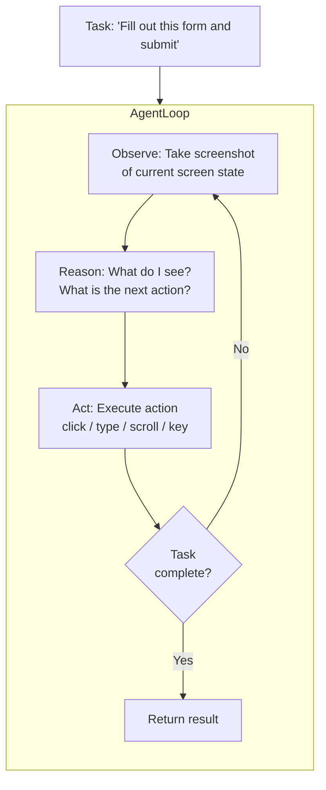
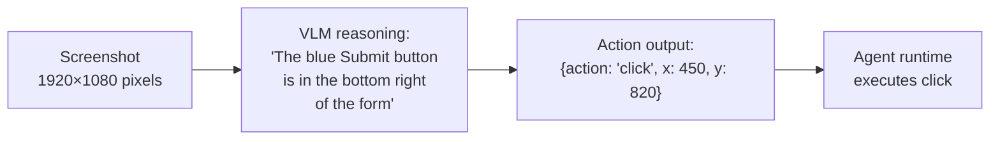
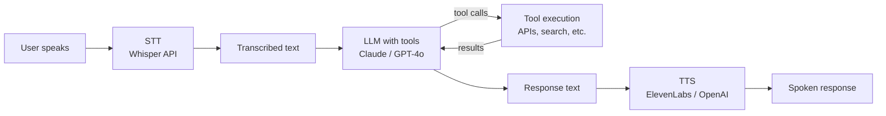

# Multimodal Agents

## The Story 📖

It's 2024 and someone at Anthropic releases a video: Claude is controlling a computer. It opens a browser, searches for a flight, reads the results, fills in a form, and confirms a booking — all without any explicit step-by-step instructions. It was just told "book the cheapest flight from New York to London next Tuesday."

The key thing Claude is doing: it's not reading structured API responses. It's looking at screenshots. The same messy, pixel-based UI that humans use. "There's a button that says 'Confirm'. I'll click it." "That form has a field labeled 'Departure date'. I'll fill in 2024-11-12."

This is a **multimodal agent**: an agent that can *see* the world (via screenshots) rather than just *read* it (via structured text). It can interact with any software — even software that has no API — because the UI itself is the interface.

The consequences are profound: multimodal agents can do anything a human can do at a computer. They see what you see. They click what you'd click.

👉 This is why **Multimodal Agents** represent a qualitative leap — they take AI from text-in, text-out to seeing-acting-in-the-world.

---

## What is a Multimodal Agent?

A **multimodal agent** is an AI agent that can perceive the world through multiple modalities (primarily vision + text) and act based on what it perceives. Unlike text-only agents that receive information pre-formatted as strings, multimodal agents receive raw visual input and must extract meaning from it before deciding what to do.

Types of multimodal agents:

| Type | Perceives | Acts |
|------|-----------|------|
| **Computer Use agent** | Screenshots, UI elements | Mouse clicks, keyboard input |
| **Voice agent** | Audio (STT) | Spoken responses (TTS) |
| **Document agent** | Image documents, PDFs | Extracts, routes, responds |
| **Vision-guided robot** | Camera feed | Physical motor actions |
| **Web navigation agent** | Web page screenshots/DOM | Browser actions |

---

## Why It Exists — The Problem It Solves

**1. Most software has no API**
There are billions of desktop applications, legacy systems, and websites with no programmatic interface. The only way to interact with them is through the UI. Multimodal agents can operate this UI the same way a human would.

**2. Text APIs lose visual context**
When a standard agent calls `get_page_html()`, it gets text — but loses layout, visual hierarchy, and the visual cues humans rely on ("that big orange button is clearly the primary action"). Vision allows agents to use the same context humans use.

**3. Voice is the most natural interface for many users**
A call center, a car dashboard, a doctor dictating notes — these are all use cases where text input is impractical. Voice agents (STT → LLM → TTS) expand AI's reach to voice-only contexts.

**4. Images as tool inputs**
Many agent tasks involve processing images: "Is this X-ray normal?", "Does this design meet brand guidelines?", "What does this error screenshot show?" Adding vision to agents makes all image-based tasks part of the agent's repertoire.

👉 Without multimodal agents: agents are limited to text-based, API-accessible systems. With multimodal agents: agents can interact with any interface and any input type.

---

## How It Works — Step by Step

### Computer Use agent loop



The agent operates in a tight **observe-reason-act** loop. At each step:

1. **Take a screenshot** of the current screen state
2. **Send the screenshot + task description** to a vision-capable LLM
3. **LLM reasons** about what it sees: "I see a form with an empty 'Name' field and a 'Submit' button"
4. **LLM outputs an action**: `{"action": "type", "coordinates": [340, 280], "text": "John Smith"}`
5. **Execute the action**: the agent runtime clicks/types/scrolls based on the output
6. **Take a new screenshot** and repeat

### Visual grounding for action targeting

The agent needs to know *where* to click. This is the **grounding problem**: connecting a description ("the Submit button") to pixel coordinates (`[x=450, y=820]`).



Modern approaches:
- **Direct coordinate output**: Model outputs `(x, y)` pixel coordinates
- **Bounding box + click**: Model describes a region, parser clicks the center
- **Set-of-Marks**: Overlay numbered labels on interactive elements, model chooses by number
- **DOM-based**: Combine visual + HTML structure for more reliable targeting

### Voice agent pipeline



---

## The Math / Technical Side (Simplified)

### Token budget for computer use

A full-resolution screenshot (1920×1080) is extremely expensive in tokens. Practical approaches:

```
1920×1080 image at full resolution ≈ 2,764 tokens (Claude estimate)
Cost per screenshot ≈ $0.03–0.08 (depending on model)

For a 20-step task: 20 × $0.05 = $1.00 per task execution

Optimization: resize to 1366×768 → ≈ 1,400 tokens → ~$0.015–0.04 per step
```

**Latency per step**:
- Screenshot capture: ~100ms
- Vision API call: 1–5 seconds
- Action execution: ~100ms
- Total per step: 2–6 seconds

A 20-step task takes 40–120 seconds at this rate. This is the fundamental latency challenge of computer use agents.

### Set-of-Marks (SoM) prompting

SoM is a technique that dramatically improves action targeting accuracy:

1. Before sending the screenshot, run a UI element detector (or OCR) to identify all interactive elements
2. Overlay a numbered marker on each element (1, 2, 3...)
3. Ask the model: "Which element number should I interact with? Respond with just the number."

The model chooses by number, and the runtime maps that number to the pre-detected coordinates. This avoids asking the model to output precise pixel coordinates, which it does poorly.

---

## Where You'll See This in Real AI Systems

| System | What the multimodal agent does |
|--------|-------------------------------|
| **Anthropic Computer Use** | Controls desktop computer from screenshots |
| **OpenAI Operator** | Web browser agent that completes tasks on websites |
| **Google Mariner** | Browser agent using Chrome |
| **Microsoft Copilot+ Recall** | Visual memory of screen history for retrieval |
| **Rabbit r1** | Voice + vision device agent |
| **HeyGen** | Interactive video avatar (voice agent variant) |
| **Call center AI** | STT → intent detection → tool calling → TTS |
| **Drone navigation** | Visual scene understanding → flight path planning |

---

## Challenges of Multimodal Agents

| Challenge | Description | Mitigation |
|-----------|-------------|------------|
| **Latency** | Each screenshot + LLM call = 2–5s per step | Cache static UI state, async execution |
| **Cost** | Screenshots are expensive tokens | Resize images, use efficient models |
| **Grounding accuracy** | Clicking the wrong element | Set-of-Marks, UI element detection |
| **Hallucination** | Model "sees" things that aren't there | Verify actions, add confirmation steps |
| **Long-horizon planning** | Tasks with many steps accumulate errors | Checkpointing, subtask decomposition |
| **UI variability** | Websites/apps change; agent breaks | DOM-based hybrid approach |
| **Safety** | Agent taking unintended destructive actions | Confirmation prompts, sandboxing |

---

## Common Mistakes to Avoid ⚠️

- **Not sandboxing the agent environment**: A computer use agent can delete files, make purchases, or send emails. Always run in a sandboxed VM or containerized environment during development.

- **Skipping action confirmation for irreversible actions**: "Are you sure you want to submit this form?" should always involve human confirmation before execution for high-stakes actions.

- **Sending full-resolution screenshots**: A 4K screenshot is enormously expensive. Resize to 1280×720 or 1366×768. The model doesn't need full resolution to identify buttons and text.

- **Ignoring accumulated context**: Each step adds tokens (screenshots + reasoning). A 30-step task can easily exceed context windows. Implement context compression or summarize earlier steps.

- **Assuming text extraction from screenshots is reliable**: Small fonts, custom UI elements, and dark themes can cause grounding failures. Build error recovery ("I couldn't find the element, trying an alternative approach").

---

## Connection to Other Concepts 🔗

- **AI Agents** (Section 10): Multimodal agents are standard agents with vision added — all agent concepts (ReAct, tool use, planning) still apply
- **Vision APIs** (Section 17.04): The screenshot perception step is a vision API call
- **Audio and Speech AI** (Section 17.05): Voice agents chain STT → LLM → TTS
- **Prompt Engineering** (Section 8): Effective task description and output formatting for agent reasoning
- **System Design** (Section 13): Computer use and voice agents have complex production architectures

---

✅ **What you just learned**
- Multimodal agents perceive the world through screenshots or audio, acting through mouse/keyboard or speech
- Computer use agents follow an observe-reason-act loop, taking screenshots and deciding actions based on what they see
- The grounding problem: connecting text descriptions ("click Submit") to pixel coordinates — Set-of-Marks is the dominant approach
- Key challenges: latency (2–5s per step), cost (screenshots are expensive), grounding accuracy, safety
- Voice agents: the STT → LLM → TTS pipeline that powers natural conversational interfaces

🔨 **Build this now**
Use Anthropic's Computer Use API to build a simple screen-reading agent: take a screenshot of your desktop (or a web page), send it to Claude with the instruction "Describe everything you see on this screen and list all interactive elements visible." This is the simplest possible computer use agent — perception without action.

➡️ **Next step**
Move to [Section 18 — AI Evaluation](../../18_AI_Evaluation/01_Evaluation_Fundamentals/Theory.md) to learn how to measure whether your AI systems are actually working.


---

## 📝 Practice Questions

- 📝 [Q87 · multimodal-agents](../../ai_practice_questions_100.md#q87--design--multimodal-agents)


---

## 📂 Navigation

**In this folder:**
| File | |
|---|---|
| 📄 **Theory.md** | ← you are here |
| [📄 Cheatsheet.md](./Cheatsheet.md) | Quick reference |
| [📄 Interview_QA.md](./Interview_QA.md) | Interview prep |
| [📄 Architecture_Deep_Dive.md](./Architecture_Deep_Dive.md) | Multimodal agent architecture diagrams |
| [📄 Code_Example.md](./Code_Example.md) | Code examples |

⬅️ **Prev:** [06 — Multimodal Embeddings](../06_Multimodal_Embeddings/Theory.md) &nbsp;&nbsp;&nbsp; ➡️ **Next:** [Section 18 — AI Evaluation](../../18_AI_Evaluation/01_Evaluation_Fundamentals/Theory.md)
