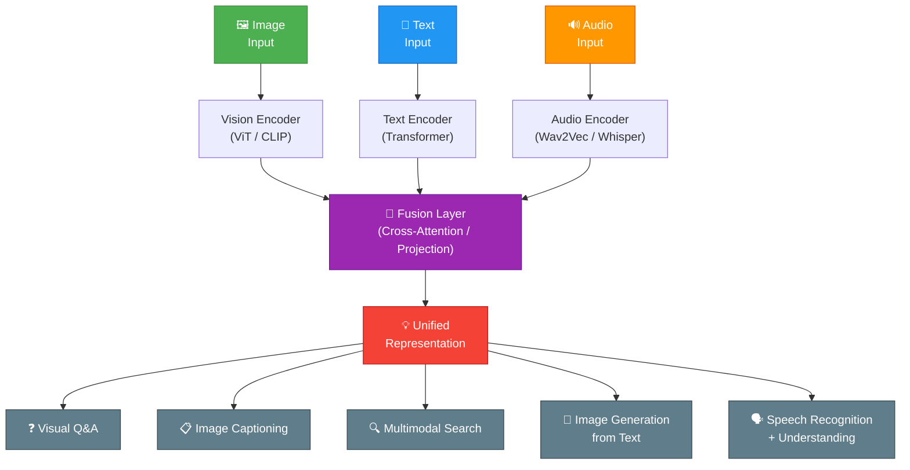

# 👁️ Multimodal AI

⬅️ [16 Diffusion Models](../16_Diffusion_Models/Readme.md) &nbsp;|&nbsp; [🏠 Home](../00_Learning_Guide/Readme.md) &nbsp;|&nbsp; [18 AI Evaluation ➡️](../18_AI_Evaluation/Readme.md)

> AI that sees, hears, and reads simultaneously — models that fuse vision, language, and audio into a unified understanding capable of tasks no single modality could solve alone.

**[▶ Start here → Multimodal Fundamentals Theory](./01_Multimodal_Fundamentals/Theory.md)**

---

## At a Glance

| | |
|---|---|
| 📚 Topics | 7 topics |
| ⏱️ Est. Time | 5–6 hours |
| 📋 Prerequisites | [Diffusion Models](../16_Diffusion_Models/Readme.md) |
| 🔓 Unlocks | [AI Evaluation](../18_AI_Evaluation/Readme.md) |

---

## What's in This Section

---

## Topics

| # | Topic | What You'll Learn | Files |
|---|---|---|---|
| 01 | [Multimodal Fundamentals](./01_Multimodal_Fundamentals/) | What multimodal AI is, why single-modality models are limiting, and the three main architectures: fusion, alignment, and generative | [📖 Theory](./01_Multimodal_Fundamentals/Theory.md) · [⚡ Cheatsheet](./01_Multimodal_Fundamentals/Cheatsheet.md) · [🎯 Interview Q&A](./01_Multimodal_Fundamentals/Interview_QA.md) |
| 02 | [Vision Language Models](./02_Vision_Language_Models/) | How GPT-4V, Claude, Gemini, and LLaVA combine vision encoders with language decoders; the projection layer that bridges modalities | [📖 Theory](./02_Vision_Language_Models/Theory.md) · [⚡ Cheatsheet](./02_Vision_Language_Models/Cheatsheet.md) · [🎯 Interview Q&A](./02_Vision_Language_Models/Interview_QA.md) |
| 03 | [Image Understanding](./03_Image_Understanding/) | Object detection, segmentation, OCR, document understanding, and chart/diagram comprehension with vision models | [📖 Theory](./03_Image_Understanding/Theory.md) · [⚡ Cheatsheet](./03_Image_Understanding/Cheatsheet.md) · [🎯 Interview Q&A](./03_Image_Understanding/Interview_QA.md) |
| 04 | [Using Vision APIs](./04_Using_Vision_APIs/) | Practical integration of GPT-4V, Claude Vision, and Gemini Vision APIs — prompting strategies, image encoding, and cost management | [📖 Theory](./04_Using_Vision_APIs/Theory.md) · [⚡ Cheatsheet](./04_Using_Vision_APIs/Cheatsheet.md) · [🎯 Interview Q&A](./04_Using_Vision_APIs/Interview_QA.md) |
| 05 | [Audio and Speech AI](./05_Audio_and_Speech_AI/) | ASR with Whisper, text-to-speech, audio classification, and how audio transformers process spectrograms instead of waveforms directly | [📖 Theory](./05_Audio_and_Speech_AI/Theory.md) · [⚡ Cheatsheet](./05_Audio_and_Speech_AI/Cheatsheet.md) · [🎯 Interview Q&A](./05_Audio_and_Speech_AI/Interview_QA.md) |
| 06 | [Multimodal Embeddings](./06_Multimodal_Embeddings/) | CLIP-style contrastive training, joint embedding spaces where images and text are comparable, and applications in search and retrieval | [📖 Theory](./06_Multimodal_Embeddings/Theory.md) · [⚡ Cheatsheet](./06_Multimodal_Embeddings/Cheatsheet.md) · [🎯 Interview Q&A](./06_Multimodal_Embeddings/Interview_QA.md) |
| 07 | [Multimodal Agents](./07_Multimodal_Agents/) | Building agents that perceive screenshots, interpret charts, process PDFs, and take actions based on visual context | [📖 Theory](./07_Multimodal_Agents/Theory.md) · [⚡ Cheatsheet](./07_Multimodal_Agents/Cheatsheet.md) · [🎯 Interview Q&A](./07_Multimodal_Agents/Interview_QA.md) |

---

## Key Concepts at a Glance

| Concept | What It Means |
|---|---|
| **CLIP bridged vision and language in 2021** | By training an image encoder and text encoder together on 400M image-caption pairs with contrastive loss, CLIP created a joint embedding space where `cosine("a photo of a dog", dog_image_embedding)` is high — enabling zero-shot image classification. |
| **VLMs are LLMs with eyes** | Models like GPT-4V and LLaVA attach a ViT-based vision encoder to a language model backbone; a trainable projection layer (MLP or cross-attention) translates image patches into token embeddings the LLM can process alongside text. |
| **Modality alignment is the core training challenge** | The representations from different encoders live in incompatible spaces; alignment is achieved through contrastive learning, instruction tuning on image-text pairs, or dedicated cross-modal attention layers. |
| **Audio is spectrograms, not waveforms** | Whisper and audio transformers convert raw audio into mel spectrograms (2D time-frequency images) and then run standard 2D convolution or patch-based transformer processing. |
| **Multimodal agents unlock computer use** | An agent that can see a screenshot, identify UI elements, and generate click/type actions can operate GUIs, fill forms, and navigate web interfaces without any programmatic API. |

---

## 📂 Navigation

⬅️ **Prev:** [16 Diffusion Models](../16_Diffusion_Models/Readme.md) &nbsp;&nbsp; ➡️ **Next:** [18 AI Evaluation](../18_AI_Evaluation/Readme.md)
