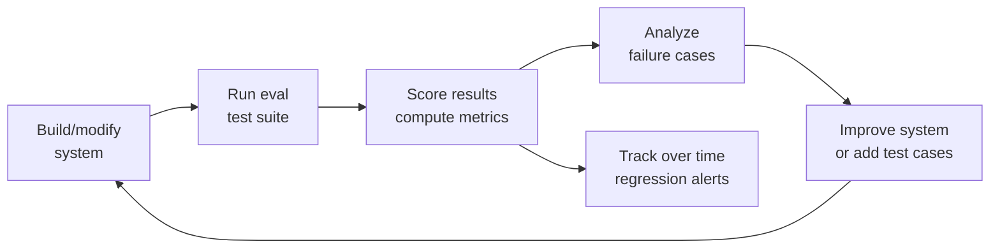

# AI Evaluation Fundamentals — Cheatsheet

## Key Terms

| Term | One-line meaning |
|------|-----------------|
| **Eval** | A structured test that measures AI system quality |
| **Test set** | Collection of (input, expected output) pairs for evaluation |
| **Automated eval** | Code-based evaluation without human involvement |
| **Human eval** | Humans rate AI outputs — highest signal, most expensive |
| **LLM-as-judge** | Use a powerful LLM to evaluate another LLM's outputs |
| **Baseline** | A comparison point (previous version, simpler system, human) |
| **Regression** | Eval score drops after a change — should trigger immediate review |
| **Eval contamination** | Test cases were seen during training or prompt development — makes eval invalid |
| **Eval-improvement loop** | Build → eval → analyze → improve → repeat |

---

## Four Dimensions of Evaluation

| Dimension | Key metrics |
|-----------|------------|
| **Quality** | Accuracy, relevance, faithfulness, helpfulness, coherence |
| **Safety** | Harmful content rate, refusal rate, jailbreak resistance |
| **Latency** | P50, P95, P99 response time; time-to-first-token |
| **Cost** | Tokens per request, $ per 1K queries, compute cost |

---

## Evaluation Types

| Type | Speed | Cost | Signal | Best for |
|------|-------|------|--------|---------|
| Automated (exact match) | Very fast | Very cheap | Low (misses nuance) | Factual Q&A, classification, code |
| Automated (LLM-as-judge) | Medium | Medium | Medium-high | Open-ended quality |
| Human evaluation | Slow | Expensive | High | Calibration, subjective quality |

---

## Test Set Guidelines

| Factor | Minimum | Better |
|--------|---------|--------|
| Size for basic accuracy | 100 examples | 500+ |
| Size for fine-grained analysis | 500 examples | 1,000+ |
| Edge case coverage | 20% of set | 30% |
| Distribution match | Mirrors production | Sample from real traffic |

---

## Metrics by Task Type

| Task | Metric |
|------|--------|
| Classification | Accuracy, F1, precision, recall |
| Extraction | Exact match, field precision/recall |
| Factual Q&A | Accuracy, hallucination rate |
| Summarization | ROUGE, BERTScore, LLM-as-judge |
| Code generation | Pass@k (unit tests) |
| RAG | Faithfulness, answer relevance, context precision |
| Agents | Task completion rate, tool call accuracy |

---

## The Eval-Improvement Loop

---

## Common Mistakes Cheat Table

| Mistake | Consequence | Fix |
|---------|-------------|-----|
| Contaminated test set | Inflated scores, false confidence | Never use test data for development |
| Too small test set | High variance, unreliable metrics | Use 200+ examples minimum |
| No baseline | Can't tell if 72% is good | Compare to previous version or human |
| Measuring only what's easy | Miss real failures | Include hard-to-measure criteria |
| Optimizing for the eval | Fail in production | Diverse test cases + production sampling |

---

## Golden Rules

1. Write evals before writing code (eval-driven development)
2. Never contaminate your test set with examples used during development
3. Always compare against a baseline — scores alone are meaningless
4. 200+ examples minimum; 1000+ for anything important
5. Track eval scores over time; regressions are bugs

---

## 📂 Navigation

**In this folder:**
| File | |
|---|---|
| [📄 Theory.md](./Theory.md) | Full explanation |
| 📄 **Cheatsheet.md** | ← you are here |
| [📄 Interview_QA.md](./Interview_QA.md) | Interview prep |

⬅️ **Prev:** [Section 17 — Multimodal AI](../../17_Multimodal_AI/) &nbsp;&nbsp;&nbsp; ➡️ **Next:** [02 — Benchmarks](../02_Benchmarks/Theory.md)
