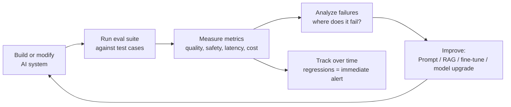
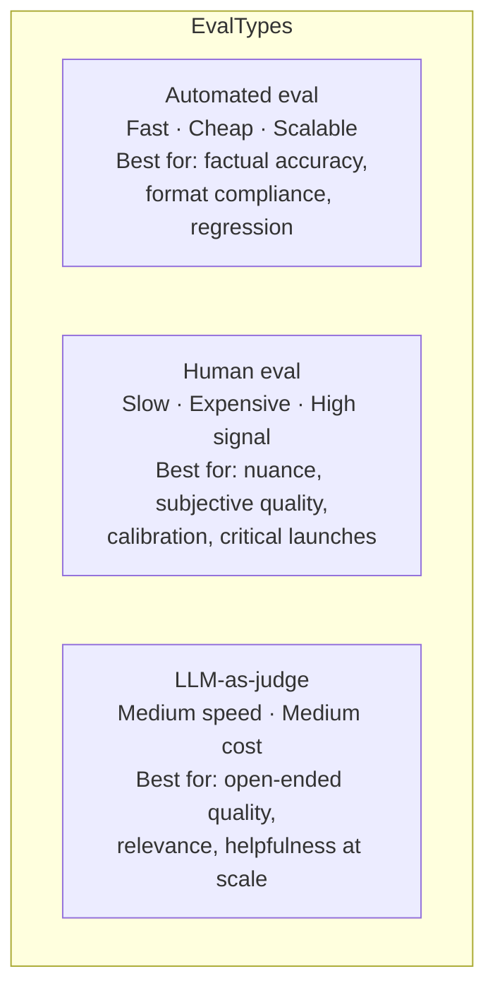

# AI Evaluation Fundamentals

## The Story 📖

A startup builds a customer support chatbot. After three months of development, the product manager asks: "Is it good?"

The developer says: "I think so. It handles most questions well."

They launch it. A week later, complaints pile up. The bot is giving wrong refund policies. It's occasionally rude to customers. It works great on common questions but fails completely on edge cases. It's slow on mobile.

Nobody measured any of this before launch. They had a vibe. The vibe was wrong.

**Evaluation is how you replace "it feels good" with numbers you can track, improve, and compare.**

The best AI teams in the world treat evaluation as a first-class engineering discipline — not an afterthought. They write evals before they write code. They track eval scores the same way engineers track uptime. When they release a new model version, the first question is "what happened to the eval scores?"

👉 This is why we need **AI Evaluation** — because "it feels good" is not a quality metric.

---

## 📌 Learning Priority

**Must Learn** — core concepts, needed to understand the rest of this file:
[What is AI Evaluation](#what-is-ai-evaluation) · [Eval-Improvement Loop](#the-eval-improvement-loop) · [Three Evaluation Types](#types-of-evaluation)

**Should Learn** — important for real projects and interviews:
[What to Measure](#what-to-measure) · [Test Set Design](#defining-a-test-set) · [Real AI Systems](#where-youll-see-this-in-real-ai-systems)

**Good to Know** — useful in specific situations, not needed daily:
[Statistical Significance](#statistical-significance) · [Common Mistakes](#common-mistakes-to-avoid-)

**Reference** — skim once, look up when needed:
[Connection to Other Concepts](#connection-to-other-concepts-)

---

## What is AI Evaluation?

**AI evaluation** (or "evals") is the systematic process of measuring how well an AI system performs on the tasks it's supposed to do, using defined metrics, test cases, and measurement methodologies.

Think of it as quality assurance for AI. Just as software engineers write unit tests and integration tests to verify code correctness, AI engineers write evals to verify AI quality.

Evaluation operates at multiple levels:

| Level | What's measured | Example |
|-------|----------------|---------|
| **Model-level** | Raw model capability | MMLU score, HumanEval pass rate |
| **Task-level** | Performance on a specific task | Accuracy on our document extraction task |
| **System-level** | End-to-end pipeline quality | RAG faithfulness, agent task completion |
| **Production-level** | Live behavior with real users | User satisfaction, escalation rate |

---

## Why It Exists — The Problem It Solves

**1. AI outputs are probabilistic and hard to verify**
Unlike traditional software (function returns wrong value → obvious bug), AI outputs exist on a spectrum of quality. "The answer is mostly right" could mean a 90% correct answer or a 50% correct answer. Without structured measurement, you can't tell.

**2. AI degrades silently**
A change in prompt, model version, data, or usage patterns can cause AI quality to degrade without any obvious error. Evaluation catches these regressions before users do.

**3. Intuition doesn't scale**
A team can manually check 20 outputs per day. A good eval pipeline can check 10,000. You can't maintain quality at scale without automation.

**4. You can't improve what you don't measure**
To make your AI better, you need to know specifically what's failing. "The model is bad" is not actionable. "The model fails on multi-hop reasoning questions 47% of the time" is.

👉 Without evaluation: AI quality is a matter of hope. With evaluation: AI quality is a matter of measurement.

---

## How It Works — Step by Step

### The eval-improvement loop



### What to measure

Good evaluation covers four dimensions:

| Dimension | Metrics | Why it matters |
|-----------|---------|---------------|
| **Quality** | Accuracy, relevance, faithfulness, helpfulness | The thing actually works |
| **Safety** | Refusal rate, harmful content rate | The thing doesn't harm users |
| **Latency** | P50/P95/P99 response time | Users will wait |
| **Cost** | Tokens per request, $ per 1K queries | Viable to operate |

### Types of evaluation

**Automated evaluation**: Code that runs test cases and measures outputs without human involvement. Fast, cheap, scalable, but can miss subtleties.

**Human evaluation**: Humans rate AI outputs. Expensive, slow, but highest signal. Used for calibration and for high-stakes decisions.

**LLM-as-judge**: Use a powerful LLM to evaluate outputs of another LLM. Combines scale of automation with some of the nuance of human judgment. (Covered in detail in Section 18.03.)



---

## The Math / Technical Side (Simplified)

### Defining a test set

A **test set** (or eval set) is a collection of examples where you know the expected output (or criteria for a good output):

```
Test case = {
  "input": "What is the return policy for shoes?",
  "context": [relevant docs from RAG],
  "expected_output": "30-day return policy with receipt",  # for exact match
  "criteria": ["mentions 30 days", "mentions receipt requirement"]  # for criteria-based
}
```

### Metrics for different task types

| Task type | Common metrics |
|-----------|---------------|
| Classification | Accuracy, precision, recall, F1 |
| Extraction | Exact match, field-level precision/recall |
| Generation (factual) | Faithfulness, precision of claims |
| Generation (open-ended) | LLM-as-judge score (1–5), human preference |
| Retrieval | Recall@k, MRR, NDCG |
| Code generation | Pass@k (tests pass), compilation rate |

### Statistical significance

With a test set of 100 examples:
- Model A: 72% accuracy
- Model B: 75% accuracy

Is B actually better? With only 100 examples, a 3% difference might just be noise. A good eval uses enough examples for statistical significance, and uses confidence intervals or bootstrapping to understand uncertainty. Rule of thumb: 200+ examples for meaningful accuracy comparisons; 1000+ for fine-grained analyses.

---

## Where You'll See This in Real AI Systems

| Context | How evaluation is used |
|---------|----------------------|
| **OpenAI / Anthropic model releases** | Run thousand-benchmark suite before every release |
| **ChatGPT improvements** | A/B test new prompts against held-out human preference eval |
| **RAG systems** | RAGAS metrics track faithfulness, context relevance |
| **Agent systems** | Task completion rate, tool call accuracy |
| **Content moderation** | False positive/negative rate on policy violations |
| **Production monitoring** | Continuous sampling of live outputs, automated quality scoring |

---

## Common Mistakes to Avoid ⚠️

- **Eval set contamination**: If your model saw your test examples during training or prompt development, the eval is meaningless. Keep a clean test set that's never used for anything except evaluation.

- **Optimizing for the eval, not the task**: It's easy to tune a system to score well on your specific eval set while still failing in production. Diversify your test cases and include edge cases.

- **Too small a test set**: 10 examples tells you almost nothing. A 3/10 pass rate could be 25%–70% with 95% confidence. Use at minimum 100 examples; 500+ for important metrics.

- **Only measuring what's easy to measure**: Exact match accuracy is easy to compute but misses whether an answer is helpful. Don't let measurement difficulty dictate what you evaluate.

- **No baseline**: "72% accuracy" means nothing without a baseline. Compare against: the previous version, a simpler system, human performance, or a random/trivial baseline.

---

## Connection to Other Concepts 🔗

- **Benchmarks** (Section 18.02): Standard evaluation datasets that measure model capability
- **LLM-as-Judge** (Section 18.03): Using LLMs to evaluate LLM outputs at scale
- **RAG Evaluation** (Section 18.04): Specialized metrics for retrieval-augmented generation
- **Agent Evaluation** (Section 18.05): Measuring agent task completion and trajectory quality
- **Red Teaming** (Section 18.06): Adversarial evaluation to find safety failures
- **Production AI** (Section 12): Monitoring is continuous evaluation in production

---

✅ **What you just learned**
- Evaluation is how you replace intuition with measurement in AI development
- Four dimensions to evaluate: quality, safety, latency, cost
- Three evaluation types: automated (fast/cheap), human (high signal), LLM-as-judge (scalable + nuanced)
- The eval-improvement loop: build → eval → analyze failures → improve → repeat
- Key mistakes: contaminated test sets, too-small sets, no baseline, optimizing for the eval

🔨 **Build this now**
Take any AI feature you've built (or want to build) and write 20 test cases for it. For each test case: input, expected output (or criteria for a good output). Then manually run the AI on all 20 and score each. Calculate a score. This is your first eval — congratulations.

➡️ **Next step**
Move to [`02_Benchmarks/Theory.md`](../02_Benchmarks/Theory.md) to learn about standard benchmarks like MMLU, HumanEval, and GSM8K — the standardized tests that measure model capability across domains.


---

## 📝 Practice Questions

- 📝 [Q88 · evaluation-fundamentals](../../ai_practice_questions_100.md#q88--interview--evaluation-fundamentals)


---

## 📂 Navigation

**In this folder:**
| File | |
|---|---|
| 📄 **Theory.md** | ← you are here |
| [📄 Cheatsheet.md](./Cheatsheet.md) | Quick reference |
| [📄 Interview_QA.md](./Interview_QA.md) | Interview prep |

⬅️ **Prev:** [Section 17 — Multimodal AI](../../17_Multimodal_AI/) &nbsp;&nbsp;&nbsp; ➡️ **Next:** [02 — Benchmarks](../02_Benchmarks/Theory.md)
