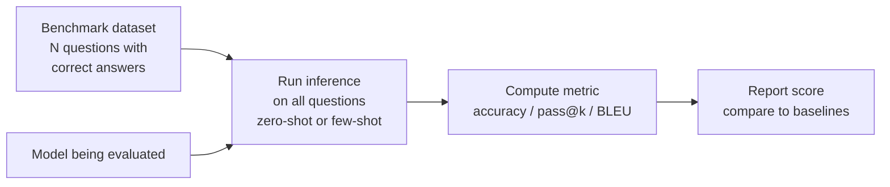

# Benchmarks

## The Story 📖

In 1926, an American psychologist introduced the SAT. The idea was radical for its time: rather than each college using completely different admissions tests, there would be one standardized test that all students could take. Colleges could then compare applicants on a common scale. You could say "she scored in the 95th percentile" and everyone knew what that meant.

AI benchmarks do the same thing. MMLU is the SAT for AI — a standardized test across 57 academic subjects. HumanEval is the coding interview. GSM8K is the math test. Every time a new model is released, it takes these same tests. Suddenly "Claude 3 Opus vs GPT-4o" stops being a subjective debate and starts having a concrete answer: "On MMLU, Claude scores X. On HumanEval, GPT scores Y."

But here's what most people don't say enough: **benchmarks are not the same as being good at your actual task**. A model that scores 90% on MMLU might still fail at your specific document extraction problem. The SAT is not the same as being successful at university.

Benchmarks tell you what a model can do in controlled conditions. Your eval tells you what it can do for your specific use case.

👉 This is why we need **Benchmarks** — standardized tests that make model comparisons objective and reproducible.

---

## 📌 Learning Priority

**Must Learn** — core concepts, needed to understand the rest of this file:
[What is a Benchmark](#what-is-a-benchmark) · [MMLU](#mmlu--massive-multitask-language-understanding) · [HumanEval](#humaneval--code-generation)

**Should Learn** — important for real projects and interviews:
[GSM8K](#gsm8k--grade-school-math) · [What Benchmarks Miss](#what-benchmarks-dont-tell-you) · [Real AI Systems](#where-youll-see-this-in-real-ai-systems)

**Good to Know** — useful in specific situations, not needed daily:
[HELM](#helm--holistic-evaluation-of-language-models) · [Contamination Risks](#contamination-risks-in-benchmarks)

**Reference** — skim once, look up when needed:
[Other Key Benchmarks](#other-key-benchmarks) · [Common Mistakes](#common-mistakes-to-avoid-)

---

## What is a Benchmark?

A **benchmark** is a standardized evaluation dataset with defined tasks, scoring methodology, and reference results that allows models to be compared on a common scale.

A benchmark has:
- A fixed **dataset** (questions + correct answers)
- A defined **metric** (accuracy, pass@1, BLEU, etc.)
- A specific **evaluation protocol** (few-shot? zero-shot? with or without CoT?)
- **Published baselines** (human performance, previous model scores)

---

## Why It Exists — The Problem It Solves

**1. Model comparison without benchmarks is marketing**
"Our model is better" without evidence is an advertisement. With benchmarks, it's a measurable claim. "Our model scores 89.5% on MMLU vs 88.2% for the previous SOTA" is a falsifiable, reproducible statement.

**2. Standardization enables progress tracking**
By running the same benchmark over years, the field can see: are models actually getting smarter at math? At reasoning? At coding? Without a fixed standard, progress is unmeasurable.

**3. Rapid model selection for practitioners**
A developer choosing between 5 models for a coding task can look at HumanEval scores and immediately identify which models are strongest at code. This takes minutes rather than running custom experiments.

---

## How It Works — Step by Step

Each major benchmark follows this basic structure:

---

## The Key Benchmarks

### MMLU — Massive Multitask Language Understanding

**What it tests**: General knowledge across 57 subjects — elementary math, law, medicine, philosophy, computer science, history, and more. Multiple-choice questions.

**Why it matters**: Tests breadth of world knowledge and reasoning. The closest thing to a "general intelligence" benchmark.

**Score interpretation**:
- Random chance: ~25%
- Non-expert human: ~55–60%
- Expert human: ~87–89%
- GPT-4 / Claude 3 Opus: ~86–90%

**Limitation**: Multiple choice is artificial. Real tasks rarely present 4 options. Models can achieve high MMLU scores while still failing at open-ended reasoning.

---

### HumanEval — Code Generation

**What it tests**: Python programming. Given a function signature and docstring, generate code that passes unit tests. 164 problems.

**Why it matters**: Code quality is objectively testable (tests pass or fail). No subjectivity.

**Metric**: pass@1 = % of problems where the first attempt passes all unit tests.

**Score interpretation**:
- GPT-4: ~67–88% pass@1
- Claude 3.5 Sonnet: ~73–92% pass@1
- Human programmer (average): ~~80%

**Limitation**: 164 problems is very small. Problems are relatively straightforward (no system design, no debugging). HumanEval+ and LiveCodeBench are more comprehensive successors.

---

### GSM8K — Grade School Math

**What it tests**: Word problems requiring multi-step arithmetic reasoning. 8,500 problems designed to require 2–8 reasoning steps.

**Why it matters**: Mathematical reasoning (especially multi-step) is a core capability. Models that can't do GSM8K reliably can't be trusted with quantitative tasks.

**Score interpretation**:
- Base GPT-3: ~35%
- GPT-4: ~92%
- Top models (with chain-of-thought): ~95%+
- Human: ~100%

**Limitation**: Modern top models nearly saturate this benchmark. The field has moved to MATH (harder competition math) and AIME/Olympiad problems for differentiation.

---

### BIG-Bench

**What it tests**: A diverse collection of 200+ tasks covering everything from logical reasoning to social bias to creative writing to unusual programming tasks.

**Why it matters**: Tests a huge diversity of capabilities. Reveals weaknesses not visible on narrow benchmarks.

**BIG-Bench Hard**: A subset of 23 tasks that GPT-4-era models still find difficult. Better for differentiating frontier models.

---

### HELM — Holistic Evaluation of Language Models

**What it tests**: Not one benchmark but a framework that evaluates models across 42 scenarios and 7 metrics (accuracy, calibration, robustness, fairness, bias, toxicity, efficiency) simultaneously.

**Why it matters**: Shows a more complete picture. A model might be highly accurate but poorly calibrated (overconfident). HELM catches this.

---

### Other Key Benchmarks

| Benchmark | Tests | Notes |
|-----------|-------|-------|
| **MATH** | Competition math (AMC-AIME level) | Much harder than GSM8K |
| **GPQA** | Graduate-level science | Near PhD-level questions |
| **MMLU-Pro** | Harder MMLU variant | More reasoning-dependent |
| **SWE-Bench** | Software engineering tasks | Fix real GitHub issues |
| **ARC** | Grade school science | Easy but good baseline |
| **HellaSwag** | Commonsense reasoning | Story completion |
| **TruthfulQA** | Truthfulness | Avoids false beliefs |
| **LiveCodeBench** | Coding (live, avoids contamination) | New monthly problems |

---

## The Math / Technical Side (Simplified)

### Few-shot vs zero-shot evaluation

**Zero-shot**: The model receives only the question, no examples. Tests whether the model "knows" the answer from training.

**Few-shot**: The model receives N examples before the question. Tests whether the model can learn the pattern in context. MMLU is typically evaluated 5-shot (5 examples per subject).

**Chain-of-thought (CoT)**: Prompting the model to "think step by step" before answering. Dramatically improves performance on reasoning tasks. GSM8K CoT vs non-CoT: roughly +20–30% accuracy.

### Contamination risks in benchmarks

If a model's training data included MMLU questions and answers (via web scraping), it will score artificially high on MMLU — not because it's smarter, but because it memorized the answers. This is **benchmark contamination** and it's a serious concern in the field. High benchmark scores from labs whose training data isn't fully disclosed should be viewed with some skepticism.

---

## What Benchmarks Don't Tell You

This is crucial. High benchmark scores do NOT guarantee:

- **Task-specific performance**: MMLU doesn't predict your specific legal QA task
- **Instruction following**: A model can know facts but fail to follow complex instructions
- **Consistency**: A model scoring 90% might be very wrong 10% of the time in unpredictable ways
- **Output quality beyond accuracy**: Tone, format, safety, verbosity
- **Real-world reliability under edge cases**: Benchmarks rarely include the weird edge cases production systems face
- **Calibration**: Does the model know what it doesn't know?

**The rule**: Benchmark scores are a starting point for model selection. Always evaluate on your specific task before committing.

---

## Where You'll See This in Real AI Systems

- **Model releases**: Every new model release is accompanied by benchmark results as a credibility signal
- **Model selection**: Engineering teams use benchmark scores to shortlist candidate models before custom evaluation
- **Leaderboards**: HuggingFace Open LLM Leaderboard, LMSYS Chatbot Arena maintain up-to-date rankings
- **Academic research**: Papers must report benchmark numbers to demonstrate contribution
- **Procurement**: Enterprise AI procurement decisions often start with benchmark comparisons

---

## Common Mistakes to Avoid ⚠️

- **Treating benchmark scores as your evaluation**: MMLU tells you about breadth of knowledge, not about whether the model can do your job. Always supplement with task-specific evals.

- **Not checking few-shot settings**: A model scoring 85% zero-shot vs 90% five-shot are different capabilities. Always compare at the same evaluation protocol.

- **Ignoring evaluation contamination**: Before trusting a model's benchmark score, ask whether the training data might have included the benchmark answers. Some published scores may be inflated.

- **Using saturated benchmarks for differentiation**: If all top models score 90%+ on a benchmark, it can no longer differentiate between them. Use harder benchmarks (GPQA, MATH) for frontier model comparisons.

---

## Connection to Other Concepts 🔗

- **Evaluation Fundamentals** (Section 18.01): Benchmarks are one type of evaluation — standardized and publicly available
- **LLM-as-Judge** (Section 18.03): For open-ended generation tasks, LLM-as-judge is used inside benchmarks like MT-Bench
- **Model Selection** (Section 7): Benchmark scores are a key input to choosing which model to use
- **RAG Evaluation** (Section 18.04): RAG-specific benchmarks (RAGAS, FRAMES) complement general benchmarks

---

✅ **What you just learned**
- Benchmarks are standardized tests that make model comparisons objective and reproducible
- Key benchmarks: MMLU (knowledge breadth), HumanEval (code), GSM8K (math), BIG-Bench (diverse), HELM (holistic)
- How to interpret scores: compare to human performance, random baseline, and previous models
- Critical limitation: benchmark scores don't guarantee performance on your specific task
- Always supplement benchmark-based model selection with task-specific evaluation

🔨 **Build this now**
Pick a model you use regularly. Look up its scores on MMLU, HumanEval, and GSM8K on the HuggingFace Open LLM Leaderboard or the model's release blog. Then run the model on 5 problems from your own use case. Do the benchmark scores predict the performance you see? This exercise builds intuition for the gap between benchmarks and task-specific performance.

➡️ **Next step**
Move to [`03_LLM_as_Judge/Theory.md`](../03_LLM_as_Judge/Theory.md) to learn how to use a powerful LLM as an automated evaluator for open-ended generation tasks.

---

## 📂 Navigation

**In this folder:**
| File | |
|---|---|
| 📄 **Theory.md** | ← you are here |
| [📄 Cheatsheet.md](./Cheatsheet.md) | Quick reference |
| [📄 Interview_QA.md](./Interview_QA.md) | Interview prep |
| [📄 Benchmark_Comparison.md](./Benchmark_Comparison.md) | All major benchmarks table |

⬅️ **Prev:** [01 — Evaluation Fundamentals](../01_Evaluation_Fundamentals/Theory.md) &nbsp;&nbsp;&nbsp; ➡️ **Next:** [03 — LLM as Judge](../03_LLM_as_Judge/Theory.md)
