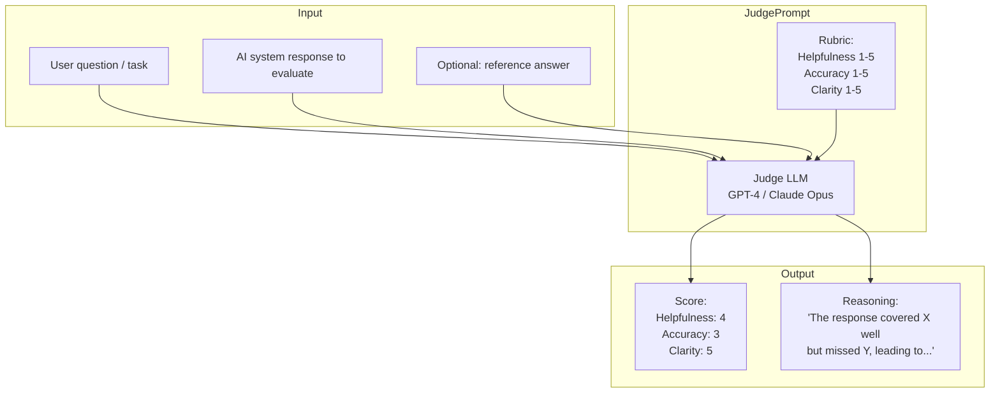
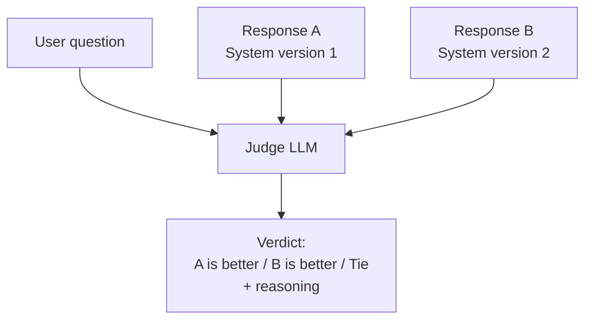
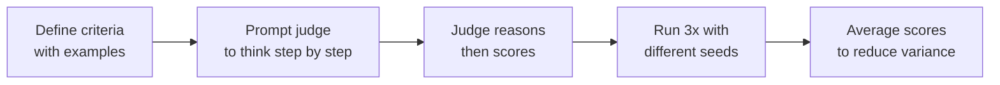

# LLM-as-Judge

## The Story 📖

A publisher has 500 junior writers all submitting articles every day. She needs to maintain quality. She can't read every article herself — that's 500 articles daily. She hires two senior editors.

The senior editors have clear guidelines: "Rate each article on helpfulness (1–5), accuracy (1–5), and clarity (1–5). Here's what a 5 looks like, here's what a 3 looks like." The senior editors work through their stack, issuing scores. The publisher sees the aggregate scores. When a writer's helpfulness scores trend down, she knows to intervene.

**LLM-as-judge** is this same pattern. The "junior writers" are your AI system's outputs. The "senior editor" is a powerful LLM (GPT-4, Claude Opus) operating on a detailed rubric. It reads each output, scores it, provides reasoning. You get evaluation at scale — hundreds of outputs per minute — with something closer to human-level judgment than simple string matching.

The key innovation: instead of writing hand-crafted rules ("does the answer contain the keyword 'refund'?"), you describe what quality means in natural language and let the judge interpret it.

👉 This is why we need **LLM-as-Judge** — to evaluate open-ended AI outputs at scale with human-like judgment.

---

## 📌 Learning Priority

**Must Learn** — core concepts, needed to understand the rest of this file:
[What is LLM-as-Judge](#what-is-llm-as-judge) · [Absolute Scoring](#absolute-scoring) · [Pairwise Comparison](#pairwise-comparison)

**Should Learn** — important for real projects and interviews:
[Judge Biases](#why-judges-have-biases) · [Calibrating Your Judge](#calibrating-your-judge) · [Real AI Systems](#where-youll-see-this-in-real-ai-systems)

**Good to Know** — useful in specific situations, not needed daily:
[G-Eval Framework](#g-eval-framework) · [Cohen's Kappa](#cohens-kappa)

**Reference** — skim once, look up when needed:
[Common Mistakes](#common-mistakes-to-avoid-) · [Connection to Other Concepts](#connection-to-other-concepts-)

---

## What is LLM-as-Judge?

**LLM-as-judge** is an evaluation technique where a large language model is used to assess the quality of outputs produced by another (typically smaller or lower-capability) language model or AI system.

The judge receives: the original input, the AI system's output, optionally a reference answer, and a rubric. It returns a quality score and a reasoning explanation.

There are three main evaluation formats:

| Format | What it does | When to use |
|--------|-------------|-------------|
| **Absolute scoring** | Rate output 1–5 on defined criteria | Measuring quality against a standard |
| **Pairwise comparison** | Which of A or B is better? | A/B testing, ranking |
| **Reference-guided** | How close is output to ideal reference? | Factual tasks with known good answer |

---

## Why It Exists — The Problem It Solves

**1. Open-ended outputs can't be measured with exact match**
"What are the benefits of meditation?" has no single correct answer. A regex can't tell you if the answer is helpful, accurate, and well-organized. A human can — and so can a capable LLM.

**2. Human evaluation doesn't scale**
You can't hire enough people to review every output at production speed. LLM-as-judge scales to thousands of evaluations per hour at a fraction of the cost of human annotation.

**3. LLM judges are surprisingly well-calibrated**
Studies show that GPT-4 and Claude-Opus-level judges achieve 80–90% agreement with human raters on many tasks — comparable to inter-annotator agreement between humans. This makes them valuable proxies for human judgment.

👉 Without LLM-as-judge: open-ended quality evaluation requires expensive human review. With LLM-as-judge: you can measure quality at scale, faster than humans, approaching human-level judgment.

---

## How It Works — Step by Step

### Absolute scoring



### Pairwise comparison



### G-Eval framework

G-Eval is a structured approach that makes LLM-as-judge more reliable:
1. **Define criteria** explicitly (e.g., "Coherence: does the response flow logically?")
2. **Provide scoring rubric** with examples for each score level
3. **Request chain-of-thought reasoning** before the final score
4. **Aggregate** multiple judge calls to reduce variance



---

## The Math / Technical Side (Simplified)

### Why judges have biases

LLM judges exhibit systematic biases that affect reliability:

| Bias | Description | Mitigation |
|------|-------------|-----------|
| **Position bias** | Prefers A when it appears first in pairwise | Randomize order; average A-first and B-first |
| **Length bias** | Prefers longer responses ("looks more thorough") | Instruct judge to ignore length; test with short high-quality answers |
| **Self-preference bias** | GPT-4 prefers GPT-4 outputs | Use cross-judge or human calibration |
| **Verbosity bias** | Verbose responses sound more confident | Penalize unnecessary length explicitly in rubric |

### Calibrating your judge

Calibration = checking that LLM scores agree with human scores on a sample:

1. Run LLM judge on 100 examples
2. Have humans rate the same 100 examples
3. Compute: Pearson correlation, Kendall's Tau, or % agreement within 1 point
4. A good judge: >0.7 correlation or >80% agreement

If calibration is low, revise the rubric with clearer descriptions and score examples.

### Cohen's Kappa

For measuring inter-rater agreement beyond chance:
```
κ = (P_observed - P_chance) / (1 - P_chance)

κ < 0.4 = poor agreement
κ 0.4–0.6 = moderate agreement
κ 0.6–0.8 = substantial agreement
κ > 0.8 = near-perfect agreement
```

Target: κ > 0.6 between your LLM judge and human raters.

---

## Where You'll See This in Real AI Systems

| Usage | What the judge evaluates |
|-------|------------------------|
| **Chatbot quality monitoring** | Helpfulness, accuracy, safety of responses |
| **RAG faithfulness** | Is the answer supported by retrieved documents? |
| **RLHF reward modeling** | Judge scores used to train reward models |
| **MT-Bench** | GPT-4 as judge for multi-turn conversation quality |
| **AlpacaEval** | Win rate of new model vs reference (GPT-4 as judge) |
| **A/B testing prompts** | Which prompt version produces better outputs? |
| **Content moderation** | Is this content harmful/policy-violating? |
| **Agent trajectory quality** | Were the right reasoning steps taken? |

---

## Common Mistakes to Avoid ⚠️

- **Not calibrating against human labels**: A judge that has 50% agreement with humans is worse than useless — it gives you false confidence. Always calibrate on at least 50–100 human-labeled examples before trusting the judge.

- **Using the same model as judge and evaluatee**: GPT-4 evaluating GPT-4 outputs will show self-preference bias. Use Claude as judge when evaluating GPT-4 outputs and vice versa, or use a specialized evaluation model.

- **Not providing clear rubrics**: Vague instructions ("rate quality 1–5") give inconsistent results. Define exactly what a 1, 3, and 5 look like with examples.

- **Not accounting for position bias in pairwise**: Always run both (A, B) and (B, A) orderings and average the results.

- **Treating judge scores as ground truth**: LLM judges are proxies for human judgment, not ground truth. Use them for scale; use humans for calibration and high-stakes decisions.

---

## Connection to Other Concepts 🔗

- **Evaluation Fundamentals** (Section 18.01): LLM-as-judge is the "automated + nuanced" middle path between exact-match automation and expensive human evaluation
- **Prompt Engineering** (Section 8): The judge prompt is a critical engineering artifact — the quality of scoring depends heavily on how you write the rubric
- **RAG Evaluation** (Section 18.04): RAGAS uses LLM-as-judge for faithfulness and relevance scoring
- **Eval Frameworks** (Section 18.07): Promptfoo, LangSmith, and other frameworks have built-in LLM-as-judge integration

---

✅ **What you just learned**
- LLM-as-judge uses a powerful model (GPT-4, Claude Opus) to evaluate outputs of another AI system, at scale
- Three formats: absolute scoring, pairwise comparison, reference-guided
- G-Eval: structured approach with explicit rubric, chain-of-thought, and multiple runs
- Key biases: position bias, length bias, self-preference — and how to mitigate each
- Calibration against human labels is mandatory before trusting a judge's scores

🔨 **Build this now**
Write a judge prompt for evaluating customer support responses on two dimensions: (1) Accuracy (does it correctly answer the question?), (2) Tone (is it professional and empathetic?). Run it against 5 test responses you write manually — include one clearly good, one clearly bad, and three middling. See if the scores match your intuition.

➡️ **Next step**
Move to [`04_RAG_Evaluation/Theory.md`](../04_RAG_Evaluation/Theory.md) to learn RAGAS — the framework for measuring whether your RAG system actually retrieves the right things and generates faithful answers.

---

## 🛠️ Practice Project

Apply what you just learned → **[A3: Automated Eval Pipeline](../../22_Capstone_Projects/13_Automated_Eval_Pipeline/03_GUIDE.md)**
> This project uses: Claude grading responses on helpfulness/accuracy/safety 1–5, aggregating scores, flagging regressions


---

## 📝 Practice Questions

- 📝 [Q89 · llm-as-judge](../../ai_practice_questions_100.md#q89--interview--llm-as-judge)


---

## 📂 Navigation

**In this folder:**
| File | |
|---|---|
| 📄 **Theory.md** | ← you are here |
| [📄 Cheatsheet.md](./Cheatsheet.md) | Quick reference |
| [📄 Interview_QA.md](./Interview_QA.md) | Interview prep |
| [📄 Code_Example.md](./Code_Example.md) | LLM judge implementation |
| [📄 Prompt_Templates.md](./Prompt_Templates.md) | 5 judge prompt templates |

⬅️ **Prev:** [02 — Benchmarks](../02_Benchmarks/Theory.md) &nbsp;&nbsp;&nbsp; ➡️ **Next:** [04 — RAG Evaluation](../04_RAG_Evaluation/Theory.md)
