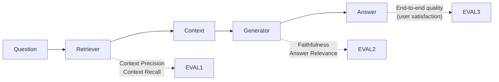

# RAG Evaluation — Cheatsheet

## RAGAS Metrics Quick Reference

| Metric | Measures | Requires | Target |
|--------|---------|---------|--------|
| **Faithfulness** | Answer grounded in context? | Question, Context, Answer | > 0.85 |
| **Answer Relevance** | Answer addresses the question? | Question, Answer | > 0.80 |
| **Context Precision** | Retrieved docs actually useful? | Question, Context | > 0.70 |
| **Context Recall** | All important docs found? | Question, Context, Ground Truth | > 0.80 |

---

## RAGAS Quick Start

```bash
pip install ragas langchain anthropic
```

```python
from ragas import evaluate
from ragas.metrics import faithfulness, answer_relevancy, context_precision, context_recall
from datasets import Dataset

# Your RAG outputs
data = {
    "question": ["What is the return policy?"],
    "contexts": [["Returns accepted within 30 days with receipt."]],
    "answer": ["You can return items within 30 days with a receipt."],
    "ground_truth": ["Returns are accepted within 30 days of purchase with original receipt."]
}

dataset = Dataset.from_dict(data)
results = evaluate(dataset, metrics=[faithfulness, answer_relevancy,
                                      context_precision, context_recall])
print(results)
```

---

## Metric Interpretation

| Faithfulness score | Meaning | Action |
|-------------------|---------|--------|
| > 0.9 | Excellent — model faithfully uses context | Maintain |
| 0.7–0.9 | Good — some minor unsupported claims | Monitor |
| 0.5–0.7 | Concerning — model adding its own knowledge | Fix: more restrictive system prompt |
| < 0.5 | Failing — hallucinations common | Fix urgently: prompt + retrieval |

| Context Precision | Meaning | Action |
|------------------|---------|--------|
| > 0.8 | Retriever precise — mostly relevant results | Maintain |
| 0.6–0.8 | Acceptable | Tune similarity threshold |
| < 0.6 | Too much noise in retrieved context | Improve embeddings or filtering |

---

## Which Metric Diagnoses Which Problem

| Symptom | Likely cause | Metric that reveals it |
|---------|-------------|----------------------|
| Answer contradicts documents | Generator hallucinating | Low faithfulness |
| Answer off-topic | Generator not following instruction | Low answer relevance |
| Answer missing important info | Retriever not finding relevant docs | Low context recall |
| Slow / expensive / context overflow | Too many irrelevant docs retrieved | Low context precision |

---

## Building a RAG Test Set

```python
# Minimum viable test set structure
test_cases = [
    {
        "question": "What is the late payment fee?",
        "ground_truth": "The late payment fee is 2% per month on outstanding balances.",
        # answer and contexts will be filled by your RAG pipeline at eval time
    },
    # ... 100+ more examples
]
```

Sources for test questions:
- Sample 100–200 from production query logs
- Have domain experts write adversarial questions
- Use LLM to generate questions from documents: "Generate 5 questions about this document"

---

## Component vs End-to-End Evaluation



---

## Golden Rules

1. Always measure faithfulness — it's the #1 RAG failure mode
2. Build a test set with ground truth answers to enable context recall
3. Measure all four metrics — they diagnose different problems
4. 50+ examples for stable averages; 200+ for reliable trend tracking
5. RAGAS uses LLM-as-judge internally — budget for API costs (~3–5 calls per sample)

---

## 📂 Navigation

**In this folder:**
| File | |
|---|---|
| [📄 Theory.md](./Theory.md) | Full explanation |
| 📄 **Cheatsheet.md** | ← you are here |
| [📄 Interview_QA.md](./Interview_QA.md) | Interview prep |
| [📄 Code_Example.md](./Code_Example.md) | RAGAS evaluation code |
| [📄 Metrics_Guide.md](./Metrics_Guide.md) | Deep dive on each metric |

⬅️ **Prev:** [03 — LLM as Judge](../03_LLM_as_Judge/Theory.md) &nbsp;&nbsp;&nbsp; ➡️ **Next:** [05 — Agent Evaluation](../05_Agent_Evaluation/Theory.md)
