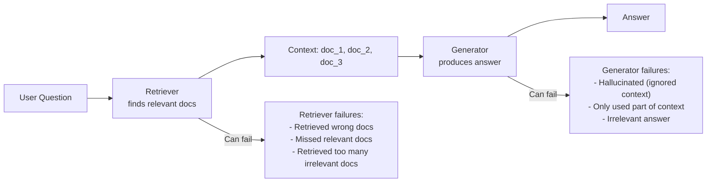

# RAG Evaluation

## The Story 📖

You build a RAG system for a legal firm. It retrieves documents and answers lawyer questions. You demo it — the answers sound great. Everyone is impressed.

Six months later, you find a complaint in the logs: a lawyer asked about contract termination clauses, the system retrieved three relevant documents, but the answer it gave contradicted two of them. The model used its own knowledge instead of the documents. This was a hallucination dressed up in official-sounding language.

The problem was that you never measured faithfulness. You measured "does the answer sound good?" not "does the answer actually come from the retrieved documents?"

**RAGAS** (Retrieval-Augmented Generation Assessment) is a framework that breaks down RAG quality into measurable components: Did the retriever find the right documents? Did the generator actually use those documents? Is the answer relevant? Does it cover everything?

Each of these can fail independently. RAGAS measures each independently.

👉 This is why we need **RAG Evaluation** — because a RAG system has multiple failure points, and you need to know which one is causing problems.

---

## What is RAG Evaluation?

**RAG evaluation** measures the quality of a Retrieval-Augmented Generation system along multiple dimensions that correspond to different parts of the pipeline.

A RAG system has three components, each of which can fail:



RAGAS metrics correspond directly to these failure modes.

---

## Why It Exists — The Problem It Solves

**1. Standard accuracy metrics miss RAG-specific failures**
A RAG answer that sounds authoritative but contradicts the retrieved documents would score well on "does this seem like a good answer?" but fail completely on faithfulness. You need RAG-specific metrics.

**2. Retrieval and generation can fail independently**
If your RAG system gives a wrong answer, is it because the retriever found the wrong documents? Or because the generator ignored the right documents? These require different fixes. RAGAS tells you which component failed.

**3. End-to-end evaluation hides component problems**
"The answer is wrong" doesn't tell you where to look. "The answer is faithful to the retrieved context but the retrieved context was wrong" tells you to fix the retriever.

👉 Without RAG evaluation: you know something is wrong but not what. With RAG evaluation: you know exactly which component to fix.

---

## How It Works — Step by Step

### The four RAGAS metrics

```mermaid
flowchart TB
    subgraph Components
        QUERY[User Question]
        CONTEXT[Retrieved Context\ndoc_1, doc_2, doc_3]
        ANSWER[Generated Answer]
        GROUND_TRUTH[Ground Truth\n(optional)]
    end

    subgraph Metrics
        F[Faithfulness\nIs the answer grounded\nin the retrieved context?]
        AR[Answer Relevance\nDoes the answer address\nthe question?]
        CP[Context Precision\nAre the retrieved docs\nactually relevant?]
        CR[Context Recall\nDid retrieval find all\nthe important docs?]
    end

    CONTEXT & ANSWER --> F
    QUERY & ANSWER --> AR
    QUERY & CONTEXT --> CP
    QUERY & CONTEXT & GROUND_TRUTH --> CR
```

---

## The Four Core Metrics Explained

### 1. Faithfulness

**What it measures**: Does every claim in the answer actually come from the retrieved documents?

**Why it matters**: A model can generate a plausible-sounding answer that doesn't match the retrieved context at all — pure hallucination with a RAG wrapper.

**How it's computed**:
1. Extract all factual claims from the generated answer
2. For each claim, ask: "Is this claim fully supported by the retrieved context?"
3. Faithfulness = number of supported claims / total claims

**Score range**: 0.0–1.0. **Target: > 0.85**

**Example**:
- Answer claims: ["The contract expires on January 31", "Early termination requires 30 days notice", "Late fees are 2% per month"]
- Retrieved docs say: January 31 ✓, 30 days notice ✓, late fees not mentioned ✗
- Faithfulness = 2/3 = 0.67

---

### 2. Answer Relevance

**What it measures**: Does the answer actually address the question that was asked?

**Why it matters**: A model can generate a faithful, accurate answer to the wrong question. If someone asks "how do I cancel my subscription?" and the answer explains "how to pause a subscription," it's relevant to subscriptions but not to the actual question.

**How it's computed**:
1. From the generated answer, generate k hypothetical questions that the answer could address
2. Compute similarity between these generated questions and the original question
3. Answer relevance = average similarity across k generated questions

**Score range**: 0.0–1.0. **Target: > 0.80**

---

### 3. Context Precision

**What it measures**: Among the documents retrieved, what proportion were actually useful?

**Why it matters**: Retrieving 10 documents where only 2 were relevant pollutes the context and wastes tokens. Context precision measures retrieval signal-to-noise ratio.

**How it's computed**:
1. For each retrieved document, determine if it's relevant to the question
2. Context precision = proportion of relevant documents among all retrieved

**Score range**: 0.0–1.0. **Target: > 0.70**

---

### 4. Context Recall

**What it measures**: Did the retriever find all the important information needed to answer the question?

**Why it matters**: If the ground truth answer requires information from 3 documents and the retriever only found 2 of them, the generator can't produce a complete answer no matter how good it is.

**How it's computed** (requires ground truth answer):
1. Break the ground truth answer into individual statements
2. For each statement, check if it's covered by the retrieved context
3. Context recall = proportion of ground truth statements supported by retrieved context

**Score range**: 0.0–1.0. **Target: > 0.80**

---

## The Math / Technical Side (Simplified)

### How RAGAS uses LLM-as-judge internally

RAGAS metrics are themselves computed using LLM-as-judge calls. For example, faithfulness:

```python
# Simplified faithfulness computation
def compute_faithfulness(answer: str, contexts: list[str]) -> float:
    # Step 1: Extract claims from answer using LLM
    claims = llm_extract_claims(answer)
    # ["The return policy is 30 days", "Returns require original receipt", ...]

    # Step 2: For each claim, verify against context using LLM
    context_text = "\n".join(contexts)
    supported = 0
    for claim in claims:
        verdict = llm_verify_claim(claim, context_text)
        # "Is this claim fully supported by the context? Yes/No"
        if verdict == "Yes":
            supported += 1

    return supported / len(claims) if claims else 1.0
```

This means RAGAS evaluation costs LLM API calls — budget for approximately 2–5 LLM calls per evaluated sample.

### End-to-end score

RAGAS provides an overall score that combines all metrics. However, it's usually more diagnostic to look at each metric separately — different failures need different fixes.

### Building a RAG test set

A good RAG test set needs:
1. **Questions**: Representative of real user queries
2. **Ground truth answers**: What the correct answer is (for context recall)
3. **Optionally, ground truth relevant documents**: For precise context recall

Sources for test questions: sample from production queries, have domain experts write them, or use a "question generation" LLM call on your documents.

---

## Where You'll See This in Real AI Systems

- **Enterprise RAG systems**: Any production RAG over company documents should have RAGAS monitoring
- **Customer support AI**: Measure faithfulness to ensure answers come from your policy documents
- **Legal/Medical AI**: Critical to catch hallucinations — faithfulness is a safety metric
- **Research assistants**: Context recall ensures important sources aren't missed
- **Procurement evaluation**: Before choosing a RAG vendor, run RAGAS on their system

---

## Common Mistakes to Avoid ⚠️

- **Evaluating only answer quality**: "The answer sounds good" is not the same as "the answer is faithful to the documents." Always measure faithfulness separately.

- **Not evaluating component-level metrics**: If end-to-end quality drops, you need component metrics (faithfulness, context precision, context recall) to diagnose where the problem is.

- **Not building a ground truth test set**: Context recall requires ground truth answers. Without them, you're flying half-blind. Invest time in building a 100–200 example test set with human-annotated ground truth.

- **Treating RAGAS scores as absolute truth**: RAGAS uses LLM-as-judge internally, which can have errors. A faithfulness score of 0.8 doesn't mean 80% of claims are verified — it means the LLM judge verified approximately 80%. Calibrate against human review on a sample.

- **Running RAGAS on too few examples**: 10 examples is not enough for stable RAGAS scores. Use 50+ examples for a meaningful average.

---

## Connection to Other Concepts 🔗

- **RAG Systems** (Section 9): RAGAS evaluates the systems built in that section
- **LLM-as-Judge** (Section 18.03): RAGAS metrics use LLM-as-judge internally for claim verification
- **Evaluation Fundamentals** (Section 18.01): RAGAS is an instance of component-level evaluation
- **Vector Databases** (Section 8): Context precision measures the quality of the similarity search in your vector store

---

✅ **What you just learned**
- RAG systems fail in distinct ways: retriever finds wrong docs, generator ignores retrieved docs, or answer doesn't address the question
- Four RAGAS metrics: faithfulness (answer grounded in context?), answer relevance (answer addresses question?), context precision (retrieved docs relevant?), context recall (all important docs found?)
- RAGAS uses LLM-as-judge internally to verify claims and assess relevance
- Building a ground truth test set is required for context recall measurement
- Component-level metrics are diagnostic: they tell you which part of the pipeline to fix

🔨 **Build this now**
Install `ragas` (`pip install ragas`) and run it on 5 examples from a RAG system you have access to (or build a simple one). For each example you need: question, retrieved context chunks, generated answer, and (optionally) ground truth answer. Look at your faithfulness score — is the model staying grounded in the context?

➡️ **Next step**
Move to [`05_Agent_Evaluation/Theory.md`](../05_Agent_Evaluation/Theory.md) to learn how to evaluate agents — where the evaluation is not just about the final answer but the entire path taken to get there.

---

## 📂 Navigation

**In this folder:**
| File | |
|---|---|
| 📄 **Theory.md** | ← you are here |
| [📄 Cheatsheet.md](./Cheatsheet.md) | Quick reference |
| [📄 Interview_QA.md](./Interview_QA.md) | Interview prep |
| [📄 Code_Example.md](./Code_Example.md) | RAGAS evaluation code |
| [📄 Metrics_Guide.md](./Metrics_Guide.md) | Deep dive on each metric |

⬅️ **Prev:** [03 — LLM as Judge](../03_LLM_as_Judge/Theory.md) &nbsp;&nbsp;&nbsp; ➡️ **Next:** [05 — Agent Evaluation](../05_Agent_Evaluation/Theory.md)
