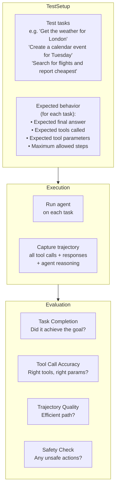
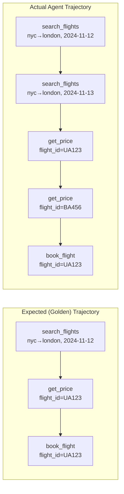

# Agent Evaluation

## The Story 📖

You ask an agent to "book the cheapest flight from New York to London next Tuesday." An hour later, it says: "Done! Booking confirmed."

But wait — how do you know it's actually done? Did it book the right flight? Did it use the right account? Did it follow the correct steps? Could a simpler approach have worked?

A human assistant who "completes" a task but books the wrong date or charges the wrong credit card hasn't completed the task at all. An agent that "completes" a task but took 47 unnecessary steps, made 3 tool call errors, and only stumbled onto the right answer is not a well-functioning agent.

**Agent evaluation** is more complex than chatbot evaluation precisely because agents act. You need to evaluate not just the final answer but the entire path taken: were the right tools called? In the right order? With the right parameters? Were unsafe actions avoided? Did the agent know when it was done?

This is **trajectory evaluation** — judging the journey, not just the destination.

👉 This is why we need **Agent Evaluation** — because agents can get to the right answer the wrong way, or to the wrong answer while sounding confident.

---

## 📌 Learning Priority

**Must Learn** — core concepts, needed to understand the rest of this file:
[What is Agent Evaluation](#what-is-agent-evaluation) · [Task Completion Rate](#task-completion-rate) · [Tool Call Accuracy](#tool-call-accuracy)

**Should Learn** — important for real projects and interviews:
[Trajectory Evaluation](#trajectory-evaluation) · [Safety Evaluation](#setting-up-agent-evaluation) · [Real AI Systems](#where-youll-see-this-in-real-ai-systems)

**Good to Know** — useful in specific situations, not needed daily:
[Step Efficiency](#step-efficiency) · [Edit Distance for Trajectories](#normalized-edit-distance-for-trajectories)

**Reference** — skim once, look up when needed:
[Common Mistakes](#common-mistakes-to-avoid-) · [Connection to Other Concepts](#connection-to-other-concepts-)

---

## What is Agent Evaluation?

**Agent evaluation** measures the quality of an AI agent's behavior across multiple dimensions:

| Dimension | What it measures |
|-----------|----------------|
| **Task completion rate** | Did the agent accomplish the goal? |
| **Tool call accuracy** | Were the right tools called with the right parameters? |
| **Trajectory quality** | Was the path to completion efficient and correct? |
| **Safety** | Did the agent avoid harmful or unintended actions? |
| **Efficiency** | Was the task completed in a reasonable number of steps and cost? |
| **Robustness** | Does the agent handle unexpected situations gracefully? |

---

## Why It Exists — The Problem It Solves

**1. Final answer evaluation misses process failures**
An agent can get the right answer by accident after many wrong steps. It can also fail in a way that produces no error — just a wrong outcome. Evaluating only the final output misses all intermediate failures.

**2. Agents have multiple failure modes**
- Calls wrong tool (wrong tool selected)
- Calls right tool with wrong parameters
- Makes too many unnecessary calls (inefficient)
- Fails to call a required tool (incomplete)
- Calls a tool in the wrong order
- Gets stuck in a loop
- Hallucinates tool availability or results
Each of these needs a different metric.

**3. Safety requires trajectory evaluation**
An agent that sends an email by accident, deletes a file, or makes a payment is dangerous even if it eventually produces the "right" answer. Safety evaluation requires checking every action taken, not just the final result.

---

## How It Works — Step by Step

### Setting up agent evaluation



### Task completion rate

The most basic metric: did the agent accomplish the task or not?

```python
# Binary: completed or not
task_completion_rate = completed_tasks / total_tasks

# Or multi-level:
def score_completion(expected_outcome, actual_outcome):
    if exact_match(expected_outcome, actual_outcome):
        return 1.0
    elif partial_match(expected_outcome, actual_outcome):
        return 0.5
    else:
        return 0.0
```

### Tool call accuracy

For each tool call in the agent's trajectory, evaluate:
1. **Was the right tool selected?** (tool selection accuracy)
2. **Were the parameters correct?** (parameter accuracy)
3. **Was it called at the right time?** (order/timing accuracy)

```python
def evaluate_tool_calls(expected_calls, actual_calls):
    """
    Compare expected vs actual tool call sequence.
    Returns precision, recall, and parameter accuracy.
    """
    # Tool precision: of tools called, how many were necessary?
    precision = len(correct_calls) / len(actual_calls)
    # Tool recall: of tools that should have been called, how many were?
    recall = len(correct_calls) / len(expected_calls)
    # Parameter accuracy: for correct tool calls, were params right?
    param_accuracy = correct_params / total_correct_tool_calls
    return precision, recall, param_accuracy
```

### Trajectory evaluation



The agent got to the right answer but: (1) searched wrong date first, (2) checked an extra flight it didn't need to. Trajectory score: 3/5 = 0.60 (3 correct steps out of 5 taken).

---

## The Math / Technical Side (Simplified)

### F1 score for tool calls

Just like information retrieval, tool calls can be measured with precision and recall:

```
Tool Precision = (necessary tool calls made) / (all tool calls made)
Tool Recall    = (necessary tool calls made) / (all necessary tool calls)
Tool F1        = 2 × (precision × recall) / (precision + recall)
```

### Step efficiency

```
Step efficiency = expected_steps / actual_steps
```
If the golden trajectory has 3 steps and the agent took 7 steps to achieve the same result, efficiency = 3/7 = 0.43. Perfect efficiency = 1.0.

### Normalized Edit Distance for trajectories

Comparing sequences of tool calls uses the same edit distance algorithms as string comparison:
- Insertion: unnecessary tool call added
- Deletion: necessary tool call missing
- Substitution: wrong tool called instead of right one

```
trajectory_similarity = 1 - (edit_distance(expected, actual) / max(len(expected), len(actual)))
```

---

## Where You'll See This in Real AI Systems

| System | What's evaluated |
|--------|----------------|
| **Customer service agents** | Did the agent resolve the issue? Escalation rate? Tools used correctly? |
| **Coding agents** | Task completion (tests pass), number of iterations, file edit accuracy |
| **Research agents** | Sources found, accuracy of synthesis, steps taken |
| **Computer use agents** | Task completion, actions taken, errors committed |
| **SWE-Bench** | Did the agent fix the GitHub issue? What was the trajectory? |

---

## Common Mistakes to Avoid ⚠️

- **Only measuring final outcome**: "The task was completed" misses process quality. An agent that takes 50 steps to do a 5-step task is not working correctly.

- **Not testing error recovery**: What happens when a tool call fails? When the environment is unexpected? Error recovery is a key agent capability that requires specific test cases.

- **Golden trajectories that are too rigid**: There may be multiple valid paths to the correct outcome. Don't penalize an agent for finding a valid alternative path. Design evaluations with flexible success criteria.

- **Not measuring safety**: Agents can cause real harm with wrong actions. Always include safety test cases (what happens when the agent encounters a dangerous instruction?) and measure whether unsafe actions were avoided.

- **Testing only happy paths**: The real failures happen in edge cases: ambiguous instructions, unavailable tools, unexpected tool responses. Always include adversarial and edge case test scenarios.

---

## Connection to Other Concepts 🔗

- **AI Agents** (Section 10): The systems being evaluated
- **Tool Use** (Section 10.02): Tool call accuracy evaluates this specifically
- **Evaluation Fundamentals** (Section 18.01): Agent evals are a specialized form of evaluation
- **Red Teaming** (Section 18.06): Adversarial agent evaluation — trying to make agents do unsafe things

---

✅ **What you just learned**
- Agent evaluation requires measuring the trajectory (path taken), not just the final answer
- Five dimensions: task completion, tool call accuracy, trajectory quality, safety, efficiency
- Tool call evaluation uses precision/recall: were the right tools called with right parameters?
- Trajectory evaluation compares actual tool call sequence to expected (golden) sequence
- Always include error recovery and safety test cases — not just happy paths

🔨 **Build this now**
Take a simple agent you have (or build one with 2–3 tools). Define 5 test tasks with expected tool call sequences. Run the agent and compare actual vs expected tool calls. Calculate tool precision and recall. This is your first agent eval.

➡️ **Next step**
Move to [`06_Red_Teaming/Theory.md`](../06_Red_Teaming/Theory.md) to learn how to actively try to break your AI before users do — red teaming as systematic adversarial evaluation.

---

## 📂 Navigation

**In this folder:**
| File | |
|---|---|
| 📄 **Theory.md** | ← you are here |
| [📄 Cheatsheet.md](./Cheatsheet.md) | Quick reference |
| [📄 Interview_QA.md](./Interview_QA.md) | Interview prep |
| [📄 Code_Example.md](./Code_Example.md) | Agent evaluation code |

⬅️ **Prev:** [04 — RAG Evaluation](../04_RAG_Evaluation/Theory.md) &nbsp;&nbsp;&nbsp; ➡️ **Next:** [06 — Red Teaming](../06_Red_Teaming/Theory.md)
