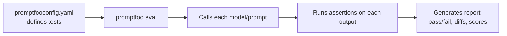
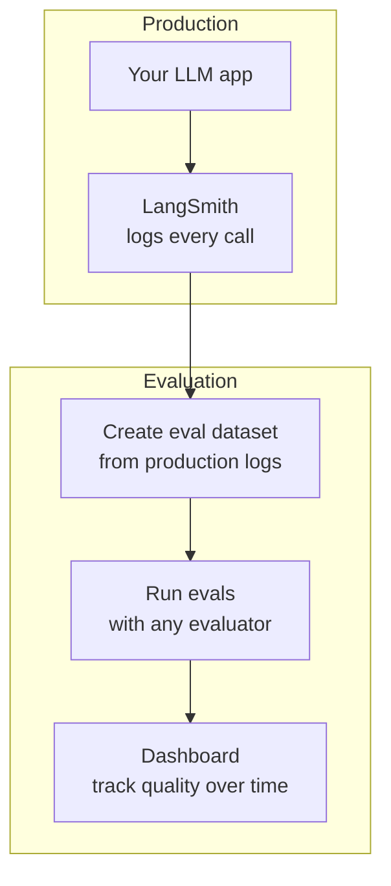

# AI Eval Frameworks

## The Story 📖

A software team starts writing tests. The first few are fine — just `assert` statements in a Python file. Then the test suite grows. Some tests need fixtures. Some need mocking. Some need parametrize. Some need fixtures from fixtures. Within a month, the custom testing code is more complex than the code being tested.

Then someone suggests: "Why don't we just use pytest?"

The same pattern plays out in AI evaluation. Teams start with ad-hoc scripts. "Run the LLM on these 50 prompts and print the outputs." That works for a week. Then you need scoring. Then you need to track scores over time. Then you need to compare two model versions. Then you need to run this in CI. Then you need a dashboard.

By the time you've built all that, you've built Promptfoo.

**Eval frameworks** give you the infrastructure so you can focus on defining what to evaluate, not on building the plumbing to run evaluations.

👉 This is why we use **Eval Frameworks** — because the evaluation infrastructure is solved; the hard part is defining your specific quality criteria.

---

## What is an Eval Framework?

An **eval framework** is a tool that provides the infrastructure for running, managing, and tracking AI evaluations at scale. Instead of writing custom scripts, you configure what to test and the framework handles running, scoring, comparing, and reporting.

Key capabilities:

| Capability | What it means |
|-----------|--------------|
| **Test case management** | Define test inputs, expected outputs, and scoring criteria |
| **Multi-model comparison** | Run the same tests against multiple models/prompts |
| **Scoring integration** | Built-in support for exact match, LLM-as-judge, custom functions |
| **CI/CD integration** | Automate eval runs on every code change |
| **History tracking** | Track scores over time to detect regressions |
| **Reporting** | Dashboards, diffs, failure analysis |

---

## Why It Exists — The Problem It Solves

**1. Eval infrastructure is expensive to build from scratch**
Building a robust eval system requires: test case storage, model calling, retry logic, parallel execution, score aggregation, result storage, dashboards, CI integration. This takes weeks to build well.

**2. Ad-hoc scripts don't catch regressions**
A script you run manually before launch doesn't catch quality regressions introduced two weeks later by a prompt change. Continuous evaluation does.

**3. Comparison across models and prompts**
When choosing between GPT-4o and Claude Sonnet, or between two prompt versions, you want to see side-by-side comparisons on the same test cases. Most teams do this manually in spreadsheets. A framework does it automatically.

---

## How It Works — Step by Step

### Promptfoo: Config-based evals

Promptfoo is an open-source CLI tool that runs evals from a YAML configuration file.



**Key concept**: You define test cases as YAML with assertions. Promptfoo calls your models, collects outputs, and applies the assertions.

### LangSmith: Observability + evals

LangSmith is LangChain's tool for logging, debugging, and evaluating LLM applications.



### OpenAI Evals

OpenAI's framework for evaluating models using a standard format. Primarily designed for model-level evaluation rather than application-level evaluation.

---

## The Math / Technical Side (Simplified)

### Assertion types

Eval frameworks support different types of assertions for checking outputs:

| Type | Description | Example |
|------|-------------|---------|
| `exact` | Output exactly matches expected string | `"The answer is 42"` |
| `contains` | Output contains a substring | `"includes keyword 'refund'"` |
| `not-contains` | Output does NOT contain a string | `"never says 'I don't know'"` |
| `icontains` | Case-insensitive contains | `"mentions 'openai'"` |
| `regex` | Output matches a regex pattern | `"matches date pattern"` |
| `python` | Custom Python function to check output | `"def check(output): ..."` |
| `llm-rubric` | LLM-as-judge with a rubric | `"Is this response helpful?"` |
| `similar` | Semantic similarity to expected | `"similar to: 'Returns in 30 days'"` |

### Running comparison tests

The power of frameworks comes from running the same test cases across multiple configurations:

```yaml
# promptfooconfig.yaml
prompts:
  - "Answer the following question: {{question}}"          # prompt v1
  - "You are a helpful assistant. {{question}}"            # prompt v2

providers:
  - openai:gpt-4o
  - anthropic:claude-opus-4-6

tests:
  - vars:
      question: "What is your return policy?"
    assert:
      - type: contains
        value: "30 days"
      - type: llm-rubric
        value: "Is the response helpful and accurate?"
```

This runs 2 prompts × 2 models × all test cases = complete comparison matrix.

---

## Framework Comparison

| Feature | Promptfoo | LangSmith | OpenAI Evals |
|---------|-----------|-----------|--------------|
| **Type** | CLI + config | SaaS platform | Python framework |
| **Cost** | Free (open source) | Free tier + paid | Free |
| **Best for** | Prompt/model comparison | LangChain apps, production monitoring | OpenAI model evaluation |
| **CI/CD** | Native support | Via API | Manual |
| **LLM-as-judge** | Built-in | Built-in | Manual |
| **Multi-model** | Excellent | Good | Limited |
| **Observability** | Limited | Excellent (traces) | Limited |
| **Dashboard** | CLI + web viewer | Full SaaS dashboard | None built-in |

---

## When to Use Off-the-Shelf vs Custom

| Use off-the-shelf when | Build custom when |
|-----------------------|------------------|
| Standard eval metrics (accuracy, LLM-as-judge) | Highly domain-specific scoring that frameworks can't express |
| Comparing models/prompts quickly | Need to integrate deeply with your existing CI/CD pipeline |
| Standard pipeline (RAG, chatbot) | Complex multi-step evaluation with dependencies |
| Fast iteration, prototyping | Enterprise requirements (data doesn't leave your infrastructure) |
| Small-to-medium team | You already have evaluation infrastructure you're extending |

---

## Where You'll See This in Real AI Systems

- **Startup AI teams**: Promptfoo for prompt comparison before deployments
- **LangChain users**: LangSmith for production tracing + eval integration
- **Enterprise**: Custom pipelines using evaluation frameworks as components
- **Model providers**: OpenAI Evals for model benchmarking

---

## Common Mistakes to Avoid ⚠️

- **Choosing a framework before defining your evaluation needs**: Start with what you want to measure, then pick the tool. Not the other way around.

- **Over-relying on LLM-as-judge without calibration**: Frameworks make it easy to run LLM-as-judge at scale. Without calibrating against human labels, you're measuring "what the judge thinks" not "what's actually good."

- **Not integrating with CI/CD**: An eval you run manually before launch is better than nothing, but a CI integration that runs on every PR is dramatically better.

- **Ignoring test case maintenance**: Test cases go stale. Product requirements change, and your eval set should reflect current quality expectations. Review and update quarterly.

---

## Connection to Other Concepts 🔗

- **Evaluation Fundamentals** (Section 18.01): Frameworks implement the concepts there
- **LLM-as-Judge** (Section 18.03): All frameworks support LLM-as-judge assertions
- **RAG Evaluation** (Section 18.04): RAGAS can be integrated into framework pipelines
- **Build an Eval Pipeline** (Section 18.08): This section covers building on top of frameworks

---

✅ **What you just learned**
- Eval frameworks provide infrastructure (test case management, parallel execution, result tracking, dashboards) so you focus on defining quality criteria
- Promptfoo: config-based, multi-model comparison, great for prompt engineering
- LangSmith: observability + evals for LangChain apps and production monitoring
- Different assertion types: exact match, contains, regex, LLM-as-judge
- Use off-the-shelf for standard pipelines; build custom only when frameworks can't express your needs

🔨 **Build this now**
Install Promptfoo (`npm install -g promptfoo`) and create a `promptfooconfig.yaml` for a simple chatbot test. Define 5 test cases with `contains` assertions. Run `promptfoo eval`. See your first framework-based eval report.

➡️ **Next step**
Move to [`08_Build_an_Eval_Pipeline/Project_Guide.md`](../08_Build_an_Eval_Pipeline/Project_Guide.md) to build a complete automated eval pipeline from scratch.

---

## 📂 Navigation

**In this folder:**
| File | |
|---|---|
| 📄 **Theory.md** | ← you are here |
| [📄 Cheatsheet.md](./Cheatsheet.md) | Quick reference |
| [📄 Interview_QA.md](./Interview_QA.md) | Interview prep |
| [📄 Code_Example.md](./Code_Example.md) | Promptfoo setup |
| [📄 Comparison.md](./Comparison.md) | Frameworks comparison table |

⬅️ **Prev:** [06 — Red Teaming](../06_Red_Teaming/Theory.md) &nbsp;&nbsp;&nbsp; ➡️ **Next:** [08 — Build an Eval Pipeline](../08_Build_an_Eval_Pipeline/Project_Guide.md)
