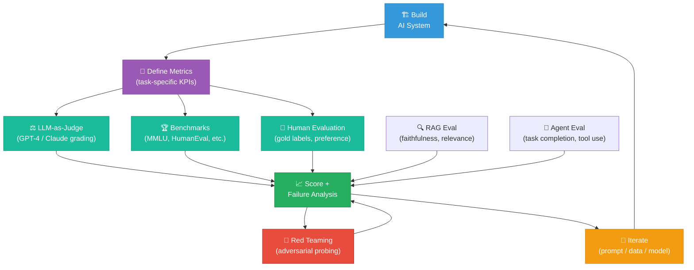

# 📊 AI Evaluation

⬅️ [17 Multimodal AI](../17_Multimodal_AI/Readme.md) &nbsp;|&nbsp; [🏠 Home](../00_Learning_Guide/Readme.md) &nbsp;|&nbsp; [19 Reinforcement Learning ➡️](../19_Reinforcement_Learning/Readme.md)

> You can't improve what you can't measure — evaluation is the discipline that turns "it seems to work" into rigorous evidence that your AI system does what it's supposed to do.

**[▶ Start here → Evaluation Fundamentals Theory](./01_Evaluation_Fundamentals/Theory.md)**

---

## At a Glance

| | |
|---|---|
| 📚 Topics | 8 topics |
| ⏱️ Est. Time | 5–6 hours |
| 📋 Prerequisites | [Multimodal AI](../17_Multimodal_AI/Readme.md) |
| 🔓 Unlocks | [Reinforcement Learning](../19_Reinforcement_Learning/Readme.md) |

---

## What's in This Section

---

## Topics

| # | Topic | What You'll Learn | Files |
|---|---|---|---|
| 01 | [Evaluation Fundamentals](./01_Evaluation_Fundamentals/) | Why AI eval is hard (non-determinism, subjective quality, distribution shift), the eval triangle of cost/speed/quality, and designing your eval strategy | [📖 Theory](./01_Evaluation_Fundamentals/Theory.md) · [⚡ Cheatsheet](./01_Evaluation_Fundamentals/Cheatsheet.md) · [🎯 Interview Q&A](./01_Evaluation_Fundamentals/Interview_QA.md) |
| 02 | [Benchmarks](./02_Benchmarks/) | Standard academic benchmarks (MMLU, HumanEval, HellaSwag, BIG-Bench), what they measure, their limitations, and how to run them | [📖 Theory](./02_Benchmarks/Theory.md) · [⚡ Cheatsheet](./02_Benchmarks/Cheatsheet.md) · [🎯 Interview Q&A](./02_Benchmarks/Interview_QA.md) |
| 03 | [LLM-as-Judge](./03_LLM_as_Judge/) | Using a strong LLM to grade outputs: rubric design, positional bias, self-consistency checks, and when LLM-as-Judge is and isn't trustworthy | [📖 Theory](./03_LLM_as_Judge/Theory.md) · [⚡ Cheatsheet](./03_LLM_as_Judge/Cheatsheet.md) · [🎯 Interview Q&A](./03_LLM_as_Judge/Interview_QA.md) |
| 04 | [RAG Evaluation](./04_RAG_Evaluation/) | The RAGAS framework: measuring faithfulness, answer relevance, context precision/recall, and how to detect hallucinations in retrieval-augmented outputs | [📖 Theory](./04_RAG_Evaluation/Theory.md) · [⚡ Cheatsheet](./04_RAG_Evaluation/Cheatsheet.md) · [🎯 Interview Q&A](./04_RAG_Evaluation/Interview_QA.md) |
| 05 | [Agent Evaluation](./05_Agent_Evaluation/) | Evaluating multi-step agents: task completion rate, tool-use accuracy, trajectory analysis, and the challenges of evaluating open-ended agentic behavior | [📖 Theory](./05_Agent_Evaluation/Theory.md) · [⚡ Cheatsheet](./05_Agent_Evaluation/Cheatsheet.md) · [🎯 Interview Q&A](./05_Agent_Evaluation/Interview_QA.md) |
| 06 | [Red Teaming](./06_Red_Teaming/) | Systematically adversarial testing: jailbreaks, prompt injection, data extraction, bias probing, and structured red-team methodologies | [📖 Theory](./06_Red_Teaming/Theory.md) · [⚡ Cheatsheet](./06_Red_Teaming/Cheatsheet.md) · [🎯 Interview Q&A](./06_Red_Teaming/Interview_QA.md) |
| 07 | [Eval Frameworks](./07_Eval_Frameworks/) | Hands-on with LangSmith, Braintrust, RAGAS, Evals (OpenAI), and DeepEval — when to use each and how to build CI-integrated eval pipelines | [📖 Theory](./07_Eval_Frameworks/Theory.md) · [⚡ Cheatsheet](./07_Eval_Frameworks/Cheatsheet.md) · [🎯 Interview Q&A](./07_Eval_Frameworks/Interview_QA.md) |
| 08 | [Build an Eval Pipeline](./08_Build_an_Eval_Pipeline/) | End-to-end project: building a golden dataset, running automated evals, visualizing failure modes, and integrating evals into a deployment workflow | [📖 Theory](./08_Build_an_Eval_Pipeline/Theory.md) · [⚡ Cheatsheet](./08_Build_an_Eval_Pipeline/Cheatsheet.md) · [🎯 Interview Q&A](./08_Build_an_Eval_Pipeline/Interview_QA.md) |

---

## Key Concepts at a Glance

| Concept | What It Means |
|---|---|
| **Eval is a loop, not a checkpoint** | Evaluation is most valuable when it runs continuously: on every prompt change, model update, and data shift, not just before a release. |
| **LLM-as-Judge scales where humans can't** | A well-prompted GPT-4 judge with a clear rubric agrees with human raters ~80% of the time, enabling cheap automated quality signals at thousands of examples per dollar. |
| **RAGAS deconstructs RAG into four measurable signals** | Faithfulness (does the answer only claim what the context says?), answer relevance (does it answer the question?), context precision (are the retrieved chunks relevant?), and context recall (were all needed chunks retrieved?). |
| **Red teaming is eval for failure modes** | Systematic adversarial probing discovers the edge cases benchmarks miss: prompt injections, refusal bypasses, data leakage, and demographic biases. |
| **A golden dataset is your most valuable eval asset** | 100–500 hand-curated examples with verified correct answers, covering both typical cases and known hard cases, is worth more than any automated metric. |

---

## Companion File

Before building your first eval pipeline, read the [Evaluation Checklist](./Evaluation_Checklist.md) — a structured set of questions to answer before you write a single line of eval code.

---

## 📂 Navigation

⬅️ **Prev:** [17 Multimodal AI](../17_Multimodal_AI/Readme.md) &nbsp;&nbsp; ➡️ **Next:** [19 Reinforcement Learning](../19_Reinforcement_Learning/Readme.md)
