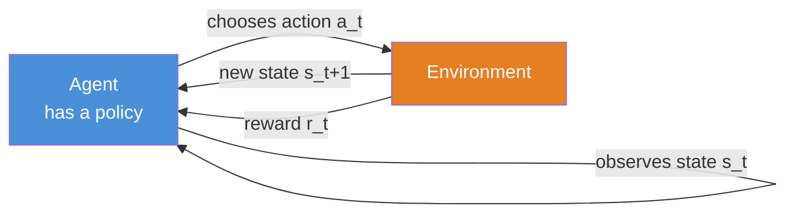
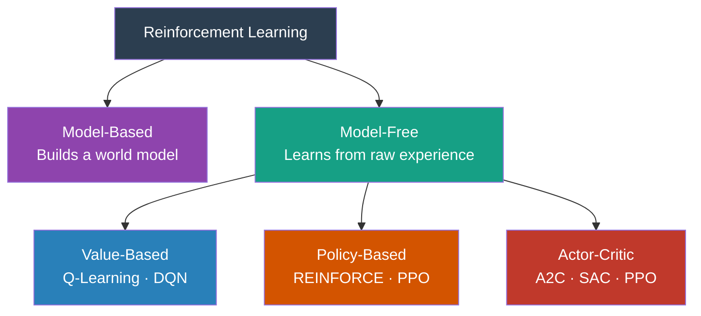

# Reinforcement Learning Fundamentals

## The Story 📖

You get a puppy. When it accidentally sits after you say "sit," you give it a treat. Over hundreds of repetitions the dog discovers the pattern: sitting after the cue produces treats. Nobody wrote down the rule — it learned through trial, feedback, and repetition.

Now imagine teaching the dog an obstacle course where only completing the whole course earns a treat. The dog must figure out which of its hundreds of actions mattered. That's the hard part of RL: connecting delayed rewards to the actions that caused them.

👉 This is why we need **Reinforcement Learning** — a way for an agent to learn behavior purely through interaction, using reward signals as the only teacher.

---

## What is Reinforcement Learning?

**Reinforcement Learning (RL)** is a branch of machine learning where an **agent** learns to make decisions by interacting with an **environment** and learning from **rewards** and **penalties** over time.

Three things make RL unique:
- **Trial and error** — the agent tries things and sees what happens.
- **Delayed rewards** — the payoff may come long after the action that caused it.
- **Sequential decisions** — today's action changes the situation you'll face tomorrow.

---

## Why It Exists — The Problem It Solves

Supervised learning needs labeled (input, correct-output) pairs. For many problems, that data doesn't exist:

1. **No one can label every game frame** with "the correct move" — too many chess positions to enumerate, let alone label.
2. **No one can label every robot motion** — a robot learning to walk faces thousands of unique situations per second.
3. **The correct action depends on future consequences** — sacrificing a chess piece now might win the game three moves later.

In RL, the **environment provides the teaching signal** through rewards. Define what "good" looks like via the reward function, and the agent discovers how to achieve it.

---

## How It Works — Step by Step



1. The agent observes the current **state**.
2. The agent uses its **policy** to choose an **action**.
3. The environment transitions to a new state and returns a **reward**.
4. The agent uses this experience to improve its policy.
5. Repeat — thousands or millions of times.

---

## Core Concepts Defined

**State (s)** — A snapshot of the environment at one moment. For chess: board position. For a robot: joint angles and velocities.

**Action (a)** — What the agent can do. Can be **discrete** (a finite list) or **continuous** (a real number, like "apply 3.2 Nm of torque").

**Reward (r)** — A scalar the environment gives after each action. It encodes your goal. The reward function is the most important design decision in any RL system.

**Policy (π)** — The agent's strategy: a mapping from states to actions. The goal of RL is to find a good policy.

**Value function V(s)** — Expected total future reward from state s. "How good is it to be here?" This looks ahead, not just at the immediate reward.

**Q-function Q(s, a)** — Expected total future reward from taking action a in state s. Q-values let the agent compare actions without trying them.

**Episode** — One complete run from start to finish. When it ends, the environment resets.

**Return (G_t)** — Total accumulated reward from time t, usually **discounted**:
```
G_t = r_t + γ·r_{t+1} + γ²·r_{t+2} + …
```

**Discount factor (γ)** — Between 0 and 1; controls how much future rewards matter. γ = 0.99 treats future rewards almost as highly as immediate ones. γ = 0 ignores everything beyond the next step.

---

## The Full RL Landscape



---

## RL vs Supervised vs Unsupervised Learning

| Dimension | Supervised Learning | Unsupervised Learning | Reinforcement Learning |
|---|---|---|---|
| Training signal | Labeled examples | No labels | Reward from environment |
| Teacher | Human-labeled dataset | None | The environment |
| Goal | Predict correct output | Find structure in data | Maximize cumulative reward |
| Data source | Static dataset | Static dataset | Generated through interaction |
| Feedback timing | Immediate, per sample | None | Delayed, sparse |
| Sample efficiency | High | N/A | Usually low |

In RL there are **no correct answers given in advance** — the agent discovers what's good by trying it.

---

## The Math / Technical Side (Simplified)

The agent's goal is to find a policy π that maximizes **expected return**:
```
maximize: E[ G_0 ] = E[ r_0 + γ·r_1 + γ²·r_2 + … ]
```

The **Bellman equation** gives the value function under policy π:
```
V^π(s) = E_π[ r_t + γ · V^π(s_{t+1}) | s_t = s ]
```

"The value of a state = the reward I expect now + the discounted value of where I'll end up." This recursive relationship is the backbone of Q-Learning, DQN, and nearly every other RL algorithm.

---

## Where You'll See This in Real AI Systems

- **Game playing** — AlphaGo, AlphaZero, OpenAI Five (Dota 2).
- **Robotics** — Training robot hands to grasp, legs to walk, arms to assemble.
- **Recommendation systems** — YouTube, TikTok, Netflix model recommendations as RL where engagement is the reward.
- **RLHF** — ChatGPT, Claude, and Gemini use RL with Human Feedback to align outputs with human preferences.
- **Data center cooling** — DeepMind's RL agent reduced Google's cooling energy use by ~40%.

---

## Common Mistakes to Avoid ⚠️

**Confusing reward with return.** Reward is what you get right now. Return is the sum of all future rewards. The agent optimizes return.

**Designing a bad reward function.** A boat-racing agent rewarded by score (not finishing the race) learns to spin in circles hitting bonus items forever. The reward IS the goal definition.

**Using RL when supervised learning would work.** If you have labeled data, supervised learning is simpler and faster. RL shines only when you lack labels and have a simulator or live environment.

**Expecting fast convergence.** RL agents often need millions of steps to learn what a human understands in seconds.

---

## Connection to Other Concepts 🔗

- **Markov Decision Processes** — The formal math framework defining states, actions, transitions, and rewards.
- **Q-Learning** — Learns a Q-table mapping each (state, action) to expected return.
- **Deep Q-Networks (DQN)** — Q-Learning with a neural network replacing the Q-table.
- **Policy Gradients / PPO** — Optimize the policy directly without learning a value function first.
- **RLHF** — RL applied to language model fine-tuning using human preferences as the reward signal.

---

✅ **What you just learned:**
- RL agents learn through trial-and-error guided by reward signals — no labeled data needed.
- Core terms: agent, environment, state, action, reward, policy, value function, return, discount factor.
- The RL loop: observe → act → receive reward → update policy → repeat.

🔨 **Build this now:**
Implement a one-armed bandit in 20 lines of Python. Create 3 slot machines with win probabilities (0.2, 0.5, 0.8). Write an agent that pulls each machine 10 times, calculates average reward per machine, then always plays the best one. You've just built your first RL agent.

➡️ **Next step:** `../02_Markov_Decision_Processes/Theory.md` — learn the formal math that makes RL rigorous.

---

## 📂 Navigation

**In this folder:**
| File | |
|---|---|
| 📄 **Theory.md** | ← you are here |
| [📄 Cheatsheet.md](./Cheatsheet.md) | Quick reference card |
| [📄 Interview_QA.md](./Interview_QA.md) | Interview prep |
| [📄 Intuition_First.md](./Intuition_First.md) | 5 everyday RL examples |

⬅️ **Prev:** Section intro &nbsp;&nbsp;&nbsp; ➡️ **Next:** [Markov Decision Processes](../02_Markov_Decision_Processes/Theory.md)
