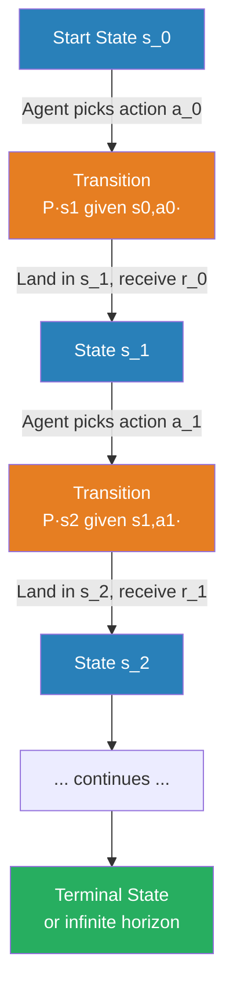
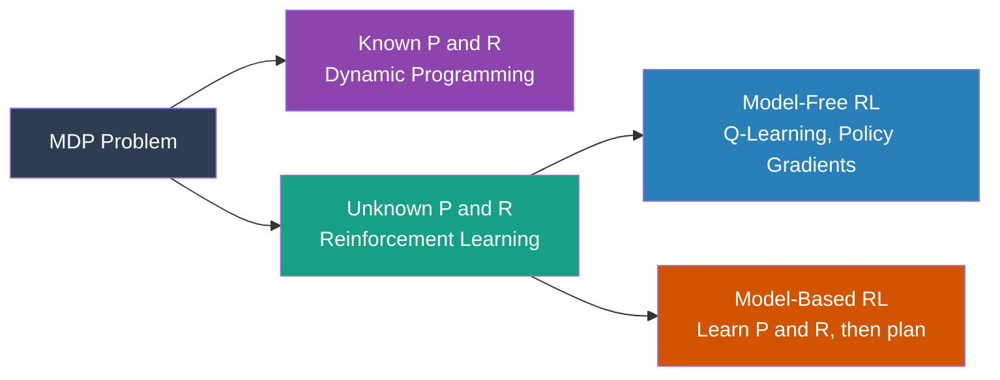

# Markov Decision Processes

## The Story 📖

You're navigating a maze. At every junction you observe your current **state** (which corridors are open), choose a direction (**action**), and move. Depending on where you were and which direction you moved, you end up somewhere new (**state transition**) and receive a signal: closer to the exit (+1), dead end (-1), or nothing (0) — that's the **reward**.

The maze doesn't care about your history. Whether you arrived via the north or south corridor doesn't change what's available from here. This property — the current state contains all the information you need — is the **Markov property**, and it's what makes the math tractable.

👉 This is why we need **Markov Decision Processes** — a formal mathematical framework that describes every RL problem precisely.

---

## 📌 Learning Priority

**Must Learn** — core concepts, needed to understand the rest of this file:
[MDP Definition](#what-is-a-markov-decision-process) · [Five Components](#the-five-components-up-close) · [Markov Property](#states-s)

**Should Learn** — important for real projects and interviews:
[Bellman Expectation Equation](#the-bellman-expectation-equation) · [Bellman Optimality Equation](#the-bellman-optimality-equation) · [Real AI Systems](#where-youll-see-this-in-real-ai-systems)

**Good to Know** — useful in specific situations, not needed daily:
[Episodic vs Infinite Horizon](#episodes-vs-infinite-horizon) · [MDP Problem Types](#types-of-mdp-problems)

**Reference** — skim once, look up when needed:
[Common Mistakes](#common-mistakes-to-avoid-) · [Connection to Other Concepts](#connection-to-other-concepts-)

---

## What is a Markov Decision Process?

A **Markov Decision Process (MDP)** is defined by five components:

- **S** — the set of all possible states
- **A** — the set of all possible actions
- **P(s' | s, a)** — transition function: probability of landing in s' after taking action a in state s
- **R(s, a, s')** — reward function: reward received when transitioning from s to s' via action a
- **γ** — discount factor (0 ≤ γ ≤ 1)

Every RL problem can be modeled as an MDP (or a partially observable version). Writing down an MDP formally defines the problem; RL algorithms are methods for *solving* it — finding the best policy.

---

## Why It Exists — The Problem It Solves

Without a formal framework, RL would be ad-hoc tricks. The MDP provides:

1. **A precise problem definition.** "Find π that maximizes expected discounted return" is a well-defined mathematical objective.
2. **Guarantees.** Certain algorithms provably converge to the optimal policy under well-defined conditions.
3. **A common language.** Researchers test new algorithms against the same problem definition.
4. **Theoretical tools.** The Bellman equation, dynamic programming, and policy iteration all flow directly from MDP structure.

---

## How It Works — Step by Step



1. **Start.** Environment places the agent in initial state s_0.
2. **Observe and act.** Agent observes s_t, picks action a_t per policy π.
3. **Transition.** Environment samples next state s_{t+1} from P(s' | s_t, a_t). Deterministic environments use a fixed function; stochastic environments use a probability distribution.
4. **Reward.** Environment returns r_t = R(s_t, a_t, s_{t+1}).
5. **Repeat** until a terminal state (episodic) or forever (continuing tasks).

---

## The Five Components Up Close

### States (S)

The state must capture everything relevant for future decisions — the **Markov property**:
```
P(s_{t+1} | s_t, a_t, s_{t-1}, a_{t-1}, …) = P(s_{t+1} | s_t, a_t)
```
Knowing where you are now is enough; you don't need to know how you got here.

### Actions (A)

- **Discrete:** {left, right, up, down} — the agent picks one.
- **Continuous:** a real number or vector (e.g., joint torque = 1.7 Nm).

### Transitions P(s' | s, a)

In deterministic environments: next_state = f(s, a). In stochastic environments, the same action from the same state may lead to different outcomes (e.g., a robot on a slippery floor).

### Rewards R(s, a, s')

The scalar signal encoding how well the agent is doing. Designing the reward function is the most critical — and most art-like — part of building an RL system.

### Discount Factor γ

| γ value | Agent behavior |
|---|---|
| γ = 0 | Only cares about the next reward — completely myopic |
| γ = 0.5 | Reward two steps ahead worth 25% of immediate reward |
| γ = 0.99 | Reward 100 steps ahead worth ~37% of immediate reward |
| γ = 1 | All future rewards count equally (only valid in episodic tasks) |

---

## Episodes vs Infinite Horizon

**Episodic tasks** have a natural terminal state: chess, maze navigation, Atari games. The environment resets after each episode.

**Continuing tasks** run forever: stock trading, thermostats, recommendation engines. The discount factor is essential here — without it, total reward could be infinite.

---

## The Math / Technical Side (Simplified)

### The Value Function

The **state-value function** V^π(s) gives expected return from state s under policy π:
```
V^π(s) = E_π[ r_t + γ·r_{t+1} + γ²·r_{t+2} + … | s_t = s ]
```

### The Bellman Expectation Equation

Expanding one step:
```
V^π(s) = Σ_a π(a|s) · Σ_{s'} P(s'|s,a) · [ R(s,a,s') + γ · V^π(s') ]
```
Sum over all actions the policy might take; for each, sum over all possible next states; collect immediate reward + discounted value of next state.

### The Bellman Optimality Equation

The **optimal value function** V*(s):
```
V*(s) = max_a Σ_{s'} P(s'|s,a) · [ R(s,a,s') + γ · V*(s') ]
```
Solving this exactly gives the optimal policy. RL algorithms approximate this solution when P and R are unknown.

---

## Types of MDP Problems



When P and R are known, solve exactly with dynamic programming (policy iteration or value iteration). In RL, P and R are typically unknown — the agent learns by interacting.

---

## Where You'll See This in Real AI Systems

- **Game AI** — Every Atari game, chess engine, and Go program is formally an MDP: state = board/screen, actions = moves, transitions = game mechanics, reward = win/lose/score.
- **Robotics** — Continuous-state, continuous-action MDPs; the transition function is the robot's physics.
- **Dialog systems** — State = conversation history, action = response, reward = user satisfaction.
- **RLHF** — Token generation is formally an MDP with human preference as the reward signal.

---

## Common Mistakes to Avoid ⚠️

**Violating the Markov property.** If your state doesn't capture all relevant history, transitions aren't truly Markovian. Fix: include relevant history (e.g., stack last 4 Atari frames — a single frame hides velocity).

**Confusing partial observability with non-Markovian environments.** If the agent can't observe the full state, you have a **POMDP**. The environment is still Markovian — the agent just can't see the full state.

**Misdesigning the reward function.** The MDP framework is neutral — it optimizes whatever reward you specify. Spec it wrong and the agent finds a legal but unwanted solution.

---

## Connection to Other Concepts 🔗

- **RL Fundamentals** — MDPs formalize RL's vocabulary: state, action, reward, policy.
- **Q-Learning** — Learns Q(s,a), the action-value version of the Bellman equation, without knowing P or R.
- **Policy Gradients** — Directly optimizes π(a|s) without explicitly representing the value function.
- **Dynamic Programming** — The exact solution method for MDPs when P and R are known.
- **POMDPs** — Extension for when agents can't observe the full state.

---

✅ **What you just learned:**
- An MDP is defined by (S, A, P, R, γ) — five components that formally specify any RL problem.
- The Markov property: the current state contains all information needed for future decisions.
- The Bellman equation: value = immediate reward + discounted value of next state (recursive).
- RL algorithms solve MDPs when P and R are unknown — learning by interaction instead.

🔨 **Build this now:**
Draw a 4-cell maze: Start → Hall → Hall → Exit. Write down the MDP: all states, all actions (move-forward, turn-back), the deterministic transition function, and rewards (0 everywhere, +10 at exit). Compute V(cell 3) by hand using the Bellman equation with γ = 0.9.

➡️ **Next step:** `../03_Q_Learning/Theory.md` — learn how Q-Learning solves the MDP without knowing P or R.

---

## 📂 Navigation

**In this folder:**
| File | |
|---|---|
| 📄 **Theory.md** | ← you are here |
| [📄 Cheatsheet.md](./Cheatsheet.md) | Quick reference |
| [📄 Interview_QA.md](./Interview_QA.md) | Interview prep |
| [📄 Math_Intuition.md](./Math_Intuition.md) | Bellman equation built from scratch |

⬅️ **Prev:** [RL Fundamentals](../01_RL_Fundamentals/Theory.md) &nbsp;&nbsp;&nbsp; ➡️ **Next:** [Q-Learning](../03_Q_Learning/Theory.md)
