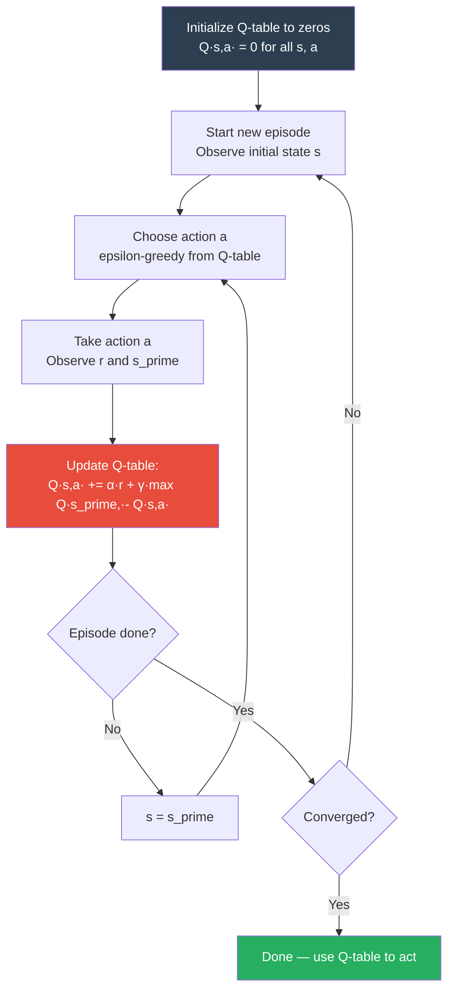
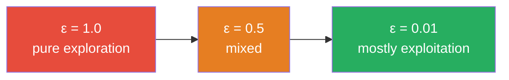

# Q-Learning

## The Story 📖

Imagine exploring a building for the first time, trying to find the cafeteria. Every time you reach a room, you note: "Room 14, going left → got me to the cafeteria in 3 minutes." Over many explorations you fill out a cheat sheet — every room, every direction, scored by how good that choice turned out to be.

Eventually the sheet is complete enough that you can walk into any room and immediately know the best direction. You don't need to wander anymore.

👉 This is **Q-Learning** — an algorithm that builds a cheat sheet (the **Q-table**) by exploring the environment, recording how good each action is in each state, and using those records to act optimally.

---

## What is Q-Learning?

**Q-Learning** is a **model-free**, **off-policy** reinforcement learning algorithm that learns the **Q-function**: Q(s, a) = the expected total future reward from taking action a in state s, then acting optimally.

Once Q(s, a) is known for all states and actions, the optimal policy is trivial:
```
π*(s) = argmax_a Q(s, a)
```

- **Model-free:** learns directly from experience — no need to know P(s'|s,a) or R.
- **Off-policy:** learns the optimal Q-function even while following an exploratory policy.

---

## Why It Exists — The Problem It Solves

Dynamic programming solves MDPs exactly — but requires knowing the full transition model P(s'|s,a). Two problems:

1. **P is usually unknown.** You don't know all the ways the environment responds to every action.
2. **Even if known, it may be huge.** Enumerating all states and transitions is infeasible.

Q-Learning's insight: you don't need P. Learn Q-values directly from (state, action, reward, next_state) tuples by running in the environment.

---

## How It Works — Step by Step



1. **Initialize.** Create a Q-table (rows = states, columns = actions), filled with zeros.
2. **Choose an action.** Use **epsilon-greedy**: with probability ε, pick random (explore); with probability 1-ε, pick argmax Q (exploit).
3. **Take the action.** Observe reward r and next state s'.
4. **Update the Q-table.** Apply the update rule below.
5. **Move to next state.** Set s = s'. If the episode ended, start a new one.
6. **Repeat** until Q-values converge.

---

## The Q-Learning Update Rule

```
Q(s, a) ← Q(s, a) + α · [ r + γ · max_{a'} Q(s', a') - Q(s, a) ]
```

| Term | Name | Meaning |
|---|---|---|
| `Q(s, a)` | Current estimate | What we currently think this (state, action) is worth |
| `r` | Immediate reward | What we actually got for taking this action |
| `γ · max_{a'} Q(s', a')` | Discounted future estimate | Best future value achievable from s' |
| `r + γ · max Q(s', a')` | TD target | New best estimate of Q(s,a) based on what happened |
| `TD target - Q(s,a)` | TD error | How wrong our old estimate was |
| `α` | Learning rate | How much to trust the new estimate vs the old one |

Intuition: "I thought this action was worth X. I just tried it and found it's more like Y. I'll update partway from X toward Y."

---

## Exploration vs Exploitation — Epsilon-Greedy

```
With probability ε:   pick a random action    (explore)
With probability 1-ε: pick argmax_a Q(s,a)   (exploit)
```

In practice ε is **annealed**: start high (ε = 1.0 — pure exploration) and gradually reduce (to ε = 0.01) as the agent learns.



---

## The Math / Technical Side (Simplified)

Q-Learning converges to Q* (the optimal Q-function) when:
1. Every (state, action) pair is visited infinitely often.
2. The learning rate α decays appropriately (Σα = ∞, Σα² < ∞).
3. The MDP satisfies the Markov property.

In practice: condition 1 via non-zero ε; condition 2 approximated with a small fixed α (e.g., 0.1); condition 3 assumed.

The update rule is a form of **temporal difference (TD) learning** — it bootstraps estimates using other estimates, rather than waiting for the episode to end.

---

## Q-Learning vs SARSA

Q-Learning is **off-policy**: the update uses `max_{a'} Q(s', a')` — the best possible next action, regardless of what the agent actually does.

**SARSA** is **on-policy**: it uses the action the agent *actually* took:
```
Q(s, a) ← Q(s, a) + α · [ r + γ · Q(s', a') - Q(s, a) ]
```

Q-Learning learns the optimal policy even while exploring randomly. SARSA learns the best policy for how the agent actually behaves (including exploration). In risky environments, SARSA tends to be safer; where data is cheap, Q-Learning is usually preferred.

---

## Limitations of the Q-Table

The Q-table requires one row per state. Fine for small problems (25-state gridworld, 100-cell maze) — but breaks down for:
- Atari games: millions of possible screen states
- Robot control: continuous state space (infinite states)

The solution: replace the table with a neural network that *generalizes* across states. That's **Deep Q-Networks (DQN)**.

---

## Where You'll See This in Real AI Systems

- **Simple game AI** — still used for small games and toy problems.
- **Educational demonstrations** — gridworld Q-Learning is the classic "hello world" of RL.
- **Foundation for DQN** — understanding Q-Learning is required to understand DQN and Atari-playing agents.

---

## Common Mistakes to Avoid ⚠️

**Setting α too high.** A learning rate of 0.9 causes values to oscillate wildly. Start with α = 0.1.

**Not annealing ε.** If ε stays at 1.0 the agent never exploits. If ε drops to 0 too fast, the agent stops exploring before finding good paths.

**Applying Q-Learning to large state spaces.** Once the state space exceeds a few thousand states, Q-tables become impractical. Use DQN.

**Confusing Q-Learning with SARSA.** Q-Learning uses `max Q(s',a')`. SARSA uses the actual next action. The difference matters in risky environments.

---

## Connection to Other Concepts 🔗

- **MDPs** — Q-Learning solves the Bellman optimality equation Q*(s,a) = E[r + γ·max Q*(s',a')] without knowing P or R.
- **Deep Q-Networks** — Replace the Q-table with a neural network for large/continuous state spaces.
- **SARSA** — The on-policy cousin of Q-Learning.
- **Policy Gradients** — Alternative approach that directly optimizes the policy instead of learning Q-values.
- **Temporal Difference Learning** — The general family Q-Learning belongs to.

---

✅ **What you just learned:**
- Q-Learning builds a Q-table storing the value of every (state, action) pair.
- Update rule: Q(s,a) += α · [r + γ·max Q(s',·) - Q(s,a)] — nudge estimate toward what actually happened.
- Epsilon-greedy balances exploration (random) and exploitation (best known action).
- Q-Learning is model-free, off-policy, and guaranteed to converge for small state spaces.

🔨 **Build this now:**
Implement Q-Learning on a 4×4 gridworld (see `Code_Example.md`). The agent starts at (0,0) and must reach (3,3) without stepping on 3 "holes." Run for 500 episodes. Plot the episode rewards over time — you should see the agent improving.

➡️ **Next step:** `../04_Deep_Q_Networks/Theory.md` — learn how to scale Q-Learning to massive state spaces using neural networks.


---

## 📝 Practice Questions

- 📝 [Q92 · q-learning](../../ai_practice_questions_100.md#q92--thinking--q-learning)


---

## 📂 Navigation

**In this folder:**
| File | |
|---|---|
| 📄 **Theory.md** | ← you are here |
| [📄 Cheatsheet.md](./Cheatsheet.md) | Quick reference |
| [📄 Interview_QA.md](./Interview_QA.md) | Interview prep |
| [📄 Math_Intuition.md](./Math_Intuition.md) | Q-update derivation with numbers |
| [📄 Code_Example.md](./Code_Example.md) | Q-Learning on a gridworld |

⬅️ **Prev:** [Markov Decision Processes](../02_Markov_Decision_Processes/Theory.md) &nbsp;&nbsp;&nbsp; ➡️ **Next:** [Deep Q-Networks](../04_Deep_Q_Networks/Theory.md)
