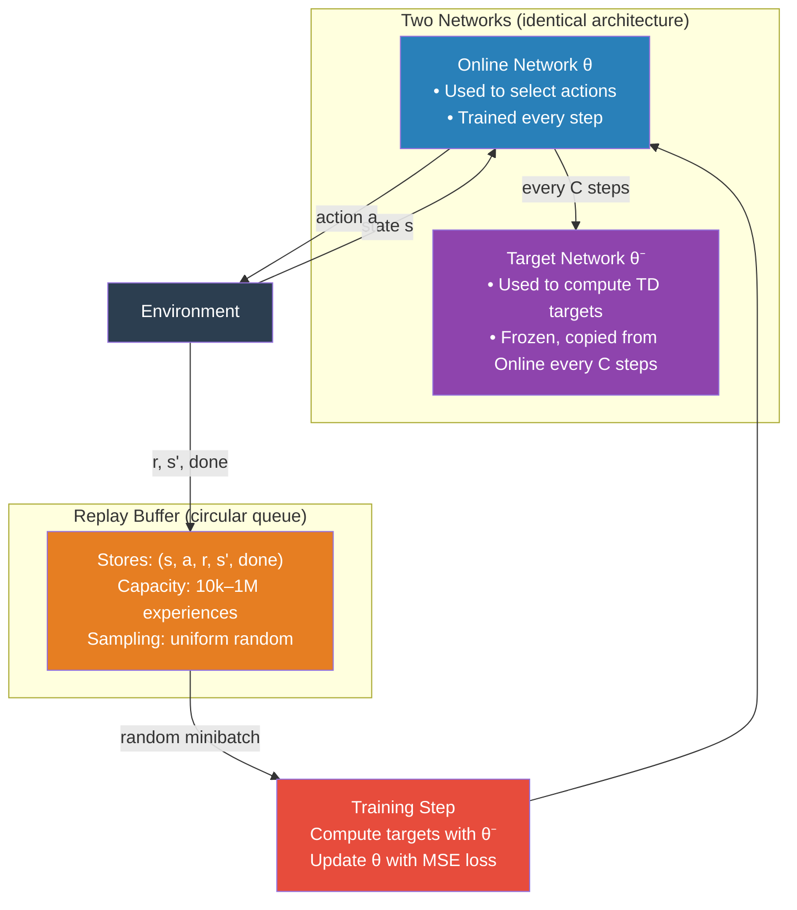

# DQN — Architecture Deep Dive

## The Big Picture

DQN has two neural networks (same architecture), one replay buffer, and one training loop.



---

## Network Architecture for CartPole (Simple States)

CartPole has a 4-dimensional observation (position, velocity, angle, angular velocity).

```
Input Layer:      4 values
                  │
Hidden Layer 1:   128 neurons  ReLU
                  │
Hidden Layer 2:   128 neurons  ReLU
                  │
Output Layer:     2 neurons    (one per action: push left, push right)
                  → [Q(s, left),  Q(s, right)]
```

To act: pick argmax of the output.

---

## Network Architecture for Atari (Pixel States)

Atari input is 4 stacked 84×84 grayscale frames → shape (4, 84, 84).

```
Input:  (4, 84, 84) — 4 stacked grayscale frames
        │
Conv2D: 32 filters, 8×8 kernel, stride 4 → output (32, 20, 20)  → ReLU
        │
Conv2D: 64 filters, 4×4 kernel, stride 2 → output (64, 9, 9)    → ReLU
        │
Conv2D: 64 filters, 3×3 kernel, stride 1 → output (64, 7, 7)    → ReLU
        │
Flatten: 64 × 7 × 7 = 3136 values
        │
Linear: 512 neurons → ReLU
        │
Linear: n_actions neurons  (e.g., 18 for full Atari action set)
        → [Q(s, a_0), Q(s, a_1), ..., Q(s, a_17)]
```

Why convolutional? Spatial structure matters in game screens — nearby pixels relate to each other. Conv layers detect edges, shapes, and objects regardless of exact position.

Why stack 4 frames? A single frame can't show motion. Stacking 4 consecutive frames gives the network implicit velocity information.

---

## The Replay Buffer in Detail


**Structure:** A fixed-capacity circular queue. When full, the oldest experience is overwritten.

**Contents:** Each slot stores one tuple: `(state, action, reward, next_state, done)`.

**Sampling:** Uniformly at random — any of the stored experiences is equally likely to be picked.

**Why random sampling breaks correlation:**
```
Time:    t=0    t=1    t=2    t=3    t=4    t=5  ...
States:  s_0    s_1    s_2    s_3    s_4    s_5

Sequential training order: s_0, s_1, s_2, s_3, s_4 ...
                           [highly correlated!]

Replay buffer sample:       s_3, s_8, s_1, s_99, s_7 ...
                           [decorrelated!]
```

**Minimum buffer fill:** Never train until the buffer has at least one full batch. Typically wait until 1,000–10,000 experiences are stored.

---

## Target Network Update Strategies

Two strategies exist:

**Hard update (original DQN):**
```
Every C steps:  θ⁻ ← θ    (copy all weights directly)
```
- C = 1,000 to 10,000 for Atari
- Simple, commonly used
- Creates periodic "jumps" in the target

**Soft update (used in DDPG, SAC):**
```
Every step:  θ⁻ ← τ · θ + (1-τ) · θ⁻    (τ typically 0.005)
```
- Smoothly tracks the online network
- More stable for continuous action tasks

---

## Data Flow — One Training Step

```
1. Sample minibatch of 32 from replay buffer:
   [(s₁,a₁,r₁,s₁',d₁), (s₂,a₂,r₂,s₂',d₂), ..., (s₃₂,a₃₂,r₃₂,s₃₂',d₃₂)]

2. For each sample i, compute TD target using TARGET NETWORK:
   yᵢ = rᵢ                                      if dᵢ = True (done)
   yᵢ = rᵢ + γ · max_{a'} Q(sᵢ', a'; θ⁻)       if dᵢ = False

3. Compute online network predictions for the taken actions:
   q̂ᵢ = Q(sᵢ, aᵢ; θ)

4. Compute MSE loss:
   L = (1/32) · Σ (yᵢ - q̂ᵢ)²

5. Backpropagate through ONLINE network only:
   θ ← θ - α · ∇_θ L

6. Every C steps: θ⁻ ← θ
```

---

## Dueling DQN Architecture

An influential extension: split the final layer into two streams.

```
     ...shared convolutional/linear layers...
                    │
          ┌─────────┴─────────┐
          │                   │
   Linear(128)          Linear(128)
          │                   │
   Linear(1)            Linear(n_actions)
     V(s)                  A(s,a)            ← Advantage
                            │
                  Q(s,a) = V(s) + A(s,a) - mean(A(s,·))
```

Why? V(s) is the baseline value of the state. A(s,a) captures how much better action a is relative to average. Many states have similar values for all actions — the dueling architecture can learn V(s) efficiently without needing action distinctions everywhere.

---

## Key Numbers at a Glance

| Parameter | CartPole | Atari |
|---|---|---|
| Observation | 4 floats | 84×84×4 pixels |
| Hidden layers | 2 × 128 | Conv + 512 |
| Replay buffer | 10,000 | 1,000,000 |
| Target update freq | 500 steps | 10,000 steps |
| Batch size | 64 | 32 |
| Learning rate | 1e-3 | 1e-4 |
| Epsilon decay | 1,000 steps | 1,000,000 steps |
| Training steps | ~50k | ~50M |

---

## 📂 Navigation

**In this folder:**
| File | |
|---|---|
| [📄 Theory.md](./Theory.md) | Full theory |
| [📄 Cheatsheet.md](./Cheatsheet.md) | Quick reference |
| [📄 Interview_QA.md](./Interview_QA.md) | Interview prep |
| 📄 **Architecture_Deep_Dive.md** | ← you are here |
| [📄 Code_Example.md](./Code_Example.md) | DQN on CartPole |

⬅️ **Prev:** [Q-Learning](../03_Q_Learning/Theory.md) &nbsp;&nbsp;&nbsp; ➡️ **Next:** [Policy Gradients](../05_Policy_Gradients/Theory.md)
