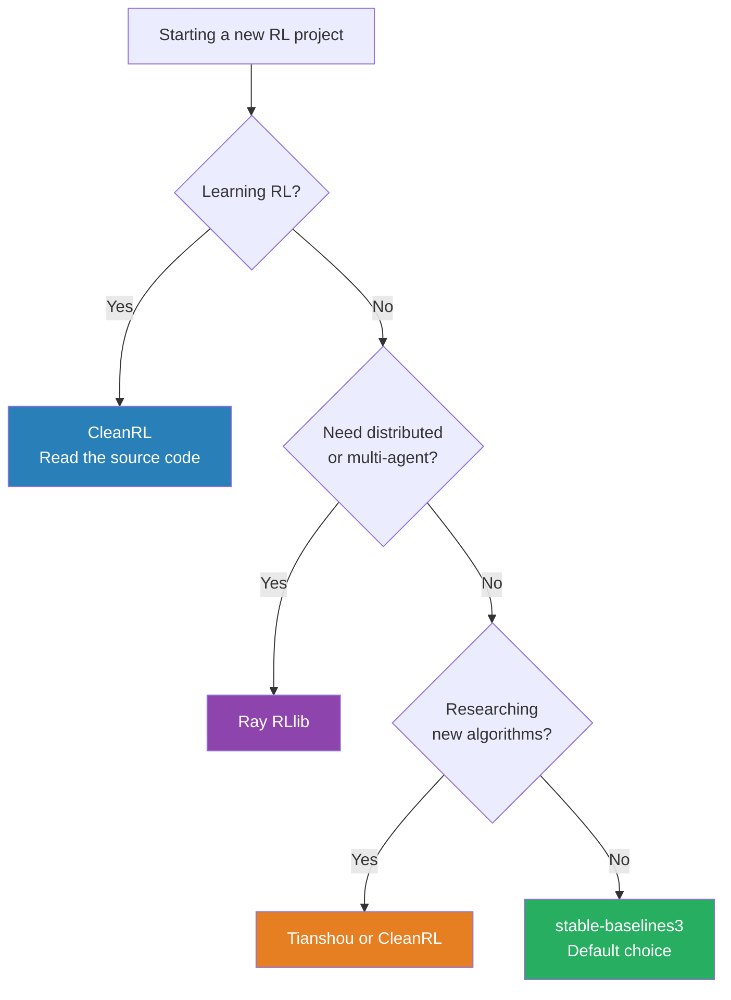

# RL Frameworks Guide

## The Landscape

Four major RL libraries cover different needs. Here's when to use each.

---

## stable-baselines3 (SB3)

**What it is:** Clean, simple, well-tested implementations of major RL algorithms. The "scikit-learn of RL."

**Algorithms:** PPO, DQN, SAC, TD3, A2C, HER (Hindsight Experience Replay)

**Best for:**
- Practitioners applying RL to a problem (not researching RL itself)
- Quick baselines and prototyping
- Teaching and learning RL concepts
- Standard Gymnasium environments

**Install:**
```bash
pip install stable-baselines3 gymnasium
```

**Minimal example:**
```python
from stable_baselines3 import PPO
import gymnasium as gym

env = gym.make("CartPole-v1")
model = PPO("MlpPolicy", env, verbose=1)
model.learn(total_timesteps=50_000)
model.save("my_model")
```

**Strengths:**
- Excellent documentation
- Consistent API across all algorithms
- Strong defaults (you can often just use `PPO("MlpPolicy", env)`)
- Built-in evaluation, callbacks, logging
- Active maintenance and support

**Weaknesses:**
- Limited to single-machine training
- Not designed for custom algorithm research
- No distributed training

**GitHub:** github.com/DLR-RM/stable-baselines3

---

## Ray RLlib

**What it is:** A production-scale, distributed RL library built on top of Ray. Designed for large-scale training across many machines/GPUs.

**Algorithms:** PPO, DQN, SAC, TD3, APPO, IMPALA, and many more (50+)

**Best for:**
- Production deployments requiring scale
- Multi-agent RL
- Training across multiple GPUs or machines
- Custom environments at scale
- Research requiring distributed training

**Install:**
```bash
pip install "ray[rllib]" gymnasium
```

**Minimal example:**
```python
from ray.rllib.algorithms.ppo import PPOConfig

config = (
    PPOConfig()
    .environment("CartPole-v1")
    .rollouts(num_rollout_workers=4)
    .training(lr=3e-4, train_batch_size=4000)
)
algo = config.build()
for i in range(100):
    result = algo.train()
    print(f"Iteration {i}: reward={result['episode_reward_mean']:.1f}")
```

**Strengths:**
- Scales to hundreds of workers
- Multi-agent RL built-in
- Highly configurable
- Excellent for production
- Supports custom models, environments, policies

**Weaknesses:**
- Significantly more complex than SB3
- Steeper learning curve
- Overkill for single-machine prototyping
- Documentation is extensive but can be hard to navigate

**GitHub:** github.com/ray-project/ray/tree/master/rllib

---

## CleanRL

**What it is:** Single-file, readable implementations of RL algorithms. Each algorithm is one Python file with no abstractions.

**Algorithms:** PPO, DQN, SAC, TD3, DDPG (each in one file, ~300–500 lines)

**Best for:**
- Learning exactly how RL algorithms work (you can read the entire implementation)
- RL researchers who want to modify algorithms
- Reproducing papers exactly
- Understanding the details that SB3 hides

**Install:**
```bash
pip install cleanrl gymnasium torch
```

**Usage:** Download a single file and run it.
```bash
python ppo.py --env-id CartPole-v1 --total-timesteps 50000
```

**Strengths:**
- Maximally transparent — no black boxes
- Exactly matches reference implementations
- WandB integration for experiment tracking built-in
- Great for learning and research

**Weaknesses:**
- Not designed for production use
- Code is not reusable (by design — it's monolithic)
- No built-in hyperparameter search or callbacks

**GitHub:** github.com/vwxyzjn/cleanrl

---

## Tianshou

**What it is:** A PyTorch-native RL library focused on modularity and research reproducibility.

**Algorithms:** DQN, PPO, SAC, TD3, and many advanced algorithms (IQN, QRDQN, etc.)

**Best for:**
- PyTorch-native workflows
- Researchers who want modularity without CleanRL's single-file approach
- Advanced algorithms not in SB3

**Install:**
```bash
pip install tianshou gymnasium
```

**Strengths:**
- Fully PyTorch native (no TensorFlow option)
- Very modular — mix and match components
- Good research reproducibility
- Offline RL support

**Weaknesses:**
- Smaller community than SB3 or RLlib
- Less documentation than SB3
- Less production-tested

**GitHub:** github.com/thu-ml/tianshou

---

## Side-by-Side Comparison

| Feature | stable-baselines3 | Ray RLlib | CleanRL | Tianshou |
|---|---|---|---|---|
| **Ease of use** | ⭐⭐⭐⭐⭐ | ⭐⭐⭐ | ⭐⭐⭐ | ⭐⭐⭐⭐ |
| **Scalability** | Single machine | Multi-machine | Single machine | Single machine |
| **Transparency** | Medium (abstractions) | Low (heavy abstractions) | High (one file) | Medium |
| **Algorithm variety** | Good (7 algos) | Excellent (50+) | Good (7 algos) | Good (15+ algos) |
| **Documentation** | Excellent | Good | Good | Good |
| **Multi-agent** | Limited | Excellent | No | Yes |
| **Production ready** | Yes (single machine) | Yes (distributed) | No | Partial |
| **Best for** | Prototyping, applying RL | Scale, production | Learning, research | PyTorch research |

---

## Decision Tree



---

## Practical Recommendations

### Starting a new project?
**Start with stable-baselines3.** Its defaults are excellent and it saves you from debugging implementation details. If SB3 doesn't have what you need, switch.

### Training a production RL system at scale?
**Use Ray RLlib.** It handles distributed training, multi-agent environments, and production deployment.

### Trying to understand an algorithm deeply?
**Read CleanRL source.** 300 lines of unabstracted Python tells you more than 1,000 lines of a framework.

### Researching novel RL algorithms?
**Modify CleanRL** (for single-algorithm experiments) or **use Tianshou** (for modular components).

---

## Common Setup Code (All Libraries)

### WandB Experiment Tracking (works with all libraries)
```python
import wandb
wandb.init(project="my-rl-experiment", config={"lr": 3e-4, "algo": "PPO"})
# ... training ...
wandb.log({"episode_reward": reward, "step": step})
```

### Tensorboard Logging (SB3 built-in)
```python
model = PPO("MlpPolicy", env, tensorboard_log="./tb_logs/")
model.learn(total_timesteps=100_000)
# Then: tensorboard --logdir ./tb_logs/
```

---

## 📂 Navigation

**In this folder:**
| File | |
|---|---|
| [📄 Theory.md](./Theory.md) | Full theory |
| [📄 Cheatsheet.md](./Cheatsheet.md) | Debugging checklist |
| [📄 Interview_QA.md](./Interview_QA.md) | Interview prep |
| [📄 Code_Example.md](./Code_Example.md) | Train, eval, save, load |
| 📄 **Frameworks_Guide.md** | ← you are here |

⬅️ **Prev:** [PPO](../06_PPO/Theory.md) &nbsp;&nbsp;&nbsp; ➡️ **Next:** [RL for LLMs](../08_RL_for_LLMs/Theory.md)
