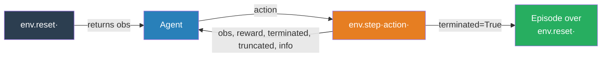
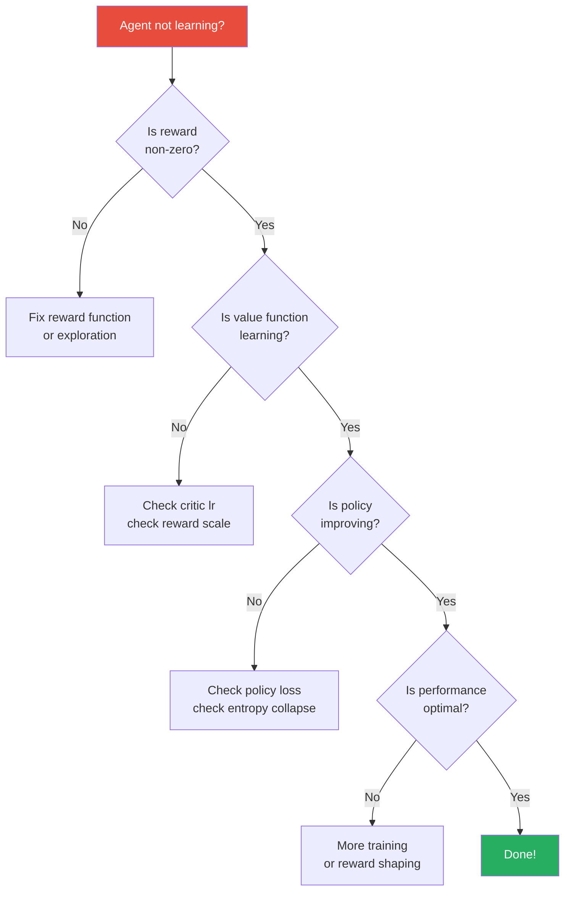

# RL in Practice

## The Story 📖

A researcher reads an RL paper, implements the algorithm exactly as described, runs it on the benchmark environment, and gets random agent-level performance. The paper reported superhuman results. What went wrong?

The paper used reward normalization. And a specific random seed. And a carefully tuned learning rate schedule. And 8 parallel environments. And a particular network initialization. And the benchmark was run over 5 seeds with error bars the paper didn't show.

Theory says RL works. Practice says RL is brutally sensitive to implementation details, hyperparameters, random seeds, and reward design. This chapter is the field guide for actually making it work — the things the papers don't always tell you.

👉 This is **RL in Practice** — the engineering and debugging knowledge required to move from "it worked in the paper" to "it works for me."

---

## 📌 Learning Priority

**Must Learn** — core concepts, needed to understand the rest of this file:
[Gymnasium Interface](#gymnasium--your-rl-environment-playground) · [Reward Shaping](#reward-shaping--the-most-important-practical-skill) · [Debugging Flow](#debugging-rl-agents)

**Should Learn** — important for real projects and interviews:
[Common Failure Modes](#1-reward-hacking) · [When Not to Use RL](#when-not-to-use-rl) · [stable-baselines3](#stable-baselines3--the-practitioners-toolkit)

**Good to Know** — useful in specific situations, not needed daily:
[Observation Normalization](#the-math--technical-side-simplified) · [Reward Shaping Patterns](#common-reward-shaping-patterns)

**Reference** — skim once, look up when needed:
[Connection to Other Concepts](#connection-to-other-concepts-)

---

## What This Chapter Covers

- The Gymnasium ecosystem (environments)
- stable-baselines3 (the practitioner's toolkit)
- Reward shaping — the most important practical skill
- Common failure modes and how to diagnose them
- When NOT to use RL

---

## Gymnasium — Your RL Environment Playground

**Gymnasium** (formerly OpenAI Gym) is the standard library for RL environments. It provides a consistent interface that every major RL library supports.

```python
import gymnasium as gym

env = gym.make("CartPole-v1")       # create environment
obs, info = env.reset()              # reset to start
action = env.action_space.sample()  # random action
obs, reward, terminated, truncated, info = env.step(action)
```

Key environments by difficulty:

| Environment | Difficulty | Action space | Use for |
|---|---|---|---|
| CartPole-v1 | Beginner | Discrete (2) | Algorithm testing |
| MountainCar-v0 | Beginner | Discrete (3) | Sparse reward challenge |
| LunarLander-v2 | Intermediate | Discrete (4) | First "real" task |
| BipedalWalker-v3 | Intermediate | Continuous (4) | Continuous control |
| HalfCheetah-v4 | Advanced | Continuous (6) | Benchmark |
| Humanoid-v4 | Advanced | Continuous (17) | Research |
| Atari (Breakout, etc.) | Advanced | Discrete (18) | Vision-based RL |



---

## stable-baselines3 — The Practitioner's Toolkit

**stable-baselines3 (SB3)** is the go-to library for applying RL without implementing algorithms from scratch. It provides battle-tested implementations of PPO, DQN, SAC, TD3, and A2C.

```python
from stable_baselines3 import PPO
import gymnasium as gym

env = gym.make("CartPole-v1")
model = PPO("MlpPolicy", env, verbose=1)
model.learn(total_timesteps=50_000)
mean_reward, _ = evaluate_policy(model, env, n_eval_episodes=10)
```

Start with SB3's defaults. They're carefully tuned. Only override hyperparameters once you understand what they do.

---

## Reward Shaping — The Most Important Practical Skill

**Reward shaping** is the art of designing or modifying the reward function to help the agent learn faster, without changing the optimal policy.

### Why it matters

The environment might give sparse rewards (e.g., only +1 when completing a task that takes 1,000 steps). The agent wanders randomly for thousands of episodes, never earning any reward, and never learning.

### A concrete example

**Task:** Robot must walk to a target 10 meters away.
**Sparse reward:** +100 only when reaching the target.

With sparse reward, the agent might never find the target by random walking. Learning takes millions of steps or fails entirely.

**Shaped reward:**
```python
# Instead of:
reward = 100 if reached_target else 0

# Use:
reward = (
    100 * reached_target         # original terminal reward
    - 0.5 * distance_to_target   # step penalty proportional to distance
    + 0.3 * forward_velocity     # bonus for moving toward target
    - 0.01                       # small cost per step (encourages efficiency)
)
```

This guides the agent toward the goal at every step, not just at the end.

### Reward shaping rules of thumb

1. **Keep the original task reward.** Shaping additions should help, not replace.
2. **Potential-based shaping is safe.** Adding γ·F(s') - F(s) to the reward (where F is any function) doesn't change the optimal policy. Anything else might.
3. **Start simple.** Add one shaping component at a time. Measure impact.
4. **Watch for reward hacking.** If the agent finds a way to exploit your shaped reward that's unintended, you've been hacked.

### Common reward shaping patterns

| Pattern | Formula | Use when |
|---|---|---|
| Distance penalty | -α · d(s, goal) | Sparse goal-reaching task |
| Velocity bonus | +α · v_toward_goal | Locomotion tasks |
| Step penalty | -ε per step | Encourage efficiency |
| Safety penalty | -large · in_danger_zone | Avoid dangerous states |
| Progress reward | +Δ · progress_metric | Track intermediate progress |

---

## Common Failure Modes

### 1. Reward Hacking

The agent finds an unintended strategy that maximizes the reward function without achieving the intended goal.

**Example:** A simulated cheetah learns to fall over immediately because the reward penalizes energy use but barely penalizes staying still. It "solves" the optimization without running.

**Diagnosis:** Watch replay videos of your agent. If it's doing something weird that still gets high reward, you've been hacked.

**Fix:** Fix the reward function. Add penalties for unintended behaviors. Use more human oversight.

---

### 2. Unstable Training (Divergence)

Q-values or policy loss explodes. Rewards drop suddenly after initially improving.

**Diagnosis checklist:**
- Is the learning rate too high? (try 10x smaller)
- Is reward being normalized? (try adding reward normalization)
- Are observations normalized? (pixel values should be [0,1], not [0,255])
- Is the replay buffer large enough? (for DQN)
- Is the target network updated too frequently? (for DQN)
- Is gradient clipping enabled?

---

### 3. Poor Exploration / Premature Convergence

The agent learns a mediocre policy and stops improving. Rewards plateau well below optimal.

**Diagnosis:** Check entropy. If entropy is near zero early in training, the policy is too deterministic.

**Fix:**
- Increase entropy coefficient (PPO: c₂ from 0.01 to 0.05)
- Increase epsilon (DQN: keep ε higher for longer)
- Use intrinsic motivation rewards (bonus for visiting novel states)

---

### 4. Slow Learning / Sample Inefficiency

The agent improves but very slowly. Needs 100x more steps than expected.

**Causes:**
- Sparse rewards (no signal for most of training)
- Environment is hard (long episodes before any reward)
- Single environment (use parallel envs for 4x–32x speedup)

**Fixes:**
- Reward shaping
- Curriculum learning (start with easier versions of the task)
- Use parallel environments: `make_vec_env("CartPole-v1", n_envs=8)`

---

### 5. Sensitivity to Random Seeds

The same algorithm and hyperparameters produce wildly different results on different seeds.

This is not a bug — it's the nature of RL. Always run at least 3–5 seeds and report mean ± std.

---

## Debugging RL Agents

A systematic debugging approach:



**Key metrics to monitor during training:**
- Episode reward mean and std
- Policy entropy (should not collapse to 0)
- Value function loss (should decrease)
- Explained variance (critic quality) — should increase
- KL divergence between updates (PPO only) — should stay small

---

## When NOT to Use RL

RL is powerful but not always the right tool. Don't use RL when:

| Situation | Better alternative |
|---|---|
| You have labeled training data | Supervised learning |
| The task has clear structure (e.g., shortest path) | Search / dynamic programming |
| You need interpretability | Rule-based systems |
| Sample efficiency is critical and no simulator | Imitation learning |
| The reward function is impossible to specify | Human-in-the-loop or preference learning |
| The task horizon is very short (< 5 steps) | Bandit algorithms |
| Latency requirements are strict | Pre-computed lookup or SL |

RL requires: a simulator or cheap environment, patience for millions of steps, and careful reward engineering. If you have labeled data, use supervised learning. RL shines when you don't.

---

## The Math / Technical Side (Simplified)

**Observation normalization:**
Running mean normalization makes training dramatically more stable:
```python
obs_mean = running_mean(observations)
obs_std  = running_std(observations)
obs_normalized = (obs - obs_mean) / (obs_std + 1e-8)
```

stable-baselines3 does this automatically with the `NormalizeObservation` wrapper.

**Reward normalization:**
Divide rewards by a running estimate of the return's standard deviation:
```python
reward_normalized = reward / running_std(returns)
```

This keeps reward magnitudes consistent regardless of the task's natural scale.

---

## Where You'll See This in Real AI Systems

- **Robotics labs** — The engineering side: curriculum learning, domain randomization, sim-to-real transfer.
- **Game companies** — Automated game balancing, NPC behavior learning.
- **Trading systems** — Market simulation environments, reward shaping for risk/return trade-offs.
- **RLHF pipelines** — Reward model training, KL penalty tuning, monitoring reward hacking.

---

## Common Mistakes to Avoid ⚠️

**Trusting a single run.** RL is stochastic. One good run might be luck. Run 5 seeds.

**Not watching your agent.** Always render/visualize your agent during and after training. Metrics can look good while the agent is doing something weird.

**Spending too long on hyperparameter tuning before validating the setup.** First make sure the agent can solve a toy version of the task. Then tune.

**Ignoring reward scale.** If your rewards range from -1000 to +1000 but your value function is initialized to output [-1, 1], the value loss will be enormous at first and gradients will explode.

**Not using vectorized environments.** Single environments are slow. `make_vec_env(env, n_envs=8)` gives 8x speedup for free.

---

## Connection to Other Concepts 🔗

- **PPO** — The algorithm this chapter most commonly uses; the stable-baselines3 default.
- **RLHF** — Practical reward shaping and reward hacking appear prominently in LLM fine-tuning.
- **Reward model** — In RLHF, the reward model IS the reward function. Getting it right is the whole challenge.
- **Gymnasium** — The environment standard that all practical RL tools support.

---

✅ **What you just learned:**
- Gymnasium provides a standard interface for RL environments.
- stable-baselines3 gives production-ready PPO, DQN, SAC implementations.
- Reward shaping is the most impactful practical skill — it bridges the gap between sparse rewards and fast learning.
- Common failures: reward hacking, unstable training, poor exploration, sample inefficiency.
- RL is not always the right tool — know when to use supervised learning instead.

🔨 **Build this now:**
Use stable-baselines3 to train PPO on MountainCar-v0 (a sparse reward problem). It should fail to solve it with default settings. Then add a reward shaping term: `shaped_reward = -abs(obs[0] - 0.45)` (penalty for distance from goal). Observe how dramatically this speeds up learning.

➡️ **Next step:** `../08_RL_for_LLMs/Theory.md` — see how all of this RL theory connects to RLHF and modern language models.

---

## 📂 Navigation

**In this folder:**
| File | |
|---|---|
| 📄 **Theory.md** | ← you are here |
| [📄 Cheatsheet.md](./Cheatsheet.md) | RL debugging checklist |
| [📄 Interview_QA.md](./Interview_QA.md) | Interview prep |
| [📄 Code_Example.md](./Code_Example.md) | PPO: train, evaluate, save, load |
| [📄 Frameworks_Guide.md](./Frameworks_Guide.md) | SB3 vs Ray RLlib vs CleanRL |

⬅️ **Prev:** [PPO](../06_PPO/Theory.md) &nbsp;&nbsp;&nbsp; ➡️ **Next:** [RL for LLMs](../08_RL_for_LLMs/Theory.md)
