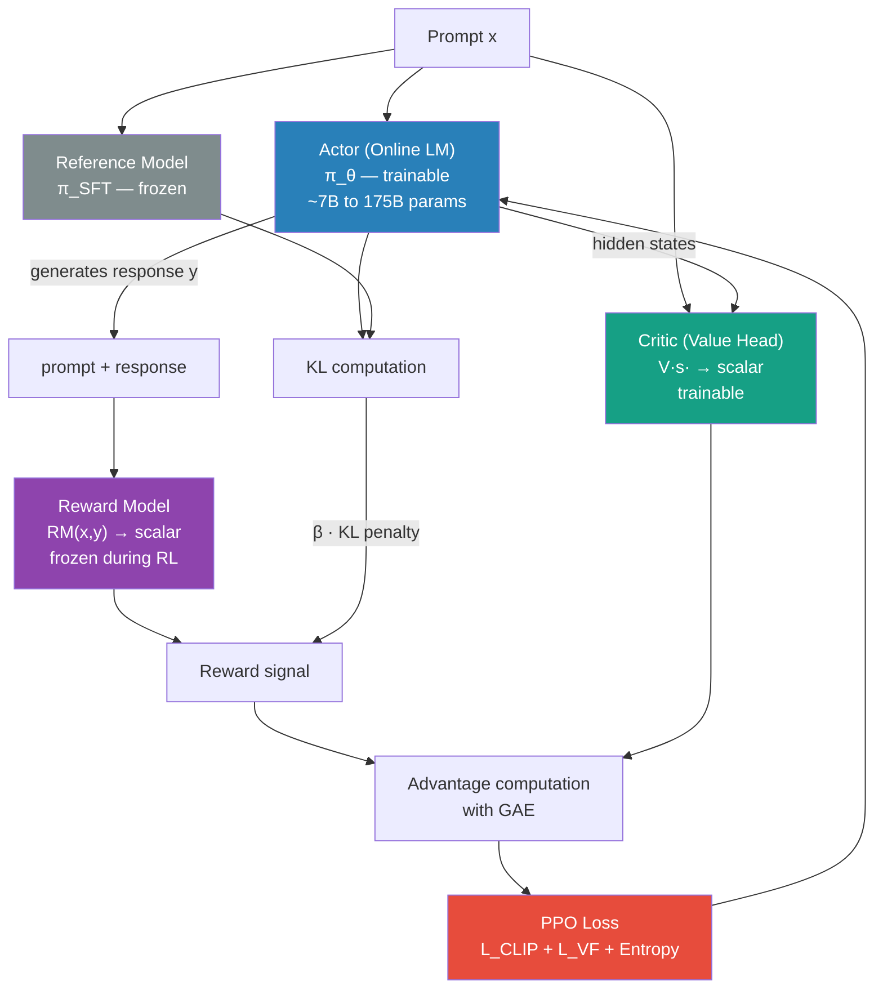

# RL → RLHF Connection: Deep Dive

## How PPO Maps Onto Language Model Fine-Tuning

This document answers the concrete question: when we say "we use PPO to train ChatGPT," what exactly is the state, action, reward, and policy in that context? How do the PPO equations translate to actual LLM training code?

---

## 1. The LLM as an MDP

Every RL algorithm requires a Markov Decision Process. Here's how language generation maps onto one:

```
MDP Component      →    LLM Context
─────────────────────────────────────────────────────────
Agent              →    The language model (weights θ)
Policy π_θ         →    P(next token | context; θ)
State s_t          →    (prompt + tokens generated so far)
Action a_t         →    The next token to output
Action space A     →    The vocabulary (typically 32,000–100,000 tokens)
Transition P       →    Deterministic: s_{t+1} = concat(s_t, a_t)
Reward r_t         →    0 for t < T; RM(prompt, response) - KL penalty at t=T
Episode            →    One complete response (prompt → EOS token)
Reference policy   →    π_SFT (the SFT model, fixed during RL)
```

---

## 2. The State

The state at time step t during generation is the full context:

```
s_t = [system_prompt | user_prompt | token_1 | token_2 | ... | token_{t-1}]
```

This is a sequence of token IDs. The LLM (which is a transformer) processes this entire sequence to generate the next token distribution.

The state grows with each action (each generated token). This is an expanding state — unusual in most RL settings but natural for autoregressive text generation.

**Does the state satisfy the Markov property?**
Yes. Given the full token sequence so far, the probability of the next token doesn't depend on anything outside the context window. The model processes the entire context at each step.

---

## 3. The Action

At each step, the action is a **single token** from the vocabulary.

The policy (the LLM) outputs a probability distribution over all vocabulary tokens:
```
π_θ(· | s_t) = softmax(LM_head(transformer(s_t)))
```

This is a categorical distribution over V ≈ 32,000–100,000 possible actions. One token is sampled (or selected by argmax for greedy decoding).

**This is discrete, high-dimensional action space.** It's different from typical RL environments:
- CartPole: 2 actions
- Atari: 18 actions
- LLM: 50,000+ actions

Despite the large action space, policy gradient methods work well because the probability mass is concentrated on a small number of likely tokens.

---

## 4. The Reward Signal

In standard RLHF:

```
r_t = 0                                    for all t < T (intermediate tokens)
r_T = RM(prompt, response) - β · KL_token  for the final token
```

Where:
```
KL_token = Σ_{t=1}^{T} log π_θ(a_t|s_t) - log π_SFT(a_t|s_t)
```

The sum of per-token KL divergences is computed across the entire response.

**In practice (per-token reward):**
Many implementations distribute the KL penalty to each token:
```
r_t = -β · (log π_θ(a_t|s_t) - log π_SFT(a_t|s_t))   for t < T
r_T = RM(prompt, response) - β · (log π_θ(a_T|s_T) - log π_SFT(a_T|s_T))
```

This per-token reward formulation helps with credit assignment — there's a reward signal at every step, not just the end.

---

## 5. The Policy Network

In standard RL, the policy is a separate neural network. In RLHF, **the policy IS the language model** — all 7 billion (or 70 billion, or 175 billion) parameters.

During RLHF training:
- The **online policy** (θ) generates text and gets updated via PPO.
- The **reference policy** (θ_SFT) is the fixed SFT model. Its outputs are used to compute the KL penalty. Weights are frozen.

```
RM (Reward Model):    frozen during RL training
π_SFT (Reference):   frozen during RL training
π_θ (Online LM):     updated via PPO gradient steps
```

---

## 6. The Critic (Value Function)

PPO requires both an actor (policy) and a critic (value function). In RLHF:

- **Actor** = the LLM generating text (produces action probabilities)
- **Critic** = a separate model that estimates V(s_t) = expected future reward from the current state

The critic typically has the same transformer architecture as the actor but a linear head that outputs a scalar. It's often initialized from the same weights as the SFT model.

```
V(s_t) = scalar linear head on top of transformer(s_t)
```

The critic is essential for computing advantages (GAE), which reduce the variance of policy gradient updates.

---

## 7. One PPO Update Step in RLHF

```
1. ROLLOUT PHASE
   For each prompt in batch:
     - Sample a response from π_θ (the current online LM)
     - Pass response through RM → get scalar reward
     - Pass response through π_SFT → get per-token reference log-probs
     - Compute per-token KL: kl_t = log π_θ(a_t|s_t) - log π_SFT(a_t|s_t)
     - Compute per-token rewards: r_t = -β·kl_t, final r_T += RM_score
     - Pass through Value Head → get per-token V(s_t)
     - Compute advantages using GAE

2. LEARNING PHASE (K epochs on the collected rollouts)
   For each minibatch:
     - Compute new log-probs: log π_θ_new(a_t|s_t) for all t
     - Compute ratio: r_t = exp(log π_θ_new - log π_θ_old)
     - Compute clipped PPO loss:
         L_CLIP = min(r_t · A_t, clip(r_t, 1-ε, 1+ε) · A_t)
     - Compute value function loss:
         L_VF = (V(s_t) - R_t)²
     - Total loss:
         L = -L_CLIP + c₁·L_VF - c₂·H(π)
     - Backprop through the LM weights
     - Update weights with Adam

3. After update: π_θ_old ← π_θ_new
4. Repeat with new rollouts
```

---

## 8. Key Differences Between Standard RL and RLHF

| Aspect | Standard RL | RLHF |
|---|---|---|
| State | Compact (game pixels, robot joints) | Long sequence of tokens (512–2048) |
| Action space | 2–18 discrete or continuous | 32k–100k discrete tokens |
| Episode length | 10–1000 steps | 10–1000 tokens (50–200 "steps" typically) |
| Reward | Dense (every step) | Very sparse (end of sequence only) |
| Policy size | 1M–10M parameters | 1B–175B+ parameters |
| Replay buffer | Used in DQN | Not used in PPO-based RLHF |
| Reference policy | None | SFT model (frozen), used for KL penalty |

---

## 9. Why PPO Specifically?

Several RL algorithms could theoretically be used for RLHF. PPO was chosen because:

1. **Stability** — the clipped objective prevents catastrophic policy collapse, which is especially important when the "policy" has 175B parameters.
2. **On-policy** — PPO uses freshly generated text for updates. This is natural for RLHF where the quality of data depends on the current model.
3. **Proven at scale** — PPO had already been validated on large-scale tasks (OpenAI Five for Dota 2) before being applied to LLMs.
4. **Handles the KL penalty naturally** — the PPO objective and the KL penalty are both additive reward terms, which compose naturally.

DPO later showed that for offline preference data, you don't need PPO at all. But for online RL (continuously collecting new human ratings during training), PPO remains the standard.

---

## 10. The Full RLHF Architecture Diagram



---

## 11. Practical Considerations

**Memory:** During RLHF you need: the actor (trainable), the reference model (frozen), the reward model (frozen), and the critic (trainable). For a 7B model, that's 4 × 7B × 2 bytes ≈ 56 GB minimum. In practice, the reference model and reward model can share architecture and be combined.

**Batch size:** RLHF typically uses small batches (4–32 prompts per step) because each prompt requires generating a complete response (inference is expensive). This makes the updates noisy.

**Response length:** Long responses have more tokens = more steps in the RL episode. This means more credit assignment challenges and more KL penalty accumulation.

**Hyperparameters that matter most:**
1. β (KL penalty weight) — most sensitive
2. Learning rate — small (1e-6 to 1e-5 for large models)
3. Number of PPO epochs K — 1–4 (less than standard PPO)
4. Mini-batch size — larger is more stable

---

## 📂 Navigation

**In this folder:**
| File | |
|---|---|
| [📄 Theory.md](./Theory.md) | Full theory |
| [📄 Cheatsheet.md](./Cheatsheet.md) | Quick reference |
| [📄 Interview_QA.md](./Interview_QA.md) | Interview prep |
| 📄 **Connection_to_RLHF.md** | ← you are here |

⬅️ **Prev:** [RL in Practice](../07_RL_in_Practice/Theory.md) &nbsp;&nbsp;&nbsp; ➡️ **Next:** Section complete!
