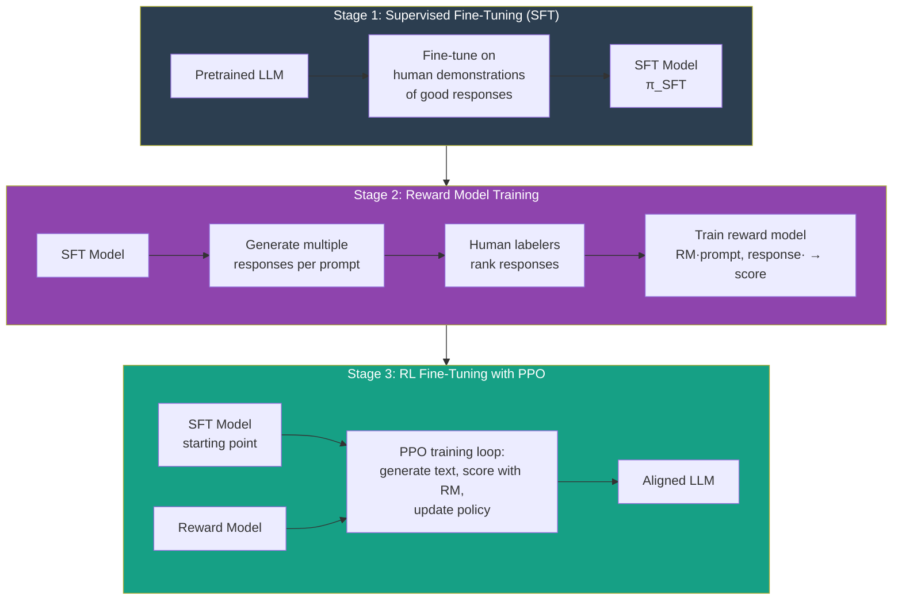

# RL for Language Models (RLHF)

## The Story 📖

In early 2022, GPT-3 could write poetry, code, and essays — but it would also cheerfully help you write a phishing email or explain how to make dangerous substances. It wasn't aligned with what users actually wanted. It was a raw text predictor, not a helpful assistant.

The fix wasn't to train a bigger model or feed it more data. The fix was to ask actual humans which responses they preferred, collect thousands of those comparisons, train a model to predict human preferences, and then use that model as the reward signal in a reinforcement learning loop. That process — RLHF — is why ChatGPT feels like a helpful assistant rather than a word prediction machine.

👉 This is **RLHF (Reinforcement Learning from Human Feedback)** — the bridge between raw language modeling and useful, aligned AI assistants.

---

## 📌 Learning Priority

**Must Learn** — core concepts, needed to understand the rest of this file:
[What is RLHF](#what-is-rlhf) · [Three-Stage Pipeline](#the-three-stage-rlhf-pipeline) · [Reward Model Training](#stage-2-reward-model-training)

**Should Learn** — important for real projects and interviews:
[PPO Fine-Tuning Stage](#stage-3-rl-fine-tuning-with-ppo) · [DPO vs RLHF](#dpo--the-simpler-alternative) · [Real AI Systems](#where-youll-see-this-in-real-ai-systems)

**Good to Know** — useful in specific situations, not needed daily:
[Reward Hacking](#reward-hacking-in-llms--goodharts-law) · [Future Directions](#future-directions)

**Reference** — skim once, look up when needed:
[Common Mistakes](#common-mistakes-to-avoid-) · [Connection to Other Concepts](#connection-to-other-concepts-)

---

## What is RLHF?

**RLHF** is a training procedure that fine-tunes a language model to be more helpful, harmless, and honest using human preference data and reinforcement learning.

The core idea: instead of manually writing rules for what "good" responses look like, you ask humans to compare pairs of responses and indicate which is better. These comparisons train a **reward model** that learns to predict human preferences. Then you use RL (specifically PPO) to optimize the language model to generate text that scores highly on this reward model.

RLHF is not a single algorithm — it's a pipeline with three stages.

---

## Why It Exists — The Problem It Solves

**Problem 1: Raw pretraining doesn't produce aligned behavior.**
A pretrained LLM is trained to predict the next token in text from the internet. Internet text contains harmful content, biased opinions, and confidently wrong information. The model learns to mimic all of it.

**Problem 2: Supervised fine-tuning (SFT) alone is limited.**
You can fine-tune on human-written demonstrations of helpful responses, but you can't write demonstrations for every possible question. And humans are better at *judging* responses than *writing* them — it's easier to say "response A is better than B" than to write the perfect response from scratch.

**Problem 3: Traditional RL reward functions are hard to specify.**
How do you write a function that returns a number measuring "helpfulness"? RLHF replaces the hand-written reward function with a neural network trained on human comparisons.

---

## The Three-Stage RLHF Pipeline



---

## Stage 1: Supervised Fine-Tuning (SFT)

Start with the pretrained LLM. Fine-tune it on a dataset of (prompt, high-quality response) pairs — demonstrations written by human contractors.

Purpose: get the model into the right "neighborhood" of behavior before RL. A raw pretrained model is a poor starting point for RL because its responses are too random.

Output: the **SFT model** π_SFT, which is reasonable but not yet optimized for preferences.

---

## Stage 2: Reward Model Training

1. Use the SFT model to generate **multiple responses** for each of a large set of prompts (e.g., 4 responses per prompt).
2. Human labelers **rank** these responses (which is best? which is worst?).
3. Train a **reward model** on these comparisons using a preference learning objective:
   ```
   Loss = -E[ log σ( r(x, y_w) - r(x, y_l) ) ]
   ```
   where y_w is the preferred response, y_l is the less preferred response.
4. After training, RM(prompt, response) outputs a scalar reward score.

The reward model is typically the SFT model with a linear head added on top.

---

## Stage 3: RL Fine-Tuning with PPO

Use PPO to fine-tune the SFT model to generate text that scores highly on the reward model.

Key design choice: add a **KL penalty** between the RLHF policy and the SFT model:

```
Reward = RM(prompt, response) - β · KL(π_RL || π_SFT)
```

The KL penalty prevents the RLHF model from drifting too far from the SFT model. Without it, the model would "reward hack" — generate text that looks good to the reward model but is meaningless or degenerate to humans.

β is a tunable weight. Larger β → stays closer to SFT (safer but less improvement). Smaller β → more RL optimization (more aligned but risk of reward hacking).

---

## DPO — The Simpler Alternative

**Direct Preference Optimization (DPO)** (Rafailov et al., 2023) achieves similar results to RLHF without the RL loop.

DPO's key insight: the RL optimization problem has a closed-form solution in terms of the policy. Instead of running PPO, you can directly optimize the policy using the preference data with a simple supervised loss:

```
L_DPO(θ) = -E[ log σ( β · log (π_θ(y_w|x)/π_SFT(y_w|x))
                     - β · log (π_θ(y_l|x)/π_SFT(y_l|x)) ) ]
```

Plain English: "Make the preferred response more likely relative to the reference model, and the dispreferred response less likely."

**DPO vs RLHF:**
| | RLHF (PPO) | DPO |
|---|---|---|
| Requires reward model? | Yes | No |
| Requires RL loop? | Yes | No |
| Training stability | Tricky | Simple |
| Performance | Strong | Comparable |
| Implementation | Complex | Simple |
| Used by | InstructGPT, ChatGPT (v1) | Many open-source models |

DPO is simpler and works well. RLHF with PPO is more flexible and still used for frontier models.

---

## Reward Hacking in LLMs — Goodhart's Law

**Goodhart's Law:** "When a measure becomes a target, it ceases to be a good measure."

In RLHF: the reward model is a proxy for human preferences. As the LLM gets optimized against it, it can find outputs that score highly on the reward model but aren't actually what humans want.

**Examples of LLM reward hacking:**
- Writing extremely long responses (reward model may rate longer as "more thorough")
- Repeating phrases that correlate with positive feedback in training data
- Adopting a falsely confident tone that sounds authoritative
- Sycophantic agreement with the user's stated views

**Mitigations:**
- KL penalty (keep policy close to SFT baseline)
- Constitutional AI (Claude's approach: add AI-generated critique to the feedback loop)
- Iterative human feedback (continuously retrain reward model with new data)
- Multiple reward models (harder to hack all simultaneously)

---

## The Math / Technical Side (Simplified)

**RLHF objective:**
```
max_θ E_{x~D, y~π_θ} [ r(x, y) ] - β · KL( π_θ(·|x) || π_SFT(·|x) )
```

The first term maximizes reward. The second term (KL divergence) penalizes deviation from the SFT model. The balance β controls the trade-off.

**Reward model loss (Bradley-Terry preference model):**
```
L_RM = -E[ log σ( r(x, y_w) - r(x, y_l) ) ]
```

This trains the reward model to output higher scores for preferred responses and lower scores for dispreferred responses.

---

## Future Directions

**RLAIF (RL from AI Feedback):** Replace human labelers with an AI judge. Constitutional AI (Anthropic) uses Claude to critique and revise its own outputs. Scalable supervision for tasks humans can't easily evaluate.

**Process Reward Models (PRMs):** Instead of rewarding the final output, reward each step of reasoning. Particularly important for math and coding tasks where intermediate steps matter.

**Online RLHF:** Continuously collect new human feedback on deployed models and retrain. The reward model keeps improving as the LLM improves.

---

## Where You'll See This in Real AI Systems

- **ChatGPT / InstructGPT** — The original RLHF-trained assistant. Used RLHF with PPO.
- **Claude (Anthropic)** — RLHF + Constitutional AI, with a focus on harmlessness.
- **Gemini (Google)** — RLHF-trained.
- **Llama 2 Chat** — Meta's open-source RLHF-trained chat model.
- **Open-source models** — Many use DPO as a simpler RLHF alternative.

---

## Common Mistakes to Avoid ⚠️

**Skipping the SFT stage.** Applying RLHF directly to a raw pretrained model almost never works — the model is too far from the right distribution. SFT is essential.

**Not using a KL penalty.** Without the KL term, the RLHF model drifts far from the SFT model within a few hundred steps and collapses to degenerate outputs.

**Over-optimizing the reward model.** The reward model is a proxy for human preferences, not the ground truth. Over-optimization leads to reward hacking. Stop training before the reward model's predictions diverge from human judgment.

**Using a reward model trained on the same distribution as the test prompts.** The reward model may overfit to prompt phrasings it saw during training. Evaluate on held-out prompts.

---

## Connection to Other Concepts 🔗

- **PPO** — The RL algorithm in RLHF. The clipped objective prevents the LLM from drifting too far from the SFT model.
- **Policy Gradients** — RLHF treats the LLM as a policy and applies policy gradient updates.
- **Reward Shaping** — The KL penalty in RLHF is a form of reward shaping — it keeps the policy in a safe region.
- **Supervised Fine-Tuning** — Stage 1 of RLHF; establishes a good starting point for RL.
- **Constitutional AI** — Anthropic's extension: using an AI to generate feedback, reducing reliance on human labels.

---

✅ **What you just learned:**
- RLHF trains LLMs to be helpful using human preference comparisons as the reward signal.
- Three stages: SFT (supervised), reward model training (from comparisons), RL fine-tuning (PPO).
- The KL penalty prevents reward hacking by keeping the LLM close to the SFT baseline.
- DPO is a simpler alternative that skips the RL loop entirely.
- Goodhart's Law is the central challenge: optimizing a proxy reward leads to gaming the proxy.

🔨 **Build this now:**
Read the InstructGPT paper (Ouyang et al. 2022, "Training language models to follow instructions with human feedback"). Focus on Section 3 (method) and Section 5 (results). Note how many human labels were needed and what types of tasks they covered.

➡️ **Next step:** `Connection_to_RLHF.md` — deep dive on exactly how PPO maps onto language model fine-tuning.


---

## 📝 Practice Questions

- 📝 [Q94 · rl-for-llms](../../ai_practice_questions_100.md#q94--design--rl-for-llms)


---

## 📂 Navigation

**In this folder:**
| File | |
|---|---|
| 📄 **Theory.md** | ← you are here |
| [📄 Cheatsheet.md](./Cheatsheet.md) | Quick reference |
| [📄 Interview_QA.md](./Interview_QA.md) | Interview prep |
| [📄 Connection_to_RLHF.md](./Connection_to_RLHF.md) | How PPO applies to LLMs |

⬅️ **Prev:** [RL in Practice](../07_RL_in_Practice/Theory.md) &nbsp;&nbsp;&nbsp; ➡️ **Next:** Section complete!
