# 🎮 Reinforcement Learning

⬅️ [18 AI Evaluation](../18_AI_Evaluation/Readme.md) &nbsp;|&nbsp; [🏠 Home](../00_Learning_Guide/Readme.md) &nbsp;|&nbsp; [🏠 Back to Learning Guide](../00_Learning_Guide/Readme.md)

> The framework where agents learn by doing — not from labeled datasets, but from the consequences of their own actions in an environment, optimizing for long-term reward.

**[▶ Start here → RL Fundamentals Theory](./01_RL_Fundamentals/Theory.md)**

---

## At a Glance

| | |
|---|---|
| 📚 Topics | 8 topics |
| ⏱️ Est. Time | 6–8 hours |
| 📋 Prerequisites | [AI Evaluation](../18_AI_Evaluation/Readme.md) |
| 🔓 Unlocks | [🏠 Learning Guide](../00_Learning_Guide/Readme.md) |

---

## What's in This Section

```mermaid
flowchart TD
    subgraph LOOP["🔄 The RL Loop"]
        AGENT["🤖 Agent"]
        ENV["🌍 Environment"]
        STATE["📊 State sₜ"]
        ACTION["⚡ Action aₜ"]
        REWARD["🏆 Reward rₜ"]
        NEXT["📊 Next State sₜ₊₁"]

        STATE -->|"observe"| AGENT
        AGENT -->|"select via π(a|s)"| ACTION
        ACTION -->|"apply to"| ENV
        ENV -->|"returns"| REWARD
        ENV -->|"transitions to"| NEXT
        REWARD -->|"update policy"| AGENT
        NEXT -->|"new observation"| AGENT
    end

    subgraph PROGRESSION["📈 Algorithm Progression"]
        direction LR
        QL["Q-Learning\n(tabular)"]
        DQN["Deep Q-Network\n(neural Q-table)"]
        PG["Policy Gradients\n(direct π optimization)"]
        PPO["PPO\n(stable, clipped PG)"]
        RLHF["RL for LLMs\n(RLHF / RLAIF)"]

        QL -->|"scale to pixels"| DQN
        DQN -->|"optimize π directly"| PG
        PG -->|"add stability"| PPO
        PPO -->|"apply to language"| RLHF
    end

    style AGENT fill:#3498DB,color:#fff,stroke:#2980B9
    style ENV fill:#27AE60,color:#fff,stroke:#1E8449
    style REWARD fill:#F39C12,color:#fff,stroke:#D68910
    style QL fill:#95A5A6,color:#fff,stroke:#7F8C8D
    style DQN fill:#3498DB,color:#fff,stroke:#2980B9
    style PG fill:#9B59B6,color:#fff,stroke:#8E44AD
    style PPO fill:#E74C3C,color:#fff,stroke:#C0392B
    style RLHF fill:#1ABC9C,color:#fff,stroke:#16A085
```

---

## Topics

| # | Topic | What You'll Learn | Files |
|---|---|---|---|
| 01 | [RL Fundamentals](./01_RL_Fundamentals/) | The core RL framework: agents, environments, states, actions, rewards, and policies; the exploration vs exploitation dilemma | [📖 Theory](./01_RL_Fundamentals/Theory.md) · [⚡ Cheatsheet](./01_RL_Fundamentals/Cheatsheet.md) · [🎯 Interview Q&A](./01_RL_Fundamentals/Interview_QA.md) |
| 02 | [Markov Decision Processes](./02_Markov_Decision_Processes/) | The mathematical foundation of RL: states, transition dynamics, discount factor γ, the Bellman equations, and value functions V(s) and Q(s,a) | [📖 Theory](./02_Markov_Decision_Processes/Theory.md) · [⚡ Cheatsheet](./02_Markov_Decision_Processes/Cheatsheet.md) · [🎯 Interview Q&A](./02_Markov_Decision_Processes/Interview_QA.md) |
| 03 | [Q-Learning](./03_Q_Learning/) | Tabular Q-Learning: building a Q-table, the update rule, epsilon-greedy exploration, and convergence guarantees in small discrete environments | [📖 Theory](./03_Q_Learning/Theory.md) · [⚡ Cheatsheet](./03_Q_Learning/Cheatsheet.md) · [🎯 Interview Q&A](./03_Q_Learning/Interview_QA.md) |
| 04 | [Deep Q-Networks](./04_Deep_Q_Networks/) | How DQN replaced the Q-table with a neural network; experience replay, target networks, and the tricks that made Atari-level game play possible | [📖 Theory](./04_Deep_Q_Networks/Theory.md) · [⚡ Cheatsheet](./04_Deep_Q_Networks/Cheatsheet.md) · [🎯 Interview Q&A](./04_Deep_Q_Networks/Interview_QA.md) |
| 05 | [Policy Gradients](./05_Policy_Gradients/) | Optimizing the policy directly with REINFORCE; the policy gradient theorem, the variance problem, and baseline / advantage estimation | [📖 Theory](./05_Policy_Gradients/Theory.md) · [⚡ Cheatsheet](./05_Policy_Gradients/Cheatsheet.md) · [🎯 Interview Q&A](./05_Policy_Gradients/Interview_QA.md) |
| 06 | [PPO](./06_PPO/) | Proximal Policy Optimization: the clipped surrogate objective, why it prevents catastrophic policy updates, and why PPO is the dominant RL algorithm | [📖 Theory](./06_PPO/Theory.md) · [⚡ Cheatsheet](./06_PPO/Cheatsheet.md) · [🎯 Interview Q&A](./06_PPO/Interview_QA.md) |
| 07 | [RL in Practice](./07_RL_in_Practice/) | Using Gymnasium (OpenAI Gym), Stable-Baselines3, and common pitfalls — reward shaping, sparse rewards, and hyperparameter sensitivity | [📖 Theory](./07_RL_in_Practice/Theory.md) · [⚡ Cheatsheet](./07_RL_in_Practice/Cheatsheet.md) · [🎯 Interview Q&A](./07_RL_in_Practice/Interview_QA.md) |
| 08 | [RL for LLMs](./08_RL_for_LLMs/) | How RLHF (and RLAIF) uses PPO to align language models with human preferences; the reward model, the KL penalty, and modern alternatives like DPO and GRPO | [📖 Theory](./08_RL_for_LLMs/Theory.md) · [⚡ Cheatsheet](./08_RL_for_LLMs/Cheatsheet.md) · [🎯 Interview Q&A](./08_RL_for_LLMs/Interview_QA.md) |

---

## Key Concepts at a Glance

| Concept | What It Means |
|---|---|
| **RL learns from consequences, not labels** | There is no ground-truth output; the only signal is reward, which may be delayed by hundreds of steps, making credit assignment the central challenge. |
| **The Bellman equation is the backbone of RL** | It states that the value of a state equals the immediate reward plus the discounted value of the next state; most RL algorithms are just different ways to estimate and exploit this relationship. |
| **DQN made deep RL stable with two tricks** | Experience replay breaks temporal correlations in training data, and a separately updated target network prevents the loss function from chasing a moving target. |
| **PPO is the workhorse of modern RL** | The clipped surrogate objective prevents any single update from changing the policy too much, giving the stability needed for long training runs without the complexity of TRPO. |
| **RLHF is why ChatGPT listens to instructions** | A reward model trained on human preference comparisons scores LLM outputs, and PPO then optimizes the LLM to maximize those scores while a KL penalty stops it from drifting into incoherent outputs. |

---

## 📂 Navigation

⬅️ **Prev:** [18 AI Evaluation](../18_AI_Evaluation/Readme.md) &nbsp;&nbsp; ➡️ **Next:** [🏠 Back to Learning Guide](../00_Learning_Guide/Readme.md)
