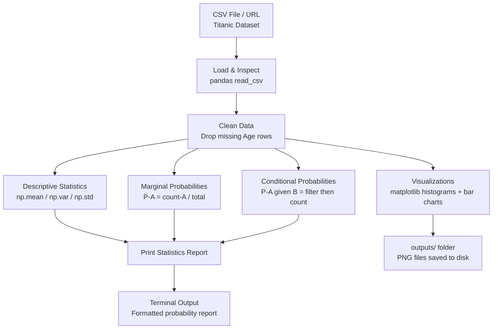
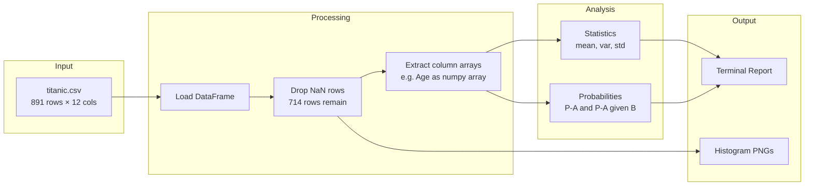
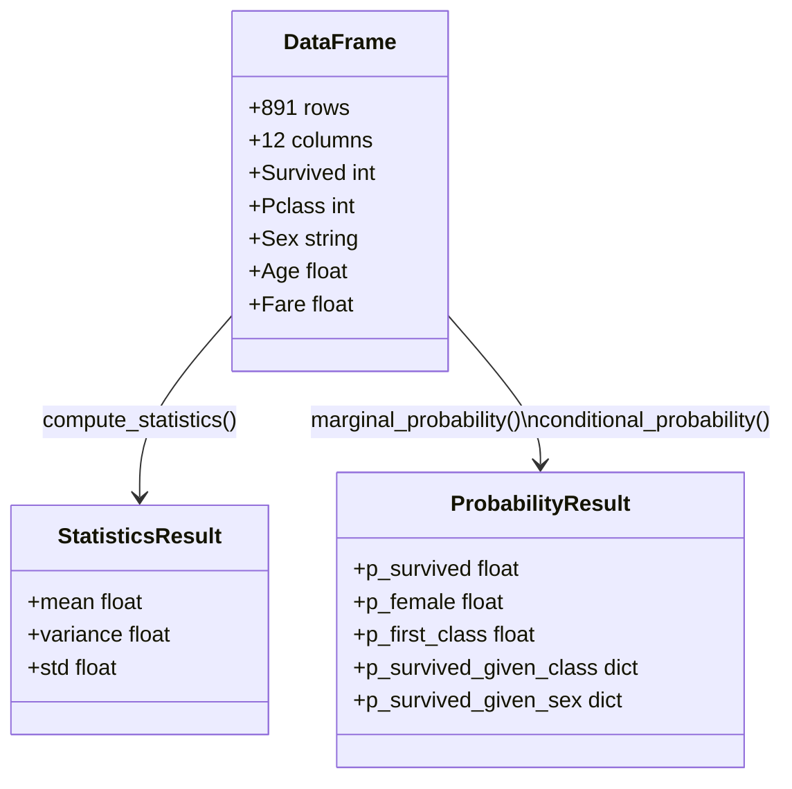
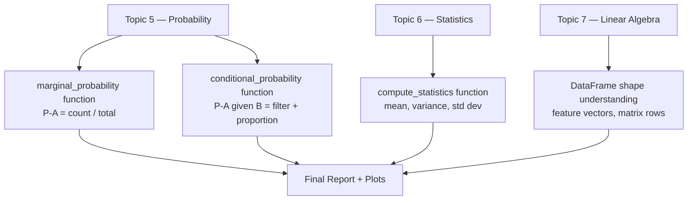

# Project 1 — Architecture Blueprint

## System Overview

This project is a **data analysis pipeline** — a linear flow from raw data to insights. There's no model training here. The purpose is to understand the data that models will eventually learn from.

---

## System Diagram



---

## Data Flow



---

## Component Table

| Component | File / Library | Role | Inputs | Outputs |
|---|---|---|---|---|
| Data Loader | `pandas.read_csv()` | Fetch and parse CSV data | URL or file path | DataFrame (891 × 12) |
| Data Cleaner | `df.dropna()` | Remove rows with missing values | Raw DataFrame | Clean DataFrame |
| Statistics Engine | `numpy` (mean/var/std) | Compute distribution summaries | Numeric column array | 3 float values |
| Probability Calculator | Custom Python functions | Compute P(A) and P(A\|B) | DataFrame + column names | Float 0–1 |
| Visualizer | `matplotlib` | Plot distributions as images | DataFrame columns | PNG files |
| Report Printer | Python `print()` | Display results in terminal | Computed values | Formatted text |

---

## Key Data Structures



---

## Concepts Map

This diagram shows how the code components map to the theory topics they implement:



---

## Folder Structure

```
01_Data_and_Probability_Explorer/
├── explorer.py               ← Your main Python script
├── outputs/
│   ├── age_distribution.png
│   ├── fare_distribution.png
│   └── survival_by_class.png
├── Project_Guide.md
├── Step_by_Step.md
├── Starter_Code.md
└── Architecture_Blueprint.md
```

---

## Why This Architecture?

This project uses a **functional, single-file** architecture by design. Each concept gets its own function:

- `compute_statistics()` — isolates the statistics concept
- `marginal_probability()` — isolates P(A)
- `conditional_probability()` — isolates P(A|B)

This makes it easy to test each piece independently and swap in different datasets. As you move to more complex projects, these functions will be replaced by classes and modules — but the same logic applies.

---

## 📂 Navigation

| File | |
|---|---|
| [Project_Guide.md](./Project_Guide.md) | Overview and objectives |
| [Step_by_Step.md](./Step_by_Step.md) | Detailed build instructions |
| [Starter_Code.md](./Starter_Code.md) | Python starter code with TODOs |
| **Architecture_Blueprint.md** | You are here |
