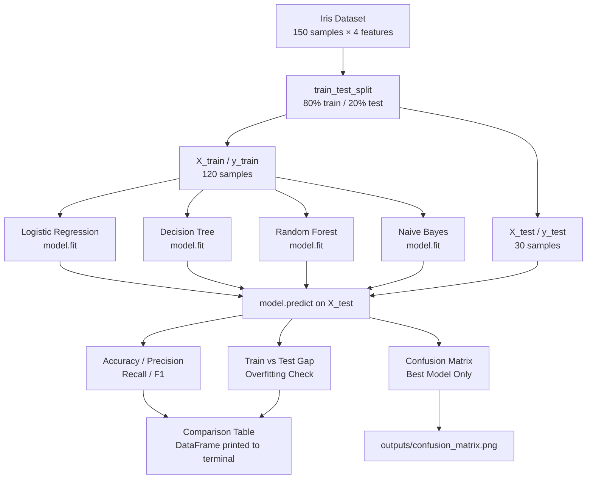
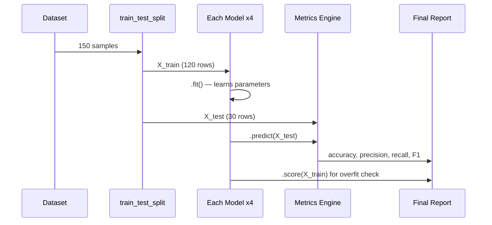
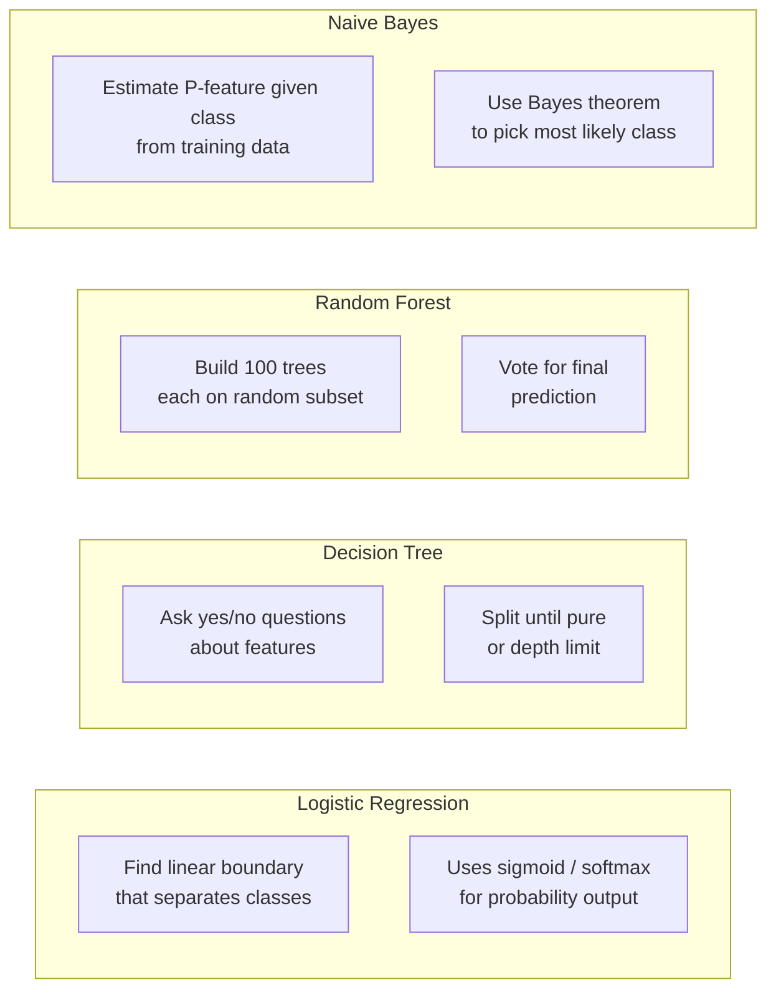
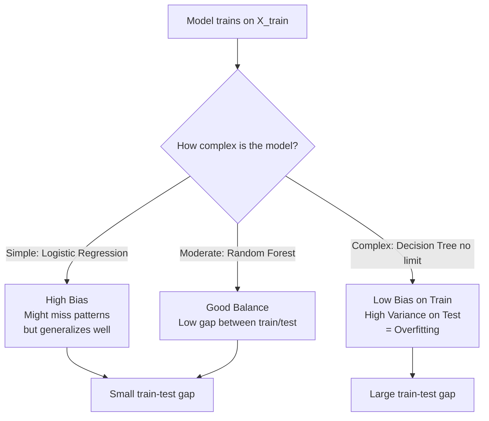
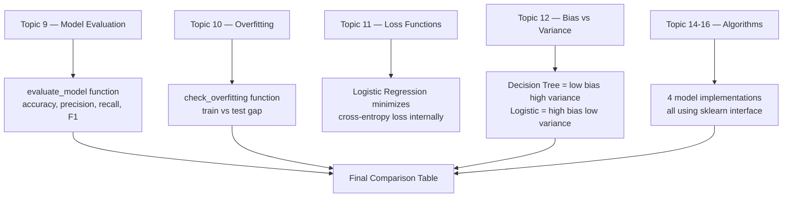

# Project 2 — Architecture Blueprint

## System Overview

This project is a **model evaluation pipeline** — a systematic process for comparing multiple ML algorithms on the same problem. This pattern (train multiple models → evaluate with consistent metrics → pick the best → explain why) is standard practice in machine learning.

---

## System Diagram



---

## Training vs Evaluation Flow



---

## Component Table

| Component | Library/Tool | Role | Key Parameters |
|---|---|---|---|
| Dataset | `sklearn.datasets.load_iris` | Provides feature matrix X and labels y | n_samples=150, n_features=4, n_classes=3 |
| Train/Test Split | `sklearn.model_selection.train_test_split` | Splits data into train and test sets | test_size=0.2, stratify=y, random_state=42 |
| Logistic Regression | `sklearn.linear_model` | Linear classifier, learns decision boundary | max_iter=200 |
| Decision Tree | `sklearn.tree` | Rule-based tree of feature splits | No max_depth = can overfit |
| Random Forest | `sklearn.ensemble` | Ensemble of 100 decision trees | n_estimators=100 |
| Naive Bayes | `sklearn.naive_bayes.GaussianNB` | Probabilistic classifier using Bayes theorem | Assumes feature independence |
| Metrics Engine | `sklearn.metrics` | Computes accuracy, precision, recall, F1 | average='weighted' for multi-class |
| Confusion Matrix | `sklearn.metrics.ConfusionMatrixDisplay` | Visual breakdown of prediction errors | 3x3 matrix for 3 classes |
| Results Table | `pandas.DataFrame` | Stores and formats model comparison | One row per model |

---

## Model Comparison: What Each Model Does Internally



---

## Overfitting Visualization Concept



---

## Metrics Reference

| Metric | Formula | When it matters most |
|---|---|---|
| Accuracy | correct / total | Balanced datasets |
| Precision | TP / (TP + FP) | When false positives are costly (e.g., spam filter) |
| Recall | TP / (TP + FN) | When false negatives are costly (e.g., cancer detection) |
| F1 Score | 2 * (P * R) / (P + R) | Imbalanced classes or when both precision and recall matter |

---

## Folder Structure

```
02_ML_Model_Comparison/
├── compare_models.py          ← Your main Python script
├── outputs/
│   └── confusion_matrix.png
├── Project_Guide.md
├── Step_by_Step.md
├── Starter_Code.md
└── Architecture_Blueprint.md
```

---

## Concepts Map



---

## 📂 Navigation

| File | |
|---|---|
| [Project_Guide.md](./Project_Guide.md) | Overview and objectives |
| [Step_by_Step.md](./Step_by_Step.md) | Detailed build instructions |
| [Starter_Code.md](./Starter_Code.md) | Python starter code with TODOs |
| **Architecture_Blueprint.md** | You are here |
