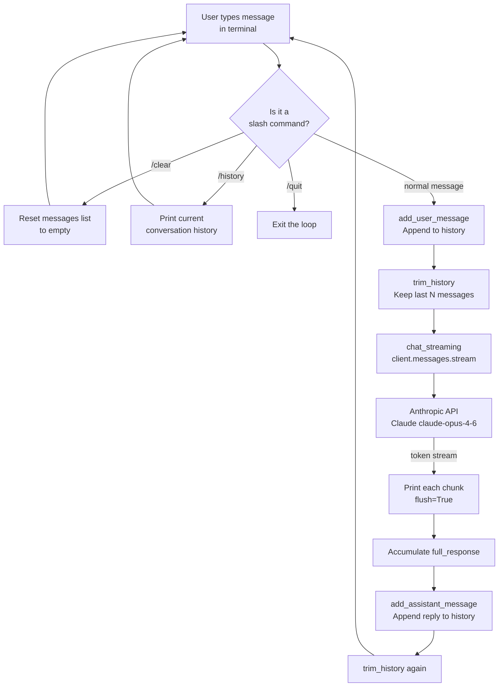
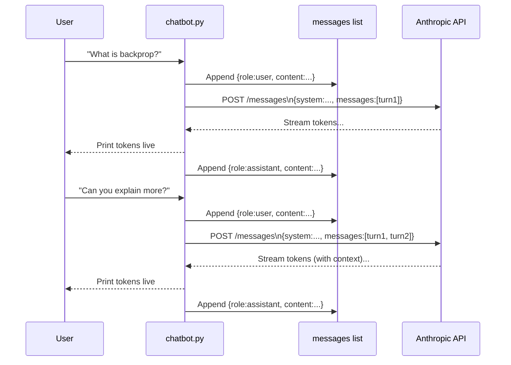
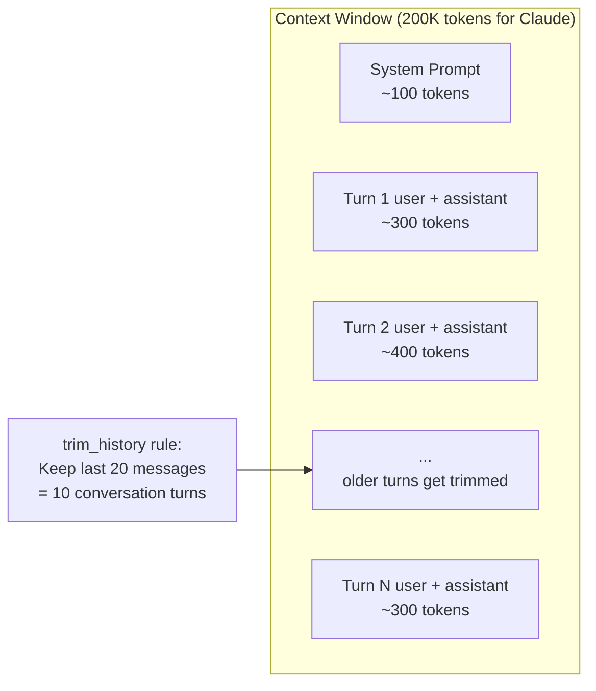
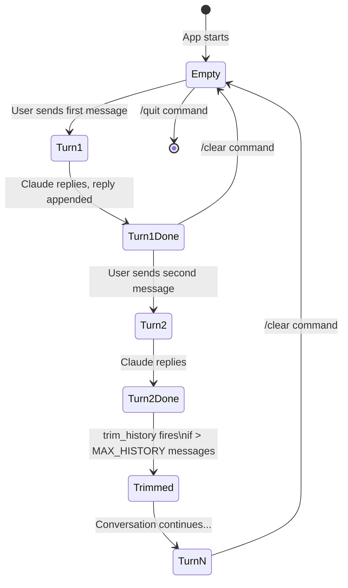
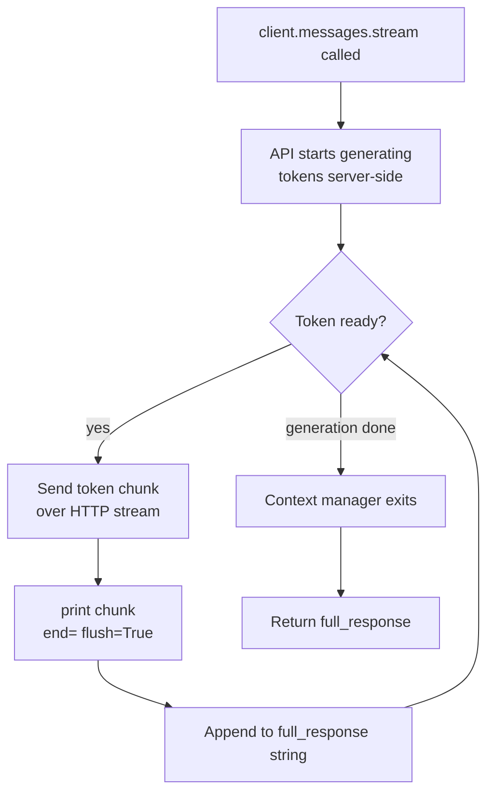
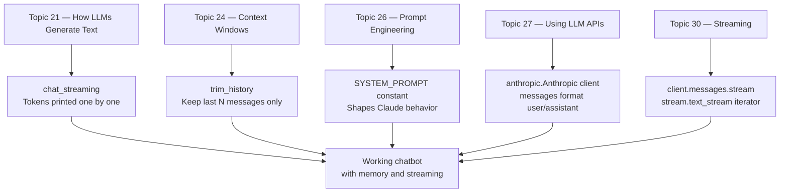

# Project 4 — Architecture Blueprint

## System Overview

This project is a **stateful CLI application** built around the Anthropic API. The key insight is that the model itself is stateless — it has no memory between API calls. All memory management happens in your code.

---

## System Diagram



---

## Message History: What Gets Sent to the API



The model receives the FULL history on every request. It has no persistent state.

---

## Context Window Management



---

## Component Table

| Component | Function | Role | Key Detail |
|---|---|---|---|
| CLI Input | `input("You: ")` | Reads user messages from terminal | Handles Ctrl+C via try/except |
| Command Router | `handle_command()` | Intercepts /clear, /history, /quit | Returns (is_command, messages) tuple |
| Message Builder | `add_user_message()` / `add_assistant_message()` | Maintains the messages list | Messages always alternate user/assistant |
| History Trimmer | `trim_history()` | Caps context window usage | Removes oldest messages from the front |
| Streaming Client | `chat_streaming()` | Calls the API with streaming | Uses `client.messages.stream()` context manager |
| Anthropic SDK | `anthropic.Anthropic()` | HTTP client for the Claude API | Reads key from ANTHROPIC_API_KEY env var |
| Claude API | Remote service | Generates the actual text | Stateless: receives full history each call |
| Error Handler | try/except in `run_chatbot()` | Handles API errors gracefully | Removes failed message from history |

---

## The Messages Array State Over Time



---

## Streaming: How It Works



Without streaming (`client.messages.create`): user waits for all tokens before seeing any output.
With streaming (`client.messages.stream`): user sees tokens appear immediately, response feels instant.

---

## Folder Structure

```
04_LLM_Chatbot_with_Memory/
├── chatbot.py              ← Your main Python script
├── Project_Guide.md
├── Step_by_Step.md
├── Starter_Code.md
└── Architecture_Blueprint.md
```

---

## Concepts Map



---

## 📂 Navigation

| File | |
|---|---|
| [Project_Guide.md](./Project_Guide.md) | Overview and objectives |
| [Step_by_Step.md](./Step_by_Step.md) | Detailed build instructions |
| [Starter_Code.md](./Starter_Code.md) | Python starter code with TODOs |
| **Architecture_Blueprint.md** | You are here |
