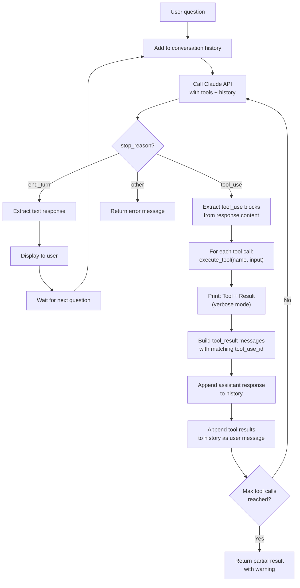
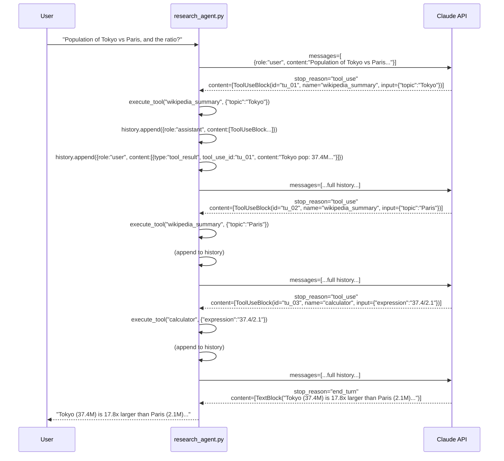
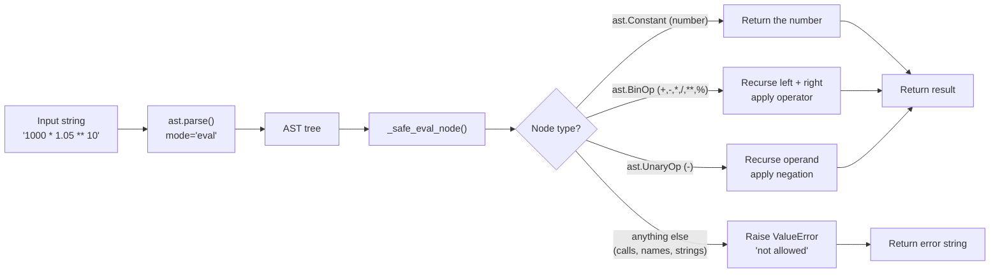

# Project 3 — Multi-Tool Research Agent: Architecture Blueprint

## System Overview

The research agent is a ReAct (Reason + Act) loop. Claude alternates between reasoning about what information it needs and calling tools to get that information. This continues until Claude has enough to answer — then it produces a final text response.

---

## ReAct Loop Architecture



---

## Message Format — Conversation History



---

## Component Table

| Component | Function | Purpose | Key Constraint |
|---|---|---|---|
| Tool: web_search | `web_search()` | DuckDuckGo live web search | No API key needed; rate limited |
| Tool: wikipedia_summary | `wikipedia_summary()` | Wikipedia article summaries | Requires exact article title match |
| Tool: calculator | `calculator()` | Safe math evaluation | Only numeric operators, no eval() |
| Tool Schemas | `TOOLS` list | Tells Claude what each tool does | Description quality affects tool selection |
| Tool Dispatcher | `execute_tool()` | Routes tool calls to implementations | Must catch all exceptions |
| Agent Loop | `run_agent_turn()` | Manages the ReAct while loop | Stops at end_turn or max_tool_calls |
| Memory | `conversation_history` list | Persists context across turns | Must include ALL messages in correct format |
| Memory Trimmer | `trim_history()` | Prevents context overflow | Removes oldest pairs first |

---

## Anthropic Tool Use Message Formats

The format of messages is critical. The API will reject malformed messages with a 400 error.

```
User turn (initial):
  {"role": "user", "content": "What is the population of Japan?"}

Assistant response with tool call:
  {
    "role": "assistant",
    "content": [
      TextBlock(type="text", text="I'll look that up."),
      ToolUseBlock(
        type="tool_use",
        id="toolu_01abc",
        name="wikipedia_summary",
        input={"topic": "Japan"}
      )
    ]
  }
  stop_reason = "tool_use"

User message with tool result (must follow immediately):
  {
    "role": "user",
    "content": [
      {
        "type": "tool_result",
        "tool_use_id": "toolu_01abc",   ← must match ToolUseBlock.id
        "content": "Japan population: 125.7 million..."
      }
    ]
  }

Assistant final response:
  {
    "role": "assistant",
    "content": [
      TextBlock(type="text", text="Japan has a population of approximately...")
    ]
  }
  stop_reason = "end_turn"
```

---

## Safe Calculator Design



The AST approach is safe because it never calls Python's `eval()`. It only allows operations that are explicitly whitelisted in `_SAFE_OPERATORS`. Function calls, variable names, and string operations all fail at the node-type check.

---

## Memory Structure Over a Multi-Turn Session

```
conversation_history after 2 user turns with tool calls:

[
  {role: "user",      content: "What is the population of Japan?"},
  {role: "assistant", content: [ToolUseBlock(wikipedia_summary, Japan)]},
  {role: "user",      content: [{type:"tool_result", id:"tu_01", content:"125.7M..."}]},
  {role: "assistant", content: [TextBlock("Japan has 125.7 million people.")]},

  {role: "user",      content: "How does that compare to Germany?"},
  {role: "assistant", content: [ToolUseBlock(wikipedia_summary, Germany)]},
  {role: "user",      content: [{type:"tool_result", id:"tu_02", content:"84M..."}]},
  {role: "assistant", content: [ToolUseBlock(calculator, "125.7/84")]},
  {role: "user",      content: [{type:"tool_result", id:"tu_03", content:"1.496..."}]},
  {role: "assistant", content: [TextBlock("Japan (125.7M) is 1.5x larger than Germany (84M).")]},
]
```

The full history is sent on every API call. Claude "remembers" the Japan population without re-searching because it is in the history.

---

## Tool Selection Quality

The quality of tool descriptions directly affects whether Claude picks the right tool. Compare:

| Weak description | Strong description |
|---|---|
| "Search the web" | "Search for current information, recent news, facts, and real-world data. Use when information may have changed since 2023." |
| "Get Wikipedia" | "Get a factual Wikipedia summary. Best for: definitions, historical facts, biographies, scientific concepts." |
| "Calculate math" | "Perform arithmetic. Use this instead of mental math to avoid errors. Supports +, -, *, /, **, %." |

The strong descriptions reduce tool misuse and improve the quality of multi-step reasoning.

---

## Error Scenarios

| Scenario | Behavior | Why it is safe |
|---|---|---|
| `calculator("__import__('os')")` | Returns error string | AST rejects non-numeric nodes |
| `web_search("...")` throws exception | Returns error string | try/except in `execute_tool()` |
| Wikipedia article not found | Returns not-found message | Checked in `wikipedia_summary()` |
| 10 tool calls without end_turn | Returns partial result warning | `MAX_TOOL_CALLS_PER_TURN` guard |
| API rate limit hit | Exception propagates to main() | Caught in main() try/except |

---

## 📂 Navigation

**In this folder:**
| File | |
|---|---|
| [Project_Guide.md](./Project_Guide.md) | What you'll build |
| [Step_by_Step.md](./Step_by_Step.md) | Build instructions |
| [Starter_Code.md](./Starter_Code.md) | Code with TODOs |
| Architecture_Blueprint.md | ← you are here |

⬅️ **Prev:** [02 — Personal Knowledge Base RAG](../02_Personal_Knowledge_Base_RAG/Project_Guide.md) &nbsp;&nbsp;&nbsp; ➡️ **Next:** [04 — Custom LoRA Fine-Tuning](../04_Custom_LoRA_Fine_Tuning/Project_Guide.md)
