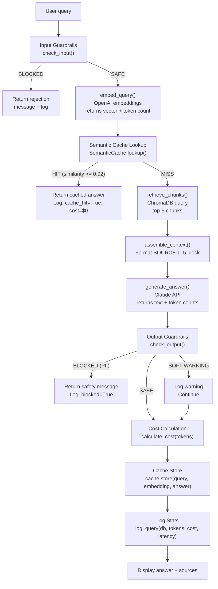
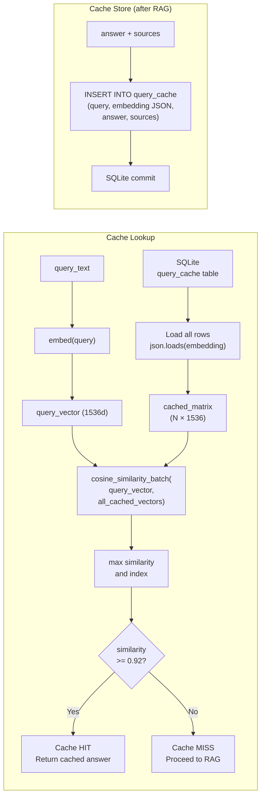
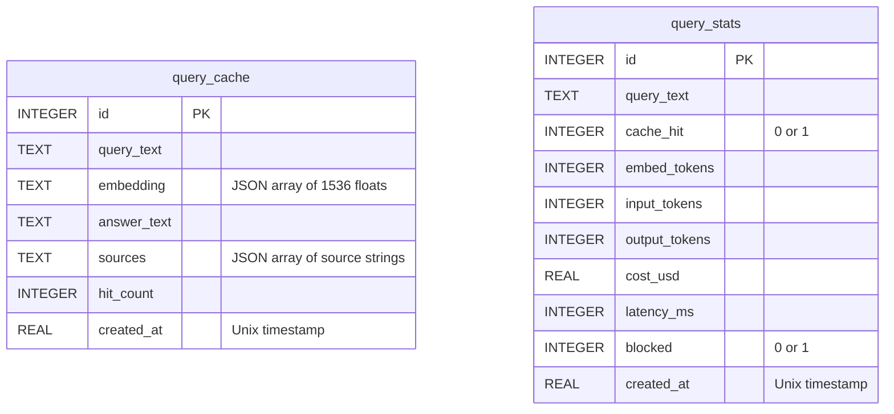
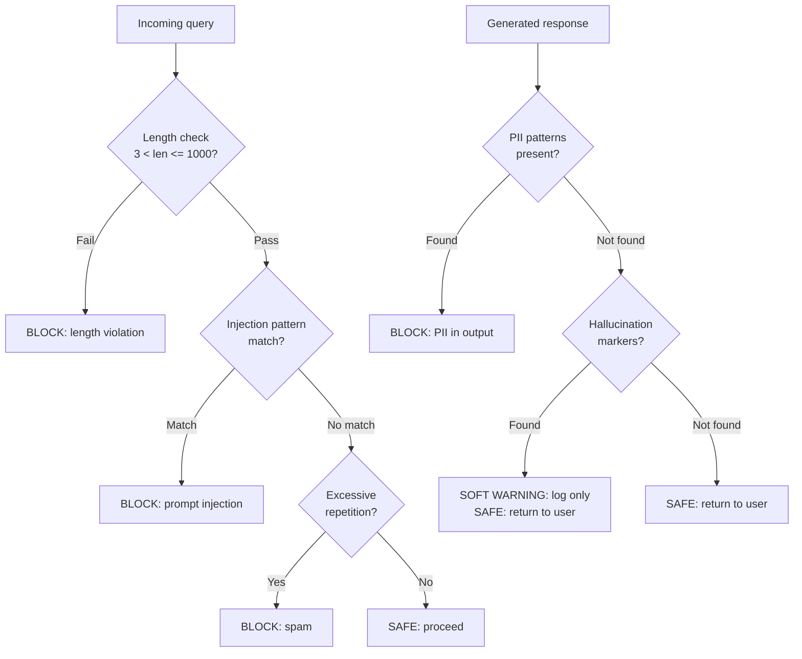
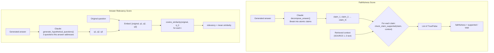

# Project 5 — Production RAG System: Architecture Blueprint

## System Overview

The production RAG system wraps the core RAG pipeline from Project 2 with four orthogonal production layers. Each layer can be understood and tested independently, then integrated into the unified query pipeline.

---

## Full System Architecture



---

## Semantic Cache Internals



---

## SQLite Database Schema



Both tables share the same SQLite database file (`production_rag.db`). The cache uses `query_cache` for storage; cost tracking uses `query_stats` for logging. The cache's `hit_count` column increments each time a cached entry is served.

---

## Guardrails Decision Tree



---

## RAGAS Evaluation Pipeline



---

## Component Table

| Component | File | Key Function | Output |
|---|---|---|---|
| Input Guardrails | `guardrails.py` | `check_input(query)` | `GuardrailResult(is_safe, reason, category)` |
| Output Guardrails | `guardrails.py` | `check_output(response)` | `GuardrailResult` |
| Embedding | `production_rag.py` | `embed_query(query)` | `(vector, token_count)` |
| Semantic Cache | `cache.py` | `SemanticCache.lookup()` | `dict` or `None` |
| Cache Store | `cache.py` | `SemanticCache.store()` | None (side effect: SQLite write) |
| Retrieval | `production_rag.py` | `retrieve_chunks(embedding)` | List of chunk dicts |
| Context Assembly | `production_rag.py` | `assemble_context(chunks)` | Formatted context string |
| Generation | `production_rag.py` | `generate_answer(q, context)` | `(answer, input_tokens, output_tokens)` |
| Cost Calculation | `cost_tracker.py` | `calculate_cost(tokens...)` | USD float |
| Stats Logging | `cost_tracker.py` | `log_query(conn, ...)` | None (side effect: SQLite write) |
| Faithfulness | `evaluator.py` | `compute_faithfulness(answer, context)` | Float [0, 1] |
| Answer Relevancy | `evaluator.py` | `compute_answer_relevancy(q, answer)` | Float [0, 1] |
| Stats Display | `cost_tracker.py` | `format_stats(stats_dict)` | Formatted string |

---

## Cost Model

Every query through this system has a measurable dollar cost:

```
Cache HIT:
  Cost = $0.00 (no API calls)
  Latency = ~50ms (cache lookup only)

Cache MISS (full pipeline):
  embed_query:      ~50 tokens × $0.02/1M = $0.000001
  generate_answer:
    input:  ~2000 tokens × $15/1M  = $0.000030
    output: ~300 tokens  × $75/1M  = $0.0000225
  Total per query: ~$0.000054

At 100 queries/day:
  Without cache: $0.0054/day → $1.62/month
  With 40% cache hit rate: $0.00324/day → $0.97/month
  Cache saves: $0.65/month (40% reduction)
```

The semantic cache pays for itself quickly. As users ask similar questions repeatedly, the savings compound.

---

## RAGAS Score Interpretation

| Faithfulness | Meaning | Action |
|---|---|---|
| > 0.85 | Excellent — answers are grounded | Ship it |
| 0.70–0.85 | Good — minor hallucination | Review low-scoring answers |
| 0.50–0.70 | Moderate — check chunking quality | Improve chunking or retrieval |
| < 0.50 | Poor — significant hallucination | Fix retrieval before shipping |

| Answer Relevancy | Meaning | Action |
|---|---|---|
| > 0.80 | Excellent — answers address questions | Ship it |
| 0.65–0.80 | Good — mostly on-topic | Tune generation prompt |
| 0.50–0.65 | Moderate — sometimes vague | Improve context assembly |
| < 0.50 | Poor — answers miss the point | Check retrieval quality |

---

## 📂 Navigation

**In this folder:**
| File | |
|---|---|
| [Project_Guide.md](./Project_Guide.md) | What you'll build |
| [Step_by_Step.md](./Step_by_Step.md) | Build instructions |
| [Starter_Code.md](./Starter_Code.md) | Code with TODOs |
| Architecture_Blueprint.md | ← you are here |

⬅️ **Prev:** [04 — Custom LoRA Fine-Tuning](../04_Custom_LoRA_Fine_Tuning/Project_Guide.md) &nbsp;&nbsp;&nbsp; No next project (end of Intermediate series)
