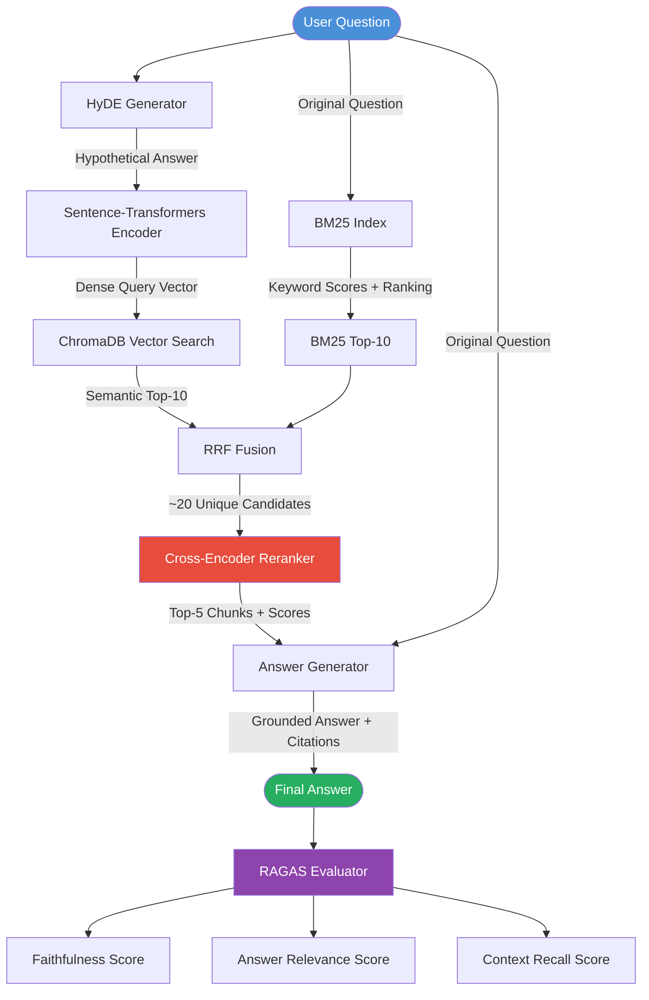
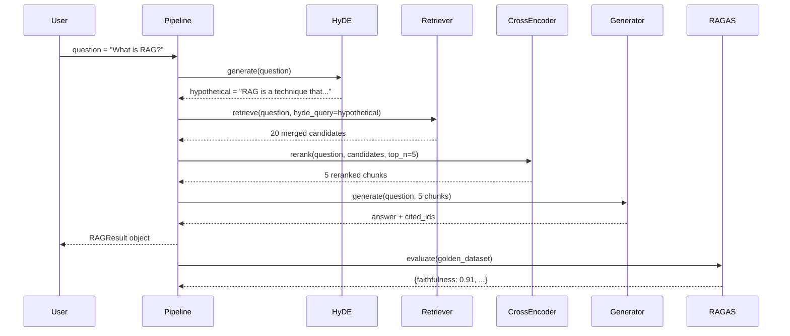
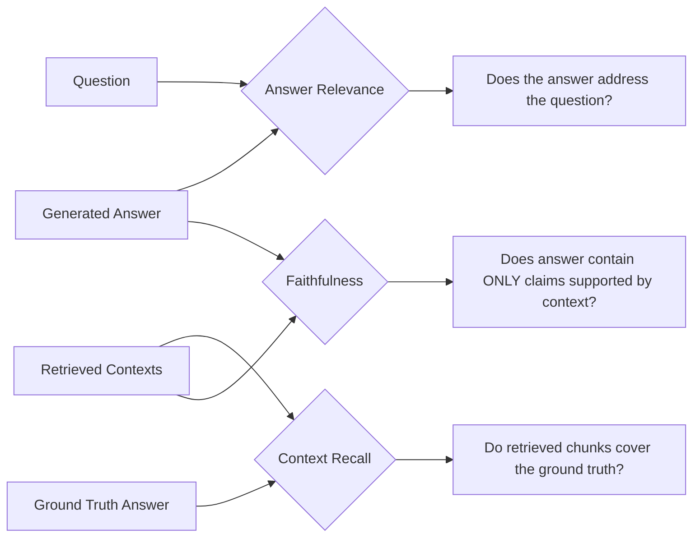

# Project 1: Architecture Blueprint

## System Flowchart



---

## Component Table

| Component | Class / Function | Input | Output | Notes |
|---|---|---|---|---|
| HyDE Generator | `HyDEGenerator.generate()` | Raw question string | Hypothetical answer text (~150 words) | Calls Claude claude-sonnet-4-6; output used as query for vector search only |
| Sentence-Transformer Encoder | Built into ChromaDB's `SentenceTransformerEmbeddingFunction` | Text string | 384-dim float vector | Model: `all-MiniLM-L6-v2`; runs locally |
| ChromaDB Vector Search | `DocumentStore.vector_search()` | HyDE answer text | Top-10 `RetrievedChunk` objects with cosine score | Persistent on disk; L2 distance converted to similarity |
| BM25 Index | `DocumentStore.bm25_search()` | Original question | Top-10 `RetrievedChunk` objects with BM25 score | `BM25Okapi` from `rank_bm25`; tokenized at index time |
| RRF Fusion | `HybridRetriever._reciprocal_rank_fusion()` | Two ranked lists of chunks | ~20 deduplicated chunks sorted by RRF score | Formula: `1/(k + rank)` summed across lists; k=60 |
| Cross-Encoder Reranker | `Reranker.rerank()` | Question + 20 candidates | Top-5 `RetrievedChunk` objects with logit scores | Model: `cross-encoder/ms-marco-MiniLM-L-6-v2`; runs locally |
| Answer Generator | `AnswerGenerator.generate()` | Question + Top-5 chunks | Answer text + list of cited source IDs | Grounded prompt; Claude refuses to answer beyond context |
| RAGAS Evaluator | `run_ragas_evaluation()` | Pipeline + golden dataset | Dict of metric scores | Uses LLM internally; requires golden ground-truth answers |

---

## Data Flow Detail



---

## Retrieval Strategy Comparison

| Strategy | Strengths | Weaknesses | When It Dominates |
|---|---|---|---|
| BM25 only | Fast, exact-match, no GPU | Misses paraphrases, no semantic understanding | Keyword queries: "BM25 algorithm definition" |
| Vector only | Handles paraphrases, conceptual queries | Misses exact terms, sensitive to embedding model | Conceptual: "why do models make things up" |
| HyDE + Vector | Fills vocabulary gap between question and doc | HyDE adds LLM call cost; can hallucinate in hypothesis | Short questions without technical terms |
| Hybrid (BM25 + Vector) | Best of both worlds, robust | More complex, two indexes to maintain | Production default |
| + Cross-Encoder Rerank | Highest precision on final top-5 | Slower (full inference per candidate pair) | Whenever answer quality matters more than latency |

---

## RAGAS Metrics Explained



| Metric | What It Catches | Target |
|---|---|---|
| Faithfulness | Hallucination — answer introduces facts not in context | > 0.85 |
| Answer Relevance | Vague or off-topic answers | > 0.80 |
| Context Recall | Retrieval failure — relevant chunks not in top-5 | > 0.80 |

---

## File Structure

```
01_Advanced_RAG_with_Reranking/
├── advanced_rag.py          # Main pipeline (from Starter_Code.md)
├── evaluate.py              # Standalone RAGAS runner
├── golden_dataset.py        # 20 Q&A pairs with ground-truth contexts
├── corpus/
│   └── sample_docs.txt      # Your document corpus (30+ paragraphs)
├── chroma_db/               # ChromaDB persistent storage (auto-created)
└── requirements.txt         # Pin your dependencies
```
