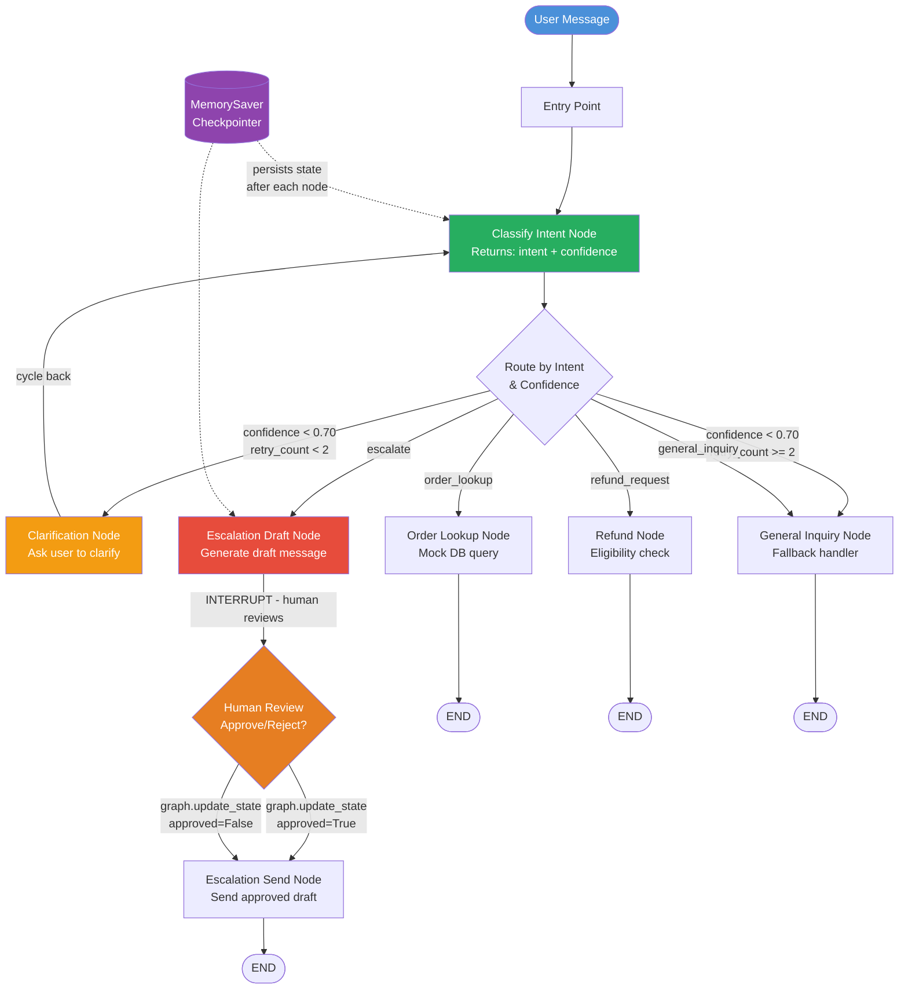
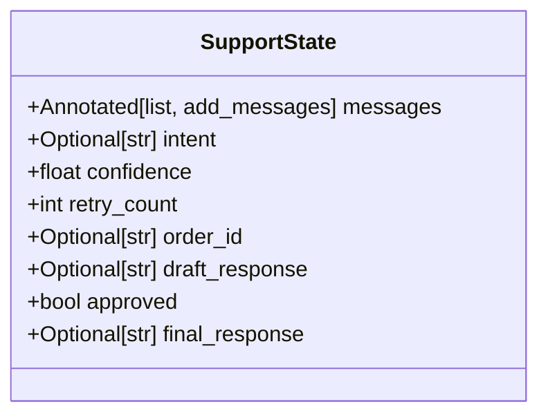
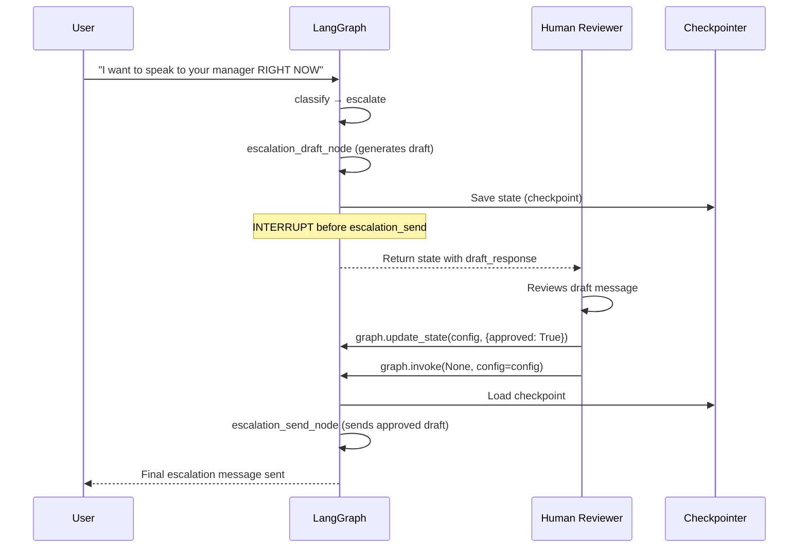
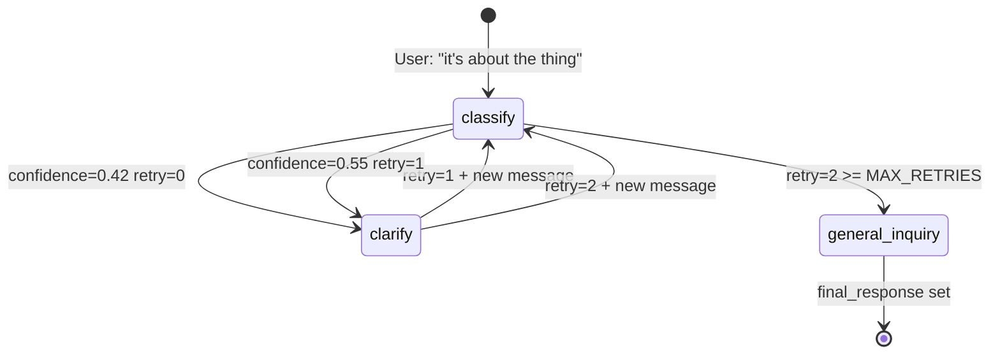
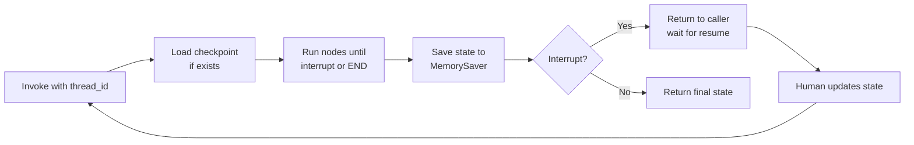

# Project 2: Architecture Blueprint

## Full System Flowchart



---

## Node Reference Table

| Node | Function | Reads from State | Writes to State | Routes to |
|---|---|---|---|---|
| `classify` | `classify_intent()` | `messages[-1]` | `intent`, `confidence`, `order_id` | Conditional (see router) |
| `clarify` | `clarification_node()` | `retry_count`, `messages` | `retry_count += 1`, `messages` (append Q + simulated reply) | `classify` (cycle) |
| `order_lookup` | `order_lookup_node()` | `order_id`, `messages` | `final_response`, `messages` | `END` |
| `refund_request` | `refund_node()` | `order_id`, `messages` | `final_response`, `messages` | `END` |
| `general_inquiry` | `general_inquiry_node()` | `messages` (full history) | `final_response`, `messages` | `END` |
| `escalate` | `escalation_draft_node()` | `messages` | `draft_response` | `escalation_send` (interrupted) |
| `escalation_send` | `escalation_send_node()` | `approved`, `draft_response` | `final_response`, `messages` | `END` |

---

## State Schema



| Field | Type | Description | Modified By |
|---|---|---|---|
| `messages` | `list` (append-only) | Full conversation history | Every node (append) |
| `intent` | `str \| None` | One of the four intent classes | `classify` |
| `confidence` | `float` | 0.0–1.0, classifier confidence | `classify` |
| `retry_count` | `int` | Number of clarification retries | `clarify` |
| `order_id` | `str \| None` | Extracted order ID if present | `classify`, `order_lookup` |
| `draft_response` | `str \| None` | Pending escalation message for review | `escalation_draft` |
| `approved` | `bool` | Human approval for escalation | Set via `graph.update_state()` |
| `final_response` | `str \| None` | The final bot message to the user | All specialist nodes |

---

## Human-in-the-Loop Sequence



---

## Retry Loop Trace



---

## Routing Decision Table

| `confidence` | `retry_count` | `intent` | Routes to |
|---|---|---|---|
| >= 0.70 | any | `order_lookup` | `order_lookup` |
| >= 0.70 | any | `refund_request` | `refund_request` |
| >= 0.70 | any | `general_inquiry` | `general_inquiry` |
| >= 0.70 | any | `escalate` | `escalate` |
| < 0.70 | 0 or 1 | any | `clarify` |
| < 0.70 | >= 2 | any | `general_inquiry` (fallback) |

---

## Checkpointing Architecture



| Checkpointer | Storage | Use Case |
|---|---|---|
| `MemorySaver` | In-memory Python dict | Development and testing |
| `SqliteSaver` | SQLite file | Single-node production |
| `PostgresSaver` | PostgreSQL | Multi-node production |

---

## File Structure

```
02_LangGraph_Support_Bot/
├── support_bot.py         # Main graph (from Starter_Code.md)
├── mock_data.py           # Extended mock order/customer database
├── test_scenarios.py      # Automated tests for all four paths
└── requirements.txt
```
