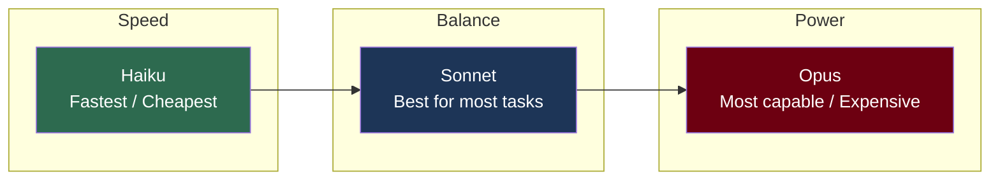
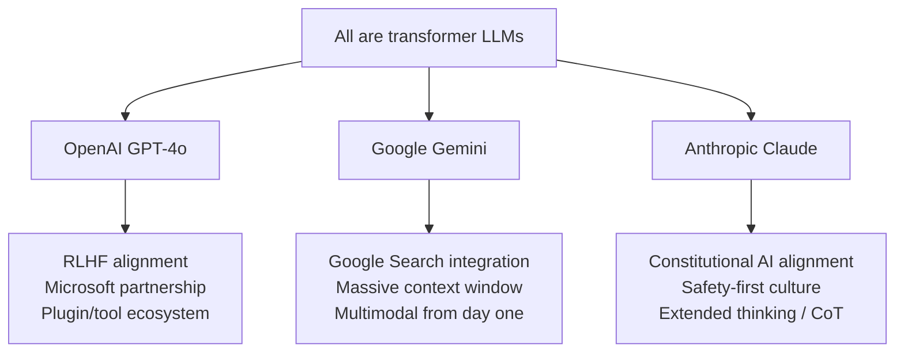

# What is Claude?

## The Story 📖

Imagine you hired the world's most well-read research assistant. This person has read billions of web pages, books, scientific papers, and code repositories — everything publicly available up to a certain date. They can write, explain, reason, translate, code, summarize, and debate with you in natural language. They don't look things up while talking to you — everything they know was absorbed during training. They are always available, always patient, and never tired.

Now imagine this assistant comes in three versions: a lightning-fast one for quick questions, a balanced one for everyday work, and a deeply thoughtful one for the hardest problems. Each version was shaped not just to be capable, but to be genuinely helpful, honest, and safe to work with.

That's Claude — a **large language model (LLM)** built by Anthropic.

👉 This is why we need **Claude** — an AI assistant that combines broad knowledge, strong reasoning, and deliberate alignment with human values.

---

## What is Claude? 🤖

**Claude** is a family of large language models created by Anthropic, a safety-focused AI company founded in 2021 by former OpenAI researchers including Dario Amodei and Daniela Amodei.

Claude is not a product that searches the internet in real time. It is a **transformer-based neural network** trained on a large corpus of text, then refined using **Reinforcement Learning from Human Feedback (RLHF)** and Anthropic's own **Constitutional AI (CAI)** methodology to be helpful, harmless, and honest.

Key properties:
- Conversational: designed for multi-turn dialogue via a messages API
- Instruction-following: can take a system prompt that shapes its persona and behavior
- Multimodal: can understand images as well as text (from Claude 3 onward)
- Long-context: supports up to 200k tokens of context in current versions
- Safety-oriented: trained with explicit safety goals baked into the process

#### Real-world examples

- **Developer tool:** Claude writes, explains, and debugs code across dozens of languages
- **Document analysis:** Claude reads and summarizes 200-page PDFs in seconds
- **Customer support:** Claude powers AI agents that resolve tickets, escalate when needed
- **Research assistant:** Claude synthesizes multiple papers and surfaces key insights
- **Creative writing:** Claude drafts emails, stories, blog posts, marketing copy

---

## Why It Exists — The Problem It Solves 🔍

### Problem 1: Capable AI without safety alignment is dangerous
Most LLMs before Anthropic's work optimized purely for capability. Claude was built from the start with safety as a first-class goal — not bolted on after training.

### Problem 2: General-purpose AI should adapt to context
Different use cases need radically different behavior. Claude's system prompt design lets operators (businesses using the API) and users shape Claude's behavior within guardrails.

### Problem 3: AI should be economically accessible at different tiers
A single model at maximum capability is expensive. The Claude family gives engineers a routing layer: use smaller faster models for simple tasks, larger models for complex reasoning.

👉 Without deliberate alignment: capable AI can be manipulated to cause harm. With Claude's training approach: safety and helpfulness are jointly optimized.

---

## The Claude Model Family 🏛️

Anthropic releases Claude in three tiers — each optimized for different speed/intelligence/cost tradeoffs.

| Tier | Best for | Speed | Intelligence | Cost |
|------|----------|-------|-------------|------|
| Haiku | High-volume, simple tasks | Fastest | Good | Lowest |
| Sonnet | Everyday AI work | Fast | Excellent | Moderate |
| Opus | Complex reasoning, research | Slower | Highest | Highest |

Current generation model IDs (as of mid-2025):
- `claude-haiku-4-5` — Haiku tier
- `claude-sonnet-4-6` — Sonnet tier (powers Claude Code)
- `claude-opus-4` — Opus tier

---

## How Claude Differs from GPT and Gemini 🆚

This is one of the most common interview and real-world questions. The models are similar in mechanism (all are transformer-based LLMs) but differ in training philosophy, ownership, and strengths.

| Dimension | Claude | GPT-4o | Gemini |
|-----------|--------|--------|--------|
| Alignment method | Constitutional AI + RLHF | RLHF | RLHF + RLAIF |
| Context window | Up to 200k tokens | Up to 128k tokens | Up to 1M tokens |
| Multimodal | Text + Images | Text + Images + Audio | Text + Images + Audio |
| Extended thinking | Yes (claude-3-7-sonnet) | Limited (o1/o3 series) | Limited |
| Ownership | Anthropic | Microsoft/OpenAI | Google |
| Primary strength | Reasoning, writing, safety | Broad capability, tools | Long context, search integration |

The most important practical difference: Anthropic prioritizes **safety research** as a core goal, not just a product feature. This shapes everything from training data curation to how Claude handles edge cases.

---

## Claude's Capabilities Overview 📋

### Language and Writing
- Write, edit, summarize, translate text in 30+ languages
- Draft professional documents: emails, reports, technical specs
- Creative writing: fiction, poetry, scripts

### Reasoning and Analysis
- Multi-step logical reasoning
- Math problem solving (with extended thinking: graduate-level)
- Scientific analysis and literature review
- Legal and financial document analysis

### Code
- Write, explain, debug, and refactor code in 40+ languages
- Generate unit tests and documentation
- Explain error messages and stack traces
- Design software architecture

### Multimodal (Claude 3+)
- Analyze images, screenshots, diagrams, charts
- Read text from images (OCR capability)
- Describe visual content for accessibility

### Tool Use and Agents
- Call external tools via function/tool calling API
- Run as an autonomous agent in a loop
- Orchestrate subagents via Claude Agent SDK

---

## Claude's Limitations ⚠️

Understanding what Claude cannot do is as important as understanding what it can.

### Knowledge Cutoff
Claude's training data has a cutoff date. It doesn't know about events after that date unless you provide them in context. Always check for recent information using external search tools when freshness matters.

### Hallucination
Claude can generate plausible-sounding but factually incorrect information — especially for specific facts, statistics, citations, URLs, and code. Always verify critical outputs.

### No Real-Time Access
Claude cannot browse the internet, call APIs, or access live data unless given tools that do this. By default, it only knows what's in its training data and its current context window.

### No Persistent Memory
Each conversation starts fresh. Claude has no memory of past sessions unless you explicitly provide that history in the prompt or use external memory tools.

### Context Window Limits
While 200k tokens is large (~150k words), extremely long documents still need chunking strategies. Very long contexts also increase cost and can degrade attention quality.

### Math and Precise Calculation
Claude can do arithmetic but is not a calculator. For precise numerical computation, use code execution tools.

---

## Where You'll See Claude in Real AI Systems 🏗️

- **Claude.ai**: Anthropic's consumer chat interface
- **Claude API**: Accessed by developers to power custom applications
- **Claude Code CLI**: An agentic coding assistant powered by Claude (the one running this session)
- **Amazon Bedrock**: Claude models available via AWS infrastructure
- **Enterprise integrations**: Salesforce, Slack, Notion, and hundreds of others via API

---

## Common Mistakes to Avoid ⚠️

- Treating Claude outputs as facts without verification — always check factual claims
- Assuming Claude "remembers" previous conversations — it doesn't by default
- Using the same model tier for all tasks — route simple tasks to Haiku, complex ones to Opus
- Ignoring the system prompt — the system prompt is your most powerful control lever
- Not testing edge cases — Claude's safety layers sometimes refuse legitimate requests; test your use case
- Assuming Claude is deterministic — same prompt twice can give different outputs (temperature > 0)

---

## Connection to Other Concepts 🔗

- Relates to **Transformer Architecture** (Topic 04) — Claude is built on transformer architecture; understanding attention heads explains how Claude processes context
- Relates to **Pretraining** (Topic 05) — Claude's knowledge comes from next-token prediction on massive text corpora
- Relates to **RLHF** (Topic 06) — Claude's helpfulness and safety come from reinforcement learning on human preferences
- Relates to **Constitutional AI** (Topic 07) — Anthropic's unique alignment method that makes Claude safer than pure RLHF
- Relates to **Extended Thinking** (Topic 08) — Claude's chain-of-thought reasoning capability for hard problems

---

✅ **What you just learned:** Claude is a family of safety-first LLMs from Anthropic, built on transformer architecture and refined with Constitutional AI, available in three tiers (Haiku/Sonnet/Opus) optimized for different speed/cost/capability tradeoffs.

🔨 **Build this now:** Make your first Claude API call using the Anthropic Python SDK — send "What are you and who made you?" and compare the response from `claude-haiku-4-5` vs `claude-opus-4`. Note the differences in depth and style.

➡️ **Next step:** How Claude Generates Text — [02_How_Claude_Generates_Text/Theory.md](../02_How_Claude_Generates_Text/Theory.md)

---

## 📂 Navigation

**In this folder:**
| File | |
|---|---|
| 📄 **Theory.md** | ← you are here |
| [📄 Cheatsheet.md](./Cheatsheet.md) | Quick reference |
| [📄 Interview_QA.md](./Interview_QA.md) | Interview prep |

⬅️ **Prev:** [Section README](../Readme.md) &nbsp;&nbsp;&nbsp; ➡️ **Next:** [02 How Claude Generates Text](../02_How_Claude_Generates_Text/Theory.md)
