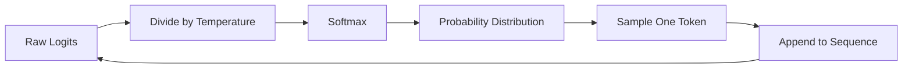
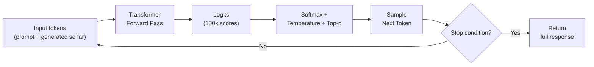

# How Claude Generates Text

## The Story 📖

You're playing a word game with a friend: they say a sentence and stop mid-way, and you have to predict the next word. "The cat sat on the..." — you'd almost certainly say "mat" or "floor." "She opened the door and..." — dozens of words fit. "Quantum entanglement describes the..." — now you need more knowledge.

Your brain is doing what Claude does millions of times per second: looking at every word that came before and asking, "What word most likely comes next?"

Now imagine you played this game after reading every book, article, forum post, code repository, and website ever published. Your predictions would be extraordinarily good — good enough to write essays, debug programs, and explain complex concepts, one word at a time.

That is exactly how Claude works. There is no meaning-engine inside, no understanding in the human sense. There is only: **what token comes next?** Repeated thousands of times to produce a response.

👉 This is why we need **autoregressive generation** — repeatedly sampling the next token from a learned probability distribution is sufficient to produce remarkably capable text output.

---

## What is Autoregressive Text Generation? 📝

**Autoregressive generation** means generating text one token at a time, where each new token is conditioned on all previous tokens. The model processes the entire history (your prompt plus any tokens it has already generated) and outputs a probability score for every token in its vocabulary. One token is then selected, appended to the sequence, and the process repeats.

The word "autoregressive" comes from statistics: the output at step t depends on (regresses on) the outputs at steps 1 through t-1. There is no future information — only past.

---

## Step 1 — Tokenization 🔤

Before generation can begin, your text is split into **tokens** — the atomic units the model processes. Tokens are not words; they are sub-word pieces produced by a **Byte Pair Encoding (BPE)** tokenizer.

Examples using Claude's tokenizer:
```
"Hello"          → ["Hello"]            — 1 token
"unbelievable"   → ["un", "believ", "able"]  — 3 tokens
"2024"           → ["2024"]             — 1 token
"def function(): " → ["def", " function", "():", " "]  — 4 tokens
```

Claude's vocabulary contains approximately 100,000 tokens. Every output must be one of these tokens.

---

## Step 2 — The Forward Pass ⚙️

Once tokenized, the entire sequence of tokens (prompt + any generated tokens so far) is fed through Claude's transformer layers. Each layer applies attention and feed-forward computations to build rich contextual representations.

The final layer outputs one number — a **logit** — for every token in the vocabulary. Logits are raw, unnormalized scores. A high logit means the model thinks that token is likely next.

```
Input: ["The", " sky", " is"]
Output: 100,000 logit scores — one per vocabulary token

Logit for " blue":     8.3
Logit for " clear":    6.1
Logit for " dark":     5.8
Logit for " a":       -2.1
...
```

---

## Step 3 — Softmax Converts Logits to Probabilities 📊

Raw logits aren't probabilities — they can be any real number and don't sum to 1. The **softmax function** converts them:

```
softmax(x_i) = exp(x_i) / sum(exp(x_j) for all j)
```

Plain English: exponentiate every logit, then divide each by the sum. The result is a valid probability distribution where all values are positive and sum to 1.0.

After softmax, the example above becomes:
```
P(" blue")  = 0.42   (42%)
P(" clear") = 0.18   (18%)
P(" dark")  = 0.12   (12%)
P(" a")     = 0.001  (0.1%)
...
```

---

## Step 4 — Sampling Picks the Next Token 🎲

The model now has a probability distribution. How it picks the next token depends on the **sampling strategy**:

### Greedy Decoding
Always pick the highest-probability token. Deterministic and fast, but prone to repetition and "boring" outputs.

### Temperature Sampling
**Temperature** is a scalar that reshapes the distribution before sampling:

```
adjusted_logit = logit / temperature
```

- `temperature = 0.0` → Greedy (always pick the top token)
- `temperature < 1.0` → Makes the distribution sharper — high-probability tokens get even more weight
- `temperature > 1.0` → Makes the distribution flatter — lower-probability tokens get more chance



### Top-p Sampling (Nucleus Sampling)
**Top-p** restricts the candidate tokens to the smallest set whose cumulative probability reaches p.

- If `p = 0.9`: keep adding tokens by probability rank until the cumulative sum reaches 0.9, then sample from only those tokens.
- When the model is confident (top 3 tokens = 92%), the nucleus is tiny — 3 tokens.
- When the model is uncertain (many tokens share probability), the nucleus is wide.

Top-p adapts to context; top-k (fixed number of candidates) does not. This is why top-p is preferred.

### Top-k Sampling
**Top-k** keeps only the k highest-probability tokens regardless of their actual values. Less flexible than top-p.

---

## Step 5 — The Generation Loop 🔄

After selecting a token, it's appended to the sequence and the entire forward pass runs again. This loop continues until:

1. The model generates a **stop token** (a special end-of-sequence token, or a stop sequence you specify)
2. The response reaches `max_tokens`



---

## Stop Sequences 🛑

A **stop sequence** is a string that, when generated, causes the model to immediately stop. You specify these in the API.

Examples:
- `stop_sequences=["</answer>"]` — stops after the model finishes an XML tag
- `stop_sequences=["\n\n"]` — stops after a blank line (good for structured formats)
- `stop_sequences=["User:"]` — stops when the model would start simulating the user

Stop sequences are powerful for structured output — they let you extract exactly the portion you want.

---

## The Math Behind Temperature 📐

Given logits `z` for vocabulary tokens and temperature `T`:

```
P(token_i) = exp(z_i / T) / Σ exp(z_j / T)
```

What happens as T changes:
- `T → 0`: the highest logit dominates exponentially → effectively argmax (greedy)
- `T = 1`: standard softmax, logits used as-is
- `T → ∞`: all logits become equal → uniform distribution → random token

For Claude API calls, temperature is passed directly as a parameter (0 to 1 range for most use cases).

---

## Why Generation is Sequential and Expensive 💸

Each token generation requires a full forward pass through the transformer. For a 70B parameter model, this means:
- Loading billions of weight matrices from GPU memory
- Running matrix multiplications across all layers
- The dominant cost is memory bandwidth, not computation

This is why:
- Generation is slower than encoding (which can be parallelized)
- Longer outputs cost more (each token = one forward pass)
- The **KV cache** optimization is critical — it stores computed key/value pairs from previous tokens so they don't need recomputation

---

## Where You'll See This in Real AI Systems 🏗️

- **Claude API**: `temperature`, `top_p`, `top_k`, `max_tokens`, `stop_sequences` are all direct API parameters
- **Prompt engineering**: Low temperature for extracting structured data; higher for brainstorming
- **Speculative decoding**: Draft-verify pattern for faster generation at same quality
- **Streaming**: Tokens are sent to the client as they're generated (server-sent events), making responses feel faster
- **Beam search**: Used in translation/older systems — maintains multiple candidate sequences

---

## Common Mistakes to Avoid ⚠️

- Setting temperature=0 and then being surprised outputs are deterministic — that's the point
- Setting temperature very high (>1.2) for production use — outputs become unpredictable
- Forgetting that top-p and temperature interact — apply temperature first (reshape logits), then top-p (filter candidates), then sample
- Using max_tokens too small — the model can be cut off mid-sentence
- Assuming stop sequences are always generated — if max_tokens is hit first, stop sequences don't fire

---

## Connection to Other Concepts 🔗

- Relates to **Tokens and Context Window** (Topic 03) — tokens are the atomic units of this process; context window limits how many can be in the sequence
- Relates to **Transformer Architecture** (Topic 04) — the forward pass that produces logits is the transformer computation
- Relates to **Extended Thinking** (Topic 08) — thinking tokens are generated using the same autoregressive process, just treated differently
- Relates to **LLM Applications / Streaming** — streaming sends tokens to the client as they're generated in this loop

---

✅ **What you just learned:** Claude generates text by running an autoregressive loop — transforming input tokens into logits, converting to probabilities via softmax, sampling the next token with temperature/top-p, and repeating until done.

🔨 **Build this now:** Call the Claude API with the same prompt 5 times at `temperature=0` (should be identical) then 5 times at `temperature=1.0` (should vary). Also try setting a `stop_sequences` parameter and see where responses get cut off.

➡️ **Next step:** Tokens and Context Window — [03_Tokens_and_Context_Window/Theory.md](../03_Tokens_and_Context_Window/Theory.md)

---

## 📂 Navigation

**In this folder:**
| File | |
|---|---|
| 📄 **Theory.md** | ← you are here |
| [📄 Cheatsheet.md](./Cheatsheet.md) | Quick reference |
| [📄 Interview_QA.md](./Interview_QA.md) | Interview prep |
| [📄 Visual_Guide.md](./Visual_Guide.md) | Step-by-step diagrams |

⬅️ **Prev:** [01 What is Claude](../01_What_is_Claude/Theory.md) &nbsp;&nbsp;&nbsp; ➡️ **Next:** [03 Tokens and Context Window](../03_Tokens_and_Context_Window/Theory.md)
