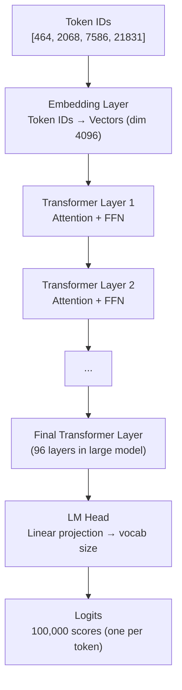
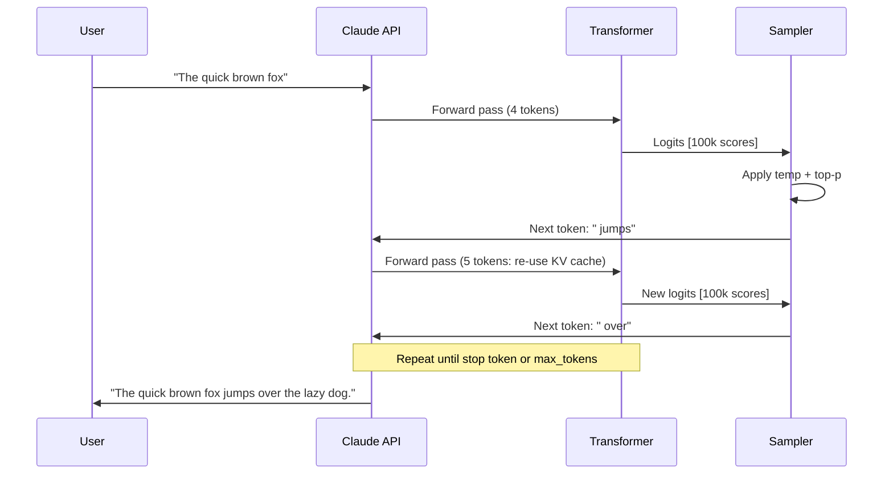

# How Claude Generates Text — Visual Guide

This guide walks through the entire generation process with step-by-step diagrams.

---

## 🔍 Stage 1 — Tokenization

Your prompt is converted from characters to tokens before the model sees it.

```
Input string:
"The quick brown fox"

After tokenization:
┌───────┬─────────┬───────┬──────┐
│  The  │  quick  │ brown │  fox │
│  (1)  │   (2)   │  (3)  │  (4) │
└───────┴─────────┴───────┴──────┘

These 4 tokens are passed as integer IDs to the model.
Token IDs example: [464, 2068, 7586, 21831]
```

Words are NOT tokens. A long word may be split into multiple tokens. Spaces are often part of a token:
```
"  running"  →  [" run", "ning"]       (2 tokens)
"2024-01-15" →  ["2024", "-", "01", "-", "15"]  (5 tokens)
```

---

## ⚙️ Stage 2 — Transformer Forward Pass

All tokens are fed into the transformer simultaneously for the "encoding" step, and the model produces logit scores for the next token position.



The model attends to all previous tokens, building rich contextual representations. The final layer projects to vocabulary size via a linear head.

---

## 📊 Stage 3 — Logits to Probabilities

```
Raw logits for top tokens after "The quick brown fox":

 " jumps"    →  logit =  9.2
 " ran"      →  logit =  7.4
 " leaped"   →  logit =  6.8
 " sat"      →  logit =  4.1
 " was"      →  logit =  3.9
 (99,995 other tokens — most very negative)

After softmax (temperature = 1.0):
 " jumps"    →  42.1%
 " ran"      →  16.3%
 " leaped"   →  11.8%
 " sat"      →   3.2%
 " was"      →   2.9%
 (everything else) → 23.7%
```

---

## 🌡️ Stage 4 — Temperature Effect

Same logits, different temperatures:

```
                    temp=0.3   temp=1.0   temp=1.5
 " jumps"             78.2%      42.1%      28.4%
 " ran"               12.6%      16.3%      16.1%
 " leaped"             7.0%      11.8%      12.8%
 " sat"                0.9%       3.2%       5.1%
 " was"                0.7%       2.9%       4.9%
 (rest)                0.6%      23.7%      32.7%
```

At temperature=0.3: the model almost always picks "jumps" — very safe.
At temperature=1.5: there's a meaningful chance of getting "leaped", "sat", "ran" — more creative.

---

## 🔵 Stage 5 — Top-p Nucleus Filtering

After applying temperature, top-p (nucleus sampling) filters the candidates:

```
With top-p = 0.9 (after temperature=1.0 softmax):

Sort by probability:
 " jumps"    42.1%   cumulative: 42.1%  ✓ include
 " ran"      16.3%   cumulative: 58.4%  ✓ include
 " leaped"   11.8%   cumulative: 70.2%  ✓ include
 " sat"       3.2%   cumulative: 73.4%  ✓ include
 " was"       2.9%   cumulative: 76.3%  ✓ include
 " slept"     2.1%   cumulative: 78.4%  ✓ include
 " stood"     1.9%   cumulative: 80.3%  ✓ include
 " crossed"   1.7%   cumulative: 82.0%  ✓ include
 " moved"     1.4%   cumulative: 83.4%  ✓ include
 " walked"    1.3%   cumulative: 84.7%  ✓ include
 " passed"    1.1%   cumulative: 85.8%  ✓ include
 " came"      1.0%   cumulative: 86.8%  ✓ include
 " turned"    0.9%   cumulative: 87.7%  ✓ include
 " went"      0.8%   cumulative: 88.5%  ✓ include
 " jumped"    0.8%   cumulative: 89.3%  ✓ include
 " looked"    0.7%   cumulative: 90.0%  ✓ stop — reached 90%
 (remaining 99,984 tokens)                ✗ exclude

Sample from only these 16 tokens.
```

Compare to top-k=50: would always include exactly 50 tokens regardless of probability mass.

---

## 🔄 Stage 6 — The Full Generation Loop



Note: the KV cache means each subsequent step only computes Q/K/V for the NEW token — past tokens' K and V are already cached.

---

## 🛑 Stage 7 — Stop Conditions

Generation stops when any of these conditions is met:

```
┌─────────────────────────────────────────┐
│           Stop Condition Check          │
├─────────────────────────────────────────┤
│ 1. Generated token == EOS token?        │
│    → Stop                               │
│ 2. Last N tokens match a stop sequence? │
│    → Stop (strip matched sequence)      │
│ 3. Total tokens >= max_tokens?          │
│    → Stop (output may be truncated)     │
│ 4. None of the above                    │
│    → Continue to next token             │
└─────────────────────────────────────────┘
```

---

## 📦 Summary — Full Pipeline


---

## 📂 Navigation

**In this folder:**
| File | |
|---|---|
| [📄 Theory.md](./Theory.md) | Core concepts |
| [📄 Cheatsheet.md](./Cheatsheet.md) | Quick reference |
| [📄 Interview_QA.md](./Interview_QA.md) | Interview prep |
| 📄 **Visual_Guide.md** | ← you are here |

⬅️ **Prev:** [01 What is Claude](../01_What_is_Claude/Theory.md) &nbsp;&nbsp;&nbsp; ➡️ **Next:** [03 Tokens and Context Window](../03_Tokens_and_Context_Window/Theory.md)
