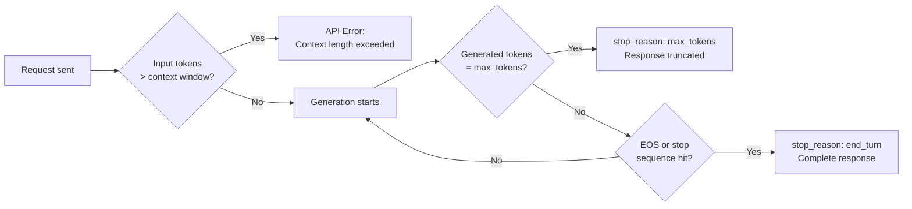

# Tokens and Context Window

## The Story 📖

Think about a translator working at the UN. They can only hold so much conversation in their head at once. If the speaker goes on for too long, the translator has to either stop listening to the beginning or start summarizing to make room. The translator also doesn't process whole words at a time — they process phonemes, morphemes, fragments of language that build up into meaning.

Claude has the same two constraints: a maximum amount of conversation it can hold in its head (the context window) and a specific unit of language it processes (the token). Neither of these is a word. Understanding both is essential for building anything real with the API.

When your application breaks in production with a "context_length_exceeded" error, or when you're surprised by how much an API call costs, the answer almost always comes back to tokens and context windows.

👉 This is why we need to understand **tokens and context windows** — they are the fundamental unit of cost, the hard limit on what Claude can process, and a constant engineering constraint.

---

## 📌 Learning Priority

**Must Learn** — core concepts, needed to understand the rest of this file:
[What is a Token](#what-is-a-token-) · [Context Window Defined](#what-is-the-context-window-) · [At-Limit Behavior](#what-happens-when-you-hit-the-limit-)

**Should Learn** — important for real projects and interviews:
[Token Counting Rules](#rules-of-thumb-for-token-counting-) · [Cost Implications](#cost-implications-) · [Counting with API](#counting-tokens-with-the-anthropic-api-)

**Good to Know** — useful in specific situations, not needed daily:
[Lost in the Middle](#the-lost-in-the-middle-problem-) · [Real AI Systems](#where-youll-see-this-in-real-ai-systems-️)

**Reference** — skim once, look up when needed:
[Common Mistakes](#common-mistakes-to-avoid-️)

---

## What is a Token? 🔤

A **token** is the atomic unit that Claude processes. It is not a word, not a character, not a sentence. It is a sub-word piece determined by a **Byte Pair Encoding (BPE)** tokenizer that was trained on the same (or similar) text corpus as the model.

### Byte Pair Encoding

**BPE** starts with individual characters and iteratively merges the most frequent adjacent pairs into new tokens. After training on a large corpus, the tokenizer has learned a vocabulary of ~100,000 pieces that efficiently represent the training data.

The result:
- Common words become single tokens: "the", "is", "and"
- Rare words get split: "anthropogenic" → ["anthro", "po", "genic"]
- Prefixes/suffixes become tokens: "un-", "-ing", "-tion"
- Code tokens mirror common code patterns: "def ", "import ", "::\n"

### Token ≠ Word

This is the most important misconception to correct:

```
"Hello, world!"    → ["Hello", ",", " world", "!"]         = 4 tokens
"running"          → ["running"]                            = 1 token
"extraordinarily"  → ["extra", "ord", "inarily"]            = 3 tokens
"claude-3-opus-20240229" → ["claude", "-", "3", "-", "opus", "-", "202", "40", "229"] = 9 tokens
" I"               → [" I"]                                 = 1 token (note the leading space)
"I"                → ["I"]                                  = 1 token (different token!)
```

The leading space matters — "I" and " I" are different tokens. This catches engineers off guard with precise string matching tasks.

---

## Rules of Thumb for Token Counting 📏

```
1 token ≈ 4 characters (English text)
1 token ≈ 0.75 words (English text)
1 word  ≈ 1.3 tokens (English text)
```

| Content | Approximate tokens |
|---------|-------------------|
| Single word | 1–2 tokens |
| Short sentence | 10–20 tokens |
| Paragraph | 75–100 tokens |
| One page of text | 400–500 tokens |
| 1,000 words | ~1,300 tokens |
| 10-page document | ~4,000 tokens |
| Book (80k words) | ~107,000 tokens |
| Claude's 200k limit | ~150,000 words |

Non-English languages and code tokenize differently:
- Chinese/Japanese: often 2–3 tokens per character (less efficient)
- Code: depends heavily on language and variable naming patterns
- JSON: whitespace and braces add tokens; minified JSON is cheaper

---

## What is the Context Window? 🪟

The **context window** is the maximum number of tokens Claude can process in a single API call — including both input (your prompt, system prompt, message history) and output (Claude's response).

It is not just an input limit. The total of input + output must fit within the window.

```
context_window = system_prompt_tokens
               + message_history_tokens
               + user_message_tokens
               + assistant_response_tokens
               ≤ max_tokens_for_model
```

Current Claude model limits:

| Model | Context Window |
|-------|---------------|
| claude-haiku-4-5 | 200,000 tokens |
| claude-sonnet-4-6 | 200,000 tokens |
| claude-opus-4 | 200,000 tokens |

200,000 tokens is roughly 150,000 words — enough for a full novel, or 40+ typical PDFs.

---

## What Happens When You Hit the Limit? 🚫

There are two types of at-limit behavior, and understanding them prevents costly bugs:

### 1. Input Too Long — API Error
If your input tokens exceed the model's context window, the API returns an error before generating anything:

```json
{
  "error": {
    "type": "invalid_request_error",
    "message": "prompt is too long: 205823 tokens > 200000 maximum"
  }
}
```

You must handle this in code — truncate, summarize, or chunk the input.

### 2. max_tokens Reached — Truncated Output
If Claude is generating a response and hits the `max_tokens` limit you set, it stops mid-generation. The response object will have `stop_reason: "max_tokens"` instead of `stop_reason: "end_turn"`.



Always check `stop_reason` in your response handling — truncated output is a silent failure if you don't.

---

## Counting Tokens with the Anthropic API 🔢

Anthropic provides a token counting endpoint:

```python
import anthropic

client = anthropic.Anthropic()

response = client.messages.count_tokens(
    model="claude-sonnet-4-6",
    system="You are a helpful assistant.",
    messages=[
        {"role": "user", "content": "How many tokens is this message?"}
    ]
)

print(response.input_tokens)  # → exact count
```

This call does not generate any output — it only counts tokens and returns the number. Use this to:
- Pre-flight check before expensive calls
- Monitor context usage in long-running agent sessions
- Validate that chunked documents fit within limits

---

## Cost Implications 💰

You pay per token — both input and output. Token counting directly maps to cost:

```
cost = (input_tokens × input_price_per_million)
     + (output_tokens × output_price_per_million)
```

Typical pricing tiers (mid-2025, approximate):
- Haiku: ~$0.25 per million input tokens, ~$1.25 output
- Sonnet: ~$3.00 per million input tokens, ~$15.00 output
- Opus: ~$15.00 per million input tokens, ~$75.00 output

Output tokens are always more expensive than input tokens (3–5x typically), because they require sequential generation while input processing is parallelized.

Engineering implications:
- Minimize prompt repetition across messages (use system prompt efficiently)
- Use **prompt caching** for long static context that repeats across calls
- Route simple tasks to Haiku — same token count, ~12x cheaper than Sonnet
- Keep `max_tokens` tight — you pay for generated tokens even if they contain padding

---

## The "Lost in the Middle" Problem 🔍

Research has shown that LLMs recall information at the start and end of very long contexts better than information in the middle. This "lost in the middle" phenomenon means:

- Putting critical instructions at the beginning AND end of your prompt is more reliable than the middle
- For document analysis, placing the most relevant chunks first or last improves retrieval accuracy
- Very long context calls may degrade quality even if they technically fit

This is an empirical observation about model attention patterns, not a hard limit. But it's worth designing around for high-stakes applications.

---

## Where You'll See This in Real AI Systems 🏗️

- **Chunking in RAG**: Documents too long for the context window are split into chunks; relevant chunks are retrieved and injected
- **Conversation truncation**: Long chat sessions must drop or summarize old messages to stay under the limit
- **Agent context management**: Agent systems track token usage and compress/summarize state when approaching the limit
- **Prompt caching**: Anthropic allows caching the first N tokens of a prompt to avoid re-processing static context
- **Batch processing**: Large document sets are processed in parallel batches, each within the context window

---

## Common Mistakes to Avoid ⚠️

- Assuming 1 token = 1 word — always use the count_tokens endpoint for precise measurement
- Forgetting output tokens count against the window — `context_window = input + output`, not just input
- Not handling `stop_reason: "max_tokens"` — your code silently gets truncated output
- Using the same max_tokens for all tasks — set it to ~2x expected output length, not 4096 by default
- Sending full conversation history every turn without compression — costs scale with history length
- Using whitespace-heavy JSON when compact formats would halve token count

---

## Connection to Other Concepts 🔗

- Relates to **How Claude Generates Text** (Topic 02) — tokens are what the generation loop produces one at a time
- Relates to **Transformer Architecture** (Topic 04) — the context window length directly determines attention matrix size and memory usage
- Relates to **Extended Thinking** (Topic 08) — thinking tokens come from the same budget; extended thinking can consume thousands of tokens before the visible response
- Relates to **Cost Optimization** (Track 3) — all cost calculations are token-denominated

---

✅ **What you just learned:** Tokens are sub-word BPE pieces (not words), one token ≈ 0.75 words in English; the context window is the total input+output token limit (200k for current Claude models); hitting it either errors the request or truncates output.

🔨 **Build this now:** Use the `client.messages.count_tokens()` API call to count the tokens in: (1) a single word, (2) a sentence, (3) a 500-word paragraph. Compare the counts to the rules of thumb above. Then count tokens in some Python code to see how code tokenizes differently.

➡️ **Next step:** Transformer Architecture — [04_Transformer_Architecture/Theory.md](../04_Transformer_Architecture/Theory.md)

---

## 📂 Navigation

**In this folder:**
| File | |
|---|---|
| 📄 **Theory.md** | ← you are here |
| [📄 Cheatsheet.md](./Cheatsheet.md) | Quick reference |
| [📄 Interview_QA.md](./Interview_QA.md) | Interview prep |
| [📄 Code_Example.md](./Code_Example.md) | Token counting code |

⬅️ **Prev:** [02 How Claude Generates Text](../02_How_Claude_Generates_Text/Theory.md) &nbsp;&nbsp;&nbsp; ➡️ **Next:** [04 Transformer Architecture](../04_Transformer_Architecture/Theory.md)
