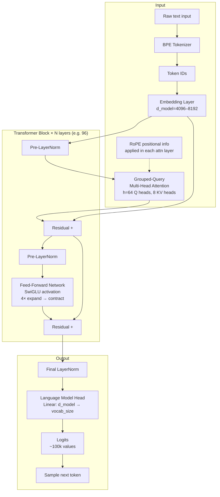

# Transformer Architecture — Architecture Deep Dive

A complete visual walkthrough of the transformer architecture as used in Claude (decoder-only, modern variant).

---

## Full Architecture Overview



---

## Layer-by-Layer Detail

### Token Embeddings

```
Token IDs: [464, 2068, 7586, 21831]
                ↓
Embedding lookup table: [vocab_size × d_model]
                ↓
Token vectors: shape [seq_len × d_model]
               each row is a dense vector in d_model-dimensional space
```

The embedding weights are shared with the final language model head (weight tying) — the same matrix maps token IDs to embeddings and maps final hidden states back to logit scores.

---

### Self-Attention Internals

For each attention layer:

```
Input x: [seq_len × d_model]

Q = x × W_Q  → [seq_len × d_model]
K = x × W_K  → [seq_len × d_k]    (d_k = d_model / n_kv_heads with GQA)
V = x × W_V  → [seq_len × d_k]

Apply RoPE to Q and K (rotate vectors by position angle)

Attention scores = Q × K^T / sqrt(d_k)  → [seq_len × seq_len]
Apply causal mask (set upper triangle to -inf)
Attention weights = softmax(scores)       → [seq_len × seq_len]
Output = weights × V                      → [seq_len × d_model]
Project: output × W_O                    → [seq_len × d_model]
```

---

### Causal Mask Visualization

```
Sequence: ["The", "cat", "sat", "on", "the", "mat"]
Position:      0      1      2     3     4      5

Attention mask (1 = can attend, 0 = masked):

        The  cat  sat   on  the  mat
The  [   1    0    0    0    0    0  ]
cat  [   1    1    0    0    0    0  ]
sat  [   1    1    1    0    0    0  ]
on   [   1    1    1    1    0    0  ]
the  [   1    1    1    1    1    0  ]
mat  [   1    1    1    1    1    1  ]

Each token can only attend to itself and previous tokens.
```

---

### Multi-Head Attention Parallel Processing

```
Input x: [seq_len × d_model]

Split into h=64 query heads:
  head_1: Q_1, K_1, V_1 → output_1: [seq_len × d_head]
  head_2: Q_2, K_2, V_2 → output_2: [seq_len × d_head]
  ...
  head_64: Q_64, K_64, V_64 → output_64: [seq_len × d_head]

With GQA (8 KV heads): heads 1-8 share K_1,V_1; heads 9-16 share K_2,V_2; etc.

Concatenate: [output_1 || output_2 || ... || output_64] → [seq_len × d_model]
Final projection × W_O → [seq_len × d_model]
```

---

### Feed-Forward Network with SwiGLU

Modern transformers use SwiGLU activation instead of original ReLU:

```
Standard FFN (original):
  FFN(x) = ReLU(x × W_1 + b_1) × W_2 + b_2

SwiGLU FFN (modern):
  gate = Swish(x × W_gate)    # gating signal
  up   = x × W_up             # content signal  
  FFN(x) = (gate * up) × W_down

  where Swish(x) = x × sigmoid(x)
```

SwiGLU improves performance over ReLU at the same parameter count. The "gate" controls how much of the "content" passes through, adding a learned selection mechanism.

Dimensions:
- Input: d_model (e.g., 4096)
- Hidden: d_ff ≈ 2.67 × d_model for SwiGLU (to maintain parameter count equivalent)
- Output: d_model

---

### KV Cache During Inference

```
Generating token 5 (without KV cache):
  1. Compute Q, K, V for all 5 tokens
  2. Compute attention scores: 5×5 matrix
  3. Weighted sum: output for token 5
  Cost: O(n²) recomputation at each step

Generating token 5 (with KV cache):
  1. Load cached K, V for tokens 0-4 from memory
  2. Compute K, V only for new token 5
  3. Append to cache: K_cache=[K_0,...,K_5], V_cache=[V_0,...,V_5]
  4. Compute attention between Q_5 and K_cache
  Cost: O(n) memory reads (past tokens) + O(1) new computation

Memory cost: seq_len × n_kv_heads × d_head × n_layers × 2 (K and V) × dtype_bytes
Example: 200k tokens, 8 KV heads, 128 head_dim, 96 layers, bf16:
  = 200,000 × 8 × 128 × 96 × 2 × 2 bytes
  ≈ 96 GB  — this is why GQA reduces KV heads from 64 to 8
```

---

## Dimension Summary (Typical Large Model)

```
d_model (embedding dim):   4,096  – 8,192
d_ff (FFN hidden):        11,000  – 28,672  (≈ 2.67× d_model with SwiGLU)
n_heads (query heads):        32  – 128
n_kv_heads (GQA):              4  – 16
d_head:                       64  – 128  (= d_model / n_heads)
n_layers:                     32  – 96
vocab_size:               32,000  – 128,256
max_context:            128,000  – 200,000  tokens
```

---

## Information Flow Summary

```
Input text
    ↓  BPE tokenize
Token IDs
    ↓  Embed → dense vectors
Token embeddings
    ↓  Block 1: pre-norm → attention (+ RoPE) → residual → pre-norm → FFN → residual
    ↓  Block 2: ... (same structure)
    ↓  ...
    ↓  Block N (96): ...
Final hidden states
    ↓  Final LayerNorm
Normalized hidden states  
    ↓  LM Head (linear projection → vocab_size)
Logits (100k scores)
    ↓  Temperature + Top-p + Sample
Next token
    ↓  Append to sequence, repeat
```

---

## 📂 Navigation

**In this folder:**
| File | |
|---|---|
| [📄 Theory.md](./Theory.md) | Core concepts |
| [📄 Cheatsheet.md](./Cheatsheet.md) | Quick reference |
| [📄 Interview_QA.md](./Interview_QA.md) | Interview prep |
| 📄 **Architecture_Deep_Dive.md** | ← you are here |
| [📄 Math_Intuition.md](./Math_Intuition.md) | Attention math explained |

⬅️ **Prev:** [03 Tokens and Context Window](../03_Tokens_and_Context_Window/Theory.md) &nbsp;&nbsp;&nbsp; ➡️ **Next:** [05 Pretraining](../05_Pretraining/Theory.md)
