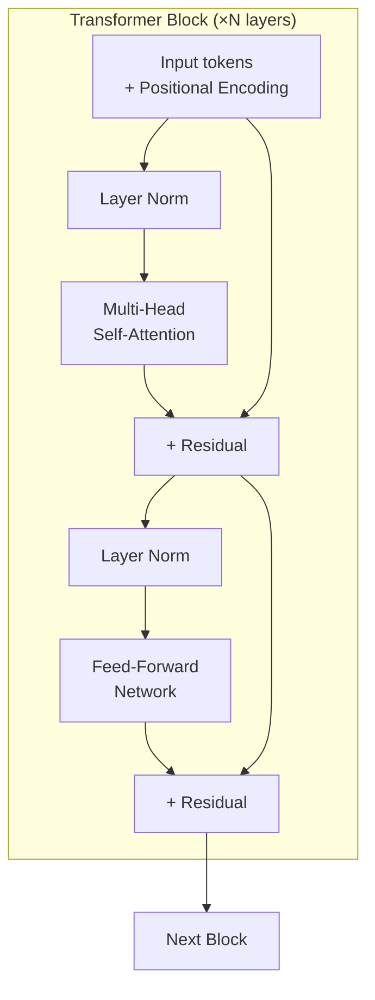
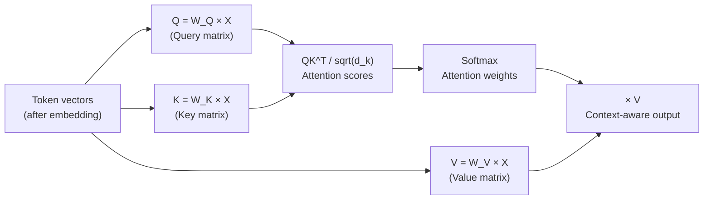

# Transformer Architecture

## The Story 📖

Imagine you're reading a legal contract. When you hit the clause "The party of the first part agrees to...", your brain doesn't just look at "party" in isolation — you're simultaneously aware of who was introduced at the top of the document, what "first part" referred to two pages ago, and the overall context of what's being agreed. Your brain holds every relevant detail in view at once, not just the last sentence.

This is exactly what transformers do — and it's why they revolutionized natural language processing. Previous architectures (RNNs, LSTMs) processed text sequentially, like reading one word and passing a compressed note to the next word. By the end of a long sentence, early words were barely represented. Transformers threw out the sequential bottleneck and replaced it with **attention** — a mechanism that lets every token look at every other token directly.

The result: a model that can track "the party of the first part" 2,000 words after its introduction, understand that "it" refers to "the contract" 10 sentences back, and build up rich contextual representations that capture complex long-range dependencies.

👉 This is why we need **transformer architecture** — attention over the full sequence enables the contextual understanding that makes LLMs like Claude possible.

---

## 📌 Learning Priority

**Must Learn** — core concepts, needed to understand the rest of this file:
[What is a Transformer](#what-is-a-transformer-️) · [Self-Attention Mechanism](#step-2--self-attention-the-core-mechanism-) · [Causal Masked Attention](#step-3--causal-masked-attention-in-decoders-)

**Should Learn** — important for real projects and interviews:
[Multi-Head Attention](#step-4--multi-head-attention-) · [Residuals and LayerNorm](#step-6--layer-normalization-and-residual-connections-) · [Claude vs Original Transformer](#how-claudes-architecture-differs-from-the-original-transformer-)

**Good to Know** — useful in specific situations, not needed daily:
[Feed-Forward Network](#step-5--feed-forward-network-) · [Positional Encoding](#step-1--token-embedding--positional-encoding-)

**Reference** — skim once, look up when needed:
[Real AI Systems](#where-youll-see-this-in-real-ai-systems-️) · [Common Mistakes](#common-mistakes-to-avoid-️)

---

## What is a Transformer? 🏗️

A **transformer** is a neural network architecture introduced in the 2017 paper "Attention Is All You Need" by Vaswani et al. It replaces sequential processing with parallel **self-attention** — a mechanism where every token in a sequence attends to every other token to build contextual representations.

Claude is a **decoder-only transformer** (like GPT), meaning it is trained to generate text autoregressively. Unlike the original encoder-decoder architecture (used for translation), a decoder-only model takes a sequence of tokens and generates the next token in the sequence.

---

## The Big Picture — Transformer Block Stack 📐

A transformer is essentially a stack of identical "transformer blocks", each containing:
1. Multi-head self-attention
2. Feed-forward network (FFN)
3. Layer normalization
4. Residual connections



Large Claude models stack 60–96 of these blocks. Each block refines the representations from the previous block, progressively building richer and richer contextual understanding.

---

## Step 1 — Token Embedding + Positional Encoding 🔢

Raw tokens are integer IDs. Before they can be processed, they need to be converted to dense vectors via an **embedding layer** — a learned lookup table mapping each token ID to a vector of dimension d (typically 4096–8192 for large models).

But embeddings alone have no sense of order — the model can't tell if "dog bites man" vs "man bites dog." This is where **positional encoding** comes in.

### Sinusoidal Positional Encoding (Original)
The original transformer added fixed sine/cosine patterns based on position index. Each dimension of the positional vector oscillates at a different frequency:

```
PE(pos, 2i)   = sin(pos / 10000^(2i/d_model))
PE(pos, 2i+1) = cos(pos / 10000^(2i/d_model))
```

### RoPE — Rotary Position Embedding (Modern)
**RoPE (Rotary Positional Embedding)** is used in most modern LLMs including Claude. Instead of adding position information to the token embedding, RoPE encodes position by rotating the query and key vectors in attention by an angle proportional to position.

Benefits of RoPE:
- Better extrapolation beyond training sequence lengths
- Position information is built into the attention mechanism, not added separately
- More stable for very long contexts

---

## Step 2 — Self-Attention: The Core Mechanism 🎯

**Self-attention** is the mechanism by which every token in the sequence attends to every other token. For each token, three vectors are computed:

- **Query (Q)**: What am I looking for?
- **Key (K)**: What information do I have to offer?
- **Value (V)**: What is the actual content I carry?

Attention is computed as:

```
Attention(Q, K, V) = softmax(QK^T / sqrt(d_k)) × V
```

Plain English:
1. **QK^T**: Compute a dot product between each query and every key — this measures how much each token "wants" to attend to every other token
2. **/ sqrt(d_k)**: Scale by the square root of the key dimension — prevents dot products from getting too large (which would cause softmax to saturate)
3. **softmax(...)**: Convert scores to probabilities — for each token, they sum to 1 across all positions it can attend to
4. **× V**: Take a weighted sum of value vectors — the attended content is a blend of all values, weighted by attention scores



The output of self-attention for each token is a new vector that incorporates information from all tokens the current token attended to.

---

## Step 3 — Causal (Masked) Attention in Decoders 🔒

In a decoder-only model like Claude, the model must not attend to future tokens — it should only see the current and previous tokens when predicting the next one. This is enforced by a **causal mask**:

The attention score matrix is masked so that position i can only attend to positions 0 through i:
```
     pos0  pos1  pos2  pos3
pos0 [  1    -inf -inf  -inf]
pos1 [  1     1   -inf  -inf]
pos2 [  1     1    1    -inf]
pos3 [  1     1    1     1  ]
```

Where -inf becomes 0 after softmax. This ensures autoregressive causality — each token can only "look back," never forward.

---

## Step 4 — Multi-Head Attention 🔢

Rather than computing attention once, the transformer computes it `h` times in parallel with different learned projection matrices. Each **head** can specialize in attending to different types of relationships:

- Head 1 might specialize in syntactic relationships (subject-verb)
- Head 2 might specialize in coreference (pronoun → noun)
- Head 3 might specialize in local dependencies (adjacent words)

```
MultiHead(Q, K, V) = Concat(head_1, ..., head_h) × W_O

where head_i = Attention(Q × W_Q_i, K × W_K_i, V × W_V_i)
```

Typical values: Claude-scale models use 64–128 attention heads with head dimension of 64–128.

---

## Step 5 — Feed-Forward Network 🔄

After attention, each token passes through a **feed-forward network (FFN)** — a two-layer MLP applied independently to each token position:

```
FFN(x) = max(0, xW_1 + b_1) × W_2 + b_2   [original ReLU version]
FFN(x) = GELU(xW_1 + b_1) × W_2 + b_2     [modern GELU version]
```

The FFN expands to a hidden dimension 4× larger than the model dimension, then contracts back. This large expansion-contraction is where much of the model's "knowledge" is stored — parameter-efficient fine-tuning methods like LoRA often target these matrices.

---

## Step 6 — Layer Normalization and Residual Connections 🔗

Two stabilization mechanisms appear around every sub-layer:

### Layer Normalization
**Layer normalization** normalizes the activations across the feature dimension for each token independently. This prevents values from exploding or vanishing as they pass through deep stacks.

```
LayerNorm(x) = γ × (x - μ) / √(σ² + ε) + β
```

Where μ and σ are the mean and variance across features, and γ/β are learned scale/shift parameters.

Modern transformers use **Pre-LN** (normalize before the sub-layer) rather than the original **Post-LN** (normalize after). Pre-LN trains more stably for very deep networks.

### Residual Connections
**Residual (skip) connections** add the input directly to the output of each sub-layer:

```
output = LayerNorm(x + SubLayer(x))
```

This creates a "highway" for gradients to flow backward through very deep networks without vanishing. Without residuals, 96-layer transformers would be nearly untrainable.

---

## How Claude's Architecture Differs from the Original Transformer 🔬

| Feature | Original (2017) | Claude / Modern LLMs |
|---------|----------------|---------------------|
| Architecture | Encoder-Decoder | Decoder-only |
| Positional encoding | Sinusoidal fixed | RoPE (learned rotations) |
| Normalization | Post-LN | Pre-LN |
| Activation | ReLU | SwiGLU / GELU |
| Attention | Multi-head | Grouped-Query Attention (GQA) |
| Vocabulary | 37k tokens | ~100k tokens |
| Context length | 512 tokens | 200,000 tokens |

**Grouped-Query Attention (GQA)**: Reduces the number of separate key-value heads relative to query heads. In standard MHA, each head has its own Q, K, V. In GQA, multiple query heads share a single K and V. This dramatically reduces KV cache memory for long-context inference — critical for 200k token contexts.

---

## Where You'll See This in Real AI Systems 🏗️

- **All modern LLMs**: GPT-4, Gemini, Llama, Mistral, Claude — all transformer-based
- **LoRA fine-tuning**: Targets the attention projection matrices and FFN layers specifically
- **Flash Attention**: An optimized attention implementation that reduces the O(n²) memory cost
- **Speculative decoding**: Exploits the fact that the transformer's forward pass can verify multiple tokens in parallel
- **Prompt caching (KV cache)**: Directly exposes the KV cache as a cost-saving API feature

---

## Common Mistakes to Avoid ⚠️

- Confusing encoder-only (BERT) vs decoder-only (GPT/Claude) transformers — they serve different purposes
- Thinking attention is "understanding" — it's a weighted average of value vectors based on learned compatibility scores
- Ignoring the residual connections when visualizing information flow — most information bypasses sub-layers through residuals
- Assuming all heads do the same thing — each head can specialize; some may be prunable

---

## Connection to Other Concepts 🔗

- Relates to **How Claude Generates Text** (Topic 02) — the forward pass that produces logits IS the transformer stack
- Relates to **Pretraining** (Topic 05) — transformers are trained via next-token prediction on massive corpora
- Relates to **Extended Thinking** (Topic 08) — thinking tokens go through the same transformer forward passes
- Relates to **Tokens and Context Window** (Topic 03) — the context window is the maximum sequence length the transformer processes; larger windows require more memory for the KV cache

---

✅ **What you just learned:** The transformer uses self-attention (Q×K^T×V) to let every token attend to every other token, stacked in layers with residual connections and layer norm, making it possible to build rich contextual representations across 200k-token sequences.

🔨 **Build this now:** Read the Attention Is All You Need paper abstract (search it) and map each architectural component described to the steps in this guide. Then look at the Architecture Deep Dive for a visual of the full stack.

➡️ **Next step:** Pretraining — [05_Pretraining/Theory.md](../05_Pretraining/Theory.md)

---

## 📂 Navigation

**In this folder:**
| File | |
|---|---|
| 📄 **Theory.md** | ← you are here |
| [📄 Cheatsheet.md](./Cheatsheet.md) | Quick reference |
| [📄 Interview_QA.md](./Interview_QA.md) | Interview prep |
| [📄 Architecture_Deep_Dive.md](./Architecture_Deep_Dive.md) | Full visual stack |
| [📄 Math_Intuition.md](./Math_Intuition.md) | Attention math explained |

⬅️ **Prev:** [03 Tokens and Context Window](../03_Tokens_and_Context_Window/Theory.md) &nbsp;&nbsp;&nbsp; ➡️ **Next:** [05 Pretraining](../05_Pretraining/Theory.md)
