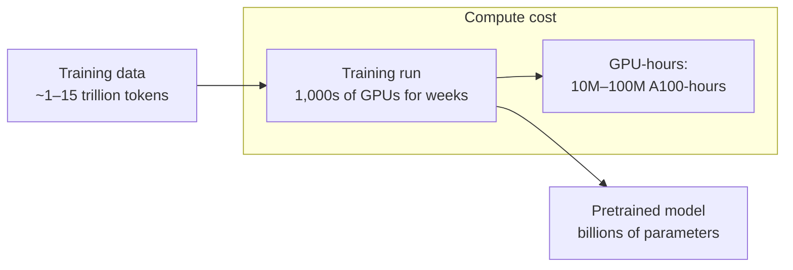

# Pretraining

## The Story 📖

Imagine you could read every book ever written, every article ever published, every forum thread, every piece of code, every Wikipedia page — all before you were asked a single question. You wouldn't be memorizing each text. Instead, patterns would form: how arguments are structured, how code follows logic, how metaphors work, how mathematical reasoning proceeds, what facts about the world tend to be true.

You would emerge with a compressed model of human knowledge and language. Not perfect. Not complete. But extraordinarily broad.

That is pretraining. The model is not taught explicit rules or given labeled answers. It is simply asked, millions of times per second, to predict what word comes next in a text it has never seen. By compressing the statistics of an enormous corpus into billions of parameters, it absorbs the structure of language, reasoning, and world knowledge.

When you ask Claude "What is the capital of France?", it doesn't look anything up. It responds from patterns encoded during pretraining — patterns so strong they can answer obscure questions, write working code, and reason through novel problems.

👉 This is why we need **pretraining** — exposing the model to vast unlabeled text is how it acquires the broad knowledge and reasoning ability that later fine-tuning stages refine.

---

## What is Pretraining? 📚

**Pretraining** is the first — and computationally dominant — phase of LLM development. The model learns from an enormous corpus of text using a single self-supervised objective: **next-token prediction**.

Given a sequence of tokens, predict what comes next. That's it. No human labels. No explicit teaching. Just: here is a trillion-token corpus, minimize the error in predicting each token from its predecessors.

The magic: this simple objective forces the model to learn the structure of language, world facts, common reasoning patterns, and the logic of many domains — all as side effects of getting good at prediction.

---

## The Training Objective — Next-Token Prediction 🎯

The objective is to minimize the **cross-entropy loss** over a corpus:

```
L = -1/N × Σ log P(token_t | token_1, token_2, ..., token_{t-1})
```

Plain English: for every token in the training data, how surprised was the model by what actually came next? Minimize surprise. Averaged over all N tokens in the dataset.

During training:
1. Take a batch of text sequences from the corpus
2. Feed them through the transformer in parallel (teacher forcing)
3. Compute cross-entropy loss between predicted and actual next tokens
4. Backpropagate gradients through all transformer layers
5. Update billions of parameters via AdamW optimizer
6. Repeat for trillions of tokens over weeks or months of compute

---

## Data Curation at Scale 📦

The training corpus for a frontier LLM is not the raw internet. Raw internet data is noisy, redundant, and contains content that degrades model quality. Data curation is a major research area:

### Sources
- Web pages (filtered crawls like Common Crawl — trillions of web pages)
- Books (curated book datasets — high quality prose and reasoning)
- Academic papers (ArXiv, PubMed — scientific and mathematical reasoning)
- Code (GitHub, StackOverflow — programming knowledge)
- Wikipedia (encyclopedic factual knowledge)
- Curated high-quality collections (internal datasets, licensing arrangements)

### Filtering steps (typical pipeline)
1. **Deduplication**: Remove near-duplicate documents — deduped models train more efficiently and generalize better
2. **Quality filtering**: Heuristics to remove spam, auto-generated content, repetitive text
3. **Safety filtering**: Remove clearly harmful content categories
4. **Language identification**: Keep only target languages (or appropriately weight multilingual data)
5. **Data mixing**: Blend sources in carefully tuned proportions — too much low-quality web content degrades the model

The exact data mixture and filtering pipeline are among the most closely guarded secrets of frontier AI labs, including Anthropic.

---

## Compute Scaling 💻

Pretraining large models requires enormous compute:



A frontier model training run consumes:
- 10,000–50,000 A100/H100 GPUs running in parallel
- 6–12 weeks of wall-clock time
- Hundreds of millions to billions of dollars in compute cost
- Megawatts of power

This is why only a handful of organizations can train frontier models. It also makes pretraining fundamentally different from fine-tuning — you cannot casually re-run it.

---

## Emergent Capabilities 🌟

One of the most surprising findings in LLM research is **emergent capabilities** — abilities that appear suddenly at certain scales without being explicitly trained for.

A model trained on 10B parameters might score near-random on multi-step arithmetic. A model trained on 100B parameters might score 80%. The jump appears to be discontinuous with respect to scale — not a smooth curve.

Documented emergent capabilities:
- Multi-step arithmetic and algebra
- Chain-of-thought reasoning (when prompted)
- In-context learning (learning from examples in the prompt)
- Code generation from natural language descriptions
- Translation between language pairs not emphasized in training
- Analogical reasoning

The mechanism is debated. Leading hypothesis: these tasks require multiple simpler sub-skills that each improve gradually with scale; the task appears to emerge when all required sub-skills cross their individual thresholds simultaneously.

---

## Scaling Laws — The Chinchilla Result 📊

**Scaling laws** describe how model performance changes with compute budget. The key insight from research (Kaplan et al., 2020; Hoffmann et al., 2022) is that performance improves predictably with:

```
Performance ≈ f(model_size, training_tokens, compute)
```

The **Chinchilla scaling law** (Hoffmann et al., 2022 — "Training Compute-Optimal Large Language Models") found that for a given compute budget:

- Previous models were undertrained — too many parameters, not enough data
- The optimal ratio is roughly: training tokens ≈ 20 × model parameters
- A 70B parameter model should train on ~1.4 trillion tokens (Llama 2 used this)
- A 500B model should train on ~10 trillion tokens

```
Optimal: N_tokens = 20 × N_parameters
```

This was a surprising finding because it suggested that simply making models bigger wasn't optimal — you needed proportionally more data too. GPT-3 (175B parameters, 300B tokens) was significantly undertrained by this metric.

Implications for engineers:
- "Smaller model trained longer" often outperforms "bigger model trained less"
- This drove the development of efficient models like Llama 2 and Mistral
- Anthropic uses compute-optimal training for the Claude family

---

## Pretraining vs Fine-Tuning — What Each Provides 🔄

| Phase | What it teaches | Duration | Cost |
|-------|----------------|----------|------|
| Pretraining | World knowledge, language structure, broad reasoning | Weeks–months | Very high ($$$) |
| Supervised Fine-tuning (SFT) | How to follow instructions, respond helpfully | Days | High ($$) |
| RLHF | What humans prefer, how to be safe | Days–weeks | High ($$) |
| Constitutional AI | Harmlessness via self-critique | Days | Moderate |

Pretraining is the foundation. Without a well-pretrained model, fine-tuning has little to work with. You cannot teach arithmetic via RLHF to a model that didn't learn it during pretraining.

---

## Where You'll See This in Real AI Systems 🏗️

- **Choosing models**: The pretraining data quality and scale is why Claude can answer questions about specialized domains (law, medicine, code) without explicit training on those tasks
- **Knowledge cutoffs**: Pretraining on a fixed corpus means there's a hard cutoff — always compensate with RAG for recent information
- **In-context learning**: The ability to learn from examples in the prompt is an emergent capability from pretraining at scale
- **Multi-language support**: The proportion of non-English text in pretraining determines multilingual capability — models with 5% Chinese in training perform much better in Chinese

---

## Common Mistakes to Avoid ⚠️

- Confusing pretraining with fine-tuning — fine-tuning is a much smaller, targeted phase layered on top
- Thinking knowledge cutoffs are just a product decision — they're a consequence of fixed training data
- Assuming scaling always helps — Chinchilla showed compute needs to be split optimally between data and parameters
- Ignoring data quality — 1T high-quality tokens outperforms 10T noisy tokens

---

## Connection to Other Concepts 🔗

- Relates to **Transformer Architecture** (Topic 04) — the transformer IS what gets trained during pretraining
- Relates to **RLHF** (Topic 06) — RLHF builds on the pretrained model; without pretraining, RLHF has no foundation
- Relates to **Extended Thinking** (Topic 08) — chain-of-thought ability is an emergent capability from pretraining, activated by prompting and enhanced by fine-tuning
- Relates to **Scaling Laws** in broader ML literature — determines how Anthropic decides what to train

---

✅ **What you just learned:** Pretraining is the process of training a transformer on trillions of tokens of internet-scale data using next-token prediction; it gives Claude broad knowledge and reasoning ability, with capabilities that emerge non-linearly with scale following Chinchilla-optimal ratios.

🔨 **Build this now:** Read the abstract and introduction of "Training Compute-Optimal Large Language Models" (Chinchilla paper, Hoffmann et al. 2022) — it's publicly available. Understand why Llama 2 70B trained on 2T tokens instead of the 300B tokens GPT-3 used.

➡️ **Next step:** RLHF — [06_RLHF/Theory.md](../06_RLHF/Theory.md)

---

## 📂 Navigation

**In this folder:**
| File | |
|---|---|
| 📄 **Theory.md** | ← you are here |
| [📄 Cheatsheet.md](./Cheatsheet.md) | Quick reference |
| [📄 Interview_QA.md](./Interview_QA.md) | Interview prep |

⬅️ **Prev:** [04 Transformer Architecture](../04_Transformer_Architecture/Theory.md) &nbsp;&nbsp;&nbsp; ➡️ **Next:** [06 RLHF](../06_RLHF/Theory.md)
