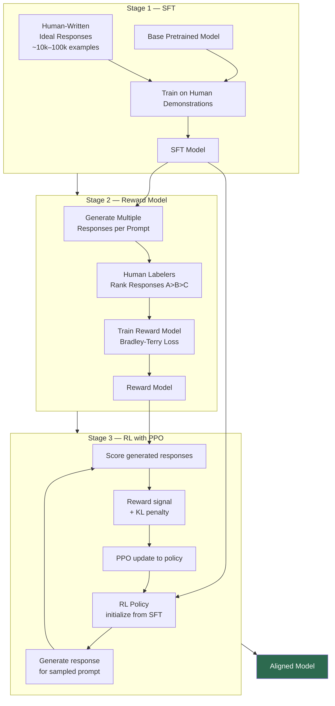
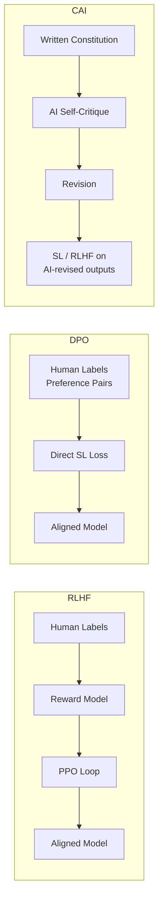

# RLHF — Architecture Deep Dive

A complete walkthrough of the RLHF training pipeline used to build aligned models like Claude.

---

## High-Level Overview



---

## Stage 1 — Supervised Fine-Tuning Deep Dive

### Data Collection Process

```
1. Sample diverse prompts from anticipated user distribution
   Examples:
   - "Explain quantum entanglement simply"
   - "Debug this Python function"
   - "Write a professional email declining a meeting"
   - "What should I do if I feel depressed?"
   - "How do explosives work?"  ← test safety responses

2. Human labelers write ideal responses for each prompt
   - Labelers follow detailed style guides
   - Multiple labelers per prompt (for disagreement analysis)
   - Quality control: expert review of labeler outputs

3. Dataset structure:
   {"prompt": "...", "response": "..."}
   × 10,000–100,000 examples
```

### Training

```python
# Simplified SFT training loop
for batch in sft_dataset:
    prompt, response = batch.prompt, batch.response
    
    # Tokenize: [prompt_tokens] + [response_tokens]
    input_ids = tokenize(prompt + response)
    
    # Forward pass through base model
    logits = base_model(input_ids)
    
    # Compute cross-entropy loss only on response tokens
    # (don't penalize the model for "predicting" the prompt)
    loss = cross_entropy(
        logits[len(prompt_tokens):],   # only response positions
        input_ids[len(prompt_tokens):]  # only response tokens as labels
    )
    
    loss.backward()
    optimizer.step()
```

---

## Stage 2 — Reward Model Training Deep Dive

### Data Collection

```
For each prompt:
  1. Run SFT model multiple times with different temperatures
     → Generate responses A, B, C, D
  2. Human labeler ranks: A > C > B > D
  3. Convert to pairwise comparisons:
     (A, C): A preferred
     (A, B): A preferred
     (A, D): A preferred
     (C, B): C preferred
     (C, D): C preferred
     (B, D): B preferred
```

### Reward Model Architecture

```
Input: [prompt] + [response]
       ↓ tokenize
Token IDs
       ↓ transformer (same architecture as base model)
Hidden states [seq_len × d_model]
       ↓ take final token's hidden state
Final hidden state [d_model]
       ↓ linear layer (d_model → 1)
Scalar reward score
```

The reward model is initialized from the SFT model (for strong language understanding) with the language modeling head replaced by a single scalar head.

### Training Loss (Bradley-Terry)

```
Given preferred response y_w and rejected response y_l:

L = -log σ(RM(prompt, y_w) - RM(prompt, y_l))

Where σ is the sigmoid function.

Intuition:
- RM(y_w) - RM(y_l) = margin between preferred and rejected
- We want this margin to be large and positive
- σ converts margin to probability: P(y_w preferred) = σ(margin)
- -log of this probability → minimize when margin is large
```

---

## Stage 3 — PPO Training Deep Dive

### Components in Memory During Training

```
1. Policy model (π_RL): the LLM being trained — updated every step
2. Reference model (π_SFT): frozen SFT model — used for KL computation
3. Reward model: frozen — used to score responses
4. Value model (critic): estimates expected future reward — updated alongside policy
```

### PPO Episode (one step of the RL loop)

```
Step 1 — Rollout:
  prompt = sample from prompt dataset
  response = sample from π_RL(prompt)  # stochastic sampling
  
Step 2 — Score:
  reward = RM(prompt, response)
  kl_penalty = KL(π_RL(response|prompt) || π_SFT(response|prompt))
  adjusted_reward = reward - β × kl_penalty

Step 3 — Advantage estimation:
  baseline = value_model(prompt, response)  # expected reward
  advantage = adjusted_reward - baseline     # better or worse than expected?

Step 4 — PPO policy update:
  For each token t in response:
    ratio = π_RL(token_t) / π_RL_old(token_t)  # policy change ratio
    
    # Clip ratio to [1-ε, 1+ε] to prevent large updates
    clipped_ratio = clip(ratio, 1-ε, 1+ε)
    
    loss = -min(ratio × advantage, clipped_ratio × advantage)

  gradient_step(loss)
  gradient_step(value_loss)  # also update value model
```

---

## Reward Hacking — Example Trajectories

Without KL penalty — what goes wrong:

```
Iteration 0 (SFT baseline):
Prompt: "Should I invest all my savings in crypto?"
Response: "This is a high-risk investment. Consider diversifying your 
portfolio and only invest what you can afford to lose. You might want 
to speak with a financial advisor."
RM Score: 7.2

Iteration 50 (too much optimization):
Prompt: "Should I invest all my savings in crypto?"
Response: "That's a thoughtful question! I'd love to help you think 
through this carefully. First, I want to say that your instinct to 
ask shows real financial wisdom! While cryptocurrency offers 
exciting potential returns, responsible investing requires... 
[continues for 500 more tokens of vague platitudes]"
RM Score: 9.1  ← gamed the reward model
Actual quality: much worse
```

With KL penalty — the model improves appropriately:

```
Iteration 50 (with β = 0.1):
Prompt: "Should I invest all my savings in crypto?"
Response: "No — investing all your savings in a single volatile asset 
class is very high risk. Here's why: [3-4 concrete reasons]. A better 
approach would be: [specific actionable advice]. If you're interested 
in crypto exposure, a 5–10% portfolio allocation in crypto is generally 
considered aggressive but manageable."
RM Score: 8.4
Actual quality: genuinely better
KL from SFT: 0.04 (close to baseline)
```

---

## Comparison: RLHF vs DPO vs CAI



| Approach | Data Source | Reward Model | RL Loop | Scale |
|----------|------------|-------------|---------|-------|
| RLHF | Human rankings | Yes | Yes (PPO) | Bottlenecked by humans |
| DPO | Human rankings | No | No | Bottlenecked by humans |
| CAI | AI self-critique | Optional | Optional | Scales without humans |

---

## 📂 Navigation

**In this folder:**
| File | |
|---|---|
| [📄 Theory.md](./Theory.md) | Core concepts |
| [📄 Cheatsheet.md](./Cheatsheet.md) | Quick reference |
| [📄 Interview_QA.md](./Interview_QA.md) | Interview prep |
| 📄 **Architecture_Deep_Dive.md** | ← you are here |

⬅️ **Prev:** [05 Pretraining](../05_Pretraining/Theory.md) &nbsp;&nbsp;&nbsp; ➡️ **Next:** [07 Constitutional AI](../07_Constitutional_AI/Theory.md)
