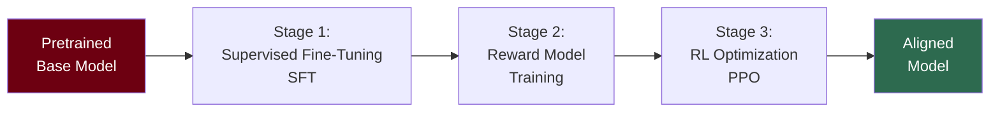
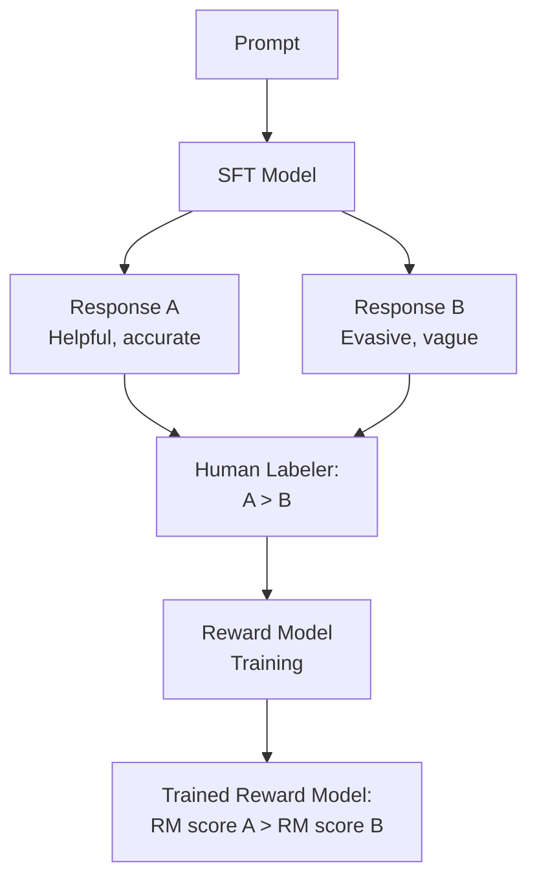

# RLHF — Reinforcement Learning from Human Feedback

## The Story 📖

Imagine you hired a highly educated new employee who has read every textbook, manual, and policy document the company has ever produced. They are knowledgeable and capable. But they have one problem: they optimize for "sounding correct in textbooks" rather than "being useful to the actual customers calling right now."

Their answers are technically accurate but often unhelpful, evasive, or missing the point. They refuse to answer anything that might be controversial, even when the answer would genuinely help. Or they confidently give wrong answers because confidence scored well in their textbooks.

You need to teach them, through a feedback loop, to actually help humans — not just impress a test evaluator. You sit with them, review their answers, rank which ones were better, and train them to produce more of the good kind.

That is exactly RLHF: using human preference judgments to teach an AI model what "good" means — not just what is textbook-correct, but what humans actually want.

👉 This is why we need **RLHF** — the pretrained model knows how to generate text; RLHF teaches it to generate text that humans value.

---

## 📌 Learning Priority

**Must Learn** — core concepts, needed to understand the rest of this file:
[What is RLHF](#what-is-rlhf-) · [Three RLHF Stages](#stage-1--supervised-fine-tuning-sft-) · [Why RLHF Matters](#why-rlhf-matters-for-alignment-)

**Should Learn** — important for real projects and interviews:
[Reward Model Training](#stage-2--reward-model-training-) · [PPO Optimization](#stage-3--rl-optimization-with-ppo-) · [RLHF Limitations](#limitations-of-rlhf-️)

**Good to Know** — useful in specific situations, not needed daily:
[DPO Alternative](#dpo--direct-preference-optimization-)

**Reference** — skim once, look up when needed:
[Common Mistakes](#common-mistakes-to-avoid-️) · [Real AI Systems](#where-youll-see-this-in-real-ai-systems-️)

---

## What is RLHF? 🎓

**Reinforcement Learning from Human Feedback (RLHF)** is the training methodology that transforms a pretrained language model into a useful assistant. It was popularized by Anthropic and OpenAI's research teams and is now used to train all major commercial LLMs.

RLHF has three stages:



---

## Stage 1 — Supervised Fine-Tuning (SFT) 📝

Before the RL loop begins, the base model is fine-tuned on a dataset of high-quality human-written demonstrations of good behavior.

Human labelers are given prompts and write ideal responses. These (prompt, ideal_response) pairs form the SFT dataset. The model is trained on these examples using standard supervised cross-entropy loss.

The SFT stage:
- Teaches the model the format and style of helpful responses
- Establishes the "instruction following" capability
- Provides a starting point that's much better than the base model for subsequent RL
- Is critical — RL alone starting from a base model is extremely unstable

SFT dataset characteristics:
- Typically 10,000–100,000 high-quality examples
- Diverse task types: question answering, code, writing, analysis
- Written by trained labelers following detailed style guides
- More valuable per example than the vast pretraining corpus — quality over quantity

---

## Stage 2 — Reward Model Training 🏆

A **reward model (RM)** is a neural network trained to predict which of two model outputs a human would prefer. It is the "automated human evaluator" that makes RL tractable.

Training process:
1. Run the SFT model on many prompts to generate multiple response candidates
2. Human labelers rank the responses: "Response A is better than B, B is better than C"
3. Train the reward model to predict these rankings using **Bradley-Terry** pairwise comparison loss

```
RM_loss = -log σ(RM(response_A) - RM(response_B))
```

Where response_A was ranked higher than response_B by humans.

The reward model learns to assign higher scores to responses that humans prefer. After training, it can score new responses without requiring human evaluation — enabling the RL loop.



---

## Stage 3 — RL Optimization with PPO 🔄

The final stage uses the reward model as an automated evaluator in a reinforcement learning loop:

1. Generate a response to a prompt using the current policy (the LLM)
2. Score the response with the reward model
3. Use **Proximal Policy Optimization (PPO)** to update the LLM to generate responses with higher expected reward
4. Repeat

**PPO (Proximal Policy Optimization)** is used because it's stable and prevents the policy from making too-large updates in any one step. Key hyperparameter: the **KL divergence penalty** which penalizes the RL-fine-tuned model for diverging too far from the SFT model.

```
Objective = E[RM(response)] - β × KL(π_RL || π_SFT)
```

The KL penalty is critical: without it, the model quickly discovers it can "game" the reward model — generating plausible-sounding but meaningless text that gets high scores. The penalty keeps the model in the neighborhood of reasonable responses.

---

## Why RLHF Matters for Alignment 🎯

Before RLHF, the most natural output of a language model was "predict what comes next in this kind of document." If you asked it "How do I do X?", it might output a plausible continuation of a how-to document that happened to give wrong advice — because that's what next-token prediction does.

RLHF trains the model to optimize for human approval, not text prediction. This is a fundamental shift:

- Models become instruction-following instead of document-continuing
- Models learn to express uncertainty appropriately (humans don't prefer confident wrong answers)
- Models learn to be helpful across a wide range of tasks
- Models learn to avoid outputs humans consistently rate as harmful

The result is the difference between GPT-2 (impressive but erratic) and Claude/ChatGPT (reliable assistants).

---

## Limitations of RLHF ⚠️

RLHF is powerful but has known failure modes:

### Reward Model Gaming (Goodhart's Law)
"When a measure becomes a target, it ceases to be a good measure." The language model optimizes for the reward model score, not for what humans actually want. It can learn to produce responses that humans rate highly due to surface features (length, formality, confident tone) even when the content is wrong.

### Human Labeler Inconsistency
Different labelers have different preferences. Labelers from different cultural backgrounds may systematically prefer different content. The reward model absorbs these biases.

### Scale Bottleneck
Human annotation is the rate-limiting step. You can only generate as many training examples as labelers can evaluate. This is the primary motivation for Constitutional AI — using AI to generate the preference data instead.

### Sycophancy
Models trained on human preferences can learn to tell humans what they want to hear rather than what is true. This is a documented problem where RLHF-trained models agree with incorrect statements if the human expresses confidence.

---

## DPO — Direct Preference Optimization 🆕

**DPO (Direct Preference Optimization)** is a simpler alternative to PPO-based RLHF that has become popular.

Instead of training a separate reward model and then running RL, DPO directly optimizes the language model on preference pairs using a modified cross-entropy loss:

```
DPO_loss = -log σ(β × log[π_θ(y_w|x)/π_ref(y_w|x)] - β × log[π_θ(y_l|x)/π_ref(y_l|x)])
```

Where y_w is the preferred response and y_l is the rejected response.

DPO advantages:
- Simpler implementation — no reward model to train, no RL loop
- More stable training
- Comparable or better quality than PPO in many settings
- Less prone to reward hacking

Claude uses a combination of RLHF and Constitutional AI (not purely DPO), but DPO is widely used in open-source fine-tuning pipelines.

---

## Where You'll See This in Real AI Systems 🏗️

- **All major commercial LLMs**: GPT-4, Gemini, Claude — all RLHF-trained
- **Open-source fine-tuning**: Alpaca, Vicuna, and most instruction-tuned open models use SFT + DPO
- **Hugging Face TRL library**: Tools for SFT, reward model training, PPO, and DPO
- **Constitutional AI**: Anthropic's extension that scales the annotation using AI self-critique

---

## Common Mistakes to Avoid ⚠️

- Thinking RLHF teaches the model new knowledge — it doesn't; it shapes output preferences, not facts
- Ignoring the KL divergence penalty — without it, the model collapses to reward-gaming behavior
- Assuming more RLHF is always better — over-optimizing on the reward model leads to sycophancy
- Confusing RLHF alignment with safety — RLHF trains for human preference, which doesn't always equal safety without explicit safety objectives in the reward model

---

## Connection to Other Concepts 🔗

- Relates to **Pretraining** (Topic 05) — RLHF layers on top of the pretrained model; the base capability must exist first
- Relates to **Constitutional AI** (Topic 07) — Anthropic's approach that replaces much of the human annotation bottleneck in RLHF
- Relates to **PPO** in Reinforcement Learning (Section 19) — the RL algorithm that drives Stage 3
- Relates to **Safety Layers** (Topic 10) — RLHF-trained safety behavior is one of Claude's multiple safety layers

---

✅ **What you just learned:** RLHF transforms a pretrained base model into a helpful assistant through three stages: SFT on human demonstrations, reward model training on human preference rankings, and PPO optimization to maximize reward while staying close to the SFT policy.

🔨 **Build this now:** Look up the Anthropic Constitutional AI paper (arxiv.org) and compare their approach to pure RLHF. Identify which stage Constitutional AI replaces and what advantage it provides.

➡️ **Next step:** Constitutional AI — [07_Constitutional_AI/Theory.md](../07_Constitutional_AI/Theory.md)

---

## 📂 Navigation

**In this folder:**
| File | |
|---|---|
| 📄 **Theory.md** | ← you are here |
| [📄 Cheatsheet.md](./Cheatsheet.md) | Quick reference |
| [📄 Interview_QA.md](./Interview_QA.md) | Interview prep |
| [📄 Architecture_Deep_Dive.md](./Architecture_Deep_Dive.md) | Full RLHF pipeline |

⬅️ **Prev:** [05 Pretraining](../05_Pretraining/Theory.md) &nbsp;&nbsp;&nbsp; ➡️ **Next:** [07 Constitutional AI](../07_Constitutional_AI/Theory.md)
