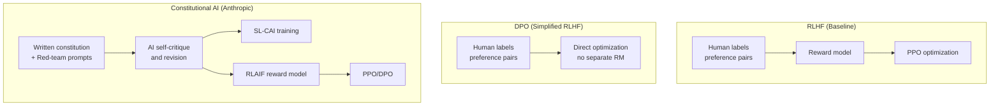

# Constitutional AI — Comparison

A comparison of CAI against RLHF, DPO, and other alignment approaches.

---

## Overview



---

## Head-to-Head Comparison

| Dimension | RLHF | DPO | Constitutional AI |
|-----------|------|-----|------------------|
| Feedback source | Humans | Humans | AI (CAI) + Humans (helpfulness) |
| Requires reward model | Yes | No | Yes (but trained on AI feedback) |
| Requires RL loop | Yes (PPO) | No | Optional (PPO or DPO) |
| Annotation cost | High ($$$) | High ($$$) | Low for harmlessness ($) |
| Throughput | ~1k labels/day | ~1k labels/day | ~1M labels/day |
| Consistency | Variable | Variable | High |
| Transparency | Implicit | Implicit | Explicit (readable constitution) |
| Auditability | Low | Low | High |
| Scalability | Bounded by humans | Bounded by humans | Bounded by compute |
| Human judgment retained | Full | Full | Helpfulness, quality |
| Used by | Most labs | Open-source | Anthropic |

---

## Scenario Analysis

### Scenario 1: Training at massive scale

**RLHF**: 10M preference pairs = ~$5M–$50M in human annotation. Bottleneck is labeler availability.

**CAI**: 10M preference pairs = ~$10,000–$100,000 in API costs. Can be generated in days.

**Winner**: CAI — dramatically more scalable

---

### Scenario 2: Capturing nuanced helpfulness preferences

**RLHF**: Human labelers capture subtle preferences about tone, depth, format, cultural context.

**CAI**: AI critique is limited to what the constitution covers and what the model can assess.

**Winner**: RLHF — humans capture more nuanced quality signals

---

### Scenario 3: Consistent harmlessness training

**RLHF**: Inter-labeler agreement on edge cases is ~60–70%. Inconsistent signals degrade the reward model.

**CAI**: The same principle is applied the same way every time. Consistency is near-perfect.

**Winner**: CAI — much more consistent for safety-specific training

---

### Scenario 4: Rapid iteration on safety behavior

**RLHF**: Changing safety behavior requires re-collecting human labels (weeks).

**CAI**: Add a new principle to the constitution, re-generate CAI data, retrain. Can be done in hours to days.

**Winner**: CAI — much faster iteration cycle

---

### Scenario 5: Transparency to external stakeholders

**RLHF**: "Our model was trained on human preferences" — black box.

**CAI**: "Here is our constitution — these are the specific principles we used."

**Winner**: CAI — explicit, auditable, debatable

---

## How Anthropic Combines Them

Anthropic's training pipeline doesn't choose one approach — it uses a hierarchy:

```
Phase 1 — Pretraining: Capability acquisition on large corpus

Phase 2 — SFT: Train on human demonstrations of good responses

Phase 3 — CAI (SL-CAI): 
  Apply self-critique to adversarial prompts → supervised training on revisions
  Primary purpose: harmlessness

Phase 4 — RLHF + CAI (RLAIF):
  Reward model trained on mix of:
    - Human preferences (helpfulness, quality)
    - AI preferences (harmlessness, per constitution)
  PPO/DPO optimization

Phase 5 — Ongoing:
  Red-teaming → new CAI training data → updated model
```

The combination leverages the strengths of each approach:
- Human feedback provides the nuanced quality and helpfulness signal
- CAI provides scale and consistency for harmlessness
- The written constitution makes the system auditable

---

## Why Not Use CAI for Everything?

CAI would seem ideal — why not replace all human feedback?

1. **Circular reasoning risk**: AI evaluating AI using AI-generated principles. Without human feedback grounding some of the training, values could drift in systematic ways unnoticed.

2. **Helpfulness is harder to specify**: What makes an answer helpful is subtle, contextual, and user-specific. A constitution can say "be helpful" but the model evaluating against that principle may have a different notion of "helpful" than the target user.

3. **Quality ceiling**: CAI feedback is only as good as the model's evaluation capabilities. A weak evaluator generates noisy training signal. Human judgment often catches things the model misses.

4. **Novel failure modes**: CAI trains the model to satisfy the constitution. New jailbreaks or harm vectors not covered by the constitution slip through — humans are needed to discover and add these.

The consensus in the field: CAI is excellent for harmlessness at scale, but human feedback remains important for overall quality and helpfulness.

---

## 📂 Navigation

**In this folder:**
| File | |
|---|---|
| [📄 Theory.md](./Theory.md) | Core concepts |
| [📄 Cheatsheet.md](./Cheatsheet.md) | Quick reference |
| [📄 Interview_QA.md](./Interview_QA.md) | Interview prep |
| 📄 **Comparison.md** | ← you are here |

⬅️ **Prev:** [06 RLHF](../06_RLHF/Theory.md) &nbsp;&nbsp;&nbsp; ➡️ **Next:** [08 Extended Thinking](../08_Extended_Thinking/Theory.md)
