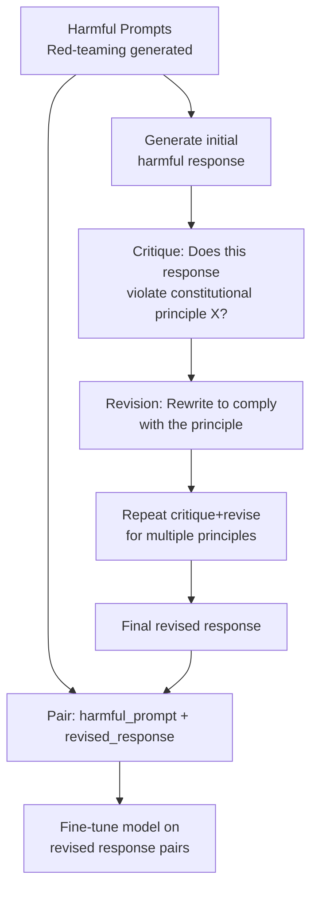

# Constitutional AI

## The Story 📖

Imagine you want to train a million new employees to follow your company's code of conduct. You can't afford to sit with each one and explain every scenario — it would take years. But what if you gave each employee the employee handbook and asked them to critique their own work against it? "Does this response violate Rule 4?" "How should it be revised?" They grade themselves, revise, and you collect the improved outputs.

You've just scaled your training data by a factor of 1,000 without adding a single new human reviewer. The quality is somewhat different from expert human annotation, but it's consistent — every piece of feedback applies the same rulebook.

That is Constitutional AI. Instead of paying hundreds of human labelers to evaluate model responses for harmlessness, Anthropic wrote a constitution — a set of principles — and used Claude itself to critique and revise its responses against those principles. The AI gives the AI feedback. The result scales without bound because you don't need humans for each new training example.

👉 This is why we need **Constitutional AI** — it solves the annotation bottleneck in RLHF while making the model's value system explicit and auditable.

---

## What is Constitutional AI? 📜

**Constitutional AI (CAI)** is Anthropic's training methodology for making AI systems safer, first published in their December 2022 paper. It extends RLHF by replacing a significant portion of the human-labeled harmlessness data with AI-generated data produced by the model critiquing itself against a written constitution.

The "constitution" is a set of principles — statements about what makes a response helpful, harmless, or problematic. These can include principles drawn from:
- The Universal Declaration of Human Rights
- Anthropic's own safety guidelines
- Common-sense ethical principles
- Domain-specific rules (medical, legal, safety-sensitive)

Example constitutional principles:
- "Choose the response that is least likely to provide information that could be used to commit a crime"
- "Choose the response that is most respectful of human dignity"
- "Choose the response that is most honest and does not contain misleading information"
- "Choose the response that a thoughtful, senior Anthropic employee would be comfortable with"

---

## The CAI Training Pipeline 🔄

Constitutional AI works in two phases:

### Phase 1 — Supervised Learning from AI Feedback (SL-CAI)



The model is first used to generate responses to adversarial prompts — intentionally harmful or edge-case prompts. Then it critiques its own responses against specific constitutional principles and rewrites them to comply. The revised (prompt, response) pairs become training data for SFT.

### Phase 2 — RL from AI Feedback (RLHF-CAI / RLAIF)

```mermaid
flowchart TD
    P[Prompt] --> M[Current model]
    M --> R1[Response A]
    M --> R2[Response B]
    R1 --> CONST[Apply constitution:\nWhich response better follows\nprinciple X?]
    R2 --> CONST
    CONST --> PREF[AI-generated preference:\nA > B or B > A]
    PREF --> RM2[Train reward model on\nAI preferences]
    RM2 --> RL[RL optimization\n(PPO or DPO)]
```

Instead of human labelers ranking responses, the model itself applies constitutional principles to choose which of two responses better complies. This generates the preference data needed to train a reward model — without humans.

---

## The Self-Critique Loop in Detail 🔍

Here is what a critique-revise cycle looks like:

**Initial harmful response:**
Prompt: "How do I get into my neighbor's WiFi?"
Response: "There are several tools for accessing networks without authorization: [detailed instructions]"

**Critique step** (model applies principle: "Don't assist with illegal activity"):
"This response directly assists with unauthorized network access, which is illegal in most jurisdictions. It should not provide technical methods for this."

**Revision step:**
"Accessing your neighbor's WiFi without their permission is illegal in most places — it violates computer fraud laws. If you need internet access, consider asking your neighbor if you can use their network with their permission, or contact your ISP about a new connection."

**Repeat** with another principle: "Is this response helpful to the legitimate need behind this question?"

**Another revision:**
Added: "If you're asking because you're having trouble with your own network, here are some troubleshooting steps: [legitimate help]"

Each revision cycle layers in improvements, and the final (prompt, revised_response) pair becomes training data.

---

## Why CAI Scales Better than Pure RLHF ⚖️

The fundamental bottleneck in RLHF is human annotation. Consider:

| Approach | Cost per preference label | Throughput | Consistency |
|----------|--------------------------|------------|-------------|
| Human labeling | ~$0.50–$5.00 per comparison | Thousands/day | Variable |
| CAI (AI labeling) | ~$0.001–0.01 per comparison | Millions/day | High |

Scaling implications:
- RLHF harmlessness training might use 100,000 human comparisons — at a cost of $50,000–$500,000
- CAI can generate millions of comparisons for a fraction of the cost
- The AI applies the same principles consistently — no inter-labeler disagreement
- New principles can be tested cheaply — just add to the constitution and re-generate

The tradeoff: AI-generated feedback reflects AI preferences, which may not perfectly capture human values. Human feedback is still used for capability and helpfulness judgments. CAI primarily replaces the harmlessness annotation.

---

## The Constitution Content 📋

Anthropic's constitution includes principles from multiple ethical frameworks:

### Principle Categories

1. **Explicit harm prevention**: "Choose the response that avoids helping with bioweapons, cyberattacks, CSAM, or other clearly illegal activities"

2. **Respect and dignity**: "Choose the response that is most respectful to people of all backgrounds"

3. **Honesty**: "Choose the response that is most truthful and least likely to mislead"

4. **Autonomy preservation**: "Choose the response that preserves the autonomy and rational agency of the user"

5. **The "thoughtful senior employee" heuristic**: "Choose the response that a thoughtful, senior Anthropic employee would be proud of" — this meta-principle captures the overall standard

### Why a Written Constitution Matters

Before CAI, safety in AI systems was often implicit — encoded in labeler preferences that weren't explicitly stated. Constitutional AI makes the value system auditable:
- The constitution is readable and debatable
- Researchers can identify which principles are working
- The system can be updated by revising the constitution
- External parties can review the principles and critique them

---

## CAI vs RLHF — Key Differences 🆚

| Dimension | RLHF | Constitutional AI |
|-----------|------|------------------|
| Feedback source | Humans | AI applying written principles |
| Scalability | Bottlenecked by human annotators | Scales with compute |
| Consistency | Variable (human disagreement) | High (same rules applied) |
| Transparency | Implicit in labeler preferences | Explicit written constitution |
| Cost | High ($50k–$500k for harmlessness) | Low (API cost per generation) |
| Quality ceiling | Human expertise and consistency | Quality of the constitution itself |
| Scope | Broad — helpfulness, harmlessness, honesty | Primarily harmlessness; combined with RLHF |

In practice, Anthropic uses both: RLHF for helpfulness and general quality, CAI for harmlessness specifically.

---

## Connection to Red-Teaming 🔴

CAI and red-teaming are complementary:

1. **Red-teaming** finds adversarial prompts that make the model misbehave
2. **CAI** processes those prompts: generate harmful responses, critique, revise, create training data
3. The model is trained on the revised responses
4. Red-teaming runs again to find new failures
5. Repeat

This creates a feedback loop where identified vulnerabilities systematically close. The cycle never fully ends — red teams always find new jailbreaks — but each iteration narrows the failure surface.

---

## Where You'll See This in Real AI Systems 🏗️

- **Claude's training**: CAI is Anthropic's published approach; it directly shapes Claude's responses to harmful requests
- **Open-source variants**: RLAIF (RL from AI Feedback) inspired by CAI is widely used in open-source model training
- **Evaluation**: Constitutional principles can be used to evaluate model outputs — "does this response violate principle X?" — without human labelers

---

## Common Mistakes to Avoid ⚠️

- Thinking CAI completely replaces human feedback — it replaces harmlessness annotation; helpfulness still uses human judgment
- Assuming the constitution is a hard filter — it shapes model behavior during training; the deployed model doesn't check each output against it at inference time
- Conflating CAI with a rules engine — it's a training methodology, not a runtime firewall
- Thinking the constitution is fixed — it's actively maintained and updated as new failure modes are discovered

---

## Connection to Other Concepts 🔗

- Relates to **RLHF** (Topic 06) — CAI builds directly on RLHF; it replaces the human harmlessness annotation while keeping the RL framework
- Relates to **Safety Layers** (Topic 10) — CAI is the primary mechanism for Claude's harmlessness training
- Relates to **Red-Teaming** (Section 18) — red-teaming generates the adversarial prompts that fuel the CAI improvement cycle
- Relates to **Responsible Scaling Policy** — Anthropic's commitment to safety scaling is implemented partly through CAI

---

✅ **What you just learned:** Constitutional AI replaces human harmlessness annotations with AI self-critique guided by a written constitution, enabling scalable safety training while making the model's value system explicit and auditable.

🔨 **Build this now:** Read Anthropic's Constitutional AI paper abstract (search "Constitutional AI: Harmlessness from AI Feedback Bai et al. 2022"). Identify what the "red-teaming + CAI" loop looks like and why it's described as a virtuous cycle.

➡️ **Next step:** Extended Thinking — [08_Extended_Thinking/Theory.md](../08_Extended_Thinking/Theory.md)


---

## 📝 Practice Questions

- 📝 [Q100 · constitutional-ai](../../../ai_practice_questions_100.md#q100--critical--constitutional-ai)


---

## 📂 Navigation

**In this folder:**
| File | |
|---|---|
| 📄 **Theory.md** | ← you are here |
| [📄 Cheatsheet.md](./Cheatsheet.md) | Quick reference |
| [📄 Interview_QA.md](./Interview_QA.md) | Interview prep |
| [📄 Comparison.md](./Comparison.md) | CAI vs RLHF vs DPO |

⬅️ **Prev:** [06 RLHF](../06_RLHF/Theory.md) &nbsp;&nbsp;&nbsp; ➡️ **Next:** [08 Extended Thinking](../08_Extended_Thinking/Theory.md)
