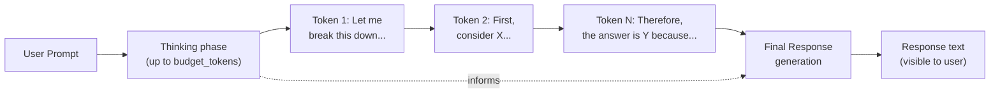
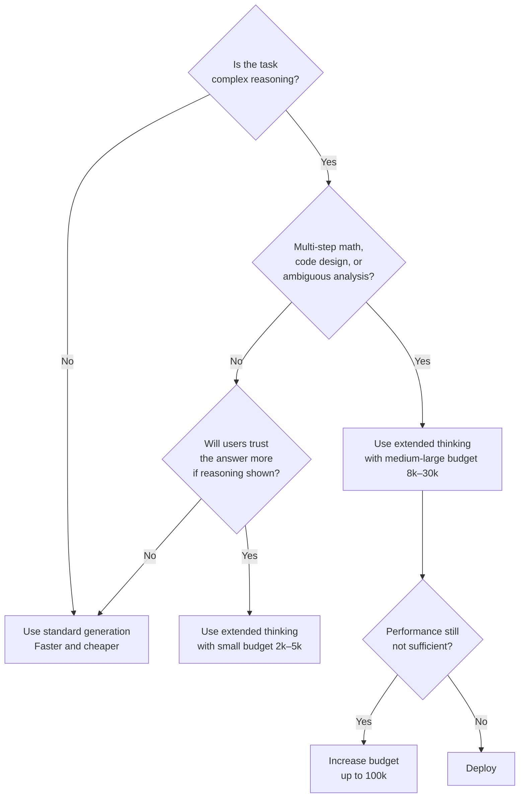

# Extended Thinking

## The Story 📖

Imagine two versions of a doctor reviewing a complex case. The first doctor glances at the chart and immediately says "Take this medication." Fast, confident, sometimes right. The second doctor says "Let me think through this..." — they write notes, cross-reference the symptoms, consider drug interactions, rule out differential diagnoses, and after ten minutes of working through it, give their recommendation with reasoning you can audit.

The second doctor is slower and more expensive, but for complex cases, they're dramatically more reliable. And crucially, you can see their work — you can spot where their reasoning went wrong before accepting their conclusion.

Claude's **extended thinking** is the second doctor. Instead of immediately generating a response, Claude works through a problem in "thinking tokens" — a scratchpad where it can reason step by step, try approaches, backtrack, and reconsider — before producing its final answer.

👉 This is why we need **extended thinking** — for complex problems that require multi-step reasoning, a scratchpad changes the answer quality, and the thinking trace makes the reasoning auditable.

---

## What is Extended Thinking? 🧠

**Extended thinking** is a Claude feature that allows the model to perform chain-of-thought reasoning in a dedicated thinking space before generating its final response. The thinking tokens are generated with the same autoregressive process as normal tokens, but they are treated differently — they represent internal deliberation rather than output content.

Extended thinking is available in specific Claude models:
- `claude-3-7-sonnet-20250219` was the first Claude model with native extended thinking support
- Later models in the Claude 4 family also support extended thinking

When extended thinking is enabled, the response includes two components:
1. A `thinking` block — the model's reasoning scratchpad (can be shown or hidden to users)
2. A `text` block — the final response informed by the thinking

---

## Why Extended Thinking Improves Complex Reasoning 📈

Standard LLM generation is greedy from left to right — the model commits to each token and cannot revisit. This works well for:
- Simple factual recall
- Short explanations
- Direct question-answering

It struggles with:
- Multi-step mathematical proofs
- Complex coding problems requiring design decisions
- Ambiguous situations requiring weighing multiple considerations
- Long-horizon planning tasks

Extended thinking addresses this by providing a space where the model can:
- Try an approach and recognize it doesn't work
- Explicitly reconsider intermediate conclusions
- Work through multiple sub-problems before synthesizing
- Surface uncertainty before committing to an answer

Research shows significant improvements on hard benchmarks (MATH, GSM8K, coding competitions, AIME) when extended thinking is enabled.

---

## The Thinking Budget 💰

Thinking tokens are controlled by a `budget_tokens` parameter that sets the maximum number of tokens the model can use for thinking before generating the response.

```python
response = client.messages.create(
    model="claude-3-7-sonnet-20250219",
    max_tokens=16000,
    thinking={
        "type": "enabled",
        "budget_tokens": 10000  # allow up to 10k thinking tokens
    },
    messages=[{"role": "user", "content": "Solve this problem..."}]
)
```

Key properties of the budget:
- Minimum budget: 1,024 tokens (below this, thinking doesn't meaningfully improve answers)
- Maximum budget: up to 100,000 tokens for very complex problems
- The model may use fewer tokens than the budget if it reaches a conclusion earlier
- Thinking tokens count against the total `max_tokens` — set `max_tokens` to cover both thinking and response
- Thinking tokens are billed at the same rate as output tokens

Budget recommendations by task complexity:

| Task | Suggested Budget |
|------|-----------------|
| Simple reasoning | 1,000–2,000 tokens |
| Moderate complexity | 3,000–8,000 tokens |
| Hard math or coding | 10,000–20,000 tokens |
| Research-level problems | 30,000–100,000 tokens |

---

## How Thinking Tokens Work Internally ⚙️

Thinking tokens are generated using the same transformer forward pass as regular tokens. Architecturally, they are not fundamentally different — they are just tokens. What makes them special is how they are:

1. **Conditioned differently**: The model knows it is in "thinking mode" — trained to reason in this space, not to produce final output
2. **Not shown by default**: The API response includes thinking blocks separately from text blocks
3. **Inform the final response**: After thinking completes, the model generates the final response conditioned on everything — including all the thinking tokens

The thinking process can include:
- Self-questioning: "Wait, did I account for the constraint that X must be positive?"
- Plan changes: "This approach doesn't work because... let me try a different decomposition"
- Explicit uncertainty: "I'm not certain about this step — let me verify"



---

## Streaming Thinking Tokens 🌊

When using streaming with extended thinking, events are emitted for both thinking and text blocks:

```python
with client.messages.stream(
    model="claude-3-7-sonnet-20250219",
    max_tokens=16000,
    thinking={"type": "enabled", "budget_tokens": 8000},
    messages=[{"role": "user", "content": "..."}]
) as stream:
    for event in stream:
        if hasattr(event, 'type'):
            if event.type == 'content_block_start':
                if event.content_block.type == 'thinking':
                    print("--- THINKING ---")
                elif event.content_block.type == 'text':
                    print("\n--- RESPONSE ---")
            elif event.type == 'content_block_delta':
                if hasattr(event.delta, 'thinking'):
                    print(event.delta.thinking, end='', flush=True)
                elif hasattr(event.delta, 'text'):
                    print(event.delta.text, end='', flush=True)
```

---

## When to Use Extended Thinking — Decision Guide 🎯



### Use Extended Thinking when:
- Solving math problems (especially multi-step algebra, calculus, combinatorics)
- Complex code generation where design decisions matter
- Logical reasoning with many constraints
- Medical or scientific analysis requiring differential consideration
- Situations where you want the reasoning to be auditable
- Tasks where showing your work increases user trust

### Do NOT use Extended Thinking when:
- Simple factual questions ("What year was the Eiffel Tower built?")
- Creative writing (thinking doesn't improve quality; slows response)
- High-frequency, latency-sensitive endpoints (thinking adds seconds)
- Cost is a primary concern (thinking tokens are expensive at scale)

---

## Cost Implications 💸

Extended thinking has material cost implications:

```
Cost = (system_prompt + user_message tokens) × input_rate
     + (thinking_tokens + response_tokens) × output_rate

Example (Sonnet pricing, 10k thinking + 500 response tokens):
  Input: 1,000 tokens × $3/M = $0.003
  Output: 10,500 tokens × $15/M = $0.1575
  Total: ~$0.16 per call

Same prompt without thinking:
  Input: 1,000 tokens × $3/M = $0.003
  Output: 500 tokens × $15/M = $0.0075
  Total: ~$0.01 per call

Extended thinking is ~16x more expensive for this example.
```

For applications where you call Claude thousands of times per day, this cost difference is significant. Reserve extended thinking for genuinely hard problems where quality matters more than cost.

---

## Where You'll See This in Real AI Systems 🏗️

- **Mathematical reasoning**: Solving hard math competition problems where step-by-step reasoning is essential
- **Code architecture**: Designing complex systems where multiple trade-offs must be considered
- **Medical/legal analysis**: High-stakes decisions where showing reasoning builds trust and enables auditing
- **Multi-constraint optimization**: Problems with many interacting constraints that need explicit tracking
- **Research assistant**: Breaking down complex multi-step research questions

---

## Common Mistakes to Avoid ⚠️

- Setting `max_tokens` too small — thinking tokens count against max_tokens; set it to `budget_tokens + expected_response_tokens`
- Using extended thinking for simple questions — it adds cost and latency with no benefit
- Ignoring the budget_tokens minimum — budgets below 1,024 tokens often don't engage thinking meaningfully
- Expecting thinking to always use the full budget — the model stops when it reaches a conclusion
- Displaying thinking tokens directly to end users without filtering — thinking can include the model "trying wrong paths" which may confuse users

---

## Connection to Other Concepts 🔗

- Relates to **How Claude Generates Text** (Topic 02) — thinking tokens are generated with the same autoregressive process
- Relates to **Tokens and Context Window** (Topic 03) — thinking tokens consume context window and are billed as output tokens
- Relates to **Claude Model Families** (Topic 09) — extended thinking is model-specific, not available in all Claude models
- Relates to **Chain-of-Thought Prompting** (Section 08) — extended thinking is a native implementation of CoT; manual CoT prompting is a weaker alternative

---

✅ **What you just learned:** Extended thinking gives Claude a scratchpad of up to 100k tokens to reason through complex problems before responding; thinking tokens use the same generation mechanism as regular tokens but are conditioned as internal deliberation and improve accuracy on hard reasoning tasks at the cost of higher latency and price.

🔨 **Build this now:** Make a Claude API call with `thinking={"type": "enabled", "budget_tokens": 5000}` to solve a multi-step math problem. Compare the answer and confidence to the same question without extended thinking enabled.

➡️ **Next step:** Claude Model Families — [09_Claude_Model_Families/Theory.md](../09_Claude_Model_Families/Theory.md)

---

## 📂 Navigation

**In this folder:**
| File | |
|---|---|
| 📄 **Theory.md** | ← you are here |
| [📄 Cheatsheet.md](./Cheatsheet.md) | Quick reference |
| [📄 Interview_QA.md](./Interview_QA.md) | Interview prep |
| [📄 Code_Example.md](./Code_Example.md) | API usage examples |

⬅️ **Prev:** [07 Constitutional AI](../07_Constitutional_AI/Theory.md) &nbsp;&nbsp;&nbsp; ➡️ **Next:** [09 Claude Model Families](../09_Claude_Model_Families/Theory.md)
