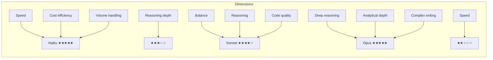
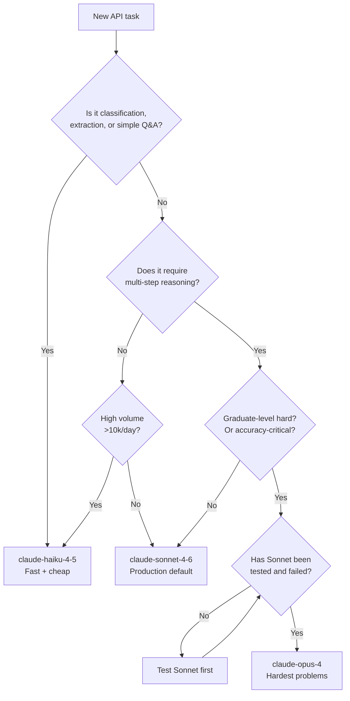

# Claude Model Families — Comparison

A detailed comparison of Haiku, Sonnet, and Opus across all relevant dimensions.

---

## Capability Profile



---

## Complete Feature Matrix

| Feature | Haiku | Sonnet | Opus |
|---------|-------|--------|------|
| Context window | 200k | 200k | 200k |
| Max output | 8k | 8k | 8k |
| Extended thinking | Check docs | Check docs | Check docs |
| Tool use / function calling | Yes | Yes | Yes |
| Vision (image input) | Yes | Yes | Yes |
| Streaming | Yes | Yes | Yes |
| Prompt caching | Yes | Yes | Yes |
| Batch API | Yes | Yes | Yes |
| Amazon Bedrock | Yes | Yes | Yes |

---

## Benchmark Relative Performance

General relative ordering across capability dimensions (Haiku = baseline):

| Benchmark Category | Haiku | Sonnet | Opus |
|-------------------|-------|--------|------|
| Simple Q&A | ✓✓✓ | ✓✓✓ | ✓✓✓ |
| Reasoning (MMLU) | ✓✓ | ✓✓✓ | ✓✓✓+ |
| Math (GSM8K, MATH) | ✓✓ | ✓✓✓ | ✓✓✓+ |
| Code (HumanEval) | ✓✓ | ✓✓✓ | ✓✓✓+ |
| Complex analysis | ✓ | ✓✓✓ | ✓✓✓+ |
| Instruction following | ✓✓✓ | ✓✓✓ | ✓✓✓ |
| Multilingual | ✓✓ | ✓✓✓ | ✓✓✓+ |

---

## Cost Scenarios

### Scenario: Customer support chatbot
- Volume: 10,000 conversations/day
- Avg tokens: 500 input + 200 output

```
Haiku:  ($0.25 × 5M/1M) + ($1.25 × 2M/1M) = $1.25 + $2.50 = $3.75/day
Sonnet: ($3.00 × 5M/1M) + ($15.00 × 2M/1M) = $15 + $30 = $45/day
Opus:   ($15.00 × 5M/1M) + ($75.00 × 2M/1M) = $75 + $150 = $225/day

Monthly cost:
  Haiku:  $112/month
  Sonnet: $1,350/month
  Opus:   $6,750/month
```

For a support chatbot: Haiku is likely sufficient and 12x cheaper.

### Scenario: Research assistant
- Volume: 100 research requests/day
- Avg tokens: 5,000 input + 2,000 output

```
Haiku:  ($0.25 × 500k/1M) + ($1.25 × 200k/1M) = $0.125 + $0.25 = $0.375/day
Sonnet: ($3.00 × 500k/1M) + ($15.00 × 200k/1M) = $1.50 + $3.00 = $4.50/day
Opus:   ($15.00 × 500k/1M) + ($75.00 × 200k/1M) = $7.50 + $15 = $22.50/day

Monthly cost:
  Haiku:  $11/month
  Sonnet: $135/month
  Opus:   $675/month
```

For research tasks: Sonnet is a good default; Opus only if Sonnet fails quality.

---

## Decision Flowchart



---

## When to Use Which — One-Line Rules

| Rule | Model |
|------|-------|
| "Need answer in < 500ms" | Haiku |
| "Processing 1M+ records per day" | Haiku |
| "Building a general-purpose chatbot" | Sonnet |
| "Agent that writes production code" | Sonnet |
| "Analyzing 100-page legal contracts" | Sonnet (or Opus if precision is critical) |
| "Solving AIME-level math problems" | Opus |
| "Synthesizing 20 academic papers into a report" | Opus |
| "Not sure which model to use" | Sonnet — always start here |

---

## 📂 Navigation

**In this folder:**
| File | |
|---|---|
| [📄 Theory.md](./Theory.md) | Core concepts |
| [📄 Cheatsheet.md](./Cheatsheet.md) | Quick reference |
| [📄 Interview_QA.md](./Interview_QA.md) | Interview prep |
| 📄 **Comparison.md** | ← you are here |

⬅️ **Prev:** [08 Extended Thinking](../08_Extended_Thinking/Theory.md) &nbsp;&nbsp;&nbsp; ➡️ **Next:** [10 Safety Layers](../10_Safety_Layers/Theory.md)
