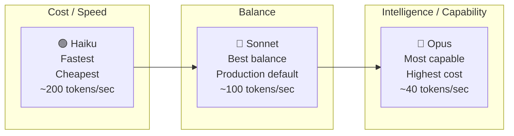
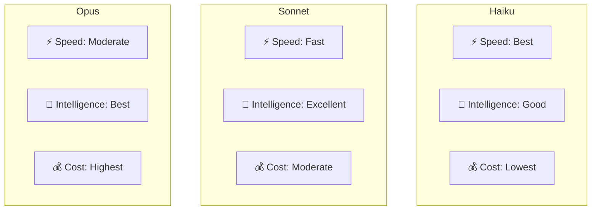

# Claude Model Families

## The Story 📖

Think about a law firm. When a paralegal needs to look up a filing deadline, you don't send a senior partner. When a Fortune 500 company needs strategy advice for a billion-dollar acquisition, you don't send an intern. And for most client meetings, the senior associate handles it perfectly well.

The same logic applies to AI models. Routing every request to the most powerful model is wasteful — expensive and slower than necessary. Routing everything to the cheapest model means your hardest problems get weak answers. Good engineering means matching the model to the task.

Anthropic's Claude family gives you exactly this routing layer: Haiku for speed and scale, Sonnet for everyday excellent work, Opus for when you need the deepest reasoning. Understanding each model's strengths, limitations, and costs lets you build systems that are both excellent and economically sustainable.

👉 This is why we need **Claude model families** — different task types have different speed, quality, and cost requirements, and the right model for each task is not always the most powerful one.

---

## The Claude Model Tiers 🏛️



The naming convention follows a musical scale metaphor — Haiku (small, elegant), Sonnet (balanced, expressive), Opus (full complexity). Each new generation improves all three dimensions, but the relative positioning holds across generations.

---

## Current Model Reference (Mid-2025) 📋

| Model ID | Tier | Context | Best for | Notes |
|----------|------|---------|----------|-------|
| `claude-haiku-4-5` | Haiku | 200k | High-volume pipelines, classification, simple Q&A | Fastest inference |
| `claude-sonnet-4-6` | Sonnet | 200k | Production default, agents, coding, analysis | This model powers Claude Code |
| `claude-opus-4` | Opus | 200k | Complex reasoning, research, hardest problems | Most capable |

Note: model IDs include version numbers; always check the Anthropic documentation for the current recommended IDs. The examples above reflect the mid-2025 model lineup.

---

## Haiku — The Speed Model 🟢

**Designed for**: High-volume applications where latency matters and tasks are well-defined.

### Strengths
- Fastest time-to-first-token across the Claude family
- Lowest cost — typically 12–15x cheaper than Sonnet per million tokens
- Highly capable for its price point — handles most classification, routing, extraction tasks
- Excellent for streaming applications where responsiveness matters

### When to use Haiku
- Document classification and routing
- Simple Q&A where factual recall suffices
- Entity extraction from structured documents
- First-pass filtering (use Haiku to decide if a task needs Sonnet/Opus)
- Customer service FAQ responses
- Real-time applications requiring < 500ms responses
- Batch processing at scale where cost is a constraint

### When NOT to use Haiku
- Complex multi-step reasoning
- Research synthesis across multiple sources
- Ambiguous instructions requiring nuanced interpretation
- Tasks requiring extended thinking

---

## Sonnet — The Production Default 🔵

**Designed for**: Most production workloads — the best balance of capability, speed, and cost.

### Strengths
- Significantly more capable than Haiku, especially for complex instructions
- Fast enough for interactive applications (typical streaming latency < 2 seconds to first token)
- Cost-effective for everyday work
- Strong coding ability — this is the model powering Claude Code
- Handles ambiguous instructions well
- Good at multi-turn reasoning within a conversation

### When to use Sonnet
- General-purpose chat applications
- Code generation, debugging, and review
- Document analysis and summarization
- Agent systems with moderate complexity
- API integrations where quality matters
- The "default choice" when you're unsure — start with Sonnet

### When NOT to use Sonnet
- Ultra-high-volume batch jobs where Haiku suffices (cost)
- The very hardest reasoning problems (graduate-level math, complex research synthesis)
- When Haiku has been validated to work at sufficient quality

---

## Opus — The Capability Pinnacle 🔴

**Designed for**: Tasks where quality is the primary constraint, not speed or cost.

### Strengths
- Highest performance on complex reasoning benchmarks
- Best at tasks requiring nuanced judgment, long-horizon planning, and complex analysis
- Strongest multilingual capabilities
- Best for creative tasks requiring depth and sophistication
- Most reliable at following complex multi-constraint instructions

### When to use Opus
- Graduate-level research questions
- Complex legal or financial document analysis
- Code architecture for large systems
- Synthesis across many long documents
- Tasks where a wrong answer is costly and quality must be maximized
- When Sonnet has been validated to be insufficient

### When NOT to use Opus
- Any task Sonnet handles well (it's 4–5x more expensive)
- Latency-sensitive user-facing features (it's ~2-3x slower)
- High-volume batch processing

---

## Speed vs Intelligence vs Cost — The Tradeoff Triangle ⚖️



Approximate relative positioning (ratios vary by task type):

| Metric | Haiku | Sonnet | Opus |
|--------|-------|--------|------|
| Speed (tok/sec) | 3x faster | 2x faster | Baseline |
| Capability | Good | Excellent | Best |
| Input cost | 1x | 12x | 60x |
| Output cost | 1x | 12x | 60x |

These are approximate ratios from the Claude 3 generation; exact pricing changes with each generation. Always check current pricing at anthropic.com/api.

---

## Model Routing Strategy 🗺️

A production system should route tasks to the appropriate model based on task characteristics:

```python
def select_model(task: Task) -> str:
    """Route to the right Claude model."""
    
    # Fast path: simple/high-volume tasks → Haiku
    if task.is_classification or task.word_count < 50:
        return "claude-haiku-4-5"
    
    # Hard problems → Opus
    if task.requires_extended_reasoning or task.domain in EXPERT_DOMAINS:
        return "claude-opus-4"
    
    # Default: Sonnet handles everything else
    return "claude-sonnet-4-6"
```

Advanced routing patterns:
1. **Cascading**: Try Haiku first; if confidence < threshold, escalate to Sonnet/Opus
2. **Task classification**: Use Haiku to classify whether a task needs Sonnet or Opus
3. **Budget-aware routing**: Route to Haiku when daily token budget is near limit
4. **A/B testing**: Route a percentage of requests to both models, measure quality, optimize

---

## When Each Generation Matters 📅

Within a tier, different generations offer improvements:

- Each new generation (3 → 3.5 → 4 → future) improves capability, typically at similar or lower cost
- "4.5" vs "4" in the model ID indicates an incremental improvement within the same generation
- Always use the latest stable model unless you need behavior consistency (pin model IDs in production)

Model pinning: use exact model IDs in production code (e.g., `claude-sonnet-4-6` not `claude-sonnet-latest`) to prevent behavior changes during model updates. Test new model versions explicitly before updating production.

---

## Where You'll See This in Real AI Systems 🏗️

- **Tiered cost architecture**: Enterprise applications typically use Haiku for bulk data processing, Sonnet for user-facing features, Opus for specialized expert-level workflows
- **Claude Code CLI**: Defaults to Sonnet for most operations; routes complex reasoning to Opus
- **Amazon Bedrock**: All Claude tiers available via AWS infrastructure for enterprise deployments
- **Cost monitoring**: Teams track model distribution in production to optimize spend

---

## Common Mistakes to Avoid ⚠️

- Using Opus by default "because it's the best" — often overkill; Sonnet handles 90%+ of tasks excellently
- Using Haiku for tasks requiring nuanced reasoning — quality can fail silently
- Not monitoring which model is actually used in production — costs can spike unexpectedly
- Ignoring model version pinning — behavior changes across minor versions can break downstream logic
- Forgetting that Sonnet powers Claude Code — it's strong enough for serious development work

---

## Connection to Other Concepts 🔗

- Relates to **Tokens and Context Window** (Topic 03) — all current Claude models share the 200k context window
- Relates to **Extended Thinking** (Topic 08) — extended thinking is model-specific; check current documentation for which models support it
- Relates to **Cost Optimization** (Track 3) — model routing is the highest-leverage cost optimization
- Relates to **What is Claude** (Topic 01) — the three tiers overview was introduced there; this topic covers the technical depth

---

✅ **What you just learned:** Claude's model family (Haiku/Sonnet/Opus) provides a speed-intelligence-cost tradeoff triangle; Haiku for high-volume/simple tasks, Sonnet as the production default, Opus for the hardest reasoning problems — routing appropriately can reduce costs by 10-60x.

🔨 **Build this now:** Run the same complex reasoning prompt on Haiku, Sonnet, and Opus. Compare: response quality, token count, and simulate cost using the pricing table. Decide which model is "good enough" for your hypothetical use case.

➡️ **Next step:** Safety Layers — [10_Safety_Layers/Theory.md](../10_Safety_Layers/Theory.md)


---

## 📝 Practice Questions

- 📝 [Q95 · claude-model-families](../../../ai_practice_questions_100.md#q95--normal--claude-model-families)


---

## 📂 Navigation

**In this folder:**
| File | |
|---|---|
| 📄 **Theory.md** | ← you are here |
| [📄 Cheatsheet.md](./Cheatsheet.md) | Quick reference |
| [📄 Interview_QA.md](./Interview_QA.md) | Interview prep |
| [📄 Comparison.md](./Comparison.md) | Detailed model comparison |

⬅️ **Prev:** [08 Extended Thinking](../08_Extended_Thinking/Theory.md) &nbsp;&nbsp;&nbsp; ➡️ **Next:** [10 Safety Layers](../10_Safety_Layers/Theory.md)
