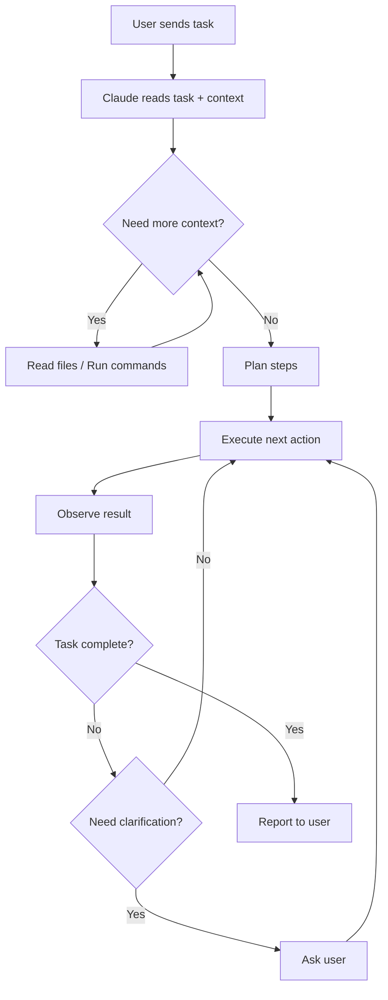
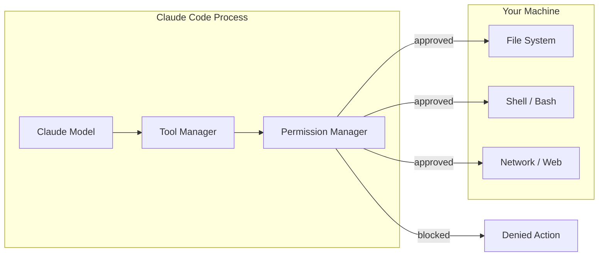
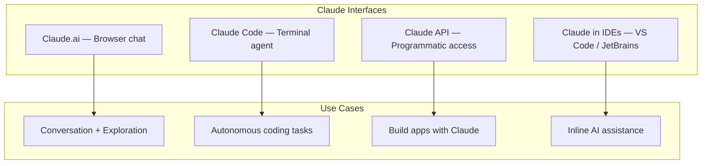

# What is Claude Code?

## The Story 📖

Imagine you hire a contractor to renovate your house. You could call them on the phone every time you need something ("move that wall three inches to the left") — and they'd do it, one instruction at a time. That's a chat interface.

Now imagine a different contractor. You hand them a key to your house, walk them through the blueprints, and say: "Renovate the kitchen. You know where everything is. Fix whatever's broken. Let me know when it's done." They go in, read the blueprints, open the cabinets, measure things, order materials, and work autonomously — coming back only when they need a decision.

That's **Claude Code**.

The difference isn't just convenience. It's a fundamentally different loop: read context → reason → act → verify → repeat. The contractor doesn't need you to describe the kitchen layout — they can go look. They don't need you to tell them there's a cracked tile — they discover it themselves.

👉 This is why we need **Claude Code** — a CLI agent that can read your codebase, edit files, run commands, and complete multi-step tasks without you holding its hand.

---

## What is Claude Code? 🖥️

**Claude Code** is Anthropic's official command-line interface (CLI) that runs Claude as an autonomous coding agent directly in your terminal. Unlike chat interfaces where you exchange messages, Claude Code operates in an **agentic loop** — it perceives your project, plans actions, executes tools, observes results, and iterates until the task is complete.

Key characteristics:

- Runs as a terminal process (not a browser tab)
- Has direct access to your file system, with permission
- Can read, write, and create files
- Can execute shell commands and run tests
- Maintains context about your project across a conversation
- Follows instructions in `CLAUDE.md` configuration files
- Supports multi-step, multi-file tasks autonomously

#### Real-world examples

- **Code review:** "Review all files changed in the last commit and suggest improvements."
- **Refactor:** "Rename the `user_id` field to `account_id` everywhere in the codebase."
- **Bug fix:** "The tests in `test_auth.py` are failing. Find and fix the root cause."
- **Documentation:** "Write docstrings for every public function in `src/utils.py`."
- **New feature:** "Add a rate limiter to the FastAPI app. Use the token bucket algorithm."

---

## Why It Exists — The Problem It Solves 🎯

### Problem 1: Context loss in chat interfaces

When you use Claude in a browser chat, you paste code snippets. You copy-paste error messages. You manually describe file structures. Every piece of context has to pass through your hands. This is slow and lossy — you might forget a relevant file, misquote an error, or skip a dependency.

### Problem 2: One-shot instructions don't match real engineering work

Real coding tasks are multi-step. "Fix the login bug" might mean: read the auth module, find the faulty condition, check the test suite, fix the code, run the tests, verify they pass, update the changelog. A chat interface handles step 1. An agent handles all of them.

### Problem 3: The context-action gap

In a chat, the model knows nothing about your project until you tell it. In Claude Code, the model can *read* your project. It can run `git log`, open your `package.json`, inspect the failing test output — all without you describing any of it.

👉 Without Claude Code: you are the bridge between the model and your code. With Claude Code: the model bridges itself.

---

## How It Works — The Agentic Loop 🔄

Claude Code does not process a single prompt and return a single answer. It runs a continuous **perceive → plan → act → observe** loop.



### Step 1: Perception

Claude Code starts by reading what it needs to understand the task. This might involve:
- Reading files mentioned in your request
- Listing directory contents
- Running `git status` or `git log`
- Reading `CLAUDE.md` for project context

### Step 2: Planning

Based on what it perceives, Claude forms a plan. For complex tasks it may decompose the task into sub-steps, estimate risks, and decide which tools to invoke.

### Step 3: Action

Claude executes tools. The core tool set includes:

| Tool | What it does |
|------|-------------|
| `Read` | Reads a file's contents |
| `Write` | Creates or overwrites a file |
| `Edit` | Makes targeted string replacements in a file |
| `Bash` | Executes a shell command |
| `Glob` | Finds files matching a pattern |
| `Grep` | Searches file contents with regex |
| `WebFetch` | Fetches a URL |

### Step 4: Observation

After each action, Claude reads the result. If a test failed, it reads the error. If a file was written, it reads it back to verify. This feedback loop is what separates an agent from a one-shot script.

### Step 5: Iteration

Claude repeats steps 3–4 until the task is done or it needs human input.

---

## The Tool Architecture ⚙️



Every tool call passes through the permission system. By default, Claude Code asks before:
- Writing or modifying files
- Running bash commands
- Deleting anything

You can configure which actions require approval and which are pre-approved.

---

## Claude Code vs Chat Interfaces 💬

| Dimension | Chat (Claude.ai) | Claude Code |
|-----------|-----------------|-------------|
| Interface | Browser | Terminal |
| File access | You paste code | Direct file system access |
| Context | What you type | Reads project automatically |
| Task scope | Single exchange | Multi-step autonomous |
| Execution | Model outputs text | Model executes tools |
| Feedback | You read output | Model reads output |
| Persistence | Session-only | MEMORY.md + CLAUDE.md |
| Configuration | Prompt only | CLAUDE.md + settings.json |
| Skills | None | Custom /commands |
| Hooks | None | Pre/Post tool events |

---

## What Claude Code Is NOT 🚫

- Not a replacement for your IDE — it works alongside it
- Not always-on — you invoke it for specific tasks
- Not magic — it can get stuck and needs guidance on ambiguous tasks
- Not a general-purpose automation platform — it's designed for engineering workflows
- Not a service — it runs on your machine, using your API key

---

## Where Claude Code Fits in the Ecosystem 🗺️



Claude Code sits in the "autonomous task execution" quadrant. You give it a task with enough context, and it drives to completion.

---

## The CLAUDE.md System 📋

When Claude Code starts in a directory, it automatically reads `CLAUDE.md` files. This is how you give the agent persistent project context without repeating yourself every session.

```
~/.claude/CLAUDE.md           ← global rules (applies everywhere)
~/project/CLAUDE.md           ← project rules (applies to this project)
~/project/subfolder/CLAUDE.md ← folder rules (applies to this folder)
```

A `CLAUDE.md` might contain:
- What the project does
- Tech stack and conventions
- Which commands to run for tests
- What to avoid
- Preferred libraries and patterns

This is analogous to a contractor's briefing document — every time they walk in, they re-read it.

---

## The Memory System 🧠

Beyond `CLAUDE.md` (instruction files), Claude Code has a memory system that persists facts across sessions:

- **Auto-memory:** Claude saves important discoveries (API patterns, architecture notes) to a `MEMORY.md` index
- **Per-project memory:** Stored in `.claude/` folder within your project
- **Global memory:** Stored in `~/.claude/`

Think of this as Claude's notebook — project-specific knowledge that survives between conversations.

---

## Common Mistakes to Avoid ⚠️

- **Mistake 1 — Treating it like a chat:** Sending short, vague messages like "fix it" without context. Claude Code works best with clear task descriptions.
- **Mistake 2 — No CLAUDE.md:** Starting a new project without a `CLAUDE.md` means Claude has no project context. Write even a 5-line brief.
- **Mistake 3 — Accepting all changes blindly:** Review diffs before approving. Claude can misunderstand intent, especially on ambiguous tasks.
- **Mistake 4 — Unlimited permissions:** Running with `--dangerously-skip-permissions` on production systems. Use it only in sandboxed environments.
- **Mistake 5 — Expecting perfection on first pass:** Complex multi-file refactors often need a second pass. That's normal — give feedback and iterate.

---

## Connection to Other Concepts 🔗

- Relates to **MCP (Model Context Protocol)** because Claude Code can be extended with MCP servers, adding tools like database access, GitHub APIs, and more
- Relates to **AI Agents** because Claude Code is itself an agent implementation of the perceive→plan→act→observe loop
- Relates to **CLAUDE.md and Settings** because all project behavior is configured through this file system
- Relates to **Hooks** because every tool invocation can be intercepted and modified by hook scripts
- Relates to **Subagents** because Claude Code can spawn background agents for parallel work

---

✅ **What you just learned:** Claude Code is an autonomous CLI agent that reads files, executes commands, and completes multi-step coding tasks by running a continuous perceive → plan → act → observe loop.

🔨 **Build this now:** Install Claude Code (`npm install -g @anthropic-ai/claude-code`), navigate to any project, and run `claude "List all the Python files in this repo and tell me what each one does."` — observe the agentic loop in action.

➡️ **Next step:** [Installation and Setup](../02_Installation_and_Setup/Theory.md) — get Claude Code running with proper auth, config, and your first real task.


---

## 📝 Practice Questions

- 📝 [Q96 · claude-code-cli](../../../ai_practice_questions_100.md#q96--interview--claude-code-cli)


---

## 📂 Navigation

**In this folder:**
| File | |
|---|---|
| 📄 **Theory.md** | ← you are here |
| [📄 Cheatsheet.md](./Cheatsheet.md) | Quick reference |
| [📄 Interview_QA.md](./Interview_QA.md) | Interview prep |

⬅️ **Prev:** [Track 2 Overview](../../02_Claude_Code_CLI/) &nbsp;&nbsp;&nbsp; ➡️ **Next:** [Installation and Setup](../02_Installation_and_Setup/Theory.md)
