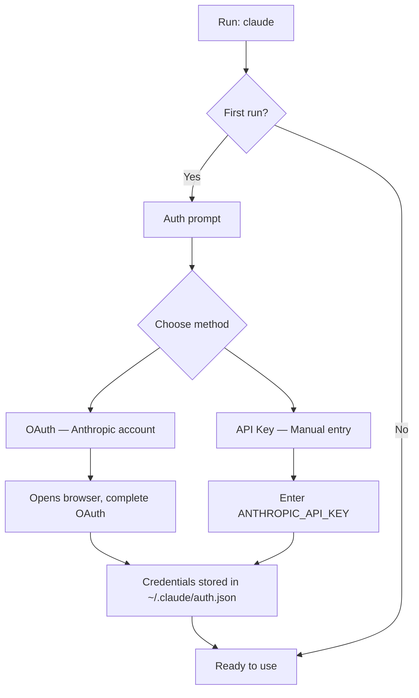
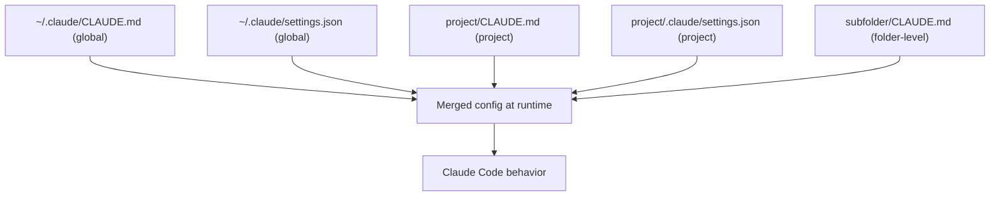

# Installation and Setup

## The Story 📖

Think about setting up a new employee's workstation. Before they can do anything useful, someone needs to: install the software they need, give them credentials to access company systems, point them to the right directories, and brief them on house rules. Skip any of those steps and they're either lost or locked out.

Installing Claude Code works the same way. You install the package (the software), authenticate with an API key (the credentials), run it in the right folder (the directory context), and configure CLAUDE.md (the house rules). Each step has a specific purpose. Getting them right means Claude Code works everywhere you need it, every time.

The good news: the whole process takes under five minutes for a clean install. The configuration you build up over time is what makes it powerful.

👉 This is why we need **proper Installation and Setup** — a misconfigured Claude Code installation leads to auth failures, wrong project context, and frustrating tool permission denials.

---

## What is the Setup Process? 📦

**Setting up Claude Code** involves four distinct phases:
1. Installing the npm package globally
2. Authenticating with your Anthropic account or API key
3. Running Claude Code in your project for the first time
4. Configuring global and project-level behavior

Each phase is independent — you do installation once per machine, authentication once per machine (or per project if using project keys), and configuration once per project.

---

## Why It Exists — The Problem It Solves 🎯

### Problem 1: Auth sprawl

Without a consistent auth flow, teams end up with API keys hardcoded in scripts, stored inconsistently, or shared unsafely. Claude Code's auth flow centralizes credential management and supports both personal OAuth (for individuals) and API key auth (for teams and CI/CD).

### Problem 2: Missing project context

Running Claude Code in the wrong directory means it has no idea what project you're working on. Proper setup means knowing which directory to launch from, and having `CLAUDE.md` ready.

### Problem 3: Conflicting global vs project settings

Global settings affect every project. Project settings override global settings. Without understanding this hierarchy, you end up with unexpected behavior in some projects and not others.

👉 Without proper setup: Claude Code has no credentials, no project context, and no behavioral configuration. With proper setup: it's ready to run as your autonomous coding partner from the first command.

---

## How It Works — Step by Step ⚙️

### Step 1: Prerequisites

Before installing, confirm you have:

```bash
node --version    # Must be 18.0.0 or higher
npm --version     # Any modern npm (8+)
```

Claude Code is distributed as an npm package. Node.js 18+ is required because it uses modern JavaScript features including native `fetch` and ES modules.

### Step 2: Install the package globally

```bash
npm install -g @anthropic-ai/claude-code
```

This installs the `claude` binary to your system PATH. After installation:

```bash
claude --version    # verify installation
claude --help       # see all available flags
```

The `-g` flag installs globally, making `claude` available from any directory. This is the standard approach.

### Step 3: Authentication

Claude Code supports two auth methods:



#### Option A: OAuth (recommended for individuals)

```bash
claude
# Prompts you to authenticate
# Opens browser → log in to console.anthropic.com
# Grants access → credentials stored locally
```

OAuth credentials are tied to your Anthropic account. They auto-refresh. This is the recommended path for individual engineers.

#### Option B: API Key (recommended for teams and CI/CD)

```bash
export ANTHROPIC_API_KEY="sk-ant-..."
claude
```

Or set it permanently in your shell config:

```bash
# ~/.bashrc or ~/.zshrc
export ANTHROPIC_API_KEY="sk-ant-api03-..."
```

API keys are tied to a specific Anthropic organization and have configurable rate limits and spending caps.

### Step 4: First Run

Navigate to your project directory and launch Claude Code:

```bash
cd ~/myproject
claude
```

On first run, Claude Code will:
1. Check for `CLAUDE.md` files (global → project → current folder)
2. Display a welcome prompt
3. Wait for your first instruction

You can also run it non-interactively with the `--print` flag:

```bash
claude --print "What files are in this directory?"
```

### Step 5: Global Configuration

Global configuration lives in `~/.claude/`:

```
~/.claude/
├── CLAUDE.md           ← global instructions (always loaded)
├── settings.json       ← global tool permissions, hooks
├── auth.json           ← credentials (auto-managed)
└── projects/           ← per-project memory
```

Your global `~/.claude/CLAUDE.md` should contain rules that apply to all projects — your coding style, preferred languages, workflow conventions.

### Step 6: Project Configuration

Project-specific config lives in your project's `.claude/` folder:

```
myproject/
├── CLAUDE.md           ← project instructions
└── .claude/
    ├── settings.json   ← project permissions, hooks, MCP servers
    ├── commands/       ← custom slash commands
    └── memory/         ← auto-saved project memory
```

---

## The Full Config Hierarchy 🗂️



Lower-level configs (project, subfolder) override higher-level ones (global) for the same setting.

---

## settings.json Structure 📄

The `settings.json` file controls permissions and behavior:

```json
{
  "permissions": {
    "allow": ["Read", "Write", "Bash(git *)"],
    "deny": ["Bash(rm -rf *)"]
  },
  "env": {
    "ANTHROPIC_API_KEY": "${ANTHROPIC_API_KEY}"
  }
}
```

Key fields:

| Field | Purpose |
|-------|---------|
| `permissions.allow` | Tools auto-approved, no prompt |
| `permissions.deny` | Tools always blocked |
| `env` | Environment variable injection |
| `hooks` | Pre/post tool event handlers |
| `mcpServers` | MCP server registrations |

---

## Useful CLI Flags 🚩

```bash
claude                          # Interactive REPL mode
claude --print "task"           # Non-interactive, print and exit
claude --continue               # Resume last conversation
claude --resume <id>            # Resume specific conversation by ID
claude --no-auto-updates        # Disable auto-update checks
claude --model claude-sonnet-4-6  # Specify model
claude --debug                  # Enable debug logging
claude --version                # Show version
claude --help                   # Full help text
```

---

## Environment Variables 🌍

| Variable | Purpose |
|----------|---------|
| `ANTHROPIC_API_KEY` | Primary auth credential |
| `ANTHROPIC_BASE_URL` | Override API endpoint (for proxies) |
| `CLAUDE_CODE_MAX_OUTPUT_TOKENS` | Cap output token count |
| `HTTP_PROXY` / `HTTPS_PROXY` | Proxy settings |
| `NO_COLOR` | Disable colored output |
| `CLAUDE_CODE_DISABLE_TELEMETRY` | Opt out of usage telemetry |

---

## Common Installation Issues and Fixes 🛠️

| Issue | Cause | Fix |
|-------|-------|-----|
| `command not found: claude` | npm global bin not in PATH | Add `$(npm bin -g)` to PATH |
| `permission denied` on install | Global npm needs sudo | Use `nvm` to manage Node, or `npm install --prefix ~/.local` |
| Auth loop / OAuth not completing | Browser blocked redirect | Use API key auth instead |
| `ANTHROPIC_API_KEY not set` | Env var not exported | Add `export` to shell config |
| Old version of Node | Node < 18 | Upgrade via `nvm install 20` |

---

## Common Mistakes to Avoid ⚠️

- **Mistake 1 — Installing without Node 18+:** Claude Code uses modern JS features. Running on Node 16 will crash with cryptic errors.
- **Mistake 2 — Launching from wrong directory:** Claude Code's project context is determined by where you launch it. Always `cd` to your project root first.
- **Mistake 3 — Hardcoding API key in CLAUDE.md:** API keys belong in environment variables or `settings.json` with env interpolation, not plaintext config files.
- **Mistake 4 — Global deny rules blocking common tools:** Setting `deny: ["Bash"]` globally will block all shell commands in all projects, including harmless ones like `git status`.
- **Mistake 5 — Not creating CLAUDE.md before first run:** Claude Code will work without CLAUDE.md but will have zero project context. Write even a minimal one.

---

## Connection to Other Concepts 🔗

- Relates to **CLAUDE.md and Settings** because installation creates the config file hierarchy
- Relates to **Permissions and Security** because `settings.json` controls which tools are pre-approved
- Relates to **Hooks** because hooks are registered in the same `settings.json`
- Relates to **MCP Servers** because MCP server registrations go in `settings.json` under `mcpServers`

---

✅ **What you just learned:** How to install Claude Code via npm, authenticate with OAuth or API key, and configure global and project-level behavior through CLAUDE.md and settings.json.

🔨 **Build this now:** Install Claude Code, create a minimal `~/.claude/CLAUDE.md` with your name, preferred language, and one coding rule. Then run `claude "Show me what you know about this machine"` and see what it says.

➡️ **Next step:** [Basic Usage and Commands](../03_Basic_Usage_and_Commands/Theory.md) — learn the everyday commands, flags, and interaction patterns.

---

## 📂 Navigation

**In this folder:**
| File | |
|---|---|
| 📄 **Theory.md** | ← you are here |
| [📄 Cheatsheet.md](./Cheatsheet.md) | Quick reference |
| [📄 Interview_QA.md](./Interview_QA.md) | Interview prep |
| [📄 Code_Example.md](./Code_Example.md) | Setup walkthrough |

⬅️ **Prev:** [What is Claude Code](../01_What_is_Claude_Code/Theory.md) &nbsp;&nbsp;&nbsp; ➡️ **Next:** [Basic Usage and Commands](../03_Basic_Usage_and_Commands/Theory.md)
