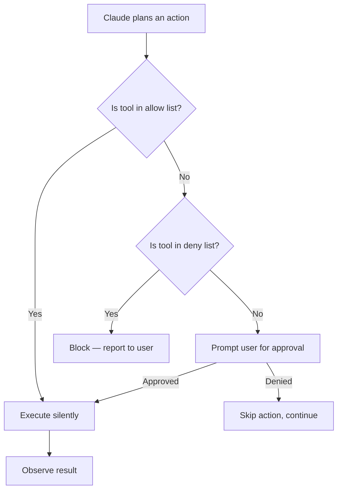

# Basic Usage and Commands

## The Story 📖

The first day you use a new power tool — a jigsaw, a drill press, a CNC machine — you don't start with the most complicated project. You learn the controls. You figure out where the safety features are. You run a test cut on scrap wood.

Claude Code is no different. Before you hand it a complex refactor spanning twenty files, you need to understand the everyday commands: how to ask questions, how to trigger file edits, how to run shell commands, and most importantly — how the permission system protects you when it executes actions on your behalf.

The everyday loop with Claude Code is simpler than it sounds: you type a natural-language instruction, Claude reads your files, takes action, and reports back. But the flags, permission system, and modes it operates in have a big impact on how you should use it.

👉 This is why we need **Basic Usage and Commands** — understanding the everyday interaction model turns Claude Code from "interesting demo" into a reliable daily driver.

---

## What is Basic Usage? 🖥️

**Basic usage** covers the everyday interactions with Claude Code: asking questions about your codebase, requesting file edits, running shell commands, and understanding how each interaction passes through the permission system. It also covers the `--print` flag for non-interactive (scripted) usage and the key modes Claude Code operates in.

---

## Why It Exists — The Problem It Solves 🎯

### Problem 1: The interaction model is different from chat

Claude Code is not a text chat where you ask and it responds. It's an agent that plans and acts. Understanding the basic commands means understanding when Claude will ask for permission, when it will act silently, and how to shape its behavior with flags.

### Problem 2: Accidental destructive actions

Without understanding the permission system, a beginner might approve an action without realizing its full scope. The default permission prompts exist precisely to create checkpoints — but only if you understand what you're approving.

### Problem 3: Automation without interaction

CI/CD pipelines, pre-commit hooks, and batch scripts need Claude Code in non-interactive mode. The `--print` flag and its behavior is critical knowledge for anyone building automation.

👉 Without understanding basic usage: you'll either fight the permission system or blindly approve everything. With this knowledge: you work with the agent loop fluently.

---

## How It Works — Step by Step 🔄

### Step 1: The Basic Interaction Loop

Claude Code runs in an interactive **REPL** (Read-Eval-Print Loop). You type a message, Claude reasons, executes tools, and displays a response. Then you type the next message.

```bash
claude
# > Welcome to Claude Code. How can I help?

# Ask a question
> What does the auth module do?
# Claude reads src/auth.py and reports back

# Request an edit
> Add input validation to the login function
# Claude reads the file, proposes an edit, asks permission, makes the change

# Run a command
> Run the test suite and tell me what's failing
# Claude executes pytest, reads the output, reports failures
```

### Step 2: Asking Questions (Read-only)

Questions that only require reading files don't trigger the write/execute permission system:

```bash
> Explain the database schema
# Claude reads models.py and describes the schema — no permission prompts

> What's the API endpoint for user registration?
# Claude searches routers/ directory — no permission prompts

> How are errors handled in this codebase?
# Claude reads exception handlers — no permission prompts
```

Read operations are always permitted. No approval needed.

### Step 3: Requesting File Edits

When you ask Claude to modify a file, it shows you a diff and asks for approval:

```
> Add error handling to the payment function

Claude Code wants to edit src/payments.py:

  --- src/payments.py
  +++ src/payments.py
  @@ -42,8 +42,14 @@
   def charge_card(amount, card_token):
  -    result = stripe.charge(amount, card_token)
  -    return result
  +    try:
  +        result = stripe.charge(amount, card_token)
  +        return result
  +    except stripe.CardError as e:
  +        logger.error(f"Card charge failed: {e}")
  +        raise PaymentError(str(e)) from e

Allow this edit? [y/n/a (always)/d (diff)]
```

The prompt options:
- `y` — approve this edit
- `n` — reject this edit
- `a` — always approve edits to this file (session-only)
- `d` — view full diff before deciding

### Step 4: Running Bash Commands

When Claude needs to execute a shell command, it shows you the command and asks for approval:

```
> Run the failing tests in verbose mode

Claude Code wants to run: pytest tests/test_payments.py -v

Allow? [y/n/a]
```

You can also explicitly ask Claude to run specific commands:
```bash
> Run `git diff HEAD~1` and summarize what changed
> Execute the migration script at db/migrate.py
> Install the requests library
```

### Step 5: The Permission System in Detail



**Three approval states:**
- **Auto-approved:** Tool listed in `permissions.allow` in settings.json
- **Blocked:** Tool listed in `permissions.deny` in settings.json
- **Prompted:** Everything else — Claude asks before executing

### Step 6: Non-Interactive Mode (--print flag)

The `--print` flag makes Claude Code run a single task, print the output, and exit. This is essential for scripting and CI/CD:

```bash
# Simple query
claude --print "What is the purpose of config.py?"

# Multi-step task — Claude still runs the full agent loop
claude --print "Find all TODO comments in the codebase and list them"

# Combine with shell pipes
claude --print "Describe the API surface of this module" > api_docs.txt

# Use in scripts
RESULT=$(claude --print "Check if the tests pass and return PASS or FAIL")
echo "Test result: $RESULT"
```

In `--print` mode:
- No interactive prompts
- All tool uses require pre-approval via `settings.json`
- Exits with code 0 on success, non-zero on error
- Output goes to stdout

---

## The Diff Viewer 📋

When Claude edits files, the diff viewer shows:
- Lines removed in red (prefixed with `-`)
- Lines added in green (prefixed with `+`)
- Context lines (unchanged, prefixed with space)
- File path and line numbers

You can configure the diff viewer behavior:
```json
{
  "diffViewer": "terminal"  // or "vscode" to open in VS Code
}
```

---

## Multi-Turn Conversations 💬

Claude Code maintains conversation context within a session. You can build on previous messages:

```
> Read the payments module
[Claude reads and summarizes]

> Now add logging to every function in it
[Claude remembers context from previous turn]

> The log messages should use the structured format we discussed
[Claude references what "structured format" means from this session]
```

Context is maintained in-session. For cross-session persistence, use MEMORY.md.

---

## Useful Interaction Patterns 🛠️

### Pattern 1: Scoped edits

```bash
> In src/api/users.py, add rate limiting to the GET /users endpoint only
```
Be specific about which file and which function.

### Pattern 2: Iterative refinement

```bash
> Refactor the authentication logic
[Claude proposes changes]
> The token validation part looks good but revert the session handling changes
[Claude adjusts]
```

### Pattern 3: Verification after edit

```bash
> Add the new UserProfile model to models.py
[Claude edits]
> Now run the tests to verify nothing broke
[Claude runs pytest]
```

### Pattern 4: Exploration before action

```bash
> Show me all the places where the database connection is established before you do anything
[Claude reads and reports]
> Now extract that into a shared connection manager
[Claude knows the full scope before acting]
```

---

## The --continue and --resume Flags 🔄

```bash
# Continue the most recent conversation
claude --continue

# Resume a specific conversation by ID
claude --resume abc123

# List recent conversations
claude --list-sessions
```

These are useful when you close the terminal mid-task and want to pick up where you left off without losing context.

---

## Common Mistakes to Avoid ⚠️

- **Mistake 1 — Approving file writes without reading the diff:** Always read the diff. Claude can misinterpret ambiguous instructions.
- **Mistake 2 — Vague instructions:** "Fix the bug" is unhelpful. "The login function returns 403 for valid users — fix it" gives Claude real signal.
- **Mistake 3 — Using --print in interactive mode:** `--print` is for scripting. In interactive mode, just type your request.
- **Mistake 4 — Not verifying after edits:** Ask Claude to run tests after editing. It can catch its own mistakes if you build verification into the workflow.
- **Mistake 5 — Letting Claude run open-ended shell commands:** Approve commands with clear, bounded scope. "Run all tests" is fine. "Clean up the repo" is not.

---

## Connection to Other Concepts 🔗

- Relates to **Permissions and Security** because every action goes through the permission layer
- Relates to **Slash Commands** because `/` commands extend the basic interaction model
- Relates to **CLAUDE.md** because the project brief shapes how Claude interprets every request
- Relates to **Hooks** because hooks can intercept and modify tool executions before/after they happen

---

✅ **What you just learned:** The everyday Claude Code interaction model — asking questions, requesting edits, running commands, reading diffs, and using `--print` for non-interactive mode.

🔨 **Build this now:** In any project, ask Claude to: (1) list all Python files, (2) explain what the main module does, (3) add a single docstring to one function. Practice reading and approving the permission prompts at each step.

➡️ **Next step:** [Slash Commands](../04_Slash_Commands/Theory.md) — learn built-in `/` commands and how to write your own custom commands.

---

## 📂 Navigation

**In this folder:**
| File | |
|---|---|
| 📄 **Theory.md** | ← you are here |
| [📄 Cheatsheet.md](./Cheatsheet.md) | Quick reference |
| [📄 Interview_QA.md](./Interview_QA.md) | Interview prep |
| [📄 Code_Example.md](./Code_Example.md) | Practical examples |

⬅️ **Prev:** [Installation and Setup](../02_Installation_and_Setup/Theory.md) &nbsp;&nbsp;&nbsp; ➡️ **Next:** [Slash Commands](../04_Slash_Commands/Theory.md)
