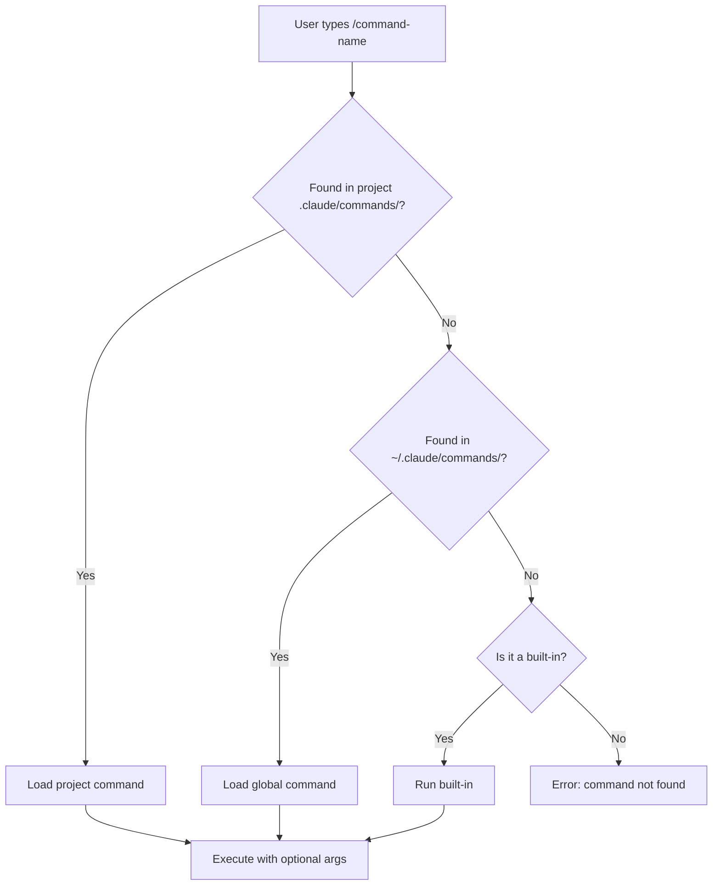

# Slash Commands

## The Story 📖

Think about keyboard shortcuts in your IDE. You could access every feature through the menu — File → Refactor → Rename Symbol. But after a week of doing it constantly, you learn `F2`. One keystroke. The action is the same, but the friction is gone.

Slash commands in Claude Code are the same idea. You could type a long natural-language instruction every time — "Read the current git diff, review it for code quality issues, check against our style guide, and summarize findings in three bullet points." Or you could type `/review`.

The difference is repeatability. Slash commands let you codify workflows you run repeatedly — code review, documentation generation, deployment checklists, database migrations — into short invocations that carry full context. And because you write them in plain Markdown files, they're version-controlled and shareable with your team.

👉 This is why we need **Slash Commands** — they turn one-time tasks into repeatable workflows, and individual habits into team-shared standards.

---

## What are Slash Commands? ⌨️

**Slash commands** are shortcut invocations in Claude Code that trigger pre-written instruction sets. They come in two varieties:

- **Built-in commands:** Shipped with Claude Code, handle session management (`/help`, `/clear`, `/compact`, `/cost`, `/status`)
- **Custom commands:** You write them as Markdown files in `.claude/commands/`, invocable with `/command-name`

Custom commands can accept arguments, use template substitution, and contain complex multi-step instructions. They're stored as plain `.md` files, making them version-controllable and team-sharable.

---

## Why It Exists — The Problem It Solves 🎯

### Problem 1: Repeated instructions accumulate friction

If you run the same "review this diff" prompt five times a day, typing it every time wastes seconds that add up to minutes. Slash commands reduce any repeatable task to a single shortcut.

### Problem 2: Inconsistency in repeated workflows

When instructions live only in your memory, different team members run different variants. A custom slash command checked into the repo gives every team member identical behavior.

### Problem 3: Complex context that's hard to type

Some tasks require long context: "Review this code against our style guide, check for security issues, verify it follows our API contract, and format findings as a GitHub comment." This is hard to type on demand but trivial as a `/review` command.

👉 Without slash commands: every workflow is typed fresh. With slash commands: your best workflows are instantly repeatable and team-shared.

---

## Built-in Slash Commands 🔧

These come with Claude Code and are always available:

| Command | What it does |
|---------|-------------|
| `/help` | Show all available commands and their descriptions |
| `/clear` | Clear the current conversation — start fresh |
| `/compact` | Compress the conversation history to save context window |
| `/cost` | Show the token cost of the current session |
| `/status` | Show Claude Code status — model, session ID, memory usage |

### /help

```
> /help
Available commands:
  /help        — Show this help
  /clear       — Clear conversation
  /compact     — Compress history
  /cost        — Show session cost
  /status      — Show status
  /review      — (custom) Review current git diff
  ...
```

### /clear

Clears the entire conversation history. Use this when you've finished one task and want to start a new one without the old context bleeding in.

### /compact

Compresses the conversation history by summarizing older messages. Useful in long sessions when you're approaching context limits. The summary preserves key decisions and facts while reducing token count.

### /cost

Shows the token usage and estimated API cost for the current session. Useful for monitoring spending and understanding which tasks consume the most context.

### /status

Displays current session information: active model, session ID (for `--resume`), memory file locations, and MCP server status.

---

## Custom Slash Commands 🛠️

### File Location

Custom commands are stored as `.md` files in your `.claude/commands/` directory:

```
project/
└── .claude/
    └── commands/
        ├── review.md        → /review
        ├── docgen.md        → /docgen
        ├── pr-summary.md    → /pr-summary
        └── deploy-check.md  → /deploy-check
```

The filename (without `.md`) becomes the command name.

### YAML Frontmatter

Each command file starts with a YAML frontmatter block that defines metadata:

```yaml
---
description: Review the current git diff for bugs and style issues
allowed_tools:
  - Bash
  - Read
  - Grep
---
```

| Field | Purpose |
|-------|---------|
| `description` | Shows in `/help` listing |
| `allowed_tools` | Tools this command is permitted to use |
| `argument_hint` | Hint shown when command expects arguments |

### Command Body

After the frontmatter, write the instruction Claude should follow when the command is invoked:

```markdown
---
description: Review the current git diff for bugs and style issues
allowed_tools:
  - Bash
  - Read
  - Grep
---

Review the output of `git diff HEAD` for:
1. Obvious bugs or logic errors
2. Missing error handling
3. Security issues (hardcoded secrets, SQL injection, etc.)
4. Style violations (unused imports, long functions, missing types)

Format your findings as:
- **Critical:** issues that will break things
- **Warning:** issues worth fixing before merge
- **Suggestion:** optional improvements

Be concise — no more than 5 items per category.
```

---

## Argument Passing 📨

Custom commands can accept arguments using `$ARGUMENTS` placeholder:

```markdown
---
description: Generate docstrings for a specific file
argument_hint: <filepath>
---

Read the file at $ARGUMENTS and write Google-style docstrings for every public
function and class that doesn't already have one. Preserve all existing code.
Show me the diff before applying.
```

Invocation:
```
> /docgen src/utils/string_helpers.py
```

`$ARGUMENTS` is replaced with everything typed after the command name.

---

## The Command Resolution Flow 🗂️



Project commands override global commands with the same name.

---

## Global vs Project Commands 🌍

| Location | Scope | When to use |
|----------|-------|-------------|
| `~/.claude/commands/` | All projects | General-purpose: review, docgen, debug |
| `<project>/.claude/commands/` | This project only | Project-specific: deploy-check, run-migrations |

Best practice: put workflow commands that apply to all your work globally, and project-specific commands (that know your test suite, deployment pipeline, etc.) in the project.

---

## Real-World Command Examples 📋

### /pr-summary

```markdown
---
description: Generate a PR summary from the current diff
---
Run `git diff main...HEAD` and `git log main...HEAD --oneline`.
Write a concise pull request description with:
- **What changed** (1-2 sentences)
- **Why** (the motivation)
- **Testing** (how to verify it works)
- **Breaking changes** (if any)
Format it as GitHub Markdown.
```

### /security-check

```markdown
---
description: Security scan for hardcoded secrets and common vulnerabilities
allowed_tools:
  - Grep
  - Read
---
Scan all source files for:
1. Hardcoded API keys, passwords, or tokens (patterns like "sk-", "Bearer ", etc.)
2. SQL string concatenation (potential SQL injection)
3. `eval()` or `exec()` on user input
4. Unvalidated redirects

Report file path and line number for each finding.
```

### /test-coverage

```markdown
---
description: Check which functions lack test coverage
argument_hint: <module_path>
---
Read all Python files in $ARGUMENTS.
Then read the tests/ directory.
List every public function or class in $ARGUMENTS that has no corresponding test.
Suggest test cases for the top 3 most critical untested functions.
```

---

## Common Mistakes to Avoid ⚠️

- **Mistake 1 — Missing frontmatter:** Commands without frontmatter may not appear in `/help` or may fail to restrict tools properly.
- **Mistake 2 — Commands that are too long:** Long command files are hard to maintain. Break complex workflows into smaller commands.
- **Mistake 3 — Hardcoding file paths:** Use `$ARGUMENTS` so commands work on any file, not just one hardcoded path.
- **Mistake 4 — Not version-controlling commands:** Checked-in commands benefit from PR review and team consistency. Don't keep them local only.
- **Mistake 5 — Overlapping global and project commands:** If both have a `/review` command, the project one silently wins. Name them clearly or rely on the override behavior intentionally.

---

## Connection to Other Concepts 🔗

- Relates to **CLAUDE.md and Settings** because command files live in the same `.claude/` directory structure
- Relates to **Custom Skills** because skills and commands are both stored as Markdown files, but serve different purposes (skills = session context, commands = on-demand invocations)
- Relates to **Memory System** because commands can be designed to read from MEMORY.md for project-specific context
- Relates to **Hooks** because hooks can be triggered by slash command usage

---

✅ **What you just learned:** Built-in slash commands manage your session (`/help`, `/clear`, `/compact`, `/cost`, `/status`), while custom commands in `.claude/commands/` turn any repeated workflow into a one-line invocation with optional arguments.

🔨 **Build this now:** Create a `/review` command in your project's `.claude/commands/review.md`. Make it run `git diff HEAD`, check for bugs and style issues, and format findings in bullet points. Invoke it after your next code change.

➡️ **Next step:** [Memory System](../05_Memory_System/Theory.md) — learn how Claude Code persists knowledge across sessions with MEMORY.md and auto-memory.

---

## 📂 Navigation

**In this folder:**
| File | |
|---|---|
| 📄 **Theory.md** | ← you are here |
| [📄 Cheatsheet.md](./Cheatsheet.md) | Quick reference |
| [📄 Interview_QA.md](./Interview_QA.md) | Interview prep |
| [📄 Code_Example.md](./Code_Example.md) | Command examples |

⬅️ **Prev:** [Basic Usage and Commands](../03_Basic_Usage_and_Commands/Theory.md) &nbsp;&nbsp;&nbsp; ➡️ **Next:** [Memory System](../05_Memory_System/Theory.md)
