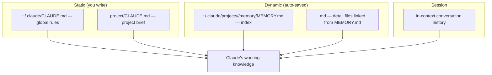
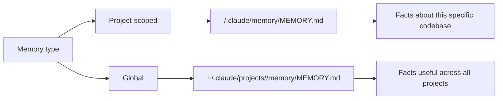

# Memory System

## The Story 📖

Imagine working with a consultant who forgets everything between meetings. Every Monday you explain the project from scratch: the tech stack, the deployment setup, the weird quirk in the legacy auth system, the naming conventions you care about. Same information, every time, from the top.

Now imagine the same consultant who keeps a notebook. Before each meeting they read their notes. They remember that you migrated from Postgres to MongoDB last quarter. They remember your team prefers snake_case. They remember the staging server is behind a VPN.

That's the difference between Claude Code without memory and Claude Code with memory.

Without memory, every session starts cold. Claude reads your CLAUDE.md (the standing brief), but anything it discovered in previous sessions — the surprising architecture decision, the undocumented API quirk, the name of the test helper you always use — is gone.

With memory, Claude builds a notebook across sessions. Facts worth remembering get saved. Context accumulates. The more you use it, the better it knows your project.

👉 This is why we need the **Memory System** — persistent, structured knowledge that makes Claude Code smarter about your project over time.

---

## 📌 Learning Priority

**Must Learn** — core concepts, needed to understand the rest of this file:
[What is the Memory System](#what-is-the-memory-system-) · [MEMORY.md Index File](#memorymd--the-index-file-) · [Memory Architecture](#memory-architecture-️)

**Should Learn** — important for real projects and interviews:
[Auto-Memory Behavior](#auto-memory-how-claude-saves-facts-) · [Manual Memory Commands](#manual-memory-telling-claude-what-to-remember-) · [When to Save vs Not Save](#when-to-save-vs-when-not-to-save-)

**Good to Know** — useful in specific situations, not needed daily:
[Memory Scope Project vs Global](#memory-scope-project-vs-global-) · [Memory File Format](#memory-file-format-best-practices-)

**Reference** — skim once, look up when needed:
[Common Mistakes](#common-mistakes-to-avoid-️)

---

## What is the Memory System? 🧠

The **Memory System** in Claude Code is a set of mechanisms for persisting knowledge across sessions. It has three layers:

1. **CLAUDE.md** — static instructions you write (covered in the next topic)
2. **Auto-memory** — Claude automatically saves discoveries to `MEMORY.md`
3. **Manual memory** — you explicitly tell Claude to remember something

The memory system is built around plain Markdown files, making it inspectable, editable, and version-controllable. There's no opaque database — just files.

---

## Why It Exists — The Problem It Solves 🎯

### Problem 1: Session cold-start

Each Claude Code session starts fresh. Without memory, Claude has no recollection of what you worked on last Tuesday — the bug you fixed, the pattern you established, the API you documented.

### Problem 2: Repeated context-setting

Without memory, you spend the first few minutes of every session re-establishing context: "This project uses asyncpg, not SQLAlchemy. We follow Google style guide. The main config is in config/settings.py." Memory eliminates this tax.

### Problem 3: Discovered knowledge disappears

Claude discovers things while working: "This codebase has a custom decorator called @require_auth that wraps every API endpoint." Without memory, that discovery vanishes. With memory, it gets saved and is available next session.

👉 Without memory: Claude starts from zero every session. With memory: Claude accumulates project knowledge over time.

---

## Memory Architecture 🗂️



The memory index file (`MEMORY.md`) links to detail files, keeping the index itself short and scannable while detail lives in separate files.

---

## The Four Memory Types 📁

| Type | What it is | Where it lives | Managed by |
|------|-----------|---------------|------------|
| **Project memory** | Facts specific to this codebase | `.claude/memory/MEMORY.md` in project | Claude (auto) |
| **Global memory** | Facts useful across all projects | `~/.claude/projects/<project>/memory/` | Claude (auto) |
| **User/feedback** | Corrections and preferences you've stated | Same as project memory | Claude (auto) |
| **Reference** | Architecture docs, patterns, design decisions | Linked from MEMORY.md | You + Claude |

---

## MEMORY.md — The Index File 📋

The `MEMORY.md` file is the entry point for project memory. It's an index — not a dump of all facts, but a structured table of contents pointing to more detailed memory files.

Example `MEMORY.md`:

```markdown
# Project Memory — MyFastAPI App

Last updated: 2026-04-18

## Architecture
- [Database setup](./architecture.md#database) — PostgreSQL via asyncpg, connection pool in `db/pool.py`
- [Auth flow](./architecture.md#auth) — JWT tokens, issued at /auth/login, validated via @require_auth decorator
- [Config system](./architecture.md#config) — Pydantic Settings in `config/settings.py`

## Key Patterns
- API endpoints always return `APIResponse` wrapper, never raw dicts
- All DB queries are in `repositories/` — never inline in routers
- Background tasks use Celery; task definitions in `tasks/`

## Test Setup
- `pytest tests/ -v` — runs all tests
- Fixtures in `tests/conftest.py` (db session, auth headers, mock user)
- Use `make test` shortcut

## User Preferences
- Prefers explicit type hints on all function signatures
- Never use print() for logging — use structlog
- All new features need a test before merging

## Known Quirks
- The legacy `users_v1` table still exists but is no longer written to
- `config/settings.py:L45` has a hardcoded staging URL — needs cleanup
- The payment webhook endpoint has no tests (tech debt)
```

---

## Auto-Memory: How Claude Saves Facts 🤖

When Claude Code discovers something important during a session — an architectural pattern, an undocumented behavior, a naming convention — it can save it to memory automatically.

The trigger conditions for auto-saving:
- A fact that would be useful in future sessions
- A preference you express ("I prefer X over Y")
- A correction you make ("That's wrong — this project uses Y, not X")
- An architecture discovery not obvious from reading the files
- A test setup detail that would take time to rediscover

What Claude does NOT auto-save:
- Temporary task state ("we were halfway through refactoring X")
- Obvious things readable directly from the code
- Personal information
- Things that will change frequently

---

## Manual Memory: Telling Claude What to Remember 💬

You can explicitly ask Claude to save something:

```
> Remember that the deployment pipeline requires the VAULT_TOKEN env variable

> Save this to memory: the API rate limit is 100 requests per minute per user

> Make a note that the legacy /v1/users endpoint is deprecated and will be removed in Q3

> Remember my preference: always use list comprehensions instead of map() in this project
```

You can also explicitly ask Claude to read its memory:
```
> What do you remember about the database setup?
> Show me all the known quirks you've saved for this project
```

---

## Memory Scope: Project vs Global 🌍



In practice, most memory is project-scoped. Global memory is better for:
- Your personal preferences (coding style, tool preferences)
- Cross-cutting facts (your company's API rate limits, internal domain knowledge)
- Lessons learned that apply broadly

---

## Memory File Format Best Practices 📝

```markdown
# MEMORY.md

## [Category]
- **[Fact name]:** [Concise description] — [Why it matters / where to find it]

## Architecture
- **DB connection:** asyncpg pool in `db/pool.py`, max 20 connections — never create direct connections elsewhere

## Patterns
- **Error handling:** Always raise `AppError(code, message)` — caught by global error handler in `app/errors.py`

## User preferences
- **Code style:** Explicit type hints everywhere; no `Any` types allowed
```

Key format rules:
- Short entries — one line per fact
- Link to files when possible
- Include "why it matters" context, not just the raw fact
- Use categories for scan-ability
- Date entries that may become stale

---

## When to Save vs When Not to Save ✅❌

| Save this | Don't save this |
|-----------|----------------|
| Architecture decisions | Step-by-step task progress |
| Undocumented behaviors | Code content (just read the file) |
| Your preferences | Things obvious from reading CLAUDE.md |
| Tricky setup steps | Temporary state ("we were fixing X") |
| Known bugs / tech debt | Personal information |
| Test setup quirks | Highly volatile facts |

---

## Common Mistakes to Avoid ⚠️

- **Mistake 1 — Using memory as a substitute for CLAUDE.md:** Standing project rules belong in CLAUDE.md. Memory is for discovered facts, not instructions.
- **Mistake 2 — Never reviewing memory files:** Memory can become stale. Periodically review and prune outdated entries.
- **Mistake 3 — Saving too much:** Saving every detail makes memory bloated and slow to scan. Save only facts that would be costly to rediscover.
- **Mistake 4 — Not version-controlling memory:** If you check `.claude/memory/` into Git, the whole team benefits. If you don't, insights die with your local environment.
- **Mistake 5 — Confusing session memory with persistent memory:** Things Claude knows in the current conversation are not saved unless explicitly stored. End the session and it's gone.

---

## Connection to Other Concepts 🔗

- Relates to **CLAUDE.md and Settings** because CLAUDE.md is the static half of Claude's project knowledge while MEMORY.md is the dynamic half
- Relates to **Custom Skills** because skills can read from memory to provide context-aware behavior
- Relates to **Agents and Subagents** because subagents can read the project's MEMORY.md to bootstrap project context without a long briefing

---

✅ **What you just learned:** Claude Code's memory system persists facts across sessions via MEMORY.md index files — auto-saved by Claude when it discovers useful facts, or explicitly saved when you tell it to remember something.

🔨 **Build this now:** After your next Claude Code session, ask: "What facts about this project would be worth saving for future sessions?" Then ask Claude to save them to MEMORY.md. Review the file it creates.

➡️ **Next step:** [CLAUDE.md and Settings](../06_CLAUDE_md_and_Settings/Theory.md) — the static instruction layer that works alongside memory.

---

## 📂 Navigation

**In this folder:**
| File | |
|---|---|
| 📄 **Theory.md** | ← you are here |
| [📄 Cheatsheet.md](./Cheatsheet.md) | Quick reference |
| [📄 Interview_QA.md](./Interview_QA.md) | Interview prep |

⬅️ **Prev:** [Slash Commands](../04_Slash_Commands/Theory.md) &nbsp;&nbsp;&nbsp; ➡️ **Next:** [CLAUDE.md and Settings](../06_CLAUDE_md_and_Settings/Theory.md)
