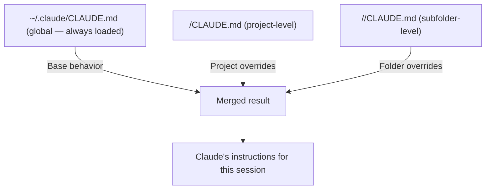

# CLAUDE.md and Settings

## The Story 📖

Every great contractor relationship starts with a project brief. Before they touch a single wall, you sit down together and walk them through the house: "This is load-bearing. This needs to stay. We always use copper plumbing here. Don't touch the electrical panel — I have someone for that." You write it down and leave it on the kitchen counter. Every time they show up, they read it.

That's `CLAUDE.md`.

Now imagine the brief has layers. The contractor works for you personally (your preferences), but they also follow building codes for your city (project-level requirements), and they have their own professional standards they apply everywhere (their global defaults). When there's a conflict, the most specific rule wins: your personal "always use marble in the bathrooms" overrides the general "use standard tile."

That's the `CLAUDE.md` loading hierarchy.

And beyond the brief, there's the toolbox. Which tools can the contractor use without checking with you first? What's absolutely off-limits? When do they need to call before proceeding? That's `settings.json`.

👉 This is why we need **CLAUDE.md and Settings** — together they define how Claude Code should behave in every project, at every scope, with every tool.

---

## What is CLAUDE.md? 📋

**CLAUDE.md** is a Markdown file that Claude Code reads automatically at session start. It contains project-specific instructions, conventions, tech stack information, and behavioral rules. Unlike the memory system (which Claude writes dynamically), CLAUDE.md is written by you and remains static until you edit it.

Think of it as:
- The project brief for your AI contractor
- Standing orders for how to behave in this codebase
- The rulebook that persists across all sessions

---

## Why It Exists — The Problem It Solves 🎯

### Problem 1: Repeated context-setting

Without CLAUDE.md, you spend the first 3 minutes of every session explaining: the tech stack, the conventions, which commands to run, what to avoid. With CLAUDE.md, Claude reads it automatically and knows all of this from session start.

### Problem 2: Inconsistent behavior across projects

Different projects have different rules. One uses pytest, another uses unittest. One uses tabs, another uses spaces. CLAUDE.md lets each project define its own rules, loaded automatically when you work in that directory.

### Problem 3: No shared standards across a team

Without CLAUDE.md in version control, each engineer has their own Claude behavior. With a project CLAUDE.md checked into Git, every engineer gets identical Claude behavior for that codebase.

👉 Without CLAUDE.md: Claude is a blank slate in every session. With CLAUDE.md: Claude is pre-briefed and ready to work from the moment you launch it.

---

## The Loading Hierarchy 📂



**Rules:**
- All levels are loaded and merged (they don't replace each other — they stack)
- When instructions conflict, the more specific (lower) level wins
- Subfolder CLAUDE.md applies only when working in that folder

**Practical example:**
- Global: "Always use type hints"
- Project: "This project uses Python 2.7 — no type hints"
- Result in this project: No type hints (project wins)

---

## What to Put in CLAUDE.md 📝

### Global (`~/.claude/CLAUDE.md`)

Your universal rules that apply to all projects:

```markdown
# Global CLAUDE.md

## About Me
- Name: [Your name]
- Primary language: Python 3.11+
- Secondary: TypeScript

## Always
- Use type hints on all function signatures
- Write docstrings for public APIs
- Run tests before marking any task complete
- Never use print() for debugging — use logging

## Never
- Commit directly to main branch
- Delete files without confirmation
- Use `sudo` in scripts
```

### Project (`<project>/CLAUDE.md`)

Project-specific instructions:

```markdown
# My FastAPI Project

## Overview
REST API for user management. FastAPI + PostgreSQL + Redis.

## Tech Stack
- FastAPI 0.115 for HTTP layer
- asyncpg for database (NOT SQLAlchemy)
- Redis via aioredis for session store
- pytest + httpx for tests
- ruff for linting, mypy for types

## Commands
- Run tests: `pytest tests/ -v --tb=short`
- Start server: `uvicorn app.main:app --reload --port 8000`
- Lint: `ruff check . && python -m mypy src/`

## File Structure
- API endpoints: `src/routers/`
- DB queries: `src/repositories/`
- Business logic: `src/services/`
- Models: `src/models/`

## Conventions
- Return `APIResponse` wrapper for all endpoints (see `src/schemas/base.py`)
- All exceptions go through `AppError` (see `src/exceptions.py`)
- New endpoints need an integration test in `tests/integration/`

## Do Not
- Write raw SQL in routers — use repository pattern
- Import from `src/repositories/` directly in routers — go through services
```

### Subfolder (`<project>/legacy/CLAUDE.md`)

Override rules for a specific directory:

```markdown
# Legacy Module — Different Rules

This is the legacy codebase acquired from Company X.
- Do NOT refactor or "improve" unless explicitly asked
- Python 2.7 compatible — no f-strings, no type hints
- Tests are in `/legacy/tests/` (not the main tests/)
- Run tests: `python -m pytest legacy/tests/`
```

---

## settings.json — The Permissions and Configuration File ⚙️

While CLAUDE.md handles *instructions*, `settings.json` handles *permissions and behavior configuration*. It lives in `.claude/settings.json` (project) or `~/.claude/settings.json` (global).

### Full settings.json Structure

```json
{
  "permissions": {
    "allow": [
      "Read",
      "Glob",
      "Grep",
      "Bash(git status)",
      "Bash(git log *)",
      "Bash(pytest *)",
      "Bash(ruff *)",
      "Bash(python -m mypy *)"
    ],
    "deny": [
      "Bash(rm -rf *)",
      "Bash(git push --force *)",
      "Bash(sudo *)"
    ]
  },
  "env": {
    "PYTHONPATH": "src",
    "ENVIRONMENT": "development"
  },
  "hooks": {
    "PostToolUse": [
      {
        "matcher": "Edit",
        "hooks": [
          {
            "type": "command",
            "command": "ruff format $CLAUDE_FILE_PATH"
          }
        ]
      }
    ]
  },
  "mcpServers": {
    "filesystem": {
      "command": "npx",
      "args": ["-y", "@modelcontextprotocol/server-filesystem", "/tmp"]
    }
  }
}
```

### Key settings.json Sections

| Section | Purpose |
|---------|---------|
| `permissions.allow` | Tools that execute without prompting |
| `permissions.deny` | Tools that are always blocked |
| `env` | Environment variables injected into the session |
| `hooks` | Shell scripts triggered by tool events |
| `mcpServers` | MCP server definitions |

---

## Tool Permission Patterns 🔒

```json
// Allow all reads, prompt for writes
"allow": ["Read", "Glob", "Grep"]

// Allow safe bash commands by pattern
"allow": ["Bash(git *)", "Bash(pytest *)", "Bash(ruff *)"]

// Block dangerous operations permanently
"deny": ["Bash(rm -rf *)", "Bash(git push --force *)", "Bash(DROP TABLE *)"]

// Allow a specific file path pattern
"allow": ["Bash(python scripts/*)"]
```

---

## .claudeignore 🚫

Similar to `.gitignore`, `.claudeignore` tells Claude Code which files and directories to skip when reading the project. This prevents Claude from reading large generated files, secrets, or irrelevant directories.

```
# .claudeignore example

# Build artifacts
dist/
build/
*.pyc
__pycache__/

# Secrets (should never be read)
.env
*.pem
*.key
secrets/

# Large generated files
node_modules/
.venv/
*.lock
coverage/
```

Files in `.claudeignore` won't appear in glob results and won't be read by Claude. This also speeds up codebase searches.

---

## Environment Variable Injection 🌍

The `env` section in settings.json injects variables into Claude's execution environment:

```json
{
  "env": {
    "PYTHONPATH": "src",
    "DATABASE_URL": "${DATABASE_URL}",
    "LOG_LEVEL": "debug"
  }
}
```

The `${VAR}` syntax reads from your shell environment at runtime — API keys and secrets should always use this pattern, never hardcoded.

---

## Common Mistakes to Avoid ⚠️

- **Mistake 1 — Keeping CLAUDE.md too vague:** "This is a Python project" tells Claude nothing useful. Include commands to run, file structure, conventions, and what to avoid.
- **Mistake 2 — Putting secrets in CLAUDE.md:** API keys, database URLs, and passwords don't belong in CLAUDE.md. Use environment variables.
- **Mistake 3 — Not checking CLAUDE.md into Git:** If it's in `.gitignore`, your team doesn't benefit from it. Check it in.
- **Mistake 4 — Writing a 500-line CLAUDE.md:** Claude reads the whole thing at session start. Long files eat context window and bury important rules. Keep it focused.
- **Mistake 5 — Ignoring the hierarchy:** If you're confused why Claude is behaving a certain way, check if a subfolder CLAUDE.md is overriding the project-level one.

---

## Connection to Other Concepts 🔗

- Relates to **Memory System** because CLAUDE.md provides static instructions while MEMORY.md provides dynamic facts
- Relates to **Hooks** because hooks are registered in settings.json
- Relates to **MCP Servers** because MCP server definitions live in settings.json
- Relates to **Permissions and Security** because all permission rules live in settings.json

---

✅ **What you just learned:** CLAUDE.md defines project instructions across a three-level hierarchy (global → project → subfolder), while settings.json controls permissions, environment, hooks, and MCP servers. Together they define how Claude Code behaves in every context.

🔨 **Build this now:** Write a `CLAUDE.md` for your current main project. Include: (1) what the project does, (2) the tech stack, (3) the commands to run tests and lint, (4) two "always do" rules, (5) two "never do" rules.

➡️ **Next step:** [Custom Skills](../07_Custom_Skills/Theory.md) — learn how to package reusable context and behavior into invocable skills.

---

## 📂 Navigation

**In this folder:**
| File | |
|---|---|
| 📄 **Theory.md** | ← you are here |
| [📄 Cheatsheet.md](./Cheatsheet.md) | Quick reference |
| [📄 Interview_QA.md](./Interview_QA.md) | Interview prep |
| [📄 Config_Reference.md](./Config_Reference.md) | Full config reference |

⬅️ **Prev:** [Memory System](../05_Memory_System/Theory.md) &nbsp;&nbsp;&nbsp; ➡️ **Next:** [Custom Skills](../07_Custom_Skills/Theory.md)
