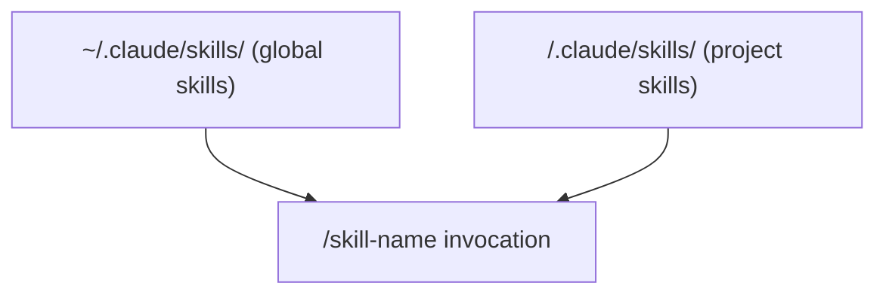

# Custom Skills

## The Story 📖

A carpenter doesn't reinvent their workflow every morning. They have a method for cutting dovetails, a method for fitting joints, a method for finishing surfaces. These methods are their skills — practiced until muscle memory takes over. When a new apprentice joins, they inherit those skills.

Custom skills in Claude Code work the same way. You have workflows you run in every project: "Here's how I approach a debugging session. Here's the context I need before writing any new feature. Here's the checklist I run before deploying." Instead of re-explaining this to Claude at the start of every session, you encode it as a skill — a Markdown file that loads the full workflow context with a single invocation.

The key distinction from slash commands: a slash command is an on-demand action ("do this task"). A skill is a context loader — "here is the complete playbook, background knowledge, and approach for this type of work." After loading a skill, Claude knows how to approach that domain of work consistently, session after session.

👉 This is why we need **Custom Skills** — they transform one-off expert context into a shareable, reusable capability your Claude always has access to.

---

## What are Custom Skills? 🎓

**Custom Skills** are Markdown files stored in a `skills/` folder that define reusable playbooks — rich context packages that load everything Claude needs to work effectively in a specific domain. Unlike slash commands (which execute a task), skills establish how Claude should think and behave within a domain.

A skill might contain:
- Background context about a complex system
- Step-by-step approach for a type of task
- Relevant files to read at invocation
- Decision frameworks and checklists
- Examples and anti-patterns
- Links to relevant slash commands for that domain

---

## Why It Exists — The Problem It Solves 🎯

### Problem 1: Context re-establishment overhead

Every debugging session starts with the same setup: "Here's the system architecture. Here's how to read the logs. Here are the common failure patterns. Here's the tooling." A skill encodes all of this once. Invoke it once. Claude has everything.

### Problem 2: Inconsistent expert context

Different team members have different mental models of how to approach a task. A shared skill enforces consistency — every engineer invokes `/airflow-debug` and Claude follows the same structured debugging approach, every time.

### Problem 3: Knowledge that grows stale

When a skilled engineer leaves, their approach goes with them. Skills capture that expertise in files that can be version-controlled, reviewed, and updated by the team.

👉 Without skills: Claude is a blank slate for every new type of work. With skills: you build a library of expert context that your Claude always has access to.

---

## Skills vs Slash Commands vs CLAUDE.md 📊

| | CLAUDE.md | Slash Command | Custom Skill |
|--|-----------|---------------|--------------|
| Purpose | Standing project rules | On-demand task | Expert context loader |
| Loaded | Every session | On invocation | On invocation |
| Written by | You | You | You |
| Content | Instructions | Task steps | Playbook + context |
| Best for | Project conventions | Repeatable actions | Domain expertise |

---

## Skill File Location 📁



Skills can be global (apply to all projects) or project-scoped (specific to one codebase).

```
~/.claude/
└── skills/
    ├── debugger.md        → /debugger
    ├── learn-topic.md     → /learn-topic
    └── code-review.md     → /code-review

myproject/
└── .claude/
    └── skills/
        ├── deploy.md      → /deploy
        └── db-debug.md    → /db-debug
```

---

## SKILL.md Format 📝

A skill file uses YAML frontmatter for metadata and Markdown body for the content:

```markdown
---
description: Full description shown in /help
usage: /skill-name [optional args]
when_to_use: When to invoke this skill — what problem it solves
---

# Skill Name

## Background
[Context Claude needs to understand this domain]

## Approach
[How Claude should tackle work in this domain]

## Step-by-Step Playbook
1. [Step 1]
2. [Step 2]
...

## Decision Framework
[When to do X vs Y]

## Common Patterns
- [Pattern 1]

## Anti-Patterns
- [What to avoid]

## Files to Read First
- [File or directory Claude should read when invoked]

## Related Commands
- /related-command — [what it does]
```

---

## Frontmatter Fields 🔖

| Field | Required | Purpose |
|-------|----------|---------|
| `description` | Yes | Shown in `/help` listing |
| `usage` | Recommended | How to invoke (with args example) |
| `when_to_use` | Recommended | When this skill is appropriate |
| `allowed_tools` | Optional | Restrict which tools the skill may use |
| `tags` | Optional | Categorization |

---

## Invoking Skills 🚀

Skills are invoked like slash commands — by typing the skill name prefixed with `/`:

```
> /debugger
# Claude loads the debugger skill — reads its context, announces it's ready

> /learn-topic Python async/await
# Claude loads the learn-topic skill and starts on the specified topic

> /deploy staging
# Claude loads the deploy skill with "staging" as the argument
```

After invocation, Claude reads the skill file and operates within that context for the rest of the session (or until you `/clear`).

---

## Writing Effective Skill Prompts ✍️

The most powerful skills share these characteristics:

### 1. Rich background context

Bad:
```markdown
Debug Airflow issues.
```

Good:
```markdown
## Background
This is an Airflow v3 cluster running on AWS EKS. Workers are Celery executors
in separate pods. Logs go to CloudWatch under the log group `/airflow/v3/workers/`.
The scheduler and webserver run as separate deployments. Config is in `config/airflow.env`.
```

### 2. Structured approach

Tell Claude *how* to think through problems:

```markdown
## Debugging Approach
1. First, check scheduler health: `kubectl logs -l component=scheduler -n airflow --tail=100`
2. Check if the DAG appears in the webserver: curl the API
3. Check executor connectivity: `airflow celery inspect`
4. If task-level: read the task log from CloudWatch
```

### 3. Decision trees

```markdown
## When You See Error X
- If "connection refused": check if the broker (Redis) pod is running
- If "task not found": check if the DAG file compiled without errors
- If "permission denied": check IAM role on the worker pod
```

### 4. Anti-patterns

```markdown
## Do Not
- Restart pods before reading logs — you'll lose the error context
- Check the webserver logs for task failures — tasks run in workers
- Assume local and production config are the same
```

---

## Real-World Skill Examples 💼

### /airflow-debug

```markdown
---
description: Debug Airflow issues on AWS EKS — pod failures, task errors, scheduling
usage: /airflow-debug
when_to_use: When an Airflow DAG is failing, stuck, or producing unexpected results
---

## System Overview
Airflow v3 on EKS. Celery executors. Redis broker. CloudWatch logs.

## Debugging Hierarchy
1. Is the DAG visible in the scheduler? (check scheduler logs)
2. Is the task being queued? (check Celery queue)
3. Is the worker picking it up? (check worker logs)
4. Is the task running? (check task logs in CloudWatch)
5. Is the task failing? (read the full traceback)

## Key Commands
- Scheduler: `kubectl logs deploy/airflow-scheduler -n airflow --tail=200`
- Workers: `kubectl logs -l component=worker -n airflow --tail=100`
- Task log: fetch from CloudWatch with task_id and execution_date

## Common Failure Patterns
- "Task received but not executing": worker pool saturated — check worker count
- "DAG not found": file not synced to all pods — check git-sync sidecar
- "Database connection failed": check RDS security group and secrets rotation

## Files to Read
- `config/airflow.env` — runtime config
- `dags/<dag_id>.py` — the DAG itself
```

### /learn-topic

```markdown
---
description: Teach a topic interactively then save learning files
usage: /learn-topic <topic>
when_to_use: When the user wants to learn a new technical concept
---

## Teaching Approach
1. Start with a real-world analogy (no jargon)
2. Introduce the formal definition with key terms bolded
3. Explain how it works step by step
4. Show where it's used in real systems
5. Common mistakes and misconceptions
6. 3 practice questions at different levels

## Format
- Use Mermaid diagrams for architecture/flow
- Bold key terms on first use
- Real examples over abstract descriptions

## After Teaching
Ask: "Ready to save this to a file?" and save to the appropriate repo path.
```

---

## Common Mistakes to Avoid ⚠️

- **Mistake 1 — Skills that are too short:** A two-line skill provides barely more context than typing the instruction. Skills should be rich enough to materially change Claude's approach.
- **Mistake 2 — Duplicating CLAUDE.md:** Skills shouldn't repeat what's in CLAUDE.md. CLAUDE.md is always-on; skills are domain-specific on-demand context.
- **Mistake 3 — No decision framework:** The best skills don't just describe — they guide decisions. Add "if X then Y else Z" logic.
- **Mistake 4 — Not version-controlling skills:** Checked-in skills are team assets. Local-only skills disappear when you change machines.
- **Mistake 5 — Confusing skills with commands:** A skill loads context. A command executes a task. A `/deploy` command runs the deployment. A `/deploy-workflow` skill loads all the context for thinking about deployments.

---

## Connection to Other Concepts 🔗

- Relates to **Slash Commands** because both use the `/name` invocation pattern, but serve different purposes
- Relates to **CLAUDE.md** because skills and CLAUDE.md both provide context, but CLAUDE.md is always-on while skills are invoked on-demand
- Relates to **Memory System** because skills can instruct Claude to read MEMORY.md for project-specific context on invocation

---

✅ **What you just learned:** Custom skills are rich context-loading Markdown files stored in `skills/` folders that give Claude domain-specific expertise on demand, invoked with `/skill-name` — the difference from commands being that skills load a mental model, not just execute a task.

🔨 **Build this now:** Write a skill for your most complex recurring workflow (debugging, deployment, code review). Include: background context, step-by-step approach, 3 decision rules ("if X then do Y"), and 2 anti-patterns. Save as `~/.claude/skills/my-skill.md` and invoke it.

➡️ **Next step:** [Hooks](../08_Hooks/Theory.md) — automate actions that run before or after every tool invocation.

---

## 📂 Navigation

**In this folder:**
| File | |
|---|---|
| 📄 **Theory.md** | ← you are here |
| [📄 Cheatsheet.md](./Cheatsheet.md) | Quick reference |
| [📄 Interview_QA.md](./Interview_QA.md) | Interview prep |
| [📄 Code_Example.md](./Code_Example.md) | Skill examples |

⬅️ **Prev:** [CLAUDE.md and Settings](../06_CLAUDE_md_and_Settings/Theory.md) &nbsp;&nbsp;&nbsp; ➡️ **Next:** [Hooks](../08_Hooks/Theory.md)
