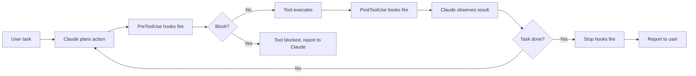

# Hooks

## The Story 📖

Imagine a restaurant kitchen with a head chef watching every station. When a dish leaves the grill, the chef checks it before it goes to the pass. When it leaves the pass, they check it again. If something's wrong at either checkpoint, it doesn't go to the table.

Claude Code hooks work exactly like this. Every time Claude executes a tool, two checkpoints fire: one just before the action (PreToolUse) and one just after (PostToolUse). You can attach shell scripts to these checkpoints that run automatically — logging what happened, reformatting files after an edit, running lint checks, blocking dangerous commands, or notifying your team.

The key insight: hooks run independently of Claude's reasoning. Claude doesn't choose whether to run your hook — the hook fires automatically, every time, for every matched tool use. This is how you enforce policies that bypass Claude's discretion entirely.

👉 This is why we need **Hooks** — automated, guaranteed side effects around every tool action, without relying on Claude to remember to do them.

---

## 📌 Learning Priority

**Must Learn** — core concepts, needed to understand the rest of this file:
[What are Hooks](#what-are-hooks-) · [Hook Event Types](#hook-event-types-) · [Blocking vs Non-Blocking](#blocking-vs-non-blocking-hooks-)

**Should Learn** — important for real projects and interviews:
[Hook Configuration](#hook-configuration-in-settingsjson-️) · [Hook Environment Variables](#environment-variables-available-to-hooks-) · [Real-World Use Cases](#real-world-hook-use-cases-)

**Good to Know** — useful in specific situations, not needed daily:
[Hook Object Structure](#hook-object-structure-) · [Hook Input/Output Format](#hook-inputoutput-format-)

**Reference** — skim once, look up when needed:
[Common Mistakes](#common-mistakes-to-avoid-️)

---

## What are Hooks? 🪝

**Hooks** are shell scripts (or commands) that execute automatically when specific Claude Code tool events fire. They intercept the agent loop at defined points and can:

- Log tool activity to an audit file
- Auto-format files after Claude edits them
- Run tests after Claude saves a file
- Block specific tool invocations (non-blocking hooks can't block, but blocking hooks can)
- Send notifications to Slack or a webhook
- Auto-commit changes after successful edits

Hooks are configured in `settings.json` under the `hooks` key.

---

## Why It Exists — The Problem It Solves 🎯

### Problem 1: Unreliable "remember to do X" instructions

You can tell Claude in CLAUDE.md: "Always run ruff format after editing a Python file." But there's no guarantee — Claude might forget in a long session, or in a context where the instruction isn't prominent. A hook runs the formatter every single time, guaranteed.

### Problem 2: Audit and observability

In team or production settings, you need a record of what Claude did and when. A hook can write every tool invocation to a log file — tool name, arguments, file path, timestamp, exit code — creating an immutable audit trail.

### Problem 3: Policy enforcement

Your organization may require: no secrets ever committed, all Python files formatted before save, all bash commands with certain patterns blocked. These are policies, not preferences. Hooks enforce them at the system level, regardless of what Claude "thinks" it should do.

👉 Without hooks: behavior depends on Claude's in-context reasoning and memory. With hooks: behavior is enforced at the tool-execution level, every time.

---

## Hook Event Types 📅



| Event | When it fires |
|-------|--------------|
| `PreToolUse` | Before a tool executes — can block |
| `PostToolUse` | After a tool executes — read results |
| `Stop` | When Claude finishes a task |
| `Notification` | When Claude sends a notification to the user |

---

## Hook Configuration in settings.json ⚙️

Hooks are registered in `settings.json` under the `hooks` key:

```json
{
  "hooks": {
    "PostToolUse": [
      {
        "matcher": "Edit",
        "hooks": [
          {
            "type": "command",
            "command": "ruff format $CLAUDE_FILE_PATH"
          }
        ]
      }
    ],
    "PreToolUse": [
      {
        "matcher": "Bash",
        "hooks": [
          {
            "type": "command",
            "command": "bash ~/.claude/hooks/audit-bash.sh"
          }
        ]
      }
    ]
  }
}
```

---

## Hook Object Structure 🔧

```json
{
  "matcher": "<tool-name or pattern>",
  "hooks": [
    {
      "type": "command",
      "command": "<shell command>",
      "blocking": false
    }
  ]
}
```

| Field | Values | Description |
|-------|--------|-------------|
| `matcher` | Tool name, `*` | Which tools trigger this hook |
| `type` | `"command"` | Currently only command type |
| `command` | shell string | Command to execute |
| `blocking` | `true`/`false` | If true, non-zero exit blocks the tool |

---

## Environment Variables Available to Hooks 🌍

Claude Code injects these variables into hook environment:

| Variable | Value |
|----------|-------|
| `CLAUDE_TOOL_NAME` | Name of the tool (e.g., `Edit`, `Bash`) |
| `CLAUDE_TOOL_INPUT` | JSON-encoded tool input |
| `CLAUDE_TOOL_RESULT` | JSON-encoded tool result (PostToolUse only) |
| `CLAUDE_FILE_PATH` | File path for file-related tools |
| `CLAUDE_BASH_COMMAND` | The bash command being run (Bash tool) |
| `CLAUDE_SESSION_ID` | Current session ID |
| `CLAUDE_PROJECT_DIR` | Project root directory |

---

## Blocking vs Non-Blocking Hooks 🚦

**Non-blocking hooks** (`blocking: false` — the default):
- Run after the tool executes
- Their exit code is ignored
- Used for: logging, formatting, notifications
- Cannot prevent the tool from running

**Blocking hooks** (`blocking: true`):
- Run before the tool executes (PreToolUse)
- Exit code matters: non-zero blocks the tool
- Claude sees the block and decides how to proceed
- Used for: policy enforcement, validation, safety checks

```json
{
  "PreToolUse": [
    {
      "matcher": "Bash",
      "hooks": [
        {
          "type": "command",
          "command": "bash ~/.claude/hooks/check-dangerous.sh",
          "blocking": true
        }
      ]
    }
  ]
}
```

---

## Real-World Hook Use Cases 💼

### Use Case 1: Auto-format on save

```json
{
  "PostToolUse": [
    {
      "matcher": "Edit",
      "hooks": [
        {
          "type": "command",
          "command": "if [[ $CLAUDE_FILE_PATH == *.py ]]; then ruff format \"$CLAUDE_FILE_PATH\"; fi"
        }
      ]
    }
  ]
}
```

Every time Claude edits a Python file, it's auto-formatted with ruff.

### Use Case 2: Audit log

```json
{
  "PostToolUse": [
    {
      "matcher": "*",
      "hooks": [
        {
          "type": "command",
          "command": "echo \"$(date -u +%Y-%m-%dT%H:%M:%SZ) TOOL=$CLAUDE_TOOL_NAME FILE=$CLAUDE_FILE_PATH\" >> ~/.claude/audit.log"
        }
      ]
    }
  ]
}
```

Every tool invocation is logged to `~/.claude/audit.log`.

### Use Case 3: Block dangerous bash commands

```bash
# ~/.claude/hooks/check-dangerous.sh
#!/bin/bash
# Block if command contains dangerous patterns

CMD="$CLAUDE_BASH_COMMAND"

# Block destructive patterns
if echo "$CMD" | grep -qE "rm -rf|DROP TABLE|DELETE FROM .* WHERE 1=1|git push --force"; then
    echo "BLOCKED: Dangerous command detected: $CMD" >&2
    exit 1  # non-zero = block the tool
fi

exit 0  # allow
```

### Use Case 4: Auto-commit after successful edit

```bash
# ~/.claude/hooks/auto-commit.sh
#!/bin/bash
# Auto-commit if tests pass after an edit

if [[ "$CLAUDE_TOOL_NAME" == "Edit" ]] && [[ "$CLAUDE_FILE_PATH" == *.py ]]; then
    cd "$CLAUDE_PROJECT_DIR"
    if pytest tests/ -q --tb=no > /dev/null 2>&1; then
        git add "$CLAUDE_FILE_PATH"
        git commit -m "auto: claude edited $CLAUDE_FILE_PATH (tests pass)"
    fi
fi
```

### Use Case 5: Slack notification on task completion

```bash
# ~/.claude/hooks/notify-done.sh
#!/bin/bash
# Send Slack notification when Claude finishes

curl -s -X POST "$SLACK_WEBHOOK_URL" \
  -H 'Content-type: application/json' \
  -d "{\"text\":\"Claude Code finished a task in session $CLAUDE_SESSION_ID\"}" \
  > /dev/null
```

Registered under the `Stop` event:

```json
{
  "Stop": [
    {
      "matcher": "*",
      "hooks": [
        {
          "type": "command",
          "command": "bash ~/.claude/hooks/notify-done.sh"
        }
      ]
    }
  ]
}
```

---

## Hook Input/Output Format 📨

The `CLAUDE_TOOL_INPUT` and `CLAUDE_TOOL_RESULT` variables contain JSON. Example for Edit tool:

```json
// CLAUDE_TOOL_INPUT for Edit
{
  "file_path": "/home/user/project/src/auth.py",
  "old_string": "def login(user, pwd):",
  "new_string": "def login(user: str, pwd: str) -> AuthResult:"
}

// CLAUDE_TOOL_RESULT for Edit
{
  "success": true
}
```

Parse these in your hook scripts with `jq`:
```bash
FILE=$(echo "$CLAUDE_TOOL_INPUT" | jq -r '.file_path')
```

---

## Common Mistakes to Avoid ⚠️

- **Mistake 1 — Hook scripts that fail silently:** Without logging or error output, you won't know why a hook blocked a tool. Always log to stderr on failure.
- **Mistake 2 — Blocking hooks for non-blocking use cases:** Only use `blocking: true` for actual policy enforcement. Logging and formatting should be non-blocking.
- **Mistake 3 — Hooks that are too slow:** Every hook adds latency to the tool loop. Keep hooks fast — sub-100ms ideally. Heavy operations (tests, uploads) should be async or only on Stop event.
- **Mistake 4 — Hardcoding paths in hooks:** Use `$CLAUDE_PROJECT_DIR` and `$CLAUDE_FILE_PATH` rather than absolute paths so hooks work in any project.
- **Mistake 5 — Not testing hooks independently:** Test your hook scripts by calling them directly from the shell before relying on them in the Claude loop.

---

## Connection to Other Concepts 🔗

- Relates to **Permissions and Security** because hooks can enforce security policies at the tool level
- Relates to **CLAUDE.md and Settings** because hooks are configured in settings.json
- Relates to **MCP Servers** because hooks and MCP can both extend Claude's capabilities, but hooks intercept the tool loop while MCP adds new tools

---

✅ **What you just learned:** Hooks fire automatically at PreToolUse, PostToolUse, Stop, and Notification events — registered in settings.json — enabling guaranteed side effects like auto-formatting, audit logging, policy enforcement, and notifications independent of Claude's reasoning.

🔨 **Build this now:** Add a PostToolUse hook that logs every file edit to `~/.claude/edit-log.txt` with a timestamp. Verify it works by having Claude edit a file and then reading the log.

➡️ **Next step:** [MCP Servers](../09_MCP_Servers/Theory.md) — extend Claude Code with external tool servers using the Model Context Protocol.

---

## 📂 Navigation

**In this folder:**
| File | |
|---|---|
| 📄 **Theory.md** | ← you are here |
| [📄 Cheatsheet.md](./Cheatsheet.md) | Quick reference |
| [📄 Interview_QA.md](./Interview_QA.md) | Interview prep |
| [📄 Code_Example.md](./Code_Example.md) | Hook scripts |
| [📄 Config_Reference.md](./Config_Reference.md) | Full config reference |

⬅️ **Prev:** [Custom Skills](../07_Custom_Skills/Theory.md) &nbsp;&nbsp;&nbsp; ➡️ **Next:** [MCP Servers](../09_MCP_Servers/Theory.md)
