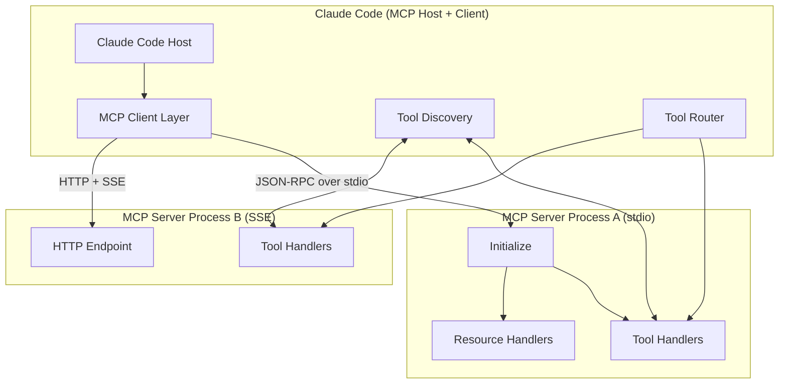
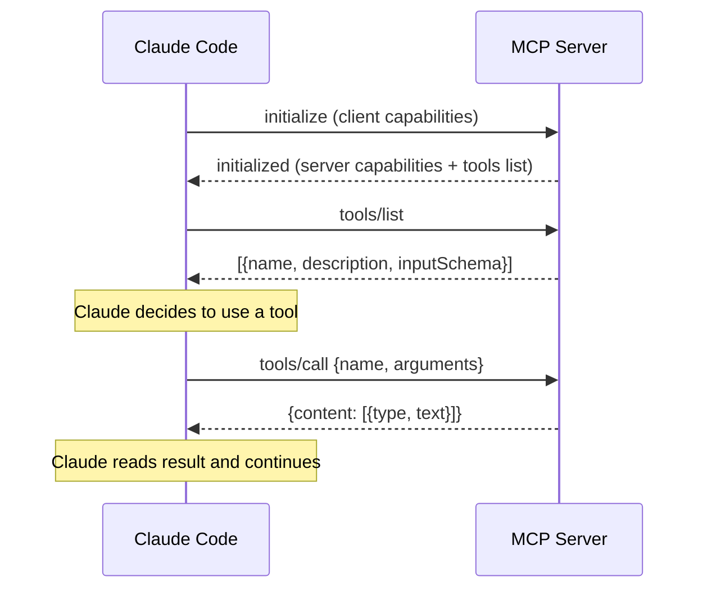
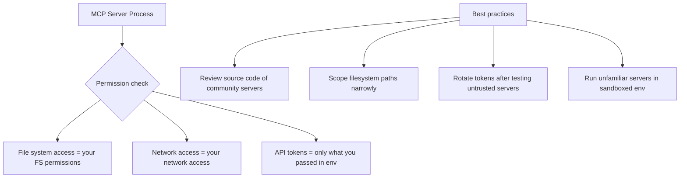

# MCP Servers in Claude Code — Architecture Deep Dive

## The Full Protocol Stack



---

## MCP Protocol Message Flow



---

## Startup Sequence

When Claude Code starts with MCP servers configured:

1. Read `settings.json`, find `mcpServers` entries
2. For each server: spawn the process (stdio) or connect to URL (SSE)
3. Send `initialize` message with protocol version
4. Server responds with capabilities
5. Send `tools/list` to discover all available tools
6. Merge server tools with built-in tools
7. Claude now has access to all tools for this session

---

## JSON-RPC Message Format

MCP uses JSON-RPC 2.0 over the transport layer.

### Initialize request
```json
{
  "jsonrpc": "2.0",
  "id": 1,
  "method": "initialize",
  "params": {
    "protocolVersion": "2024-11-05",
    "capabilities": {
      "tools": {}
    },
    "clientInfo": {
      "name": "claude-code",
      "version": "1.0"
    }
  }
}
```

### Tools list response
```json
{
  "jsonrpc": "2.0",
  "id": 2,
  "result": {
    "tools": [
      {
        "name": "search_issues",
        "description": "Search GitHub issues in a repository",
        "inputSchema": {
          "type": "object",
          "properties": {
            "repo": {"type": "string", "description": "owner/repo"},
            "query": {"type": "string", "description": "Search query"}
          },
          "required": ["repo", "query"]
        }
      }
    ]
  }
}
```

### Tool call
```json
{
  "jsonrpc": "2.0",
  "id": 3,
  "method": "tools/call",
  "params": {
    "name": "search_issues",
    "arguments": {
      "repo": "anthropics/claude-code",
      "query": "authentication bug"
    }
  }
}
```

### Tool call response
```json
{
  "jsonrpc": "2.0",
  "id": 3,
  "result": {
    "content": [
      {
        "type": "text",
        "text": "Found 3 issues matching 'authentication bug':\n#123: Login fails..."
      }
    ]
  }
}
```

---

## Tool Schema Design (for building servers)

Tool schemas use JSON Schema. Key fields Claude uses to decide when/how to use a tool:

```json
{
  "name": "query_users",
  "description": "Query the users table with a SQL WHERE clause. Use this when you need to find users matching specific criteria.",
  "inputSchema": {
    "type": "object",
    "properties": {
      "where_clause": {
        "type": "string",
        "description": "SQL WHERE clause (without the WHERE keyword). Example: 'created_at > NOW() - INTERVAL 7 days'"
      },
      "limit": {
        "type": "integer",
        "description": "Maximum rows to return (default 100, max 1000)",
        "default": 100
      }
    },
    "required": ["where_clause"]
  }
}
```

Key design principles:
- Description tells Claude WHEN to use this tool, not just what it does
- Include examples in descriptions — Claude uses them to form correct arguments
- Mark required vs optional fields correctly
- Validate inputs in your handler — Claude sometimes passes wrong types

---

## Resources Protocol

Resources allow Claude to access live data streams:

```json
// List resources request
{"method": "resources/list"}

// Response
{
  "resources": [
    {
      "uri": "postgres://mydb/users",
      "name": "Users table",
      "description": "Current state of the users table",
      "mimeType": "application/json"
    }
  ]
}

// Read resource
{"method": "resources/read", "params": {"uri": "postgres://mydb/users"}}

// Response
{
  "contents": [
    {
      "uri": "postgres://mydb/users",
      "mimeType": "application/json",
      "text": "[{\"id\": 1, \"email\": \"...\"}, ...]"
    }
  ]
}
```

---

## Security Model



---

## 📂 Navigation

**In this folder:**
| File | |
|---|---|
| [📄 Theory.md](./Theory.md) | Full concept explanation |
| [📄 Cheatsheet.md](./Cheatsheet.md) | Quick reference |
| [📄 Interview_QA.md](./Interview_QA.md) | Interview prep |
| 📄 **Architecture_Deep_Dive.md** | ← you are here |

⬅️ **Prev:** [Hooks](../08_Hooks/Theory.md) &nbsp;&nbsp;&nbsp; ➡️ **Next:** [Agents and Subagents](../10_Agents_and_Subagents/Theory.md)
